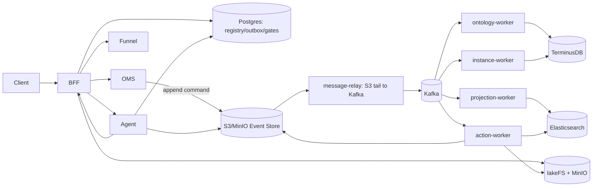

# SPICE HARVESTER

> Ontology + Event Sourcing + Data Plane + LLM-native Control Plane

- English README: `README.en.md`
- 문서 인덱스: `docs/README.md`
- API 목록(자동 생성): `docs/API_REFERENCE.md`
- 아키텍처(자동 생성 섹션 포함): `docs/ARCHITECTURE.md`
- Action writeback 설계/철학: `docs/ACTION_WRITEBACK_DESIGN.md`
- LLM-native control plane(Planner/Memory/Evals): `docs/LLM_NATIVE_CONTROL_PLANE.md`

---

## 목차

- [1) 한 줄 요약](#1-한-줄-요약)
- [2) 이 프로덕트가 해결하는 문제](#2-이-프로덕트가-해결하는-문제)
- [3) 핵심 철학: “결정론적 코어 + 반증 가능한 의사결정”](#3-핵심-철학-결정론적-코어--반증-가능한-의사결정)
- [4) 시스템 구성(서비스/SSoT/플레인)](#4-시스템-구성서비스ssot플레인)
- [5) 핵심 기능(현재 구현)](#5-핵심-기능현재-구현)
- [6) Action writeback + Decision Simulation(What-if)](#6-action-writeback--decision-simulationwhat-if)
- [7) LLM-native Control Plane(Agent Plans)](#7-llm-native-control-planeagent-plans)
- [8) 보안/거버넌스/감사](#8-보안거버넌스감사)
- [9) 관측/운영(OpenTelemetry)](#9-관측운영opentelemetry)
- [10) 로컬 실행(빠른 시작)](#10-로컬-실행빠른-시작)
- [11) 테스트](#11-테스트)
- [12) 문서/자동화(정합성 유지)](#12-문서자동화정합성-유지)
- [13) 레포 구조](#13-레포-구조)
- [14) 현재 제약/로드맵](#14-현재-제약로드맵)

---

## 1) 한 줄 요약

SPICE HARVESTER는 **온톨로지 기반 그래프 데이터(SSoT) + 이벤트 소싱(불변 로그) + 버전화된 데이터 플레인(lakeFS)** 위에서,  
업무/데이터 변경을 **“시뮬레이션으로 반증 가능한 형태”** 로 만들고, 그 위에 **LLM 컨트롤 플레인(계획 컴파일러 + HITL + 정책 강제)** 을 얹어
**안전한 운영 자동화**와 **재현 가능한 의사결정**을 가능하게 하는 플랫폼입니다.

---

## 2) 이 프로덕트가 해결하는 문제

현실의 데이터/운영 환경은 아래 특징 때문에 “자동화”가 위험해집니다.

1) **At-least-once 전달은 기본**: Kafka 재전달, 워커 재시작, 네트워크 타임아웃으로 동일 작업이 여러 번 들어옵니다.  
2) **조용한 last-write-wins는 사고**: 경쟁 업데이트/충돌이 “조용히 덮어쓰기”로 처리되면, 나중에 원인 규명이 불가능합니다.  
3) **스프레드시트/비정형 입력**: 구조가 매번 다르고, 의미/라벨이 모호합니다.  
4) **거버넌스/권한/조건이 얽힘**: “이 작업이 가능한지”는 데이터 상태/권한/정책을 다 봐야 합니다.  
5) **실제 운영은 적대적**: 오염 입력, 권한 부족, 부분 장애, 인덱스 지연, 충돌 폭증이 정상 상황입니다.

SPICE HARVESTER는 이를 위해:
- **정합성 레이어(멱등/순서/OCC)** 를 Postgres로 강하게 고정하고,
- 읽기 모델(ES)은 **재구축 가능한 파생물**로 취급하며,
- write는 항상 **시뮬레이션(반증 가능) + 승인(HITL) + 감사(Audit)** 를 통해 “책임 소재/재현성”을 확보합니다.

---

## 3) 핵심 철학: “결정론적 코어 + 반증 가능한 의사결정”

### 3.1 Data Plane / Control Plane / Read Model 분리

- **Data Plane(버전화 데이터 플레인)**: raw ingest → transforms → datasets → materialization (lakeFS + MinIO)  
- **Control Plane(정책/승인/오케스트레이션)**: plan/approval/simulate/submit/run/registry (Postgres)  
- **Read Model(조회/검색/프로젝션)**: Elasticsearch overlay + lineage/audit projections  

“LLM-native”는 **LLM이 마음대로 실행한다**가 아니라, LLM은 **계획(typed plan)** 만 만들고  
시스템이 **검증/정책/승인/시뮬레이션**으로 실행을 강제하는 것을 의미합니다.

### 3.2 SSoT(진실의 원천) 규정

- 그래프/온톨로지 권위: **TerminusDB**
- 불변 로그(커맨드/도메인 이벤트): **S3/MinIO Event Store**
- 정합성/등록/게이트/승인 저장소: **Postgres**
- 데이터 아티팩트 버전: **lakeFS + MinIO**
- 검색(ES)은 truth가 아니라 **materialized view(재구축 가능)**

---

## 4) 시스템 구성(서비스/SSoT/플레인)

### 4.1 마이크로서비스(로컬 기본 포트)

- **BFF (8002)**: 외부 진입점. 프론트 계약, 라우팅, 정책/레이트리밋, agent-plans control plane 엔드포인트
- **OMS (8000)**: 온톨로지/그래프 관리(내부용; 필요 시 debug ports로 노출)
- **Funnel (8003)**: 타입 추론/구조 분석(내부용)
- **Agent**: 에이전트 도구 실행기(단일 순차 루프, 내부용; BFF를 통해서만 호출)
- **Workers**: pipeline/objectify/instance/projection/action-worker 등(이벤트 기반 처리)
- **Infra**: Kafka, Postgres, Redis, MinIO(S3), lakeFS, Elasticsearch, OTel collector, Jaeger/Prometheus/Grafana

전체 compose 인벤토리는 `docs/ARCHITECTURE.md`의 auto-generated 섹션을 참고하세요.

### 4.2 아키텍처(요약)



---

## 5) 핵심 기능(현재 구현)

### 5.1 온톨로지/그래프
- 클래스/속성/관계 CRUD, 브랜치/병합/롤백
- 관계 모델링: LinkType + RelationshipSpec(FK/조인테이블/object-backed), dangling 정책, link edits overlay
- Graph query federation(멀티 홉), 라벨 기반 query

### 5.2 데이터 플레인(인제스트 → 파이프라인 → 오브젝트화)
- CSV/Excel/미디어 업로드, Google Sheets 커넥터
- Funnel 타입 추론/프로파일링
- lakeFS dataset versioning + dataset registry/outbox/reconciler
- Spark 변환(필터/조인/계산/캐스팅/리네임/union/dedupe/groupBy/aggregate/window/pivot)
- Objectify: mapping spec 버전 관리 + KeySpec(Primary/Title) + PK 유일성 게이트 + edits migration

### 5.3 정합성(멱등/순서/OCC) + 리플레이 가능성
- processed_event_registry(멱등), aggregate_versions(순서), expected_seq(OCC)를 “계약”으로 강제
- Event Store(S3/MinIO) + message-relay → Kafka로 리플레이 가능한 파이프
- ES/프로젝션은 재구축 가능한 read model

자세한 정합성 계약은 `docs/IDEMPOTENCY_CONTRACT.md`를 참고하세요.

### 5.4 운영/감사/라인리지
- Audit logs / lineage graph / health/config/monitoring endpoints
- 에러 택소노미(enterprise payload)로 운영 자동화 분기 품질을 고정
- OpenTelemetry 기반 tracing/metrics 수집(collector + jaeger/prometheus/grafana)

---

## 6) Action writeback + Decision Simulation(What-if)

> 핵심: “쓰기”를 **intent-only**로 선언하고, 시스템이 **simulate→approve→submit**으로 안전하게 실행한다.

### 6.1 ActionLog는 ‘단순 DB row’가 아니라 Ontology 객체

- ActionLog는 “우리가 무엇을 결정했고 왜 그렇게 했는지”를 담는 **온톨로지 객체**입니다.  
- ActionLog는 충돌/조건 미달/권한 거부 등의 결과를 **구조화된 스키마**로 남겨, 이후 학습/통계/회고(메타인지)의 기반이 됩니다.

관련 설계/철학: `docs/ACTION_WRITEBACK_DESIGN.md`

### 6.2 End-to-end 흐름(설계/구현 정합성)

1) **simulate(dry-run)**: 정책/권한/조건/충돌을 평가하고, 적용 diff(overlay/lakeFS/es effects 포함)를 계산  
2) **HITL 승인**: 사람이 결과를 보고 승인/거절  
3) **submit(async)**: worker가 lakeFS commit + EventStore event + ES overlay 문서 반영  
4) **read path**: BFF read는 overlay를 사용하여 “미적용/부분 적용/지연”을 표기 가능

### 6.3 Decision Simulation 레벨
- **레벨 1(입력 변수 주입)**: action input payload의 변수(discount_rate 등)만 바꿔 시나리오 비교
- **레벨 2(상태 변수 주입, 안전하게)**: base_doc/observed_base에 “가정된 상태”를 주입해 what-if를 수행  
  - 가정은 절대 SSoT로 승격되지 않으며, 주입된 필드 목록이 결과에 명시됩니다.

---

## 7) LLM-native Control Plane(Agent Plans)

> LLM은 실행기가 아니라 **대화형 컴파일러(Planner)** 입니다.

### 7.1 핵심 보장
- LLM은 **plan JSON(typed)** 만 생성하고, 실행은 서버가 강제 검증합니다.
- write/workflow는 항상 **simulate→approve→submit**을 서버가 강제합니다.
- validate 결과는 단순 errors/warnings가 아니라 **PlanCompilationReport**로 “왜 reject됐는지 / 무엇을 고치면 되는지 / 서버 제안 patch”까지 제공합니다.
- 기본은 **reject(투명성/안전)** 이고, 사용자가 patch를 명시적으로 수락해야만 plan이 수정됩니다.

### 7.2 주요 엔드포인트(요약)
- `POST /api/v1/agent-plans/compile`: 자연어 → plan draft 생성(LLM) + 서버 validate + plan registry 저장
- `POST /api/v1/agent-plans/validate`: 정적 검증 + `compilation_report` 반환
- `POST /api/v1/agent-plans/{plan_id}/apply-patch`: 서버 제안 patch를 사용자가 수락한 경우에만 적용(재검증 포함)
- `POST /api/v1/agent-plans/{plan_id}/preview`: preview-safe step만 실행(시뮬레이션/GET/READ risk)
- `POST /api/v1/agent-plans/{plan_id}/execute`: 승인 기록 없으면 403, 승인 후 Agent run 시작
- `POST /api/v1/agent-plans/{plan_id}/approvals`: 승인 기록
- `POST /api/v1/agent-plans/context-pack`: 운영 메모리(context pack) 안전 요약

전체 목록은 `docs/API_REFERENCE.md`에서 확인할 수 있습니다.

### 7.3 Step dataflow(최소 스펙): produces/consumes

운영 자동화에서 중요한 것은 “다음 스텝 입력을 안전하게 연결”하는 것입니다.  
그래서 각 step은 `produces`/`consumes`(artifact refs)를 선언하고, 서버는 다음을 기계적으로 차단합니다.

- 존재하지 않는 artifact를 consume
- simulate 결과 없이 submit 단계로 진행
- simulation_id 링크 불일치(잘못된 결과 참조)

### 7.4 정책 드리프트 방지(테스트로 강제)

enterprise catalog fingerprint와 allowlist bundle hash를 테스트에 “핀”하여,  
정책이 바뀌면 CI가 깨지도록 강제합니다.

- 드리프트 가드: `backend/tests/unit/errors/test_policy_drift_guards.py`

---

## 8) 보안/거버넌스/감사

- **Access policy**: instance/query/graph read에서 행/컬럼 마스킹/필터링
- **Input sanitizer**: prompt injection/악성 payload 최소화(규칙 기반)
- **Admin endpoints**: `X-Admin-Token` 기반(미설정 시 비활성)
- **Audit/Trace**: ActionLog/AgentRun에 trace context를 보존해 “왜/누가/언제”를 재현 가능

---

## 9) 관측/운영(OpenTelemetry)

풀 스택은 `otel-collector-config.yml` 기반으로 trace/metrics를 수집합니다.

- Jaeger: 트레이스 확인(로컬 compose 포트는 `docs/ARCHITECTURE.md` 참고)
- Prometheus/Grafana: 메트릭/대시보드
- 서비스는 request_id/actor/plan_id/action_log_id 같은 키로 상호 연결됩니다.
- ⚠️ 제약: HTTP 없이 시작된 배치/스케줄러 작업은 로그의 `corr_id`가 `-`일 수 있습니다. 이 경우 `event_id`/`job_id`(또는 `command_id`)로 추적을 시작하세요.

운영 가이드: `docs/OPERATIONS.md`

---

## 10) 로컬 실행(빠른 시작)

### 10.1 백엔드 스택(5~10분)

사전 준비: Docker + Docker Compose

```bash
git clone https://github.com/ludia8888/SPICE-Harvester.git
cd SPICE-Harvester
cp .env.example .env  # 선택
docker compose -f docker-compose.full.yml up -d
```

헬스 체크(BFF가 기본 외부 엔드포인트):

```bash
curl -fsS http://localhost:8002/api/v1/health
```

OMS/Funnel/Agent를 직접 디버깅해야 하면(debug ports):

```bash
docker compose -f docker-compose.full.yml -f backend/docker-compose.debug-ports.yml up -d
curl -fsS http://localhost:8000/health
curl -fsS http://localhost:8003/health
```

### 10.2 프론트엔드(로컬 개발)

사전 준비: Node 20+

```bash
cd frontend
cp .env.example .env  # 선택
npm ci
npm run dev
```

프론트 정책/스펙: `docs/frontend.md`, `docs/FRONTEND_POLICIES.md`

---

## 11) 테스트

유닛 테스트(빠름, docker 불필요):

```bash
make backend-unit
```

프로덕션 게이트(전체 스택 필요):

```bash
make backend-prod-full
```

커버리지:

```bash
make backend-coverage
```

---

## 12) 문서/자동화(정합성 유지)

이 레포는 “문서가 코드와 어긋나는 것”을 줄이기 위해 일부 문서를 자동 생성합니다.

```bash
python scripts/generate_api_reference.py
python scripts/generate_architecture_reference.py
python scripts/generate_backend_methods.py
python scripts/generate_error_taxonomy.py
```

---

## 13) 레포 구조

- `backend/`: BFF/OMS/Funnel/Agent + shared + workers
- `frontend/`: React + Blueprint.js UI
- `docs/`: 시스템 문서(설계/운영/보안/아키텍처/API)
- `scripts/`: 문서 생성/스모크 테스트/유틸 스크립트
- `docker-compose.*.yml`: 로컬 스택 구성

---

## 14) 현재 제약/로드맵

- 운영 자동화는 “완전 자동 실행”이 아니라 **simulate-first + HITL + 정책 강제**를 기본값으로 합니다.
- 프로덕션 운영을 위해서는 환경별로 authn/authz, tenant isolation, secrets/retention/partitioning 등을 강화해야 합니다.
- 더 자세한 설계/제약/운영 우선순위는 아래 문서를 참고하세요:
  - `docs/ARCHITECTURE.md`
  - `docs/OPERATIONS.md`
  - `docs/SECURITY.md`
  - `docs/LLM_NATIVE_CONTROL_PLANE.md`
