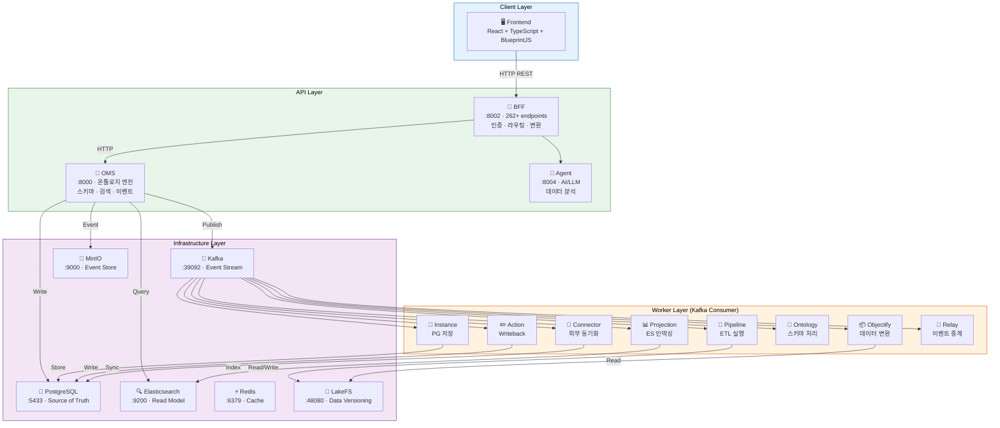
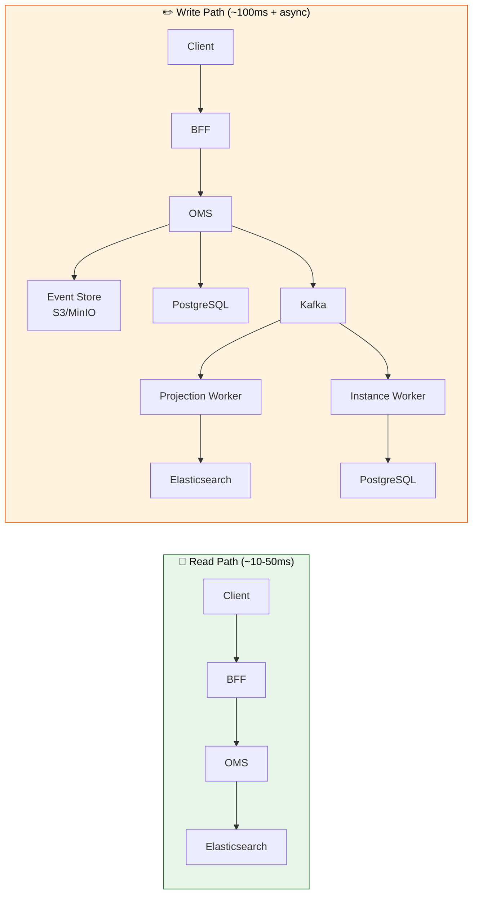
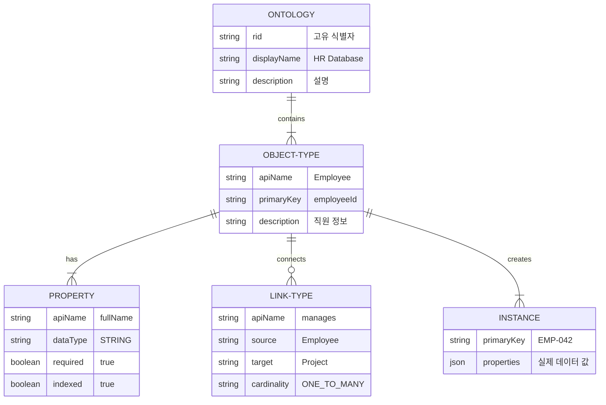
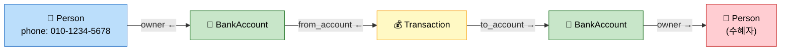

<div align="center">

# SPICE-Harvester (Spice OS)

**조직의 모든 데이터를 하나의 통합 온톨로지로 연결하는 데이터 관리 플랫폼**

[](https://python.org)
[](https://fastapi.tiangolo.com)
[](https://react.dev)
[](https://www.typescriptlang.org)
[](https://postgresql.org)
[](https://elastic.co)
[](https://kafka.apache.org)
[](https://docker.com)
[]()

<br>

| 항목 | 수치 |
|:---:|:---:|
| **API 엔드포인트** | 262+ |
| **백그라운드 워커** | 12+ |
| **인프라 서비스** | 7개 |
| **백엔드 테스트** | 1,600+ (단위 1,556 + E2E 91) |

</div>

---

## 이 프로젝트는 무엇인가요?

회사에는 수많은 데이터베이스가 있습니다 — HR 시스템에 직원 정보, PM 도구에 프로젝트 정보, ERP에 매출 데이터. 이 데이터들은 서로 연결되지 않아서 "직원 A가 담당하는 프로젝트의 매출은 얼마인지"를 한눈에 알기 어렵습니다.

**Spice OS는 이 문제를 해결합니다.** 흩어진 데이터를 하나의 통합된 데이터 모델(온톨로지)로 연결하고, 검색/분석/자동화가 가능한 플랫폼을 제공합니다. Palantir Foundry에서 영감을 받은 오픈소스 엔터프라이즈급 데이터 관리 시스템입니다.

---

## 온톨로지(Ontology)란 무엇인가요? (비개발자용)

온톨로지는 한마디로 **회사 데이터의 “공용 언어(표준 사전) + 연결 지도”** 입니다.

- HR 시스템에는 `employee_id`
- ERP에는 `emp_no`
- 프로젝트 도구에는 `assignee`

같은 “사람”을 가리키는 값이 시스템마다 이름도 다르고, 연결 방식도 다르기 때문에 실제 업무 질문(예: “A가 맡은 프로젝트 매출은?”)에 답하려면 매번 사람의 머릿속에서 조인(JOIN)을 해야 합니다.

Spice OS에서 온톨로지는 이런 조인을 **사람 대신 시스템이 이해하도록** 만드는 층입니다.

### 온톨로지는 무엇을 정의하나요?

- **Object Type**: “사람(Employee)”, “프로젝트(Project)”, “주문(Order)” 같은 업무 개체(명사)
- **Property**: “이름”, “입사일”, “가격”, “상태” 같은 속성(필드)
- **Link Type**: “소속”, “담당”, “구매”, “연결됨” 같은 관계(엣지)

즉, “표”를 여러 개 만들어 두는 것보다 한 단계 더 나아가 **업무 의미(semantics)와 관계를 1등 시민으로 모델링**합니다.

### 왜 온톨로지를 쓰나요?

- **질문이 쉬워집니다**: “직원 → 프로젝트 → 매출”처럼 관계를 따라가며 탐색/검색
- **데이터가 바뀌어도 덜 깨집니다**: 시스템이 바뀌어도 온톨로지 계약(이름/타입/관계)이 안정적인 기준점 역할
- **권한과 감사가 단순해집니다**: 누가 어떤 데이터에 접근/변경했는지 일관된 방식으로 추적
- **자동화(액션)로 폐루프가 가능해집니다**: “조건을 만족하면 상태 변경/승인/정정” 같은 쓰기 작업을 검증 후 실행

### 이 프로덕트로 무엇을 할 수 있나요?

- **데이터 수집과 버전 관리**: CSV/커넥터로 들어온 원천 데이터를 버전으로 남기고 재현 가능하게 관리
- **파이프라인(ETL)로 변환**: 정제/조인/집계/파생 컬럼 생성 등 변환 과정을 정의하고 실행
- **온톨로지로 모델링**: 데이터셋을 “업무 개체(Object)”로 만들기 위한 스키마/관계/액션 타입을 정의
- **객체화(Objectify) + 검색 인덱싱**: 데이터를 인스턴스로 만들고(객체화), 빠른 검색/필터/정렬을 지원
- **그래프 탐색(링크 기반)**: 단순 검색을 넘어 여러 홉(hop)으로 연결 관계를 추적
- **액션(Action)과 Writeback**: 검증(Validate) → 시뮬레이션 → 실행으로 안전한 변경을 기록하고 반영

> 개발자 관점의 상세 정의는 아래 `## 핵심 개념` 섹션(온톨로지/Object Type/Link Type/Action)을 참고하세요.

---

## 아키텍처 개요



### Read Path vs Write Path (CQRS)



---

## 기술 스택

| 영역 | 기술 | 용도 |
|:---|:---|:---|
| **백엔드** | Python 3.11+, FastAPI, Pydantic v2, AsyncPG | API 서버, 데이터 검증 |
| **프론트엔드** | React 18, TypeScript, BlueprintJS, Zustand, Vite | UI, 상태관리, 빌드 |
| **데이터베이스** | PostgreSQL 16, Elasticsearch 8.12, Redis 7 | 저장, 검색, 캐싱 |
| **메시징** | Apache Kafka (Confluent 7.4) | 이벤트 스트리밍 |
| **스토리지** | MinIO (S3 호환), LakeFS | 이벤트 저장, 데이터 버전관리 |
| **관측성** | OpenTelemetry, Prometheus, Grafana, Jaeger | 추적, 메트릭, 모니터링 |
| **테스트** | pytest, Vitest, Playwright | 백엔드/프론트엔드 테스트 |

---

## 빠른 시작

### 사전 준비

| 도구 | 최소 버전 | 확인 명령 |
|:---|:---:|:---|
| Docker Desktop | 24.0+ | `docker --version` |
| Docker Compose | 2.20+ | `docker compose version` |
| Node.js | 20.0+ | `node --version` |
| Python | 3.11+ | `python3 --version` |
| Git | 2.40+ | `git --version` |

> **Apple Silicon (M1/M2/M3):** 반드시 **Docker Desktop**을 사용하세요. Colima에서는 Elasticsearch가 SIGILL 에러로 실행되지 않습니다.

> **메모리:** 최소 8GB, 권장 16GB 이상. 메모리 부족 시 Elasticsearch OOM(exit 137) 발생.

### 4단계로 시작하기

```bash
# 1. 저장소 클론
git clone <repository-url>
cd SPICE-Harvester

# 2. 환경 변수 설정
cp .env.example .env

# 3. 전체 스택 실행 (32개 서비스)
docker compose -f docker-compose.full.yml up -d

# 4. 헬스 체크
curl http://localhost:8000/health          # OMS → {"status":"healthy"}
curl http://localhost:8002/api/v1/health   # BFF → {"status":"healthy"}
```

> 상세한 설정 방법은 [로컬 환경 설정 가이드](docs/onboarding/ko/03-LOCAL-SETUP.md)를 참고하세요.

---

## 핵심 개념

Spice OS의 데이터 모델은 관계형 DB와 유사하지만, **관계(Link)가 일급 시민(first-class citizen)**이라는 점이 다릅니다.



### 개념별 상세 설명

<table>
<tr>
<th>개념</th>
<th>SQL 대응</th>
<th>설명</th>
</tr>
<tr>
<td>

**온톨로지(Ontology)**

</td>
<td>

`DATABASE`

</td>
<td>

데이터 모델의 최상위 컨테이너. Object Type, Link Type, Property 정의를 모두 포함합니다.

```
Ontology "HR System"
├── Object Type: Employee
├── Object Type: Department
├── Object Type: Project
├── Link Type: Employee → belongs_to → Department
└── Link Type: Employee → manages → Project
```

</td>
</tr>
<tr>
<td>

**객체 유형(Object Type)**

</td>
<td>

`CREATE TABLE`

</td>
<td>

엔티티의 스키마 정의. `apiName`으로 식별하며, `primaryKey` 필드를 반드시 지정합니다.

```python
# SQL로 비유하면:
# CREATE TABLE Employee (
#   employeeId VARCHAR PRIMARY KEY,
#   fullName VARCHAR NOT NULL,
#   department VARCHAR,
#   startDate DATE
# );
```

</td>
</tr>
<tr>
<td>

**속성(Property)**

</td>
<td>

`COLUMN`

</td>
<td>

Object Type의 필드. 타입(`STRING`, `INTEGER`, `DOUBLE`, `BOOLEAN`, `DATE`, `TIMESTAMP`, `GEOHASH`, `ARRAY`), 필수 여부, 인덱싱 여부를 지정합니다.

```json
{
  "apiName": "salary",
  "displayName": "연봉",
  "dataType": "DOUBLE",
  "required": false,
  "indexed": true
}
```

</td>
</tr>
<tr>
<td>

**링크 유형(Link Type)**

</td>
<td>

`FOREIGN KEY` + `JOIN TABLE`

</td>
<td>

Object Type 간의 방향성 있는 관계. 일반 FK와 달리 **관계 자체가 독립적인 엔티티**이며, 양방향 탐색이 가능합니다.

```
Employee --[manages]--> Project
         <--[managed_by]--
```

카디널리티: `ONE_TO_ONE`, `ONE_TO_MANY`, `MANY_TO_MANY`

</td>
</tr>
<tr>
<td>

**인스턴스(Instance)**

</td>
<td>

`INSERT INTO ... VALUES`

</td>
<td>

Object Type에 대한 실제 데이터 레코드(행).

```json
{
  "employeeId": "EMP-042",
  "fullName": "Jane Doe",
  "department": "Engineering",
  "startDate": "2023-06-15"
}
```

</td>
</tr>
<tr>
<td>

**액션(Action)**

</td>
<td>

Validated `INSERT`/`UPDATE`/`DELETE`

</td>
<td>

구조화된 쓰기 작업. 직접 DB를 수정하지 않고, 검증 → 시뮬레이션 → 실행 3단계를 거칩니다.

- 감사 로그 자동 기록 (누가, 언제, 뭘 변경)
- 타입/필수필드 검증
- 되돌리기(undo) 지원

</td>
</tr>
<tr>
<td>

**멀티홉 쿼리(Multi-hop Query)**

</td>
<td>

다중 `JOIN`

</td>
<td>

Link Type을 따라 여러 Object Type을 횡단하는 그래프 탐색 쿼리.

```
Person → BankAccount → Transaction → BankAccount → Person
```

SQL로는 4단계 JOIN이 필요한 쿼리를 선언적으로 실행합니다. API: `POST /api/v1/graph-query/{db}/multi-hop`

</td>
</tr>
</table>

### 멀티홉 쿼리 예시

"특정 인물의 은행 계좌 → 거래내역 → 상대 계좌 → 계좌 소유자"를 추적하는 4-hop 쿼리:



```json
{
  "start_class": "Person",
  "filters": { "phone": "010-1234-5678" },
  "hops": [
    { "predicate": "owner",        "target_class": "BankAccount", "reverse": true },
    { "predicate": "from_account", "target_class": "Transaction", "reverse": true },
    { "predicate": "to_account",   "target_class": "BankAccount" },
    { "predicate": "owner",        "target_class": "Person" }
  ],
  "include_paths": true,
  "max_paths": 25
}
```

---

## 주요 서비스 포트

| 서비스 | 포트 | 용도 |
|:---|:---:|:---|
| BFF | `8002` | 프론트엔드 API 게이트웨이 |
| OMS | `8000` | 온톨로지/검색 핵심 엔진 |
| Agent | `8004` | AI Agent 서비스 |
| PostgreSQL | **`5433`** | 관계형 데이터 저장 (컨테이너 내부 5432) |
| Elasticsearch | `9200` | 전문 검색 엔진 |
| Redis | `6379` | 캐싱/세션/실시간 알림 |
| Kafka | `39092` | 이벤트 스트리밍 |
| MinIO | `9000` / `9001` | S3 API / 웹 콘솔 |
| LakeFS | `48080` | 데이터 버전 관리 |
| Grafana | `13000` | 모니터링 대시보드 |
| Jaeger | `16686` | 분산 추적 |
| Kafka UI | `8080` | Kafka 토픽 모니터링 |

> **주의:** PostgreSQL 호스트 포트는 5432가 아니라 **5433**입니다!

---

## 프로젝트 구조

```
SPICE-Harvester/
├── backend/                          # 백엔드 (Python)
│   ├── bff/                         #   BFF - API 게이트웨이 (:8002)
│   │   ├── main.py                  #     진입점
│   │   ├── routers/                 #     API 라우터 (94개 파일)
│   │   ├── services/                #     비즈니스 로직
│   │   └── middleware/              #     인증, 로깅 미들웨어
│   ├── oms/                         #   OMS - 온톨로지 엔진 (:8000)
│   │   ├── main.py                  #     진입점
│   │   ├── routers/                 #     API 라우터 (16개 파일)
│   │   └── services/                #     이벤트 스토어, 검색
│   ├── agent/                       #   AI Agent (:8004)
│   ├── objectify_worker/            #   데이터셋 → 인스턴스 변환
│   ├── projection_worker/           #   이벤트 → ES 인덱싱
│   ├── action_worker/               #   Writeback 실행
│   ├── pipeline_worker/             #   ETL 파이프라인 실행
│   ├── instance_worker/             #   인스턴스 상태 관리
│   ├── ontology_worker/             #   온톨로지 이벤트 처리
│   ├── connector_sync_worker/       #   외부 데이터 동기화
│   ├── data_connector/              #   외부 DB 커넥터
│   ├── shared/                      #   공유 라이브러리
│   │   ├── config/settings.py       #     환경 설정 (Pydantic Settings)
│   │   ├── models/                  #     데이터 모델 (ontology, event 등)
│   │   ├── services/                #     공유 서비스 (저장소, 레지스트리)
│   │   └── security/                #     인증/인가 (JWT, RBAC)
│   └── tests/                       #   테스트
│       ├── unit/                    #     단위 테스트 (1,556+)
│       └── test_*.py                #     E2E 테스트 (91+)
│
├── frontend/                        # 프론트엔드 (React + TypeScript)
│   └── src/
│       ├── api/bff.ts              #   API 클라이언트 (127KB)
│       ├── pages/                  #   23개 페이지
│       ├── components/             #   UI 컴포넌트
│       └── store/                  #   Zustand 상태관리
│
├── docs-portal/                    # 문서 포털 (Docusaurus, 한/영)
├── docs/onboarding/ko/             # 한국어 온보딩 가이드
├── docker-compose.full.yml         # 전체 스택 Docker 구성
├── docker-compose.databases.yml    # DB만 실행
└── Makefile                        # 개발 자동화 명령어
```

---

## 자주 쓰는 개발 명령어

```bash
# ── 전체 스택 ──
docker compose -f docker-compose.full.yml up -d   # 시작
docker compose -f docker-compose.full.yml down     # 종료
docker compose -f docker-compose.full.yml ps       # 상태 확인

# ── DB만 실행 (가볍게 개발할 때) ──
docker compose -f docker-compose.databases.yml up -d

# ── 백엔드 테스트 ──
make backend-unit          # 단위 테스트 (Docker 불필요, ~30초)
make backend-coverage      # 단위 테스트 + 커버리지
make backend-prod-full     # E2E 테스트 (전체 스택 필요)

# ── 프론트엔드 ──
cd frontend && npm install && npm run dev   # 개발 서버 (:5173)

# ── Docker 리빌드 ──
docker compose -f docker-compose.full.yml build bff   # BFF 리빌드
docker compose -f docker-compose.full.yml build oms   # OMS 리빌드
```

---

## 온보딩 문서 안내

신규 개발자라면 아래 순서로 읽어보세요:

| 순서 | 문서 | 설명 |
|:---:|:---|:---|
| 1 | [이 제품이 뭔가요?](docs/onboarding/ko/01-WHAT-IS-SPICE.md) | 핵심 개념을 코드 예시와 함께 이해 |
| 2 | [멘탈 모델](docs/onboarding/ko/02-MENTAL-MODEL.md) | 아키텍처 패턴을 익숙한 비유로 이해 |
| 3 | [로컬 환경 설정](docs/onboarding/ko/03-LOCAL-SETUP.md) | 내 컴퓨터에서 플랫폼 실행 |
| 4 | [첫 API 호출](docs/onboarding/ko/04-FIRST-API-CALL.md) | 직접 API를 호출하며 체험 |
| 5 | [아키텍처 이해하기](docs/onboarding/ko/05-ARCHITECTURE-EXPLAINED.md) | 시스템 구조를 3단계로 이해 |
| 6 | [데이터 흐름 추적](docs/onboarding/ko/06-DATA-FLOW-WALKTHROUGH.md) | 요청이 시스템을 어떻게 통과하는지 |
| 7 | [프론트엔드 둘러보기](docs/onboarding/ko/07-FRONTEND-TOUR.md) | UI 페이지 ↔ 백엔드 개념 매핑 |
| 8 | [개발 워크플로](docs/onboarding/ko/08-DEVELOPMENT-WORKFLOW.md) | 첫 코드 변경 가이드 |
| 9 | [테스트 가이드](docs/onboarding/ko/09-TESTING-GUIDE.md) | 테스트 실행 및 작성 |
| 10 | [트러블슈팅 FAQ](docs/onboarding/ko/10-TROUBLESHOOTING-FAQ.md) | 자주 겪는 문제와 해결법 |
| 11 | [30일 학습 로드맵](docs/onboarding/ko/LEARNING-ROADMAP.md) | 체계적 온보딩 일정 가이드 |

추가로 [Spice OS Documentation Portal](https://spice-harvester-docs.vercel.app/ko/)에서 더 상세한 API 레퍼런스, 아키텍처 문서, 운영 가이드를 한국어로 확인할 수 있습니다.

---

## 문서 포털 (Documentation Portal)

온라인 문서 포털은 [spice-harvester-docs.vercel.app](https://spice-harvester-docs.vercel.app)에서 접근할 수 있습니다.

| 카테고리 | 내용 |
|:---|:---|
| **[시작하기](https://spice-harvester-docs.vercel.app/ko/docs/getting-started/concepts)** | 핵심 개념, 빠른 시작, 설치 가이드 |
| **[API 레퍼런스](https://spice-harvester-docs.vercel.app/ko/docs/api/overview)** | v2 객체, 검색, 액션, 객체 유형 API |
| **[아키텍처](https://spice-harvester-docs.vercel.app/ko/docs/architecture/overview)** | 시스템 아키텍처, 데이터 흐름, 이벤트 소싱 |
| **[가이드](https://spice-harvester-docs.vercel.app/ko/docs/category/guides)** | 데이터 엔지니어, 플랫폼 관리자, 통합 개발자, 비즈니스 분석가 가이드 |
