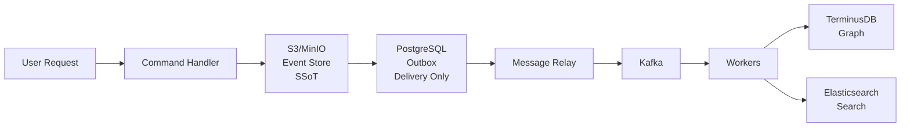

# 🔥 THINK ULTRA! Corrected Architecture Summary

## Critical Correction Applied

### ❌ WRONG (Previous Understanding)
```
PostgreSQL Outbox = Event Store ❌
```

### ✅ CORRECT (Palantir Foundry Aligned)
```
S3/MinIO = Event Store (SSoT) ✅
PostgreSQL Outbox = Delivery Guarantee Only ✅
```

## The Correct SPICE HARVESTER Architecture

### 1. **S3/MinIO - The REAL Event Store (SSoT)**
```python
# THIS is where events are actually stored
/events/
  /{year}/{month}/{day}/
    /{aggregate_type}/
      /{aggregate_id}/
        /{event_id}.json  # Immutable event
```
- **Role**: Single Source of Truth for all events
- **Purpose**: Event Sourcing, audit trail, replay capability
- **Retention**: Infinite (cheap object storage)
- **Immutability**: Events are never modified or deleted

### 2. **TerminusDB - Graph Authority Layer**
```
Lightweight nodes with:
- IDs
- Relationships
- NO domain data
```
- **Role**: Graph relationships and traversal
- **Purpose**: Multi-hop queries, relationship management
- **Data**: Only IDs and edges, no heavy data

### 3. **Elasticsearch - Search & Analytics**
```
Full denormalized documents for fast queries
```
- **Role**: Derived read models
- **Purpose**: Fast search, aggregations, analytics
- **Data**: Complete domain objects (projected from events)

### 4. **PostgreSQL Outbox - Delivery Guarantee ONLY**
```sql
-- This is NOT storing events!
-- Just ensuring delivery to Kafka
INSERT INTO spice_outbox.outbox (
    id,           -- Reference to S3 event
    topic,        -- Kafka topic
    payload       -- Metadata for delivery
)
```
- **Role**: Atomic message delivery guarantee
- **Purpose**: Ensure exactly-once delivery to Kafka
- **NOT**: This is NOT an event store!

## Correct Event Flow



1. **Command arrives** → Validate
2. **Store in S3/MinIO** → This is the truth!
3. **Add to Outbox** → Just for delivery
4. **Message Relay** → Reads outbox
5. **Kafka** → Event streaming
6. **Workers** → Process events
7. **Update projections** → TerminusDB + ES

## Palantir Foundry Alignment

| Component | Palantir Foundry | Our System | Purpose |
|-----------|-----------------|------------|---------|
| **Truth** | Foundry Datasets | S3/MinIO | Immutable event/data storage |
| **Graph** | Ontology | TerminusDB | Relationships & schema |
| **Search** | Contour/Quiver | Elasticsearch | Fast queries & analytics |
| **Pipeline** | Pipeline Builder | Kafka + Workers | Data transformation |
| **Delivery** | Magritte | PostgreSQL Outbox | Transaction guarantees |

## Key Principles

### 1. S3/MinIO is the Single Source of Truth
```python
# Events are ONLY authoritatively stored here
event_id = await event_store.append_event(event)  # S3/MinIO
```

### 2. PostgreSQL is ONLY for Delivery
```python
# Outbox just ensures the event gets to Kafka
await outbox.add_reference(event_id)  # Not storing the event!
```

### 3. Everything Else is Derived
- TerminusDB graph = Projection from events
- Elasticsearch docs = Projection from events
- Any cache/view = Can be rebuilt from S3 events

## Benefits of Correct Architecture

1. **True Event Sourcing**: Complete history in S3
2. **Infinite Scalability**: Object storage scales infinitely
3. **Time Travel**: Replay from any point
4. **Disaster Recovery**: Rebuild everything from S3
5. **Audit Compliance**: Immutable audit trail
6. **Cost Effective**: S3 is cheap for long-term storage

## Implementation Status

✅ **Completed:**
- Architecture documentation corrected
- Event Store service for S3/MinIO created
- Command handler updated to use S3 first
- PostgreSQL role clarified as delivery only

⏳ **Next Steps:**
1. Deploy MinIO containers
2. Migrate existing "events" from PostgreSQL to S3
3. Update workers to read from S3 for replay
4. Implement snapshot optimization

## Conclusion

**Thank you for the critical correction!** 

The architecture is now correctly aligned with:
- True Event Sourcing principles
- Palantir Foundry patterns
- Industry best practices

**PostgreSQL is NOT an Event Store - it's just a delivery guarantee mechanism.**
**S3/MinIO is the real Single Source of Truth.**

---

*THINK ULTRA: Always question assumptions and align with proven patterns.*