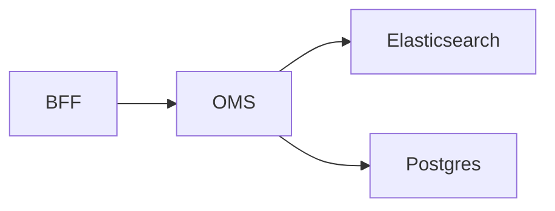
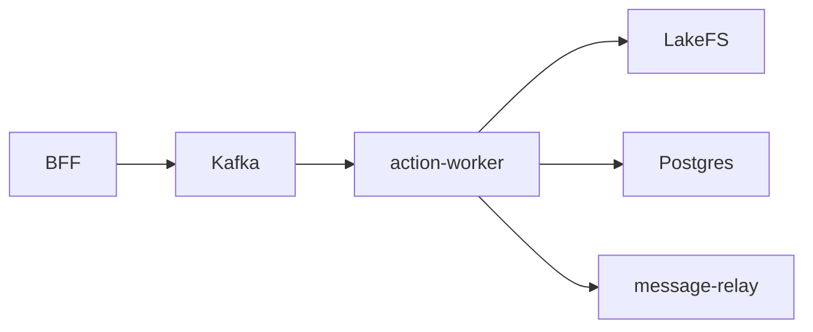
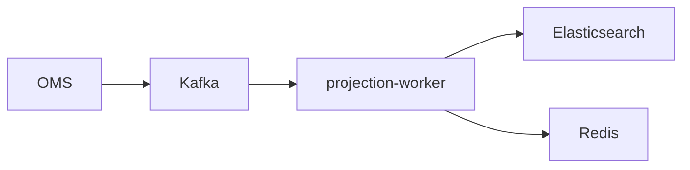

# Architecture Reference (Auto-Generated)

> Generated by `scripts/generate_architecture_reference.py`.
> Do not edit manually.

## Developer Onboarding Quick Start

> [!TIP]
> First-day onboarding path (recommended)

1. Start core runtime services and verify API health.
2. Read BFF/OMS entrypoints to understand dependency wiring.
3. Follow the Foundry v2 ontology route and OMS object search route end-to-end.
4. Validate docs generation to ensure documentation and code stay in lockstep.

```bash
# 1) Start stack
docker compose -f docker-compose.full.yml up -d

# 2) Verify docs are in sync
python scripts/check_docs.py
```

## Runtime Topology Summary

- Total runtime services: **32**
- API services: **3**
- Background/worker services: **12**
- Data platform services: **7**
- Observability services: **6**

| Role | Count | Services |
| --- | --- | --- |
| `api` | 3 | agent<br/>bff<br/>oms |
| `workers` | 12 | action-outbox-worker<br/>action-worker<br/>connector-sync-worker<br/>connector-trigger-service<br/>ingest-reconciler-worker<br/>instance-worker<br/>objectify-worker<br/>ontology-worker<br/>pipeline-scheduler<br/>pipeline-worker<br/>projection-worker<br/>writeback-materializer-worker |
| `data` | 7 | elasticsearch<br/>kafka<br/>lakefs<br/>minio<br/>postgres<br/>redis<br/>zookeeper |
| `observability` | 6 | alertmanager<br/>grafana<br/>jaeger<br/>kafka-ui<br/>otel-collector<br/>prometheus |
| `bootstrap` | 3 | db-migrations<br/>lakefs-init<br/>minio-init |
| `other` | 1 | message-relay |

## Architecture Quality Checklist (Auto-Computed)

- Scope: `backend/**/*.py` (excluding tests/scripts/examples/perf)
- Population: files **638**, functions **6097**, classes **886**, internal cross-imports **1516**

| # | Check | Ratio | Target | Status | Metric Basis |
| --- | --- | --- | --- | --- | --- |
| 1 | 계층 간 누수 | 0/1516 (0.00%) | ≤ 0.50% | **PASS** | `layer_leak_imports / internal_cross_imports` |
| 2 | 의존성 튐(패키지 순환) | 0/22 (0.00%) | ≤ 0.00% | **PASS** | `packages_in_scc(>1) / packages` |
| 3 | I/O와 Core 직접 연결 | 3/92 (3.26%) | ≤ 5.00% | **PASS** | `io_importing_core_files / core_files` |
| 4 | 모듈 결합도 과다 | 4/22 (18.18%) | ≤ 15.00% | **FAIL** | `high_coupling_modules / modules` |
| 5 | 파일 응집도 저하 | 51/638 (7.99%) | ≤ 20.00% | **PASS** | `cohesion_risk_files / files` |
| 6 | 파일 단일 책임 위반 | 58/638 (9.09%) | ≤ 12.00% | **PASS** | `single_responsibility_risk_files / files` |
| 7 | 함수 단일 책임 위반 | 329/6097 (5.40%) | ≤ 10.00% | **PASS** | `(cc>=25 or len>=120) / functions` |
| 8 | 연속 상속 깊이(>=3) | 15/886 (1.69%) | ≤ 5.00% | **PASS** | `classes_depth>=3 / classes` |
| 9 | 복잡도 과다(CC>=15) | 736/6097 (12.07%) | ≤ 15.00% | **PASS** | `cc>=15 / functions` |
| 10 | 롱메서드(len>=80) | 417/6097 (6.84%) | ≤ 8.00% | **PASS** | `len>=80 / functions` |

### Top Risk Signals

- Layer leaks: none detected
- Dependency cycles: none detected
- I/O-core direct links (sample): `shared/services/core/consistency_token.py`, `shared/services/core/sequence_service.py`, `shared/services/core/watermark_monitor.py`
- Longest functions: `mcp_servers/pipeline_mcp_server.py:202` (1321 lines), `mcp_servers/pipeline_mcp_server.py:204` (1272 lines), `shared/services/pipeline/pipeline_preflight_utils.py:684` (1009 lines)
- Most complex functions: `shared/services/pipeline/pipeline_preflight_utils.py:684` (CC=296), `shared/services/pipeline/pipeline_definition_validator.py:151` (CC=249), `objectify_worker/main.py:1388` (CC=247)

## External Interfaces (Published Ports)

| Service | Published Ports |
| --- | --- |
| `agent` | `${AGENT_PORT_HOST:-8004}`:8004 |
| `alertmanager` | 19093:9093 |
| `bff` | 8002:8002 |
| `elasticsearch` | `${ELASTICSEARCH_PORT_HOST:-9200}`:9200<br/>`${ELASTICSEARCH_TRANSPORT_PORT_HOST:-9300}`:9300 |
| `grafana` | 13000:3000 |
| `ingest-reconciler-worker` | `${INGEST_RECONCILER_PORT_HOST:-8012}`:8012 |
| `jaeger` | 16686:16686 |
| `kafka` | `${KAFKA_PORT_HOST:-39092}`:9092<br/>`${KAFKA_PORT_INTERNAL_HOST:-29092}`:29092 |
| `kafka-ui` | `${KAFKA_UI_PORT_HOST:-8080}`:8080 |
| `lakefs` | `${LAKEFS_PORT_HOST:-48080}`:8000 |
| `minio` | `${MINIO_PORT_HOST:-9000}`:9000<br/>`${MINIO_CONSOLE_PORT_HOST:-9001}`:9001 |
| `oms` | `${OMS_PORT_HOST:-8000}`:8000<br/>8000:8000 |
| `otel-collector` | 4317:4317<br/>4318:4318<br/>8889:8889 |
| `postgres` | `${POSTGRES_PORT_HOST:-5433}`:5432 |
| `prometheus` | 19090:9090 |
| `redis` | `${REDIS_PORT_HOST:-6379}`:6379 |
| `zookeeper` | `${ZOOKEEPER_PORT_HOST:-2181}`:2181 |

## Service Inventory (`docker-compose.full.yml`)

Source: `docker-compose.full.yml` (with extends resolved).

| Service | Ports | Depends On |
| --- | --- | --- |
| `action-outbox-worker` | - | kafka<br/>postgres<br/>minio<br/>lakefs<br/>otel-collector |
| `action-worker` | - | kafka<br/>postgres<br/>minio<br/>lakefs<br/>message-relay<br/>otel-collector |
| `agent` | `${AGENT_PORT_HOST:-8004}`:8004 | bff<br/>postgres<br/>minio<br/>otel-collector |
| `alertmanager` | 19093:9093 | - |
| `bff` | 8002:8002 | db-migrations<br/>oms<br/>postgres<br/>redis<br/>elasticsearch<br/>kafka<br/>minio<br/>lakefs<br/>otel-collector |
| `connector-sync-worker` | - | bff<br/>kafka<br/>postgres<br/>otel-collector |
| `connector-trigger-service` | - | kafka<br/>postgres<br/>otel-collector |
| `db-migrations` | - | postgres |
| `elasticsearch` | `${ELASTICSEARCH_PORT_HOST:-9200}`:9200<br/>`${ELASTICSEARCH_TRANSPORT_PORT_HOST:-9300}`:9300 | - |
| `grafana` | 13000:3000 | prometheus |
| `ingest-reconciler-worker` | `${INGEST_RECONCILER_PORT_HOST:-8012}`:8012 | postgres<br/>otel-collector |
| `instance-worker` | - | kafka<br/>elasticsearch<br/>minio<br/>message-relay<br/>postgres<br/>otel-collector |
| `jaeger` | 16686:16686 | - |
| `kafka` | `${KAFKA_PORT_HOST:-39092}`:9092<br/>`${KAFKA_PORT_INTERNAL_HOST:-29092}`:29092 | zookeeper |
| `kafka-ui` | `${KAFKA_UI_PORT_HOST:-8080}`:8080 | kafka<br/>zookeeper |
| `lakefs` | `${LAKEFS_PORT_HOST:-48080}`:8000 | postgres<br/>minio |
| `lakefs-init` | - | lakefs<br/>minio-init |
| `message-relay` | - | kafka<br/>postgres<br/>minio<br/>otel-collector |
| `minio` | `${MINIO_PORT_HOST:-9000}`:9000<br/>`${MINIO_CONSOLE_PORT_HOST:-9001}`:9001 | - |
| `minio-init` | - | minio |
| `objectify-worker` | - | kafka<br/>postgres<br/>lakefs<br/>oms<br/>otel-collector |
| `oms` | `${OMS_PORT_HOST:-8000}`:8000<br/>8000:8000 | db-migrations<br/>postgres<br/>redis<br/>elasticsearch<br/>minio<br/>otel-collector |
| `ontology-worker` | - | kafka<br/>redis<br/>message-relay<br/>postgres<br/>otel-collector |
| `otel-collector` | 4317:4317<br/>4318:4318<br/>8889:8889 | jaeger |
| `pipeline-scheduler` | - | kafka<br/>postgres<br/>lakefs<br/>otel-collector |
| `pipeline-worker` | - | kafka<br/>postgres<br/>minio<br/>lakefs<br/>otel-collector |
| `postgres` | `${POSTGRES_PORT_HOST:-5433}`:5432 | - |
| `projection-worker` | - | kafka<br/>elasticsearch<br/>redis<br/>message-relay<br/>postgres<br/>otel-collector |
| `prometheus` | 19090:9090 | otel-collector<br/>alertmanager |
| `redis` | `${REDIS_PORT_HOST:-6379}`:6379 | - |
| `writeback-materializer-worker` | - | minio<br/>lakefs<br/>otel-collector |
| `zookeeper` | `${ZOOKEEPER_PORT_HOST:-2181}`:2181 | - |

## Service Dependency Graph

```mermaid
graph TD
  svc_action_outbox_worker["action-outbox-worker"]
  svc_action_worker["action-worker"]
  svc_agent["agent"]
  svc_alertmanager["alertmanager"]
  svc_bff["bff"]
  svc_connector_sync_worker["connector-sync-worker"]
  svc_connector_trigger_service["connector-trigger-service"]
  svc_db_migrations["db-migrations"]
  svc_elasticsearch["elasticsearch"]
  svc_grafana["grafana"]
  svc_ingest_reconciler_worker["ingest-reconciler-worker"]
  svc_instance_worker["instance-worker"]
  svc_jaeger["jaeger"]
  svc_kafka["kafka"]
  svc_kafka_ui["kafka-ui"]
  svc_lakefs["lakefs"]
  svc_lakefs_init["lakefs-init"]
  svc_message_relay["message-relay"]
  svc_minio["minio"]
  svc_minio_init["minio-init"]
  svc_objectify_worker["objectify-worker"]
  svc_oms["oms"]
  svc_ontology_worker["ontology-worker"]
  svc_otel_collector["otel-collector"]
  svc_pipeline_scheduler["pipeline-scheduler"]
  svc_pipeline_worker["pipeline-worker"]
  svc_postgres["postgres"]
  svc_projection_worker["projection-worker"]
  svc_prometheus["prometheus"]
  svc_redis["redis"]
  svc_writeback_materializer_worker["writeback-materializer-worker"]
  svc_zookeeper["zookeeper"]
  svc_action_outbox_worker --> svc_kafka
  svc_action_outbox_worker --> svc_postgres
  svc_action_outbox_worker --> svc_minio
  svc_action_outbox_worker --> svc_lakefs
  svc_action_outbox_worker --> svc_otel_collector
  svc_action_worker --> svc_kafka
  svc_action_worker --> svc_postgres
  svc_action_worker --> svc_minio
  svc_action_worker --> svc_lakefs
  svc_action_worker --> svc_message_relay
  svc_action_worker --> svc_otel_collector
  svc_agent --> svc_bff
  svc_agent --> svc_postgres
  svc_agent --> svc_minio
  svc_agent --> svc_otel_collector
  svc_bff --> svc_db_migrations
  svc_bff --> svc_oms
  svc_bff --> svc_postgres
  svc_bff --> svc_redis
  svc_bff --> svc_elasticsearch
  svc_bff --> svc_kafka
  svc_bff --> svc_minio
  svc_bff --> svc_lakefs
  svc_bff --> svc_otel_collector
  svc_connector_sync_worker --> svc_bff
  svc_connector_sync_worker --> svc_kafka
  svc_connector_sync_worker --> svc_postgres
  svc_connector_sync_worker --> svc_otel_collector
  svc_connector_trigger_service --> svc_kafka
  svc_connector_trigger_service --> svc_postgres
  svc_connector_trigger_service --> svc_otel_collector
  svc_db_migrations --> svc_postgres
  svc_grafana --> svc_prometheus
  svc_ingest_reconciler_worker --> svc_postgres
  svc_ingest_reconciler_worker --> svc_otel_collector
  svc_instance_worker --> svc_kafka
  svc_instance_worker --> svc_elasticsearch
  svc_instance_worker --> svc_minio
  svc_instance_worker --> svc_message_relay
  svc_instance_worker --> svc_postgres
  svc_instance_worker --> svc_otel_collector
  svc_kafka --> svc_zookeeper
  svc_kafka_ui --> svc_kafka
  svc_kafka_ui --> svc_zookeeper
  svc_lakefs --> svc_postgres
  svc_lakefs --> svc_minio
  svc_lakefs_init --> svc_lakefs
  svc_lakefs_init --> svc_minio_init
  svc_message_relay --> svc_kafka
  svc_message_relay --> svc_postgres
  svc_message_relay --> svc_minio
  svc_message_relay --> svc_otel_collector
  svc_minio_init --> svc_minio
  svc_objectify_worker --> svc_kafka
  svc_objectify_worker --> svc_postgres
  svc_objectify_worker --> svc_lakefs
  svc_objectify_worker --> svc_oms
  svc_objectify_worker --> svc_otel_collector
  svc_oms --> svc_db_migrations
  svc_oms --> svc_postgres
  svc_oms --> svc_redis
  svc_oms --> svc_elasticsearch
  svc_oms --> svc_minio
  svc_oms --> svc_otel_collector
  svc_ontology_worker --> svc_kafka
  svc_ontology_worker --> svc_redis
  svc_ontology_worker --> svc_message_relay
  svc_ontology_worker --> svc_postgres
  svc_ontology_worker --> svc_otel_collector
  svc_otel_collector --> svc_jaeger
  svc_pipeline_scheduler --> svc_kafka
  svc_pipeline_scheduler --> svc_postgres
  svc_pipeline_scheduler --> svc_lakefs
  svc_pipeline_scheduler --> svc_otel_collector
  svc_pipeline_worker --> svc_kafka
  svc_pipeline_worker --> svc_postgres
  svc_pipeline_worker --> svc_minio
  svc_pipeline_worker --> svc_lakefs
  svc_pipeline_worker --> svc_otel_collector
  svc_projection_worker --> svc_kafka
  svc_projection_worker --> svc_elasticsearch
  svc_projection_worker --> svc_redis
  svc_projection_worker --> svc_message_relay
  svc_projection_worker --> svc_postgres
  svc_projection_worker --> svc_otel_collector
  svc_prometheus --> svc_otel_collector
  svc_prometheus --> svc_alertmanager
  svc_writeback_materializer_worker --> svc_minio
  svc_writeback_materializer_worker --> svc_lakefs
  svc_writeback_materializer_worker --> svc_otel_collector
```



## Critical Runtime Paths

### Query Path (API -> Object Search)



### Action Path (Submit -> Async Apply)



### Projection Path (Change -> Read Model)



## Development Change Map

| Common Task | Primary File |
| --- | --- |
| Add/modify Foundry v2 ontology API | `backend/bff/routers/foundry_ontology_v2.py` |
| Add/modify OMS Object Search DSL | `backend/oms/routers/query.py` |
| Service startup wiring (BFF) | `backend/bff/main.py` |
| Service startup wiring (OMS) | `backend/oms/main.py` |
| Async action execution | `backend/action_worker/main.py` |
| Projection/read-model pipeline | `backend/projection_worker/main.py` |
| Event storage/persistence primitives | `backend/shared/services/storage/event_store.py` |

## Service Entry Points (`backend/*/main.py`)

- `backend/action_outbox_worker/main.py`
- `backend/action_worker/main.py`
- `backend/agent/main.py`
- `backend/bff/main.py`
- `backend/connector_sync_worker/main.py`
- `backend/connector_trigger_service/main.py`
- `backend/funnel/main.py`
- `backend/ingest_reconciler_worker/main.py`
- `backend/instance_worker/main.py`
- `backend/message_relay/main.py`
- `backend/objectify_worker/main.py`
- `backend/oms/main.py`
- `backend/ontology_worker/main.py`
- `backend/pipeline_scheduler/main.py`
- `backend/pipeline_worker/main.py`
- `backend/projection_worker/main.py`
- `backend/writeback_materializer_worker/main.py`

## Router Inventory (BFF)

- Routers detected: **33**
- Distinct prefixes: **5**
- Routers with explicit tags: **0**
- Routers with resolved source files: **33**

| Router | Prefix | Tags | Source File |
| --- | --- | --- | --- |
| `admin.router` | `/api/v1` | - | `backend/bff/routers/admin.py` |
| `agent_proxy.router` | `/api/v1` | - | `backend/bff/routers/agent_proxy.py` |
| `ai.router` | `/api/v1` | - | `backend/bff/routers/ai.py` |
| `audit.router` | `/api/v1` | - | `backend/bff/routers/audit.py` |
| `auth.router` | `/api/v1` | - | `backend/bff/routers/auth.py` |
| `ci_webhooks.router` | `/api/v1` | - | `backend/bff/routers/ci_webhooks.py` |
| `command_status.router` | `/api/v1` | - | `backend/bff/routers/command_status.py` |
| `config_monitoring.router` | `/api/v1/config` | - | `backend/shared/routers/config_monitoring.py` |
| `context7.router` | `/api/v1` | - | `backend/bff/routers/context7.py` |
| `context_tools.router` | `/api/v1` | - | `backend/bff/routers/context_tools.py` |
| `database.router` | `/api/v1` | - | `backend/bff/routers/database.py` |
| `document_bundles.router` | `/api/v1` | - | `backend/bff/routers/document_bundles.py` |
| `foundry_connectivity_v2.router` | `/api` | - | `backend/bff/routers/foundry_connectivity_v2.py` |
| `foundry_datasets_v2.router` | `/api` | - | `backend/bff/routers/foundry_datasets_v2.py` |
| `foundry_ontology_v2.router` | `/api` | - | `backend/bff/routers/foundry_ontology_v2.py` |
| `foundry_orchestration_v2.router` | `/api` | - | `backend/bff/routers/foundry_orchestration_v2.py` |
| `governance.router` | `/api/v1` | - | `backend/bff/routers/governance.py` |
| `graph.router` | `router-defined` | - | `backend/bff/routers/graph.py` |
| `health.router` | `/api/v1` | - | `backend/bff/routers/health.py` |
| `instance_async.router` | `/api/v1` | - | `backend/bff/routers/instance_async.py` |
| `lineage.router` | `/api/v1` | - | `backend/bff/routers/lineage.py` |
| `mapping.router` | `/api/v1` | - | `backend/bff/routers/mapping.py` |
| `monitoring.router` | `/api/v1/monitoring` | - | `backend/shared/routers/monitoring.py` |
| `objectify.router` | `/api/v1` | - | `backend/bff/routers/objectify.py` |
| `ontology.router` | `/api/v1` | - | `backend/bff/routers/ontology.py` |
| `ontology_agent.router` | `/api/v1` | - | `backend/bff/routers/ontology_agent.py` |
| `ontology_extensions.router` | `/api/v1` | - | `backend/bff/routers/ontology_extensions.py` |
| `ops.router` | `/api/v1` | - | `backend/bff/routers/ops.py` |
| `pipeline.router` | `/api/v1` | - | `backend/bff/routers/pipeline.py` |
| `schema_changes.router` | `/api/v1` | - | `backend/bff/routers/schema_changes.py` |
| `summary.router` | `/api/v1` | - | `backend/bff/routers/summary.py` |
| `tasks.router` | `/api/v1` | - | `backend/bff/routers/tasks.py` |
| `websocket.router` | `/api/v1` | - | `backend/bff/routers/websocket.py` |

## Router Inventory (OMS)

- Routers detected: **13**
- Distinct prefixes: **4**
- Routers with explicit tags: **13**
- Routers with resolved source files: **13**

| Router | Prefix | Tags | Source File |
| --- | --- | --- | --- |
| `action_async.foundry_router` | `/api` | foundry-actions-v2 | `backend/oms/routers/action_async.py` |
| `attachments.attachments_property_router` | `/api` | foundry-attachments-v2 | `backend/oms/routers/attachments.py` |
| `attachments.attachments_upload_router` | `/api` | foundry-attachments-v2 | `backend/oms/routers/attachments.py` |
| `command_status.router` | `/api/v1` | command-status | `backend/oms/routers/command_status.py` |
| `config_monitoring.router` | `/api/v1/config` | config-monitoring | `backend/shared/routers/config_monitoring.py` |
| `database.router` | `/api/v1` | database | `backend/oms/routers/database.py` |
| `instance.router` | `/api/v1` | instance | `backend/oms/routers/instance.py` |
| `instance_async.router` | `/api/v1` | async-instance | `backend/oms/routers/instance_async.py` |
| `monitoring.router` | `/api/v1/monitoring` | monitoring | `backend/shared/routers/monitoring.py` |
| `ontology.router` | `/api/v1` | ontology | `backend/oms/routers/ontology.py` |
| `ontology_extensions.router` | `/api/v1` | ontology | `backend/oms/routers/ontology_extensions.py` |
| `query.foundry_router` | `/api` | foundry-object-search-v2 | `backend/oms/routers/query.py` |
| `timeseries.timeseries_router` | `/api` | foundry-timeseries-v2 | `backend/oms/routers/timeseries.py` |

## Router Inventory (Funnel)

- Routers detected: **1**
- Distinct prefixes: **1**
- Routers with explicit tags: **0**
- Routers with resolved source files: **0**

| Router | Prefix | Tags | Source File |
| --- | --- | --- | --- |
| `structure_router` | `/internal` | - | - |
