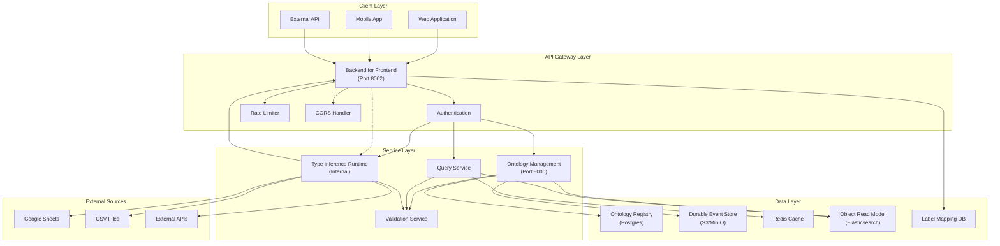

# Data Flow Architecture

:::info Auto-Generated
This diagram is auto-generated from `docs/architecture/` Mermaid sources.
Do not edit manually. Run `python scripts/generate_portal_mermaid.py`.
:::

End-to-end data flow through SPICE Harvester, from client requests through the API Gateway, Service Layer, and Data Layer.

