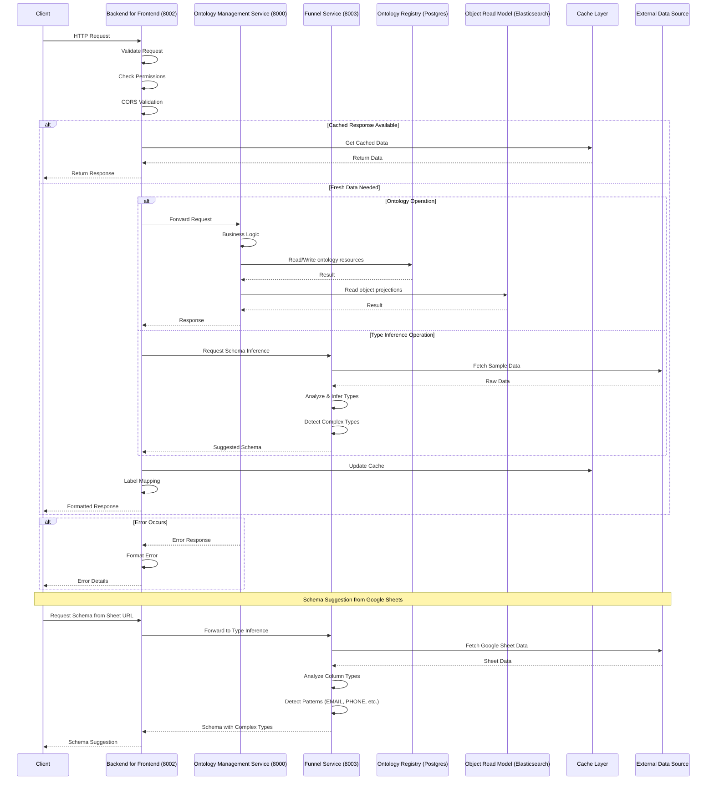

# Service Interactions

:::info Auto-Generated
This diagram is auto-generated from `docs/architecture/` Mermaid sources.
Do not edit manually. Run `python scripts/generate_portal_mermaid.py`.
:::

Sequence diagram showing request flows between services: client → BFF → OMS/Funnel → data stores, including caching and error handling paths.

