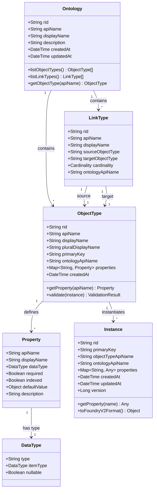
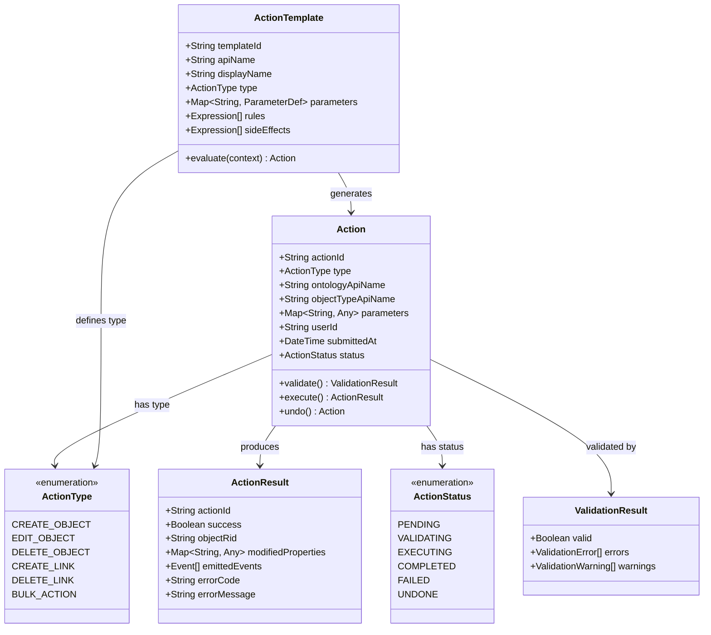
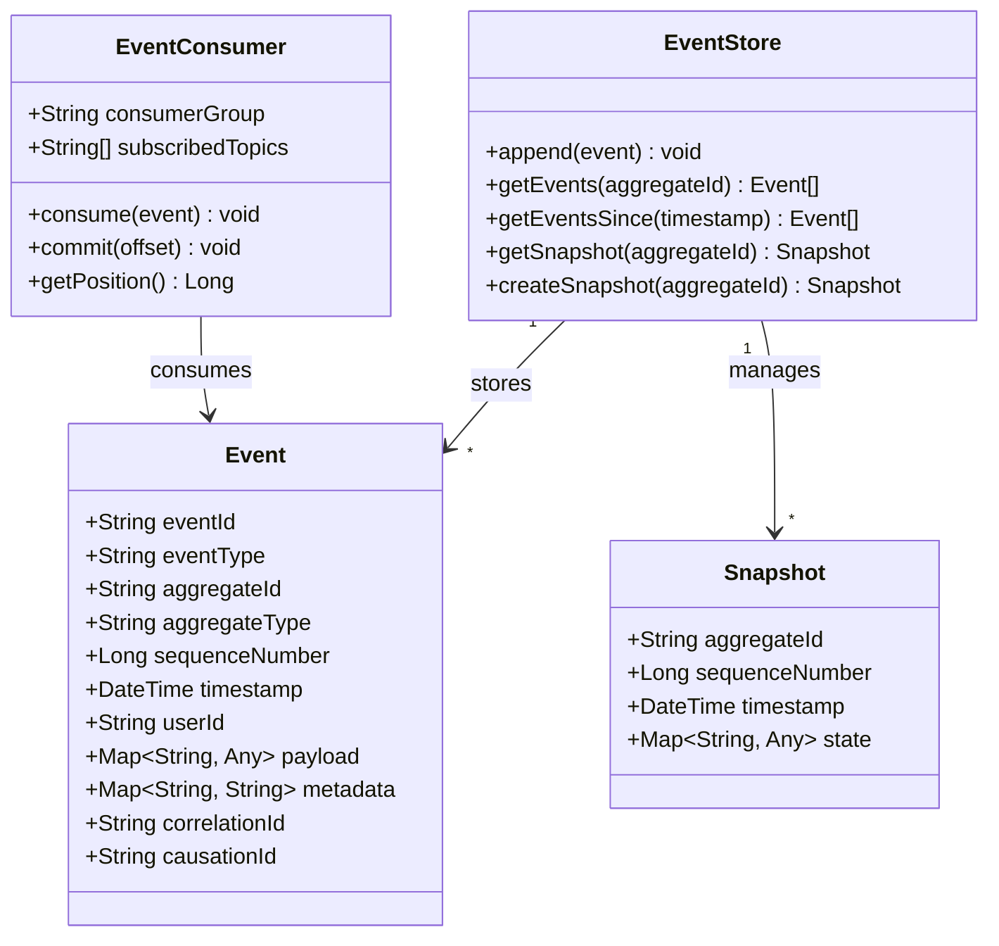
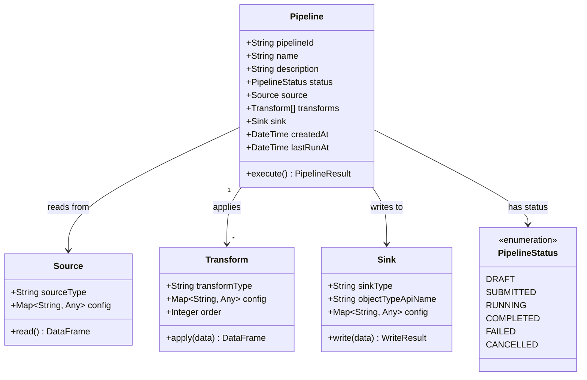
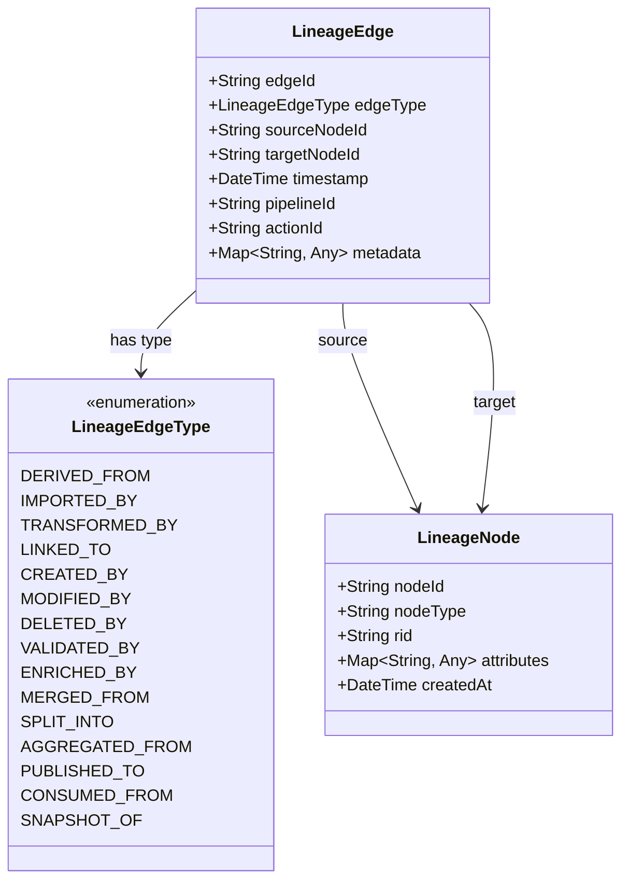

# Class Diagrams

This page presents the key domain model classes in SPICE Harvester. These diagrams reflect the core entities and their relationships as implemented in the ontology management layer.

## Ontology Domain Model

The following class diagram shows the primary entities that make up the ontology schema and instance layers.

## Action System Model

Actions represent all write operations in the platform. They are validated, executed, and recorded as events.

## Event Model

Events are the immutable records of all state changes in the platform.

## Pipeline Model

Pipelines define data transformation workflows.

## Lineage Model

Lineage tracks data provenance through the system.

## Relationship Summary

The domain model follows these key relationships:

- An **Ontology** contains multiple **ObjectTypes** and **LinkTypes**.
- Each **ObjectType** defines multiple **Properties**, each with a **DataType**.
- **Instances** are concrete records conforming to an ObjectType schema.
- **Actions** mutate instances and produce **Events**.
- **Events** are stored in the **EventStore** and consumed by **EventConsumers** (workers).
- **Pipelines** read from **Sources**, apply **Transforms**, and write to **Sinks** (which submit actions).
- **Lineage** records provenance relationships between **LineageNodes** via typed **LineageEdges**.

## Next Steps

- **[Event Sourcing](./event-sourcing)** -- How events flow through the system
- **[Core Concepts](/docs/getting-started/concepts)** -- Plain-language explanation of these entities
- **[API Reference](/docs/api/overview)** -- How these models appear in the API
