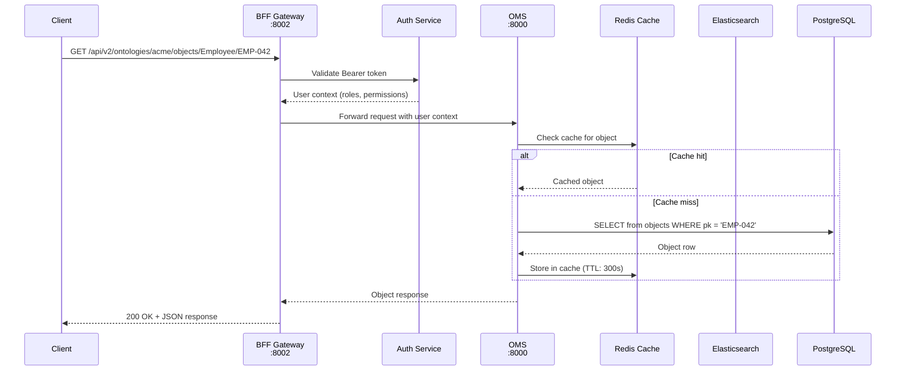
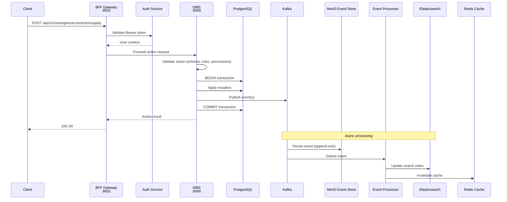
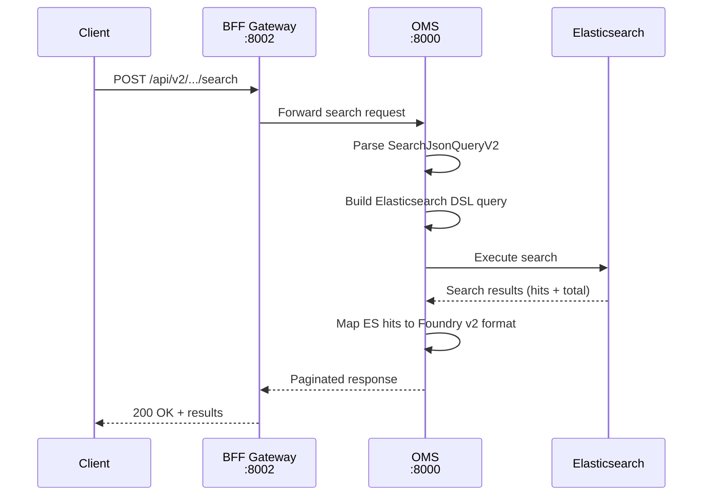

# Data Flow

This page traces the lifecycle of a request through SPICE Harvester, from client submission to response delivery. Understanding data flow is essential for debugging, performance tuning, and capacity planning.

## Read Path (Query)

The read path handles all data retrieval operations: listing objects, searching, loading by primary key, and fetching ontology metadata.

### Read Path Details

1. **Client** sends a request to the BFF gateway with a Bearer token in the `Authorization` header.
2. **BFF** extracts the token and validates it with the Auth service. The Auth service returns the user context including roles and permissions.
3. **BFF** checks that the user has read access to the requested ontology and object type. If not, a `403 Forbidden` is returned.
4. **BFF** forwards the request to **OMS** with the resolved user context attached as internal headers.
5. **OMS** first checks **Redis** for a cached copy of the requested object.
   - On cache hit, the cached object is returned immediately.
   - On cache miss, OMS queries **PostgreSQL** for the canonical record, caches the result in Redis, and returns it.
6. For search queries, OMS routes to **Elasticsearch** instead of PostgreSQL.
7. **BFF** transforms the OMS response into the Foundry v2 API format and returns it to the client.

## Write Path (Command)

The write path handles all mutations: creating objects, editing properties, deleting records, and managing links.

### Write Path Details

1. **Client** submits an action to the BFF gateway (e.g., `createObject`, `editObject`).
2. **BFF** authenticates the user and verifies write permissions on the target ontology and object type.
3. **OMS** validates the action:
   - Schema validation ensures the payload matches the object type definition.
   - Business rules are evaluated (required fields, value constraints, uniqueness).
   - Conflict detection checks for concurrent modifications using optimistic locking.
4. **OMS** opens a database transaction in **PostgreSQL**:
   - The mutation is applied to the objects table.
   - One or more events are published to **Kafka** within the same transaction (using the transactional outbox pattern).
   - The transaction is committed.
5. **OMS** returns the action result to BFF, which forwards it to the client.
6. **Asynchronously**, Kafka delivers the events to:
   - **MinIO Event Store** for durable, append-only persistence.
   - **Event Processor Workers** which update Elasticsearch indices and invalidate Redis caches.

## Search Flow

Search requests follow a specialized path through Elasticsearch:

The OMS translates `SearchJsonQueryV2` operators (eq, gt, containsAnyTerm, etc.) into Elasticsearch Query DSL. Results are mapped back to the Foundry v2 object format with `__rid`, `__primaryKey`, `__apiName`, and `properties`.

## Pipeline Execution Flow

Pipelines are long-running data transformation jobs:

1. A pipeline definition is submitted to the **Funnel** service.
2. Funnel validates the pipeline configuration and stores it in PostgreSQL.
3. Funnel publishes a `pipeline.submitted` event to Kafka.
4. A **Pipeline Runner** worker picks up the event and begins execution.
5. The runner processes transforms sequentially: reading from sources, applying transformations, and writing results.
6. Output transforms (e.g., `upsertObjects`) submit actions to OMS, which follow the normal write path.
7. Progress events are published to Kafka so clients can monitor execution.
8. On completion, a `pipeline.completed` event is published.

## Eventual Consistency

Because reads are served from separate stores (Elasticsearch, Redis) that are updated asynchronously, there is a consistency window between a write and when that write is visible in search results or cached views.

**Typical consistency latency:**

| Read Model | Typical Lag | Maximum Lag |
|-----------|-------------|-------------|
| PostgreSQL (direct) | 0 ms (synchronous) | 0 ms |
| Redis cache | 0-300 ms (invalidation) | 300 s (TTL expiry) |
| Elasticsearch | 50-500 ms | 5 s (refresh interval) |
| Projections | 100 ms - 2 s | 30 s |

For use cases that require read-after-write consistency, clients can include the `X-Consistency: strong` header, which forces OMS to read from PostgreSQL instead of Elasticsearch or Redis.

## Next Steps

- **[Service Topology](./service-topology)** -- Detailed service ports and dependencies
- **[Event Sourcing](./event-sourcing)** -- How events flow through the system
- **[Monitoring](/docs/operations/monitoring)** -- Track data flow health
