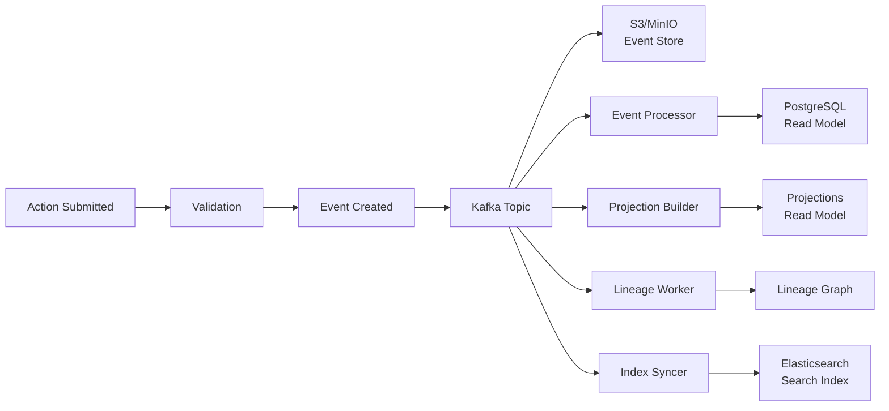

# Event Sourcing

Spice OS uses event sourcing as its core persistence pattern. Every state change is captured as an immutable event, providing a complete audit trail and enabling powerful capabilities like event replay, time-travel queries, and projection rebuilds.

## Event Flow Overview



## Event Lifecycle

### 1. Event Creation

When an action is submitted through the API, the OMS service validates it and produces one or more events. Events are created within a database transaction using the **transactional outbox pattern**:

```python
# Simplified pseudocode
async def apply_action(action: Action) -> ActionResult:
    async with database.transaction():
        # 1. Validate the action
        validation = await validate(action)
        if not validation.valid:
            raise ValidationError(validation.errors)

        # 2. Apply the mutation to PostgreSQL
        result = await mutate(action)

        # 3. Write event to outbox table (same transaction)
        event = Event(
            event_type=action.type.value,
            aggregate_id=result.object_rid,
            payload=result.changes,
            metadata={"user_id": action.user_id}
        )
        await outbox.insert(event)

    # 4. Transaction committed; outbox relay publishes to Kafka
    return result
```

The outbox relay is a background process that reads committed events from the outbox table and publishes them to Kafka. This guarantees that events are published if and only if the database transaction succeeded.

### 2. Kafka Distribution

Events are published to topic-partitioned Kafka topics. The partitioning strategy ensures that all events for a given aggregate (object) are processed in order:

| Topic | Partition Key | Consumers |
|-------|--------------|-----------|
| `spice.events.objects` | `aggregate_id` (object RID) | Event Processor, Index Syncer, Cache Warmer |
| `spice.events.actions` | `action_id` | Lineage Worker, Notification Worker |
| `spice.events.pipelines` | `pipeline_id` | Pipeline Runner, Metric Aggregator |
| `spice.events.projections` | `projection_id` | Projection Builder |
| `spice.events.schema` | `object_type_rid` | Schema Validator |
| `spice.events.dlq` | `original_topic` | Dead Letter Processor |

### 3. Event Store Persistence

Every event is persisted to the S3/MinIO event store in an append-only, immutable log. Events are stored as JSON files organized by date and aggregate:

```
s3://spice-events/
├── 2024/
│   ├── 01/
│   │   ├── 15/
│   │   │   ├── objects/
│   │   │   │   ├── ri.ontology.main.object.emp-001/
│   │   │   │   │   ├── 000001.json
│   │   │   │   │   ├── 000002.json
│   │   │   │   │   └── 000003.json
│   │   │   │   └── ri.ontology.main.object.proj-042/
│   │   │   │       └── 000001.json
│   │   │   └── actions/
│   │   │       └── ...
```

The event store is the canonical source of truth. All other data stores (PostgreSQL read models, Elasticsearch indices, projections) are derived from it and can be rebuilt.

### 4. Read Model Updates

Workers consume events from Kafka and update their respective read models:

**Event Processor** updates the PostgreSQL read model with the latest object state. This is the primary read model for point lookups.

**Index Syncer** updates Elasticsearch indices to keep search results current. It handles index creation, document upserts, and deletions.

**Projection Builder** maintains denormalized views by aggregating events. Projections can combine data from multiple object types and compute derived values.

**Lineage Worker** records provenance edges in the lineage graph whenever data flows between objects, pipelines, or external systems.

## Event Schema

Every event follows a standard envelope format:

```json
{
  "eventId": "evt-2024-01-15T09:30:00.000Z-a1b2c3",
  "eventType": "OBJECT_CREATED",
  "aggregateId": "ri.ontology.main.object.emp-042",
  "aggregateType": "object",
  "sequenceNumber": 1,
  "timestamp": "2024-01-15T09:30:00.000Z",
  "userId": "user-admin-001",
  "correlationId": "req-abc123",
  "causationId": "action-def456",
  "payload": {
    "objectTypeApiName": "Employee",
    "ontologyApiName": "acme",
    "properties": {
      "employeeId": "EMP-042",
      "fullName": "Jane Doe",
      "department": "Engineering",
      "startDate": "2023-06-15"
    }
  },
  "metadata": {
    "source": "api",
    "version": "2",
    "clientIp": "10.0.1.50"
  }
}
```

### Event Types

| Event Type | Description |
|-----------|-------------|
| `OBJECT_CREATED` | A new object instance was created |
| `OBJECT_UPDATED` | Properties of an existing object were modified |
| `OBJECT_DELETED` | An object instance was deleted |
| `LINK_CREATED` | A link between two objects was established |
| `LINK_DELETED` | A link between two objects was removed |
| `ACTION_APPLIED` | An action was successfully applied |
| `ACTION_FAILED` | An action failed validation or execution |
| `ACTION_UNDONE` | A previously applied action was reversed |
| `PIPELINE_STARTED` | A pipeline execution began |
| `PIPELINE_COMPLETED` | A pipeline execution completed successfully |
| `PIPELINE_FAILED` | A pipeline execution failed |
| `SCHEMA_UPDATED` | An object type schema was modified |
| `PROJECTION_REBUILT` | A projection was rebuilt from events |

## Snapshots

To avoid replaying the entire event history when rebuilding state, the platform takes periodic snapshots. A snapshot captures the current state of an aggregate at a specific sequence number:

```json
{
  "aggregateId": "ri.ontology.main.object.emp-042",
  "sequenceNumber": 150,
  "timestamp": "2024-01-15T09:30:00.000Z",
  "state": {
    "objectTypeApiName": "Employee",
    "properties": {
      "employeeId": "EMP-042",
      "fullName": "Jane Doe",
      "department": "Product",
      "startDate": "2023-06-15"
    },
    "version": 150
  }
}
```

When rebuilding state, the system loads the latest snapshot and replays only the events after the snapshot's sequence number.

The **Snapshot Worker** creates snapshots on a configurable schedule (default: every 100 events per aggregate, or daily for low-activity aggregates).

## Replay and Rebuild

### Full Rebuild

To completely rebuild a read model from the event store:

```bash
# Rebuild Elasticsearch indices from events
docker compose exec oms python -m spice.cli rebuild --target elasticsearch

# Rebuild projections from events
docker compose exec oms python -m spice.cli rebuild --target projections

# Rebuild everything
docker compose exec oms python -m spice.cli rebuild --target all
```

### Selective Replay

Replay events for a specific aggregate or time range:

```bash
# Replay events for a specific object
docker compose exec oms python -m spice.cli replay --aggregate ri.ontology.main.object.emp-042

# Replay events from a specific timestamp
docker compose exec oms python -m spice.cli replay --since 2024-01-15T00:00:00Z

# Replay events for a specific ontology
docker compose exec oms python -m spice.cli replay --ontology acme
```

## Ordering Guarantees

- Events for the **same aggregate** are strictly ordered by sequence number.
- Events across **different aggregates** have no ordering guarantee.
- Kafka partitioning by aggregate ID ensures per-aggregate ordering within a topic.
- Consumers that need cross-aggregate ordering must implement their own coordination (e.g., using timestamps and buffering).

## Retention and Compaction

| Store | Retention | Compaction |
|-------|----------|------------|
| Kafka topics | 7 days (default) | Log compaction on `aggregate_id` |
| S3/MinIO event store | Indefinite | No compaction (immutable append-only) |
| PostgreSQL outbox | 24 hours | Deleted after Kafka delivery confirmed |
| Snapshots | Indefinite (last 10 per aggregate) | Older snapshots pruned |

## Error Handling

When event processing fails, the platform follows a retry-then-dead-letter strategy:

1. **Immediate retry**: The consumer retries the event up to 3 times with exponential backoff.
2. **Delayed retry**: If immediate retries fail, the event is published to a retry topic with a delay (1 min, 5 min, 15 min).
3. **Dead letter**: After all retries are exhausted, the event is moved to the dead letter queue (`spice.events.dlq`).
4. **Manual resolution**: Operators can inspect dead letter events via the Admin service and manually replay or discard them.

## Next Steps

- **[Architecture Overview](./overview)** -- High-level system design
- **[Data Flow](./data-flow)** -- Request lifecycle
- **[Projection Consistency](/docs/operations/projection-consistency)** -- Monitoring and fixing projection lag
