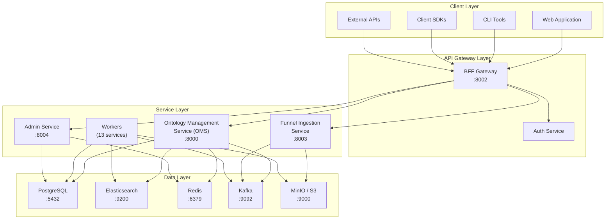

# Architecture Overview

SPICE Harvester is a CQRS/Event Sourcing platform designed for enterprise ontology management. This page describes the high-level architecture, service layers, and key design decisions.

## High-Level Architecture

The platform is organized into four distinct layers, each with clear responsibilities:

## Layer Responsibilities

### Client Layer

The client layer includes all consumers of the SPICE Harvester API:

- **Web Application** -- browser-based UI for ontology exploration, search, and administration
- **CLI Tools** -- command-line interface for scripting and automation
- **Client SDKs** -- language-specific libraries (Python, TypeScript) for programmatic access
- **External APIs** -- third-party integrations consuming the public API

All clients communicate exclusively through the BFF gateway. Direct access to internal services is not permitted.

### API Gateway Layer

The **Backend-for-Frontend (BFF)** service on port 8002 is the single entry point for all external traffic. It handles:

- **Request routing** -- dispatches requests to the appropriate internal service
- **Authentication** -- validates Bearer tokens and resolves user identity
- **Rate limiting** -- protects internal services from excessive load
- **Request/response transformation** -- adapts internal formats to the Foundry v2 API contract
- **CORS management** -- controls cross-origin access for browser clients

### Service Layer

The service layer contains the core business logic:

- **Ontology Management Service (OMS)** -- the primary service for ontology CRUD, object management, search, actions, and lineage. Runs on port 8000.
- **Funnel Ingestion Service** -- handles bulk data imports, file uploads, and streaming ingestion. Runs on port 8003.
- **Admin Service** -- platform administration, user management, and configuration. Runs on port 8004.
- **Workers** -- 13 background services that process events, build projections, run pipelines, and maintain consistency.

### Data Layer

The data layer provides persistence, indexing, caching, messaging, and object storage:

| Store | Role | Consistency |
|-------|------|------------|
| **PostgreSQL** | Source of truth for ontology schema and object instances | Strong (ACID) |
| **Elasticsearch** | Full-text search index and analytics | Eventually consistent |
| **Redis** | Caching, session storage, rate limiting | Best effort |
| **Kafka** | Event streaming and message bus | At-least-once delivery |
| **MinIO/S3** | Immutable event store and file storage | Durable, append-only |

## Key Design Decisions

### CQRS (Command Query Responsibility Segregation)

The platform separates reads and writes into distinct paths:

- **Command path**: Actions are submitted through the API, validated, and converted to events. Events are published to Kafka and persisted to the event store.
- **Query path**: Reads are served from optimized read models (PostgreSQL for point lookups, Elasticsearch for search, Redis for cached aggregations).

This separation allows each path to be scaled and optimized independently.

### Event Sourcing

Every state change is captured as an immutable event. The event store (S3/MinIO) serves as the canonical history. Benefits include:

- Complete audit trail of every mutation
- Ability to rebuild any read model by replaying events
- Time-travel queries to inspect historical state
- Support for undo/redo through compensating events

### Foundry v2 API Compatibility

The v2 API surface follows the Palantir Foundry API contract. This ensures that clients built for Foundry can migrate to SPICE Harvester with minimal changes. Key compatibility points:

- Resource identifiers use the `ri.` prefix format
- Object responses include `__rid`, `__primaryKey`, `__apiName`, and `properties`
- Search uses the `SearchJsonQueryV2` format with 13 operators
- Pagination uses opaque `pageToken` values

### Multi-Tenancy Through Ontologies

Each ontology provides logical isolation of data and schema. This enables:

- Multiple teams or business units to operate independently
- Environment separation (dev, staging, production) within a single deployment
- Schema evolution without cross-ontology impact

## Service Inventory

The platform consists of 33+ Docker services organized into four categories:

| Category | Count | Examples |
|----------|-------|---------|
| API Servers | 4 | OMS, BFF, Funnel, Admin |
| Workers | 13 | Event Processor, Projection Builder, Pipeline Runner, Lineage Worker, Schema Validator, Action Executor, Notification Worker, Retry Handler, Dead Letter Processor, Metric Aggregator, Cache Warmer, Index Syncer, Snapshot Worker |
| Data Stores | 8 | PostgreSQL, Elasticsearch, Redis, Kafka, ZooKeeper, MinIO, Schema Registry, Kafka Connect |
| Observability | 6 | Grafana, Prometheus, Jaeger, OTEL Collector, AlertManager, Loki |

For detailed service topology and port mappings, see [Service Topology](./service-topology).

## Next Steps

- **[Data Flow](./data-flow)** -- Trace a request from client to response
- **[Service Topology](./service-topology)** -- Complete service inventory with ports and dependencies
- **[Event Sourcing](./event-sourcing)** -- Deep dive into the event-driven architecture
