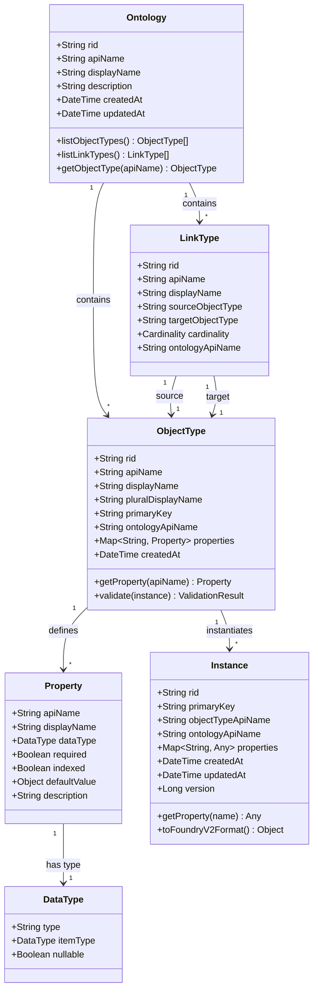
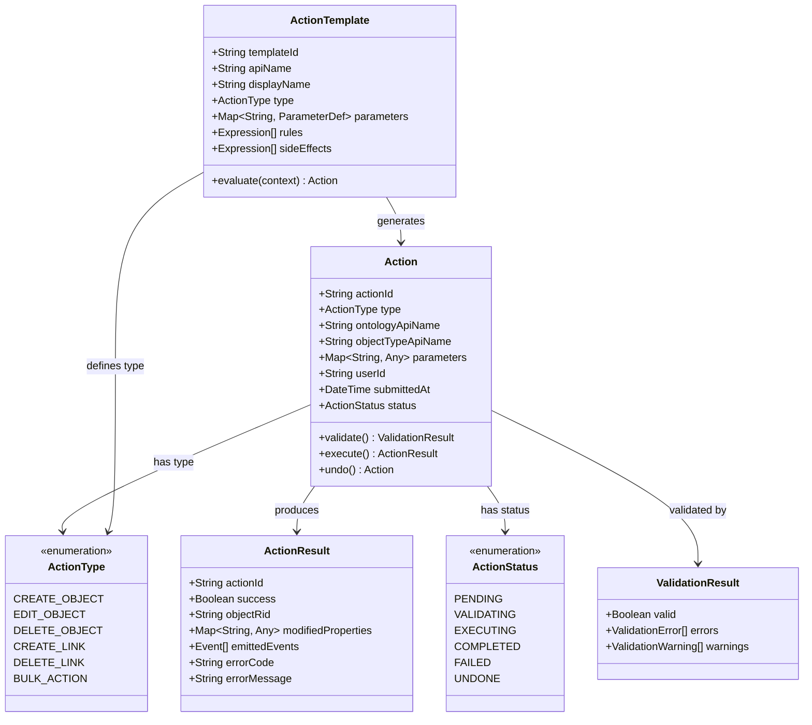
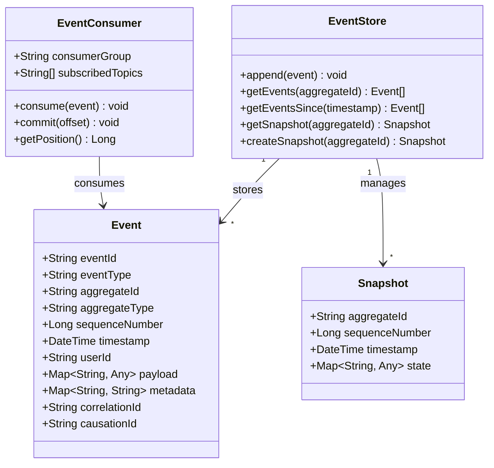
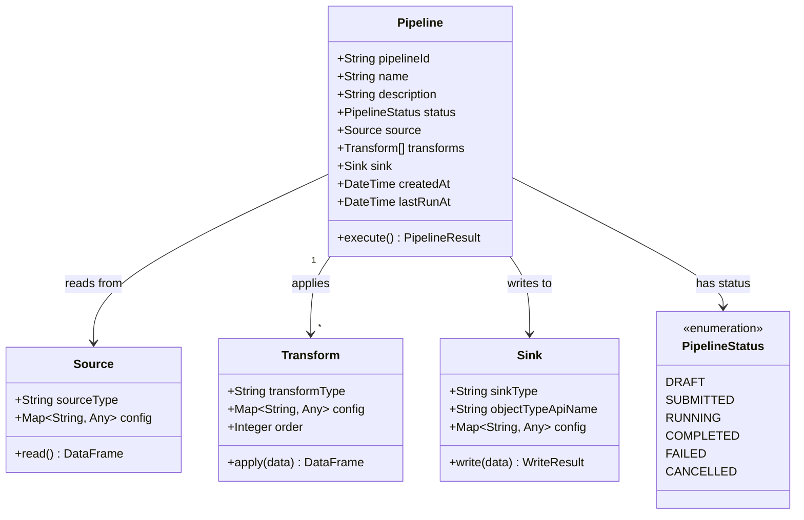
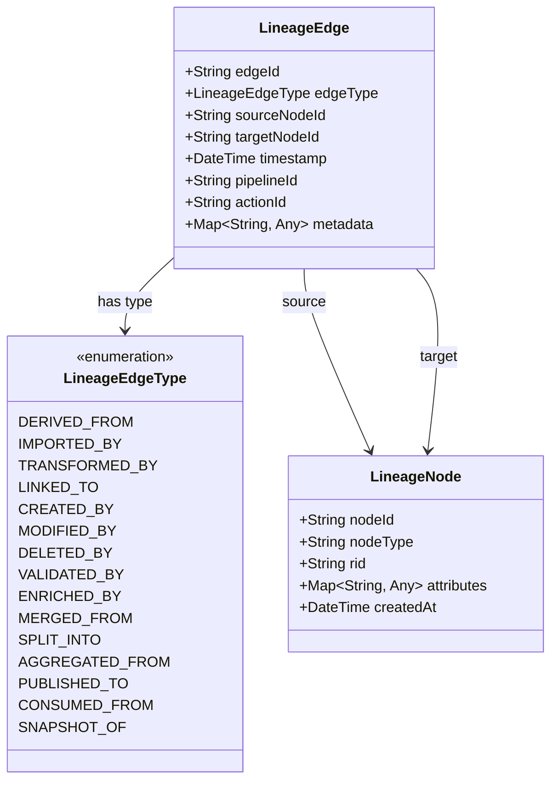

# 클래스 다이어그램

이 페이지는 Spice OS의 핵심 도메인 모델 클래스들을 보여줍니다. 다이어그램은 온톨로지 관리 레이어에 구현된 핵심 엔티티와 그 관계를 반영합니다.

## 온톨로지 도메인 모델

아래 클래스 다이어그램은 온톨로지 스키마 레이어와 인스턴스 레이어를 구성하는 주요 엔티티를 나타냅니다.

## 액션 시스템 모델

액션은 플랫폼의 모든 쓰기(write) 작업을 나타냅니다. 액션은 검증되고 실행되며, 이벤트로 기록됩니다.

## 이벤트 모델

이벤트는 플랫폼에서 발생하는 모든 상태 변경의 불변(immutable) 기록입니다.

## 파이프라인 모델

파이프라인은 데이터 변환 워크플로를 정의합니다.

## 라인리지(Lineage) 모델

라인리지는 시스템 내 데이터 출처(provenance)를 추적합니다.

## 관계 요약

도메인 모델은 다음과 같은 핵심 관계를 가집니다:

- **온톨로지(Ontology)** 는 여러 **ObjectType** 과 **LinkType** 을 포함합니다.
- 각 **ObjectType** 은 여러 **Property** 를 정의하며, 각 Property는 **DataType** 을 가집니다.
- **인스턴스(Instances)** 는 ObjectType 스키마를 따르는 실제 레코드입니다.
- **액션(Actions)** 은 인스턴스를 변경하고 **이벤트(Events)** 를 생성합니다.
- **이벤트(Events)** 는 **EventStore** 에 저장되고, **EventConsumer**(워커)가 소비합니다.
- **파이프라인(Pipelines)** 은 **Source** 에서 읽고, **Transform** 을 적용한 뒤 **Sink** 로 기록합니다(이 과정에서 액션을 제출할 수 있음).
- **라인리지(Lineage)** 는 타입이 있는 **LineageEdge** 로 **LineageNode** 간 출처 관계를 기록합니다.

## 다음 단계

- **[이벤트 소싱](./event-sourcing)** -- 이벤트가 시스템을 통해 흐르는 방식
- **[핵심 개념](/docs/getting-started/concepts)** -- 위 엔티티에 대한 쉬운 설명
- **[API 레퍼런스](/docs/api/overview)** -- API에서 이 모델이 어떻게 나타나는지
