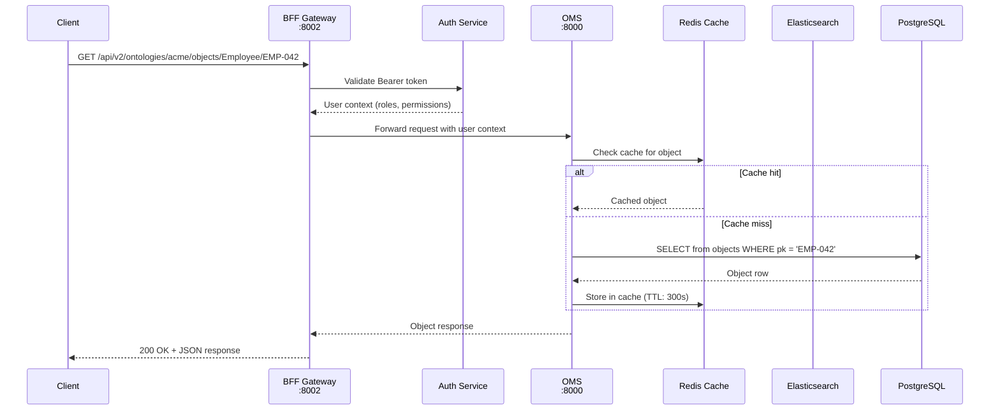
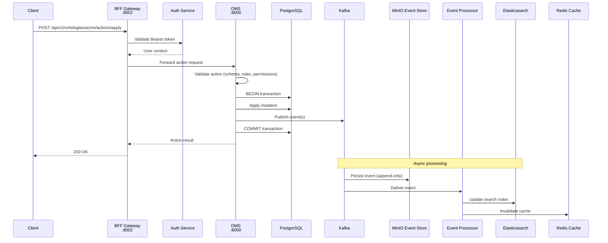
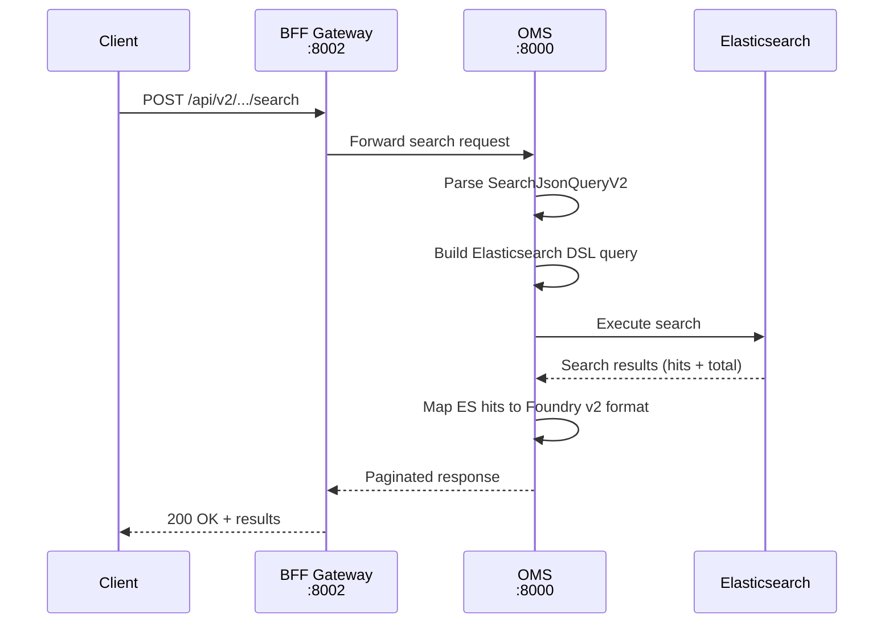

# 데이터 흐름

이 페이지에서는 Spice OS에서 요청이 처리되는 전체 라이프사이클을 클라이언트 제출부터 응답 전달까지 추적합니다. 데이터 흐름을 이해하면 디버깅, 성능 튜닝, 용량 계획에 큰 도움이 됩니다.

## 읽기 경로(Read Path, Query)

읽기 경로는 객체 목록 조회, 검색, 기본키 기반 로드, 온톨로지 메타데이터 조회 등 모든 데이터 조회 작업을 처리합니다.

### 읽기 경로 상세

1. **Client**가 `Authorization` 헤더에 Bearer 토큰을 담아 BFF 게이트웨이로 요청을 보냅니다.
2. **BFF**가 토큰을 추출해 Auth 서비스로 검증합니다. Auth 서비스는 역할, 권한 등을 포함한 사용자 컨텍스트를 반환합니다.
3. **BFF**가 사용자에게 요청한 온톨로지와 객체 유형(Object Type)에 대한 읽기 권한이 있는지 확인합니다. 권한이 없으면 `403 Forbidden`을 반환합니다.
4. **BFF**가 해석된 사용자 컨텍스트를 내부 헤더로 첨부하여 **OMS**로 요청을 전달합니다.
5. **OMS**는 먼저 **Redis** 캐시에서 해당 객체의 사본을 확인합니다.
   - 캐시 히트면 즉시 반환합니다.
   - 캐시 미스면 **PostgreSQL**에서 정본(canonical record)을 조회하고, Redis에 캐시(TTL: 300초)한 뒤 반환합니다.
6. 검색 쿼리의 경우에는 OMS가 PostgreSQL 대신 **Elasticsearch**로 라우팅합니다.
7. **BFF**가 OMS 응답을 Foundry v2 API 형식으로 변환한 뒤 클라이언트에 반환합니다.

## 쓰기 경로(Write Path, Command)

쓰기 경로는 객체 생성, 수정, 삭제 및 링크(Link) 관리 등 모든 변이(mutation)를 처리합니다.

### 쓰기 경로 상세

1. **Client**가 BFF 게이트웨이에 액션을 제출합니다(예: `createObject`, `editObject`).
2. **BFF**가 사용자를 인증하고 대상 온톨로지와 객체 유형에 대한 쓰기 권한을 확인합니다.
3. **OMS**가 액션을 검증합니다.
   - 스키마 검증: payload가 객체 유형 정의와 일치하는지 확인
   - 비즈니스 규칙 평가: 필수 필드, 값 제약, 유일성 등
   - 충돌 감지: 낙관적 락을 사용한 동시 수정 감지
4. **OMS**가 **PostgreSQL**에서 트랜잭션을 시작합니다.
   - objects 테이블에 변이를 적용합니다.
   - 동일 트랜잭션 안에서 **Kafka**로 이벤트를 게시합니다(Transactional Outbox 패턴).
   - 트랜잭션을 커밋합니다.
5. **OMS**가 액션 결과를 BFF에 반환하고, BFF는 이를 클라이언트에 전달합니다.
6. **비동기적으로** Kafka가 이벤트를 다음 대상으로 전달합니다.
   - 내구성 있는 append-only 저장을 위한 **MinIO Event Store**
   - Elasticsearch 인덱스 갱신 및 Redis 캐시 무효화를 수행하는 **Event Processor 워커**

## 검색 흐름(Search Flow)

검색 요청은 Elasticsearch를 중심으로 특화된 경로를 따릅니다.

OMS는 `SearchJsonQueryV2` 연산자(eq, gt, containsAnyTerm 등)를 Elasticsearch Query DSL로 변환합니다. 결과는 `__rid`, `__primaryKey`, `__apiName`, `properties`를 포함하는 Foundry v2 객체 형식으로 다시 매핑됩니다.

## 파이프라인 실행 흐름(Pipeline Execution Flow)

파이프라인은 장시간 실행되는 데이터 변환 잡입니다. 전체 흐름은 다음과 같습니다.

1. 파이프라인 정의가 **BFF**를 통해 파이프라인 오케스트레이션 서비스로 제출됩니다.
2. 오케스트레이터가 파이프라인 구성을 검증한 뒤 PostgreSQL에 저장합니다.
3. 오케스트레이터가 Kafka에 `pipeline.submitted` 이벤트를 게시합니다.
4. **Pipeline Runner** 워커가 이벤트를 수신하고 실행을 시작합니다.
5. 러너는 변환을 순차적으로 처리합니다. 소스 읽기, 변환 적용, 결과 쓰기 순서입니다.
6. 출력 변환(예: `upsertObjects`)은 OMS에 액션을 제출하며, 이후에는 일반 쓰기 경로를 따릅니다.
7. 진행 상황 이벤트가 Kafka에 게시되어 클라이언트가 실행 과정을 모니터링할 수 있습니다.
8. 완료 시 `pipeline.completed` 이벤트가 게시됩니다.

## 최종 일관성(Eventual Consistency)

읽기가 별도 스토어(Elasticsearch, Redis)에서 제공되고 비동기적으로 업데이트되기 때문에, 쓰기 직후 검색 결과나 캐시 뷰에 반영되기까지 일관성 윈도우가 발생할 수 있습니다.

**일반적인 일관성 지연:**

| 리드 모델 | 일반 지연 | 최대 지연 |
|-----------|-------------|-------------|
| PostgreSQL (direct) | 0 ms (동기) | 0 ms |
| Redis cache | 0-300 ms (무효화) | 300 s (TTL 만료) |
| Elasticsearch | 50-500 ms | 5 s (refresh interval) |
| Projections | 100 ms - 2 s | 30 s |

read-after-write 정합성이 필요하다면 클라이언트가 `X-Consistency: strong` 헤더를 포함하면 됩니다. 이 헤더를 사용하면 OMS가 Elasticsearch나 Redis 대신 PostgreSQL에서 직접 읽도록 강제할 수 있습니다.

## 다음 단계

- **[서비스 토폴로지](./service-topology)** -- 서비스 포트와 의존성 상세
- **[이벤트 소싱](./event-sourcing)** -- 이벤트가 시스템을 통해 흐르는 방식
- **[모니터링](/docs/operations/monitoring)** -- 데이터 흐름 상태 추적
