# 이벤트 소싱

Spice OS는 코어 영속성 패턴으로 이벤트 소싱(Event Sourcing)을 사용합니다. 모든 상태 변경을 불변(immutable) 이벤트로 캡처하여 완전한 감사 추적을 제공하고, 이벤트 리플레이, 타임 트래블 쿼리, 프로젝션 리빌드 같은 강력한 기능을 가능하게 합니다.

## 이벤트 흐름 개요

```mermaid
graph LR
    A[Action Submitted] --> B[Validation]
    B --> C[Event Created]
    C --> D[Kafka Topic]
    D --> E[S3/MinIO<br/>Event Store]
    D --> F[Event Processor]
    D --> G[Projection Builder]
    D --> H[Lineage Worker]
    D --> I[Index Syncer]

    F --> J[PostgreSQL<br/>Read Model]
    G --> K[Projections<br/>Read Model]
    H --> L[Lineage Graph]
    I --> M[Elasticsearch<br/>Search Index]
```



## 이벤트 라이프사이클

### 1. 이벤트 생성

API를 통해 액션이 제출되면 OMS 서비스가 이를 검증하고 하나 이상의 이벤트를 생성합니다. 이벤트는 **Transactional Outbox 패턴**을 사용해 데이터베이스 트랜잭션 안에서 생성됩니다:

```python
# Simplified pseudocode
async def apply_action(action: Action) -> ActionResult:
    async with database.transaction():
        # 1. Validate the action
        validation = await validate(action)
        if not validation.valid:
            raise ValidationError(validation.errors)

        # 2. Apply the mutation to PostgreSQL
        result = await mutate(action)

        # 3. Write event to outbox table (same transaction)
        event = Event(
            event_type=action.type.value,
            aggregate_id=result.object_rid,
            payload=result.changes,
            metadata={"user_id": action.user_id}
        )
        await outbox.insert(event)

    # 4. Transaction committed; outbox relay publishes to Kafka
    return result
```

Outbox relay는 outbox 테이블에서 커밋된 이벤트를 읽어 Kafka에 게시하는 백그라운드 프로세스입니다. 이를 통해 **DB 트랜잭션이 성공했을 때만 이벤트가 게시**되도록 보장합니다.

### 2. Kafka 분산

이벤트는 Kafka 토픽(파티션)으로 게시됩니다. 파티셔닝 전략은 특정 aggregate(객체)에 대한 이벤트가 순서대로 처리되도록 보장합니다:

| 토픽 | 파티션 키 | 컨슈머 |
|-------|--------------|-----------|
| `spice.events.objects` | `aggregate_id` (object RID) | Event Processor, Index Syncer, Cache Warmer |
| `spice.events.actions` | `action_id` | Lineage Worker, Notification Worker |
| `spice.events.pipelines` | `pipeline_id` | Pipeline Runner, Metric Aggregator |
| `spice.events.projections` | `projection_id` | Projection Builder |
| `spice.events.schema` | `object_type_rid` | Schema Validator |
| `spice.events.dlq` | `original_topic` | Dead Letter Processor |

### 3. 이벤트 스토어 영속화

모든 이벤트는 S3/MinIO 이벤트 스토어에 append-only, immutable 로그로 저장됩니다. 이벤트는 날짜와 aggregate 기준으로 정리된 JSON 파일로 저장됩니다:

```
s3://spice-events/
├── 2024/
│   ├── 01/
│   │   ├── 15/
│   │   │   ├── objects/
│   │   │   │   ├── ri.ontology.main.object.emp-001/
│   │   │   │   │   ├── 000001.json
│   │   │   │   │   ├── 000002.json
│   │   │   │   │   └── 000003.json
│   │   │   │   └── ri.ontology.main.object.proj-042/
│   │   │   │       └── 000001.json
│   │   │   └── actions/
│   │   │       └── ...
```

이벤트 스토어는 정합성의 기준(canonical source of truth)입니다. PostgreSQL 리드 모델, Elasticsearch 인덱스, 프로젝션 등 다른 모든 스토어는 이벤트에서 파생되며, 필요 시 재구성할 수 있습니다.

### 4. 리드 모델 업데이트

워커는 Kafka에서 이벤트를 소비해 각자 리드 모델을 업데이트합니다:

**Event Processor** 는 PostgreSQL 리드 모델에 최신 객체 상태를 반영합니다(포인트 조회의 기본 리드 모델).

**Index Syncer** 는 Elasticsearch 인덱스를 업데이트해 검색 결과를 최신으로 유지합니다. 인덱스 생성, 문서 업서트, 삭제를 처리합니다.

**Projection Builder** 는 이벤트를 집계해 비정규화 뷰를 유지합니다. 여러 객체 유형의 데이터를 결합하거나 파생 값을 계산할 수 있습니다.

**Lineage Worker** 는 객체/파이프라인/외부 시스템 간 데이터 흐름이 발생할 때 라인리지 그래프에 provenance 엣지를 기록합니다.

## 이벤트 스키마

모든 이벤트는 표준 엔벨로프(envelope) 형식을 따릅니다:

```json
{
  "eventId": "evt-2024-01-15T09:30:00.000Z-a1b2c3",
  "eventType": "OBJECT_CREATED",
  "aggregateId": "ri.ontology.main.object.emp-042",
  "aggregateType": "object",
  "sequenceNumber": 1,
  "timestamp": "2024-01-15T09:30:00.000Z",
  "userId": "user-admin-001",
  "correlationId": "req-abc123",
  "causationId": "action-def456",
  "payload": {
    "objectTypeApiName": "Employee",
    "ontologyApiName": "acme",
    "properties": {
      "employeeId": "EMP-042",
      "fullName": "Jane Doe",
      "department": "Engineering",
      "startDate": "2023-06-15"
    }
  },
  "metadata": {
    "source": "api",
    "version": "2",
    "clientIp": "10.0.1.50"
  }
}
```

### 이벤트 타입

| 이벤트 타입 | 설명 |
|-----------|-------------|
| `OBJECT_CREATED` | 새 객체 인스턴스가 생성됨 |
| `OBJECT_UPDATED` | 기존 객체의 속성이 수정됨 |
| `OBJECT_DELETED` | 객체 인스턴스가 삭제됨 |
| `LINK_CREATED` | 두 객체 간 링크가 생성됨 |
| `LINK_DELETED` | 두 객체 간 링크가 삭제됨 |
| `ACTION_APPLIED` | 액션이 성공적으로 적용됨 |
| `ACTION_FAILED` | 액션이 검증 또는 실행에 실패함 |
| `ACTION_UNDONE` | 적용된 액션이 되돌려짐 |
| `PIPELINE_STARTED` | 파이프라인 실행이 시작됨 |
| `PIPELINE_COMPLETED` | 파이프라인 실행이 성공적으로 완료됨 |
| `PIPELINE_FAILED` | 파이프라인 실행이 실패함 |
| `SCHEMA_UPDATED` | 객체 유형 스키마가 수정됨 |
| `PROJECTION_REBUILT` | 프로젝션이 이벤트로부터 리빌드됨 |

## 스냅샷(Snapshots)

상태를 재구성할 때 전체 이벤트 히스토리를 매번 리플레이하지 않도록, 플랫폼은 주기적으로 스냅샷을 생성합니다. 스냅샷은 특정 시퀀스 번호에서 aggregate의 현재 상태를 캡처합니다:

```json
{
  "aggregateId": "ri.ontology.main.object.emp-042",
  "sequenceNumber": 150,
  "timestamp": "2024-01-15T09:30:00.000Z",
  "state": {
    "objectTypeApiName": "Employee",
    "properties": {
      "employeeId": "EMP-042",
      "fullName": "Jane Doe",
      "department": "Product",
      "startDate": "2023-06-15"
    },
    "version": 150
  }
}
```

상태를 재구성할 때는 최신 스냅샷을 로드한 뒤, 스냅샷의 시퀀스 이후 이벤트만 리플레이합니다.

**Snapshot Worker** 는 구성 가능한 스케줄로 스냅샷을 생성합니다(기본값: aggregate당 100개 이벤트마다, 또는 활동이 적은 aggregate는 일 1회).

## 리플레이와 리빌드(Replay and Rebuild)

### 전체 리빌드(Full Rebuild)

이벤트 스토어에서 리드 모델을 완전히 재구성하려면:

```bash
# 이벤트로부터 Elasticsearch 인덱스 재구성
docker compose exec oms python -m spice.cli rebuild --target elasticsearch

# 이벤트로부터 프로젝션 재구성
docker compose exec oms python -m spice.cli rebuild --target projections

# 전체 재구성
docker compose exec oms python -m spice.cli rebuild --target all
```

### 선택적 리플레이(Selective Replay)

특정 aggregate 또는 기간에 대해서만 이벤트를 리플레이할 수 있습니다:

```bash
# 특정 객체의 이벤트 리플레이
docker compose exec oms python -m spice.cli replay --aggregate ri.ontology.main.object.emp-042

# 특정 시점 이후 이벤트 리플레이
docker compose exec oms python -m spice.cli replay --since 2024-01-15T00:00:00Z

# 특정 온톨로지에 대한 이벤트 리플레이
docker compose exec oms python -m spice.cli replay --ontology acme
```

## 순서 보장(Ordering Guarantees)

- **동일 aggregate** 에 대한 이벤트는 시퀀스 번호로 엄격히 정렬됩니다.
- **서로 다른 aggregate** 간에는 순서 보장이 없습니다.
- aggregate ID 기반 Kafka 파티셔닝은 토픽 내에서 aggregate 단위 순서를 보장합니다.
- aggregate 간 순서가 필요한 컨슈머는 자체 코디네이션(예: 타임스탬프+버퍼링)을 구현해야 합니다.

## 보존/컴팩션(Retention and Compaction)

| 스토어 | 보존 | 컴팩션 |
|-------|----------|------------|
| Kafka topics | 7일(기본) | `aggregate_id` 기준 로그 컴팩션 |
| S3/MinIO event store | 무기한 | 컴팩션 없음(불변 append-only) |
| PostgreSQL outbox | 24시간 | Kafka 전달 확인 후 삭제 |
| Snapshots | 무기한(aggregate당 최근 10개) | 오래된 스냅샷은 정리 |

## 에러 처리(Error Handling)

이벤트 처리 실패 시, 플랫폼은 재시도 후 데드 레터 전략을 따릅니다:

1. **즉시 재시도**: 컨슈머가 지수 백오프로 최대 3회 재시도
2. **지연 재시도**: 실패 시 지연 토픽으로 게시(1분, 5분, 15분)
3. **데드 레터**: 모든 재시도 실패 후 DLQ(`spice.events.dlq`)로 이동
4. **수동 처리**: 운영자가 Admin 서비스에서 DLQ 이벤트를 확인하고 리플레이/폐기

## 다음 단계

- **[아키텍처 개요](./overview)** -- 상위 수준 시스템 설계
- **[데이터 흐름](./data-flow)** -- 요청 라이프사이클
- **[프로젝션 정합성](/docs/operations/projection-consistency)** -- 프로젝션 지연 모니터링/복구
