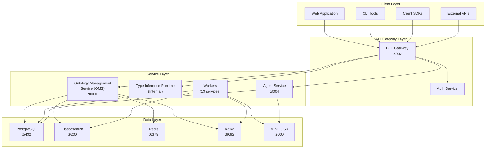

# 아키텍처 개요

Spice OS는 엔터프라이즈 온톨로지 관리를 위해 설계된 CQRS/Event Sourcing 플랫폼입니다. 이 페이지에서는 상위 수준 아키텍처, 서비스 레이어, 그리고 주요 설계 결정을 설명합니다.

## 상위 수준 아키텍처

플랫폼은 역할이 명확한 4개 레이어로 구성됩니다:

## 레이어별 역할

### 클라이언트 레이어

클라이언트 레이어는 Spice OS API의 모든 소비자를 포함합니다:

- **웹 애플리케이션** -- 온톨로지 탐색/검색/관리용 브라우저 UI
- **CLI 도구** -- 스크립팅과 자동화를 위한 커맨드라인 인터페이스
- **클라이언트 SDK** -- 언어별 라이브러리(Python, TypeScript)로 프로그램 방식 접근
- **외부 API** -- 공개 API를 소비하는 서드파티 통합

모든 클라이언트는 BFF 게이트웨이를 통해서만 통신합니다. 내부 서비스에 대한 직접 접근은 허용되지 않습니다.

### API 게이트웨이 레이어

포트 8002의 **Backend-for-Frontend(BFF)** 서비스는 모든 외부 트래픽의 단일 진입점입니다. 다음을 담당합니다:

- **요청 라우팅** -- 요청을 적절한 내부 서비스로 디스패치
- **인증(Authentication)** -- Bearer 토큰 검증 및 사용자 식별
- **레이트 리미팅(Rate limiting)** -- 과도한 부하로부터 내부 서비스 보호
- **요청/응답 변환** -- 내부 포맷을 Foundry v2 API 계약에 맞게 변환
- **CORS 관리** -- 브라우저 클라이언트를 위한 교차 출처 접근 제어

### 서비스 레이어

서비스 레이어는 핵심 비즈니스 로직을 포함합니다:

- **온톨로지 관리 서비스(OMS)** -- 온톨로지 CRUD, 객체 관리, 검색, 액션, 라인리지의 핵심 서비스. 포트 8000에서 동작합니다.
- **Funnel 런타임(내부)** -- BFF에 포함된 테이블형 타입 추론/시트 구조 분석 컴포넌트(공개 서비스로 노출되지 않음)
- **Agent 서비스** -- 오케스트레이션된 워크플로 단계에서 도구 실행을 담당하는 런타임. 포트 8004에서 동작합니다.
- **워커(Workers)** -- 이벤트 처리, 프로젝션 생성, 파이프라인 실행, 정합성 유지 등을 수행하는 12개의 백그라운드 서비스

### 데이터 레이어

데이터 레이어는 영속성/인덱싱/캐싱/메시징/오브젝트 스토리지를 제공합니다:

| 스토어 | 역할 | 일관성 |
|-------|------|------------|
| **PostgreSQL** | 온톨로지 스키마와 객체 인스턴스의 source of truth | 강함(ACID) |
| **Elasticsearch** | 전체 텍스트 검색 인덱스 및 분석 | 최종 일관성 |
| **Redis** | 캐시/세션/레이트 리미팅 | best effort |
| **Kafka** | 이벤트 스트리밍/메시지 버스 | at-least-once |
| **MinIO/S3** | 불변 이벤트 스토어 및 파일 저장소 | 내구성, append-only |

## 주요 설계 결정

### CQRS(Command Query Responsibility Segregation)

플랫폼은 읽기와 쓰기를 분리된 경로로 처리합니다:

- **커맨드 경로**: 액션이 API를 통해 제출되고, 검증 후 이벤트로 변환됩니다. 이벤트는 Kafka에 게시되고 이벤트 스토어에 저장됩니다.
- **쿼리 경로**: 읽기는 최적화된 리드 모델(PostgreSQL: 포인트 조회, Elasticsearch: 검색, Redis: 캐시)에서 제공됩니다.

이 분리는 각 경로를 독립적으로 스케일하고 최적화할 수 있게 합니다.

### 이벤트 소싱(Event Sourcing)

모든 상태 변경은 불변 이벤트로 캡처됩니다. 이벤트 스토어(S3/MinIO)는 정합성의 기준이 되는 히스토리입니다. 장점:

- 모든 변경의 완전한 감사 추적
- 이벤트 리플레이로 리드 모델 재구성 가능
- 과거 상태를 확인하는 타임 트래블 쿼리
- 보상 이벤트를 통한 undo/redo 지원

### Foundry v2 API 호환성

v2 API 표면은 Palantir Foundry API 계약을 따릅니다. Foundry용 클라이언트가 최소 변경으로 Spice OS로 이동할 수 있게 합니다. 주요 포인트:

- 리소스 식별자는 `ri.` 접두사 형식 사용
- 객체 응답에 `__rid`, `__primaryKey`, `__apiName`, `properties` 포함
- 검색은 13개 연산자를 가진 `SearchJsonQueryV2` 형식 사용
- 페이지네이션은 opaque `pageToken` 사용

### 온톨로지를 통한 멀티 테넌시(Multi-Tenancy)

각 온톨로지는 데이터와 스키마를 논리적으로 격리합니다. 이를 통해:

- 여러 팀/사업부가 독립적으로 운영 가능
- 단일 배포 내에서 환경(dev/staging/prod) 분리
- 온톨로지 간 영향 없이 스키마 진화 가능

## 서비스 인벤토리

플랫폼은 6개 범주로 구성된 **32개의 Docker 서비스**로 이루어져 있습니다:

| 범주 | 개수 | 예시 |
|----------|-------|---------|
| API 서버 | 3 | OMS, BFF, Agent |
| 워커 | 12 | Action Worker, Action Outbox Worker, Connector Sync Worker, Connector Trigger Service, Ingest Reconciler, Instance Worker, Objectify Worker, Ontology Worker, Pipeline Scheduler, Pipeline Worker, Projection Worker, Writeback Materializer |
| 데이터 플랫폼 | 7 | PostgreSQL, Elasticsearch, Redis, Kafka, ZooKeeper, MinIO, LakeFS |
| 관측성 | 6 | Grafana, Prometheus, Jaeger, OTEL Collector, AlertManager, Kafka UI |
| 부트스트랩 | 3 | DB Migrations, LakeFS Init, MinIO Init |
| 기타 | 1 | Message Relay |

서비스 토폴로지와 포트 매핑의 상세 내용은 [서비스 토폴로지](./service-topology)를 참고하세요.

## 다음 단계

- **[데이터 흐름](./data-flow)** -- 클라이언트에서 응답까지 요청 추적
- **[서비스 토폴로지](./service-topology)** -- 포트/의존성을 포함한 서비스 인벤토리
- **[이벤트 소싱](./event-sourcing)** -- 이벤트 기반 아키텍처 심화
