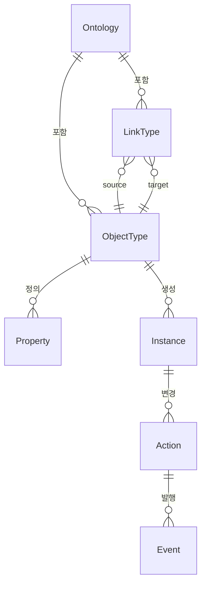
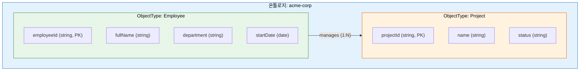
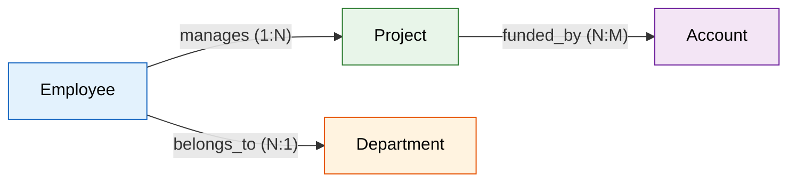
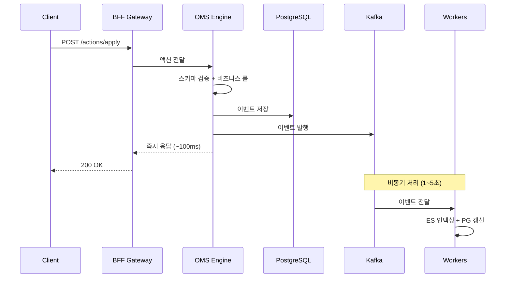
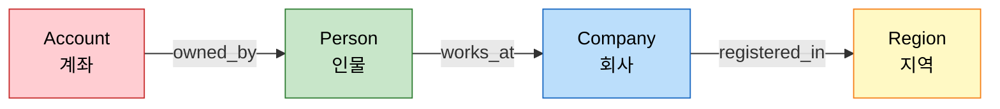
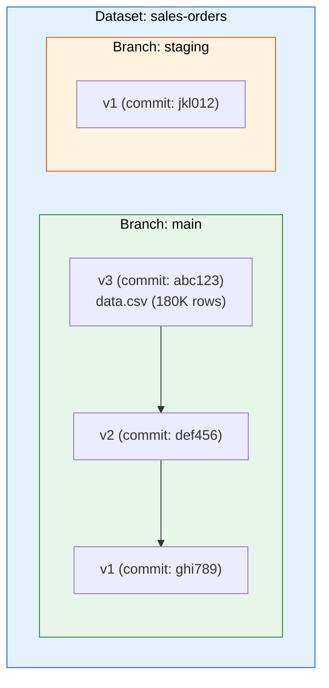
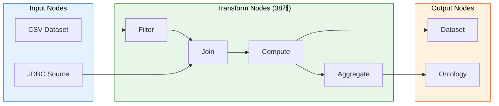
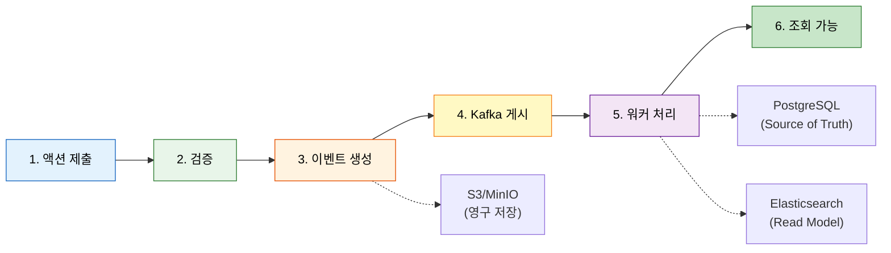
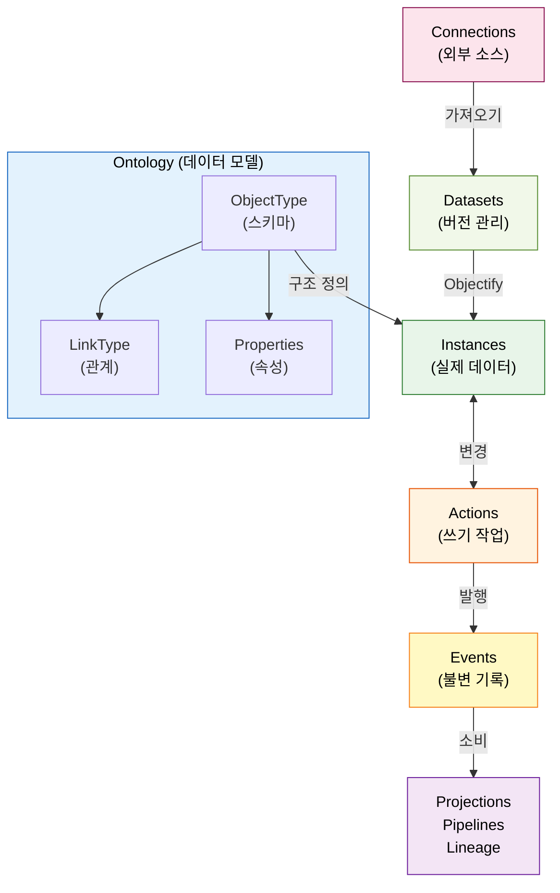

# 핵심 개념

Spice OS는 Palantir Foundry에서 영감을 받아 설계된 플랫폼입니다. 핵심은 **강타입(Strongly-typed) 온톨로지 모델**이에요.

이 페이지에서는 플랫폼을 사용하기 전에 알아야 할 기본 개념을 **SQL과 코드 비유**를 곁들여 설명합니다.

## 핵심 개념 한눈에 보기



---

## 온톨로지(Ontology)

**온톨로지(Ontology)** 는 조직의 데이터 모델을 정의하는 최상위 컨테이너입니다. SQL의 `DATABASE`에 해당한다고 생각하면 됩니다.

### SQL 비유로 보는 핵심 용어

| Spice OS | SQL 비유 | 설명 |
|:---------|:---------|:-----|
| **Ontology** | `DATABASE` | 모든 스키마를 담는 최상위 컨테이너 |
| **Object Type** | `CREATE TABLE` | 엔티티의 스키마 정의 |
| **Property** | `COLUMN` | 타입이 있는 속성 |
| **Link Type** | `FOREIGN KEY` (1급 시민) | 방향성을 가진 관계 정의 |
| **Instance** | `INSERT INTO` 된 행 | 실제 데이터 레코드 |
| **Action** | `INSERT`, `UPDATE`, `DELETE` + 감사 로그 | 검증 + 이벤트 기반 쓰기 |



여러 온톨로지를 둘 수도 있고, 각각 고유한 `apiName`으로 식별됩니다. 대부분의 경우에는 하나의 기본 온톨로지만 사용해요.

---

## 객체 유형(Object Types)

**객체 유형(Object Type)** 은 데이터의 구조를 정의하는 스키마입니다. 관계형 DB의 테이블이나 객체지향 프로그래밍의 클래스와 비슷합니다.

```sql
-- SQL로 비유하면:
CREATE TABLE Employee (
    employeeId  VARCHAR PRIMARY KEY,  -- primary_key: true
    fullName    VARCHAR NOT NULL,     -- required: true, title_key: true
    department  VARCHAR,
    startDate   DATE,
    salary      DECIMAL CHECK (salary >= 0)
);
```

```python
# Python 코드로 비유하면:
@dataclass
class Employee:
    employeeId: str    # primary key
    fullName: str      # title key
    department: str | None = None
    startDate: date | None = None
    salary: float | None = None
```

### 지원 데이터 타입

| 타입 | SQL 매핑 | 설명 | 예시 |
|------|----------|------|------|
| `string` | `TEXT` | UTF-8 텍스트 | `"Jane Doe"` |
| `integer` | `BIGINT` | 64-bit 정수 | `42` |
| `long` | `BIGINT` | 64-bit 정수 (별칭) | `9876543210` |
| `double` | `DOUBLE PRECISION` | 64-bit 부동소수점 | `3.14159` |
| `boolean` | `BOOLEAN` | 참/거짓 | `true` |
| `date` | `DATE` | ISO 8601 날짜 | `"2024-01-15"` |
| `timestamp` | `TIMESTAMP WITH TIME ZONE` | ISO 8601 일시 | `"2024-01-15T09:30:00Z"` |
| `geopoint` | `TEXT` (JSON) | 위도, 경도 쌍 | `{"lat": 37.77, "lon": -122.42}` |
| `geoshape` | `TEXT` (GeoJSON) | GeoJSON 지오메트리 | `{"type": "Polygon", ...}` |
| `array` | `JSONB` | 기본 타입의 리스트 | `["tag1", "tag2"]` |

---

## 링크 유형(Link Types)

**링크 유형(Link Type)** 은 두 객체 유형 사이의 방향성을 가진 관계를 정의합니다. SQL의 FOREIGN KEY와 비슷하지만, 온톨로지에서는 **1급 시민(First-class citizen)** 으로 취급돼요.



### 카디널리티(Cardinality)

| 카디널리티 | SQL 비유 | 설명 | 구현 방식 |
|:-----------|:---------|:-----|:----------|
| `ONE_TO_ONE` | `UNIQUE FOREIGN KEY` | 1:1 관계 | Foreign Key |
| `ONE_TO_MANY` | `FOREIGN KEY` | 1:N 관계 | Foreign Key |
| `MANY_TO_ONE` | 역방향 `FOREIGN KEY` | N:1 관계 | Foreign Key |
| `MANY_TO_MANY` | `JOIN TABLE` | N:M 관계 | Join Table / Object-Backed |

### 관계 구현 방식

링크 유형은 3가지 백킹 구현을 지원합니다.

- **Foreign Key** -- 소스 테이블의 컬럼이 타겟의 PK를 참조합니다. 가장 단순한 방식이에요.
- **Join Table** -- 별도의 브릿지 테이블로 N:M 관계를 표현합니다.
- **Object-Backed** -- 관계 자체를 추가 속성을 가진 객체 유형으로 표현합니다.

---

## 속성(Properties)

**속성(Property)** 은 객체 유형에 붙는 이름과 타입이 지정된 특성입니다.

```json
{
  "name": "employeeId",
  "type": "xsd:string",
  "label": { "en": "Employee ID", "ko": "직원 ID" },
  "required": true,
  "primary_key": true,
  "constraints": {
    "pattern": "^EMP-\\d{3,6}$"
  }
}
```

### 특수 역할

| 역할 | 설명 | SQL 비유 |
|:-----|:-----|:---------|
| **primary_key** | 인스턴스를 고유 식별 | `PRIMARY KEY` |
| **title_key** | UI에서 표시 이름으로 사용 | `-- display column` |
| **required** | 모든 인스턴스에 필수 | `NOT NULL` |
| **indexed** | ES에서 검색 가능 | `CREATE INDEX` |

### 제약 조건(Constraints)

| 제약 | 타입 | SQL 비유 | 예시 |
|:-----|:-----|:---------|:-----|
| `min` / `max` | number | `CHECK (age >= 0)` | `{"min": 0, "max": 200}` |
| `pattern` | string | `CHECK (id ~ '^EMP-')` | `{"pattern": "^EMP-\\d+$"}` |
| `enum` | array | `CHECK (status IN (...))` | `{"enum": ["ACTIVE", "INACTIVE"]}` |
| `length` | object | `VARCHAR(100)` | `{"min": 1, "max": 100}` |

---

## 인스턴스(Instances)

**인스턴스(Instance)** 는 특정 객체 유형의 실제 데이터 레코드입니다. SQL에서 `INSERT INTO`로 추가한 행이라고 생각하면 됩니다.

```json
{
  "__rid": "ri.ontology.main.object.employee-00042",
  "__primaryKey": "EMP-042",
  "__apiName": "Employee",
  "properties": {
    "employeeId": "EMP-042",
    "fullName": "Jane Doe",
    "department": "Engineering",
    "startDate": "2023-06-15"
  }
}
```

| 필드 | 설명 | SQL 비유 |
|:-----|:-----|:---------|
| `__rid` | 플랫폼 전체에서 유일한 리소스 식별자 | `CTID` (내부 행 ID) |
| `__primaryKey` | 기본키 속성의 값 | `PRIMARY KEY` 값 |
| `__apiName` | 이 인스턴스가 속한 객체 유형 | `TABLE` 이름 |
| `properties` | 실제 데이터 값 | 행의 컬럼 값들 |

인스턴스는 두 곳에 저장됩니다.

- **PostgreSQL** -- Source of Truth로서 정확성을 보장합니다
- **Elasticsearch** -- 빠른 검색과 분석을 위해 인덱싱됩니다

---

## 액션(Actions)

**액션(Action)** 은 플랫폼의 쓰기(write) 경로입니다. 단순 CRUD가 아니라, **검증 -> 이벤트 생성 -> 비동기 처리** 파이프라인을 거칩니다.



### 액션 타입

| 액션 타입 | SQL 비유 | 설명 |
|:----------|:---------|:-----|
| `createObject` | `INSERT INTO` | 새 인스턴스 생성 |
| `editObject` | `UPDATE SET` | 기존 인스턴스 속성 수정 |
| `deleteObject` | `DELETE FROM` | 인스턴스 삭제 |
| `createLink` | `INSERT INTO join_table` | 두 인스턴스 간 관계 생성 |
| `deleteLink` | `DELETE FROM join_table` | 관계 삭제 |
| `bulkAction` | `BEGIN; ... COMMIT;` | 여러 액션을 원자적으로 실행 |

### SQL과의 차이점

| SQL | Spice OS 액션 |
|:----|:-------------|
| 직접 실행 | 검증(Validation) 후 실행 |
| 로그는 선택적 | 모든 변경이 이벤트로 기록 (감사 추적) |
| ROLLBACK | Undo API로 보상 액션 실행 |
| 락(Lock) 기반 | 낙관적 잠금(Optimistic Locking) + 충돌 감지 |

### 액션 템플릿

재사용 가능한 동적 표현식 언어를 사용합니다.

| 연산자 | 설명 | 예시 |
|:-------|:-----|:-----|
| `$ref` | 파라미터/속성 참조 | `{"$ref": "parameters.fullName"}` |
| `$now` | 현재 타임스탬프 | `{"$now": "ISO8601"}` |
| `$if` | 조건부 표현식 | `{"$if": {"cond": ..., "then": ..., "else": ...}}` |
| `$switch` | 다중 분기 조건 | `{"$switch": {"on": ..., "cases": {...}}}` |
| `$call` | 등록된 함수 호출 | `{"$call": {"fn": "generateId", "args": [...]}}` |

---

## 멀티홉 쿼리(Multi-hop Query)

Spice OS는 **링크 유형을 따라 여러 단계를 탐색**하는 멀티홉 쿼리를 지원합니다. 별도의 그래프 DB 없이 **Elasticsearch만으로** 구현돼요.



### 쿼리 예시: 4-홉 금융 조사

> "의심 계좌 ACC-001에 연결된 인물 → 그 인물이 근무하는 회사 → 그 회사가 등록된 지역"

```json
{
  "start_class": "Account",
  "start_filter": { "type": "eq", "field": "accountId", "value": "ACC-001" },
  "hops": [
    { "predicate": "owned_by", "target_class": "Person" },
    { "predicate": "works_at", "target_class": "Company" },
    { "predicate": "registered_in", "target_class": "Region" }
  ]
}
```

**API 엔드포인트:** `POST /api/v1/graph-query/{db}/multi-hop`

### 내부 동작 순서

1. **시작점 검색** -- Elasticsearch에서 `Account` 중 `accountId = "ACC-001"`을 찾습니다.
2. **각 홉 순회** -- `relationships.{predicate}` 필드에서 연결된 인스턴스 ID를 추출합니다.
3. **팬아웃 제한** -- 각 홉의 최대 결과 수를 1,000개로 제한해 무한 팽창을 방지합니다.
4. **순환 감지** -- 이미 방문한 노드를 추적해 무한 루프를 방지합니다.
5. **역방향 탐색** -- `reverse: true`를 설정하면 링크 반대 방향으로도 탐색할 수 있습니다.

---

## 데이터셋(Datasets)

**데이터셋(Dataset)** 은 LakeFS(MinIO/S3 기반)에 저장되는 버전 관리가 가능한 불변 데이터 객체입니다.



:::info LakeFS default_branch 주의
LakeFS 리포지토리의 기본 브랜치는 `"main"`입니다 (`"master"` 아님).
:::

---

## 커넥션 & 커넥터(Connections & Connectors)

외부 데이터 소스와의 연결을 설정합니다. 현재 6가지 커넥터 타입을 지원해요.

| 커넥터 | 라이브러리 | 사용 사례 |
|:-------|:---------|:---------|
| **Google Sheets** | gspread | 스프레드시트 가져오기 |
| **PostgreSQL** | asyncpg | 관계형 DB |
| **MySQL** | pymysql | 관계형 DB |
| **Oracle** | oracledb | 엔터프라이즈 DB |
| **Snowflake** | snowflake-connector | 데이터 웨어하우스 |
| **SQL Server** | pymssql | 엔터프라이즈 DB |

### 동기화 모드(Sync Modes)

| 모드 | SQL 비유 | 전략 | 사용 시점 |
|:-----|:---------|:-----|:---------|
| **SNAPSHOT** | `TRUNCATE + INSERT` | 매 실행 시 전체 교체 | 일일 리포트 |
| **APPEND** | `INSERT ON CONFLICT DO NOTHING` | 해시 기반 중복 제거 추가 | 이벤트 로그 |
| **UPDATE** | `INSERT ON CONFLICT DO UPDATE` | PK 기준 업서트 | 고객 프로필 |
| **INCREMENTAL** | `WHERE updated_at > watermark` | 워터마크 이후만 가져오기 | 대형 테이블 |
| **CDC** | Binlog / SCN 추적 | DB 변경 실시간 추적 | 실시간 복제 |

---

## 파이프라인(Pipelines)

**파이프라인(Pipeline)** 은 선언적 데이터 변환 워크플로입니다. 노드로 구성된 DAG(방향 비순환 그래프) 형태를 가집니다.



### 실행 모드

| 모드 | 목적 | 부수 효과 |
|:-----|:-----|:---------|
| **Preview** | 샘플 데이터로 시뮬레이션 | 없음 |
| **Build** | 전체 실행, 아티팩트 생성 | S3에 아티팩트 저장 |
| **Deploy** | 프로덕션에 반영 | 데이터셋 + 온톨로지에 기록 |

### UDF (사용자 정의 함수)

**샌드박스** 환경에서 행 단위 변환을 커스터마이징할 수 있습니다.

```python
def transform(row):
    return row.get("name", "").upper()
```

:::caution UDF 보안
안전한 Python builtins만 허용됩니다. `import`, 루프, 시스템 접근은 AST 검증으로 차단됩니다.
:::

---

## 이벤트 소싱(Event Sourcing)

모든 상태 변경이 불변 이벤트로 캡처됩니다. **Git for Data**와 같은 개념이에요.



| Git | Spice OS |
|:----|:---------|
| `git commit` | 이벤트 생성 (INSTANCE_CREATED, PROPERTY_UPDATED...) |
| `git log` | 이벤트 스토어 조회 (S3/MinIO에 영구 보관) |
| `git checkout <hash>` | 타임 트래블 쿼리 (과거 시점 데이터 조회) |
| HEAD | PostgreSQL + Elasticsearch (현재 데이터) |

---

## 프로젝션(Projections)

특정 쿼리 패턴에 최적화된 사전 계산 비정규화 뷰입니다. 대표적인 활용 사례를 볼까요.

- 타입이나 부서별 객체 수 집계
- 링크 유형을 따라 객체를 조인한 플랫 뷰
- 액션 활동의 시계열 롤업

프로젝션은 Source of Truth와 **최종 일관성(Eventual Consistency)** 을 가집니다. 보통 1~5초 이내에 동기화돼요.

---

## 라인리지(Lineage)

데이터가 시스템을 통해 어떻게 흐르는지 추적합니다. 총 **15개의 엣지 타입**을 캡처해요.

### 파생 및 변환

| 엣지 타입 | 설명 |
|:----------|:-----|
| `DERIVED_FROM` | 객체가 다른 객체로부터 파생됨 |
| `IMPORTED_BY` | 파이프라인에 의해 가져옴 |
| `TRANSFORMED_BY` | 변환으로 처리됨 |
| `LINKED_TO` | 다른 객체와 링크됨 |

### 액션 추적

| 엣지 타입 | 설명 |
|:----------|:-----|
| `CREATED_BY` | 액션으로 생성됨 |
| `MODIFIED_BY` | 액션으로 수정됨 |
| `DELETED_BY` | 액션으로 삭제됨 |
| `VALIDATED_BY` | 규칙에 의해 검증됨 |
| `ENRICHED_BY` | 조회로 보강됨 |

### 구조 변경 및 외부 연동

| 엣지 타입 | 설명 |
|:----------|:-----|
| `MERGED_FROM` | 다른 객체에서 병합됨 |
| `SPLIT_INTO` | 여러 객체로 분할됨 |
| `AGGREGATED_FROM` | 프로젝션에서 집계됨 |
| `PUBLISHED_TO` | 외부 시스템으로 게시됨 |
| `CONSUMED_FROM` | 외부 시스템에서 소비됨 |
| `SNAPSHOT_OF` | 특정 시점의 스냅샷 |

---

## 개념 간 관계



---

## 보안(Security)

| 계층 | 보호 |
|:-----|:-----|
| **시크릿 암호화** | 소스별 AAD를 포함한 AES-GCM |
| **SQL Injection 방어** | JDBC 쿼리 정규화, 세미콜론 및 멀티 스테이트먼트 거부 |
| **쿼리 타임아웃** | 모든 JDBC 작업에 300초 타임아웃 적용 |
| **피처 플래그** | JDBC, CDC 기능을 DB별로 게이팅 |
| **평문 차단** | 프로덕션에서 암호화 키 없이 시크릿 저장 불가 |
| **UDF 샌드박스** | AST 검증으로 import, 루프, 시스템 접근 차단 |

---

## 다음 단계

- **[아키텍처 개요](/docs/architecture/overview)** -- 이 개념들이 서비스에 어떻게 매핑되는지 확인
- **[API 레퍼런스](/docs/api/overview)** -- 플랫폼과 상호작용 시작
- **[데이터 엔지니어 가이드](/docs/guides/data-engineer/schema-config)** -- 온톨로지 정의
- **[커넥티비티 가이드](/docs/guides/data-engineer/import-templates)** -- 외부 데이터 소스 연결
