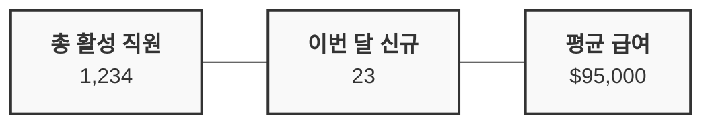
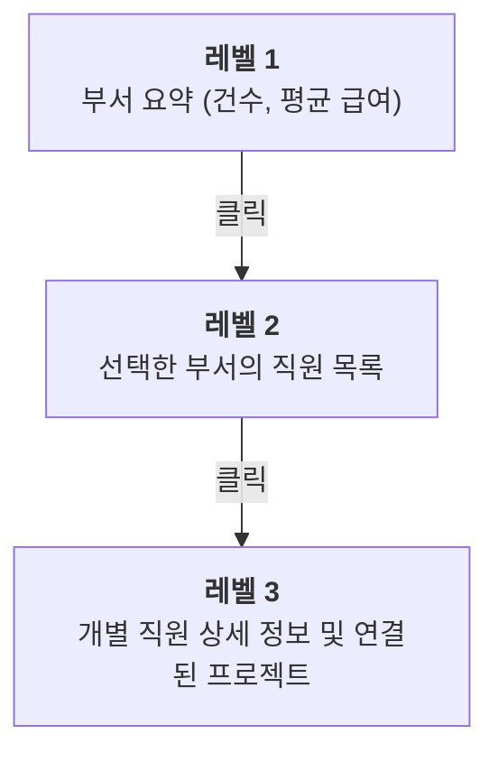

# 대시보드 및 시각화(Dashboard & Visualization)

Spice OS 데이터를 활용해 대시보드와 시각화를 구축해 볼까요? 검색 API(Search API), 프로젝션(Projections), 외부 도구를 조합하면 바로 활용 가능한 데이터 뷰를 만들 수 있어요.

## 데이터 접근 패턴

Spice OS는 시각화를 위해 여러 가지 데이터 접근 방법을 제공합니다:

| 패턴 | 적합한 용도 | 데이터 소스 |
|------|-------------|-------------|
| **검색 API(Search API)** | 실시간 객체 쿼리 | Elasticsearch |
| **프로젝션(Projections)** | 사전 집계된 분석 | Projection Workers |
| **데이터셋 readTable** | 원시 데이터 탐색 | LakeFS 데이터셋 |
| **링크 탐색(Link Traversal)** | 관계 그래프 | Object Graph |

## 검색 기반 뷰(Search-Powered Views)

가장 일반적인 대시보드 패턴은 검색 API를 사용하여 필터링되고 정렬된 뷰를 구축하는 것입니다.

### 필터링된 테이블 구축

```bash
POST /api/v2/ontologies/acme/objectTypes/Employee/objects/search

{
  "where": {
    "type": "and",
    "value": [
      { "type": "eq", "field": "status", "value": "ACTIVE" },
      { "type": "eq", "field": "department", "value": "Engineering" }
    ]
  },
  "orderBy": {
    "fields": [{ "field": "fullName", "direction": "asc" }]
  },
  "select": ["employeeId", "fullName", "department", "level", "startDate"],
  "pageSize": 100
}
```

### 동적 필터링(Dynamic Filtering)

사용자 선택에 따라 쿼리를 동적으로 구성하여 인터랙티브 대시보드를 구축합니다:

```javascript
// 사용자 선택에 따라 쿼리 구성
function buildQuery(filters) {
  const conditions = [];

  if (filters.department) {
    conditions.push({
      type: 'eq', field: 'department', value: filters.department
    });
  }

  if (filters.status) {
    conditions.push({
      type: 'eq', field: 'status', value: filters.status
    });
  }

  if (filters.minSalary) {
    conditions.push({
      type: 'gte', field: 'salary', value: filters.minSalary
    });
  }

  if (filters.searchText) {
    conditions.push({
      type: 'containsAnyTerm', field: 'fullName', value: filters.searchText
    });
  }

  return {
    where: conditions.length > 1
      ? { type: 'and', value: conditions }
      : conditions[0] || undefined,
    pageSize: 100
  };
}
```

### 집계 쿼리(Aggregation Queries)

차트 데이터를 위해 그룹화된 검색을 사용합니다:

```bash
# 부서별 건수 조회
POST /api/v2/ontologies/acme/objectTypes/Employee/objects/search

{
  "where": { "type": "eq", "field": "status", "value": "ACTIVE" },
  "select": ["department"],
  "pageSize": 1000
}
```

그런 다음 차트를 위해 클라이언트 측에서 집계합니다:

```javascript
const departmentCounts = {};
for (const emp of results.data) {
  const dept = emp.properties.department;
  departmentCounts[dept] = (departmentCounts[dept] || 0) + 1;
}
// 결과: { "Engineering": 45, "Marketing": 20, "Sales": 35, ... }
```

## 프로젝션 기반 분석(Projection-Based Analytics)

**프로젝션(Projections)**은 특정 쿼리 패턴에 최적화된 사전 계산된 비정규화 뷰(Denormalized Views)입니다. 이벤트 스트림(Event Stream)에서 프로젝션 워커(Projection Workers)에 의해 구축되며, 거의 실시간(Near-Real-Time)으로 집계된 데이터를 제공합니다.

### 프로젝션 유형

| 프로젝션 유형 | 설명 | 예시 |
|---------------|------|------|
| **카운트 집계(Count Aggregation)** | 차원별 객체 수 | 부서별 직원 수 |
| **평탄화 조인(Flattened Join)** | 비정규화된 크로스 링크 뷰 | 부서명이 포함된 직원 정보 |
| **시계열 롤업(Time-series Rollup)** | 시간 기반 집계 | 시간/일별 액션 수 |
| **계산된 메트릭(Computed Metrics)** | 파생 계산 | 부서별 평균 급여 |

### 프로젝션 접근

프로젝션은 표준 Object API를 통해 읽기 전용 뷰로 접근할 수 있습니다:

```bash
GET /api/v2/ontologies/acme/objectTypes/DepartmentSummary/objects
```

프로젝션은 **최종 일관성(Eventually Consistent)**을 가집니다 -- 쓰기와 프로젝션에 반영되기까지 짧은 지연이 있을 수 있습니다.

## 데이터 탐색

### 객체 탐색기(Object Explorer)

Object API를 사용하여 데이터를 인터랙티브하게 탐색합니다:

```bash
# 모든 객체 유형 조회
GET /api/v2/ontologies/acme/objectTypes

# 특정 유형의 객체 목록
GET /api/v2/ontologies/acme/objectTypes/Employee/objects?pageSize=25

# 객체 상세 정보 조회
GET /api/v2/ontologies/acme/objectTypes/Employee/objects/EMP-042

# 링크 탐색
POST /api/v2/ontologies/acme/linkTypes/manages/links
{
  "sourceObjectRid": "ri.spice.main.object.employee-00042"
}
```

### 데이터셋 탐색기(Dataset Explorer)

원시 데이터셋 내용을 탐색합니다:

```bash
# 데이터셋 목록
GET /api/v2/datasets

# 데이터셋을 테이블로 읽기
POST /api/v2/datasets/{datasetRid}/readTable
{
  "format": "csv",
  "branchName": "main",
  "limit": 100
}
```

## 외부 시각화 도구

### Grafana 통합

다음 방법을 사용하여 Grafana에서 Spice OS를 쿼리할 수 있습니다:

1. **JSON API 데이터 소스** -- 검색 API를 직접 쿼리합니다
2. **PostgreSQL 데이터 소스** -- 기본 PostgreSQL 테이블을 쿼리합니다
3. **Elasticsearch 데이터 소스** -- Elasticsearch 인덱스를 직접 쿼리합니다

**JSON API 데이터 소스 설정:**

```
URL: http://bff:8080/api
Custom HTTP Headers:
  Authorization: Bearer YOUR_TOKEN
```

**Grafana 패널 쿼리 예시:**

```json
{
  "url": "/v2/ontologies/acme/objectTypes/Employee/objects/search",
  "method": "POST",
  "body": {
    "where": { "type": "eq", "field": "status", "value": "ACTIVE" },
    "select": ["department", "salary"],
    "pageSize": 1000
  }
}
```

### 외부 애플리케이션에 임베딩(Embedding)

Spice OS 데이터를 자체 애플리케이션에 임베드합니다:

```html
<iframe
  src="https://your-grafana-instance.com/d/dashboard-id?orgId=1&kiosk"
  width="100%"
  height="600"
  frameborder="0">
</iframe>
```

또는 REST API나 SDK를 사용하여 사용자 정의 시각화를 구축합니다:

```typescript
import { SpiceClient } from '@spice-harvester/sdk';

const client = new SpiceClient({
  baseUrl: 'http://localhost:8080/api',
  token: 'your-token',
});

// 차트용 데이터 가져오기
const results = await client.objects.search('acme', 'Employee', {
  where: { type: 'eq', field: 'status', value: 'ACTIVE' },
  select: ['department', 'salary'],
  pageSize: 1000,
});

// 선호하는 차트 라이브러리로 렌더링 (Chart.js, D3, Recharts 등)
renderBarChart(aggregateByDepartment(results.data));
```

## 일반적인 대시보드 패턴

### KPI 대시보드

핵심 성과 지표(KPI)를 표시합니다:



**쿼리:**

```json
// 총 활성 직원
{ "where": { "type": "eq", "field": "status", "value": "ACTIVE" } }

// 이번 달 신규
{
  "where": {
    "type": "and",
    "value": [
      { "type": "relativeDateRange", "field": "startDate", "startDuration": "P30D" },
      { "type": "eq", "field": "status", "value": "ACTIVE" }
    ]
  }
}
```

### 드릴다운 테이블(Drill-Down Table)

요약에서 시작하여 클릭하면 상세 정보를 확인합니다:



### 타임라인 뷰(Timeline View)

액션 히스토리를 사용하여 시간에 따른 변경 사항을 추적합니다:

```bash
# 최근 액션 목록
GET /api/v2/ontologies/acme/actionTypes

# 감사 이벤트 검색
POST /api/v2/ontologies/acme/objectTypes/AuditEvent/objects/search
{
  "where": {
    "type": "relativeDateRange",
    "field": "timestamp",
    "startDuration": "P7D"
  },
  "orderBy": { "fields": [{ "field": "timestamp", "direction": "desc" }] }
}
```

## 모범 사례(Best Practices)

1. **`select` 사용** -- 페이로드를 최소화하기 위해 항상 필요한 속성만 지정합니다
2. **메타데이터 캐싱** -- 객체 유형 정의는 거의 변경되지 않으므로 캐싱합니다
3. **책임감 있는 페이지네이션** -- 모든 데이터를 한 번에 로드하지 말고, 가상 스크롤링(Virtual Scrolling)을 구현합니다
4. **집계에는 프로젝션 사용** -- 대규모 데이터셋의 클라이언트 측 집계를 피합니다
5. **새로고침 주기 설정** -- 적절한 간격(30초~5분)으로 대시보드를 자동 새로고침합니다
6. **최종 일관성 처리** -- 프로젝션은 쓰기 후 몇 초 정도 지연될 수 있습니다

## 사전 요구 사항

- [검색 및 쿼리 가이드](./search-query) -- 대시보드 데이터를 위한 쿼리 작성
- [핵심 개념](/docs/getting-started/concepts) -- 프로젝션 및 읽기 모델

## 다음 단계

- **[모니터링](/docs/operations/monitoring)** -- Grafana 설정 및 사전 구축된 대시보드
- **[액션 템플릿](./action-templates)** -- 대시보드에서 데이터에 대한 액션 수행
- **[REST API 가이드](../integration-developer/rest-api)** -- 사용자 정의 대시보드를 위한 API 통합
