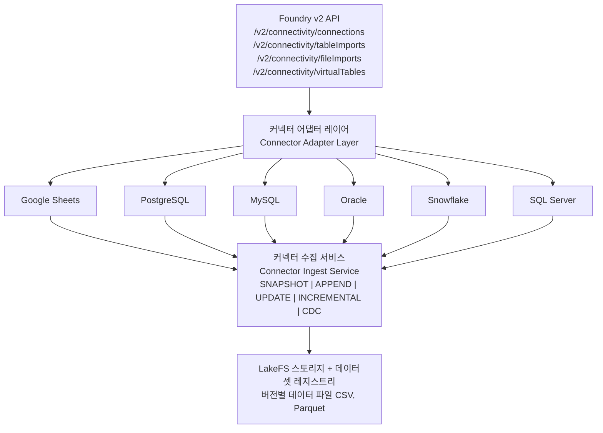

# 가져오기 템플릿 및 연결(Import Templates & Connectivity)

이 가이드에서는 외부 데이터 소스를 연결하고 Spice OS로 데이터를 가져오는 방법을 다룹니다. 연결(Connection) 구성, 가져오기 리소스 생성, 동기화 모드(Sync Mode) 선택, 데이터 수집 실행 방법을 알아봅니다.

## 아키텍처 개요

연결(Connectivity) 시스템은 계층형 아키텍처를 따릅니다.



## 지원 커넥터(Supported Connectors)

Spice OS는 6개의 커넥터 유형을 지원합니다.

| 커넥터 | 라이브러리 | 주요 사용 사례 |
|-----------|---------|-----------------|
| **Google Sheets** | gspread | 스프레드시트 가져오기, 경량 데이터 소스 |
| **PostgreSQL** | asyncpg | 관계형 데이터베이스 |
| **MySQL** | pymysql | 관계형 데이터베이스 |
| **Oracle** | oracledb | 엔터프라이즈 데이터베이스 |
| **Snowflake** | snowflake-connector | 데이터 웨어하우스 |
| **SQL Server** | pymssql | 엔터프라이즈 데이터베이스 |

### 커넥터 기능(Connector Capabilities)

| 기능 | Google Sheets | PostgreSQL | MySQL | Oracle | Snowflake | SQL Server |
|-----------|:---:|:---:|:---:|:---:|:---:|:---:|
| Table Import | ✅ | ✅ | ✅ | ✅ | ✅ | ✅ |
| File Import | ✅ | ✅ | ✅ | ✅ | ✅ | ✅ |
| Virtual Table | ✅ | ✅ | ✅ | ✅ | ✅ | ✅ |
| SNAPSHOT | ✅ | ✅ | ✅ | ✅ | ✅ | ✅ |
| APPEND | ✅ | ✅ | ✅ | ✅ | ✅ | ✅ |
| UPDATE | ✅ | ✅ | ✅ | ✅ | ✅ | ✅ |
| INCREMENTAL | -- | ✅ | ✅ | ✅ | ✅ | ✅ |
| CDC | -- | ✅ | ✅ | ✅ | ✅ | ✅ |

:::note
INCREMENTAL 및 CDC 모드는 JDBC 커넥터가 필요합니다. Google Sheets는 이러한 모드를 지원하지 않습니다.
:::

## 연결 생성(Creating a Connection)

**연결(Connection)**은 외부 데이터 소스의 구성 정보와 자격 증명을 저장합니다.

### 연결 구조

각 연결에는 다음 두 가지가 포함됩니다.
- **공개 구성**(호스트, 포트, 데이터베이스) -- `config_json`에 저장
- **시크릿**(비밀번호, 연결 문자열) -- `connector_connection_secrets`에 **AES-GCM 암호화** 방식으로 저장

### API를 통한 연결

```bash
# PostgreSQL 연결 생성
curl -X POST http://localhost:8080/api/v2/connectivity/connections \
  -H "Content-Type: application/json" \
  -d '{
    "displayName": "Production Database",
    "connectorKind": "postgresql",
    "configuration": {
      "host": "db.example.com",
      "port": 5432,
      "database": "production",
      "schema": "public",
      "sslMode": "require"
    },
    "secrets": {
      "password": "super-secret-password"
    }
  }'
```

### 커넥터 유형별 구성

#### Google Sheets

```json
{
  "connectorKind": "google_sheets",
  "configuration": {
    "spreadsheetId": "1BxiMVs0XRA5nFMdKvBdBZjgmUUqptlbs74OgVE2upms",
    "sheetName": "Sheet1",
    "headerRow": 1
  },
  "secrets": {
    "serviceAccountJson": "{...}"
  }
}
```

**시크릿 필드:** `accessToken`, `refreshToken`, `apiKey`, `serviceAccountJson`

#### PostgreSQL

```json
{
  "connectorKind": "postgresql",
  "configuration": {
    "host": "db.example.com",
    "port": 5432,
    "database": "mydb",
    "schema": "public",
    "sslMode": "require"
  },
  "secrets": {
    "password": "secret"
  }
}
```

**시크릿 필드:** `password`, `dsn`

#### MySQL

```json
{
  "connectorKind": "mysql",
  "configuration": {
    "host": "mysql.example.com",
    "port": 3306,
    "database": "mydb"
  },
  "secrets": {
    "password": "secret"
  }
}
```

**시크릿 필드:** `password`, `dsn`

#### Snowflake

```json
{
  "connectorKind": "snowflake",
  "configuration": {
    "account": "xy12345.us-east-1",
    "warehouse": "COMPUTE_WH",
    "database": "MY_DB",
    "schema": "PUBLIC",
    "role": "ANALYST"
  },
  "secrets": {
    "password": "secret"
  }
}
```

**시크릿 필드:** `password`, `privateKey`, `token`

#### Oracle

```json
{
  "connectorKind": "oracle",
  "configuration": {
    "host": "oracle.example.com",
    "port": 1521,
    "service_name": "ORCL"
  },
  "secrets": {
    "password": "secret"
  }
}
```

**시크릿 필드:** `password`, `dsn`

#### SQL Server

```json
{
  "connectorKind": "sqlserver",
  "configuration": {
    "host": "sqlserver.example.com",
    "port": 1433,
    "database": "mydb"
  },
  "secrets": {
    "password": "secret"
  }
}
```

**시크릿 필드:** `password`, `connectionString`

## 가져오기 리소스 유형(Import Resource Types)

Spice OS는 세 가지 유형의 가져오기 리소스를 지원합니다.

### 테이블 가져오기(Table Import)

SQL 쿼리 기반 데이터 수집 방식입니다. 구조화된 데이터를 가져올 때 가장 많이 사용합니다.

```bash
curl -X POST http://localhost:8080/api/v2/connectivity/tableImports \
  -H "Content-Type: application/json" \
  -d '{
    "connectionRid": "ri.spice.main.connection.conn-123",
    "datasetRid": "ri.spice.main.dataset.target-dataset",
    "displayName": "Daily Employee Sync",
    "importMode": "SNAPSHOT",
    "config": {
      "query": "SELECT employee_id, full_name, department FROM employees WHERE active = true"
    }
  }'
```

### 파일 가져오기(File Import)

파일 선택기를 사용한 파일 기반 데이터 수집 방식입니다.

```bash
curl -X POST http://localhost:8080/api/v2/connectivity/fileImports \
  -H "Content-Type: application/json" \
  -d '{
    "connectionRid": "ri.spice.main.connection.conn-456",
    "datasetRid": "ri.spice.main.dataset.target-dataset",
    "displayName": "CSV File Import",
    "importMode": "SNAPSHOT",
    "config": {
      "path": "/data/exports/employees.csv",
      "fileFormat": "csv",
      "filePattern": "*.csv"
    }
  }'
```

**필수:** 최소 하나의 파일 선택기를 반드시 지정해야 합니다.

| 선택기 | 설명 |
|----------|-------------|
| `fileImportFilters` | 파일 선택을 위한 필터 규칙 |
| `path` | 특정 파일 경로 |
| `subfolder` | 스캔할 디렉토리 |
| `filePattern` | 파일 매칭을 위한 글로브 패턴 |
| `fileFormat` | 예상 파일 형식 (csv, json, parquet) |

### 가상 테이블(Virtual Table)

읽기 전용 쿼리 뷰로, **SNAPSHOT 모드만 지원**합니다.

```bash
curl -X POST http://localhost:8080/api/v2/connectivity/virtualTables \
  -H "Content-Type: application/json" \
  -d '{
    "connectionRid": "ri.spice.main.connection.conn-789",
    "datasetRid": "ri.spice.main.dataset.target-dataset",
    "displayName": "Department Summary View",
    "importMode": "SNAPSHOT",
    "config": {
      "query": "SELECT department, COUNT(*) as headcount FROM employees GROUP BY department"
    }
  }'
```

:::caution
가상 테이블은 SNAPSHOT 모드만 지원합니다. APPEND, UPDATE, INCREMENTAL, CDC를 사용하려고 하면 오류가 발생합니다.
:::

## 동기화 모드(Sync Modes)

동기화 모드는 새 데이터가 대상 데이터셋의 기존 데이터와 병합되는 방식을 결정합니다.

### SNAPSHOT

**전략:** 매 실행마다 모든 데이터를 교체합니다.

```json
{
  "importMode": "SNAPSHOT",
  "config": {
    "query": "SELECT * FROM products"
  }
}
```

**필수 필드:** `query` (JDBC 커넥터의 경우)

**사용 시기:** 일일 보고서, 소규모 참조 테이블, 변경 패턴을 예측하기 어려운 데이터에 적합합니다.

**동작:** 대상 데이터셋 전체가 쿼리 결과로 교체됩니다.

### APPEND

**전략:** 새 행을 추가하고, 콘텐츠 해시로 중복을 제거합니다.

```json
{
  "importMode": "APPEND",
  "config": {
    "query": "SELECT * FROM event_logs"
  }
}
```

**필수 필드:** `query` (JDBC 커넥터의 경우)

**사용 시기:** 이벤트 로그, 감사 추적 등 행이 업데이트되지 않고 계속 증가하는 데이터셋에 적합합니다.

**동작:**
1. 기존 데이터셋 행 로드
2. 소스에서 새 행 가져오기
3. 중복 제거를 위한 콘텐츠 해시 계산
4. 진정으로 새로운 행만 추가
5. 병합된 결과 저장

### UPDATE

**전략:** 기본 키로 업서트(Upsert)합니다.

```json
{
  "importMode": "UPDATE",
  "config": {
    "query": "SELECT * FROM customers",
    "primary_key_column": "customer_id"
  }
}
```

**필수 필드:** `query` (JDBC 커넥터의 경우)

**사용 시기:** 고객 프로필, 제품 카탈로그, 상태 테이블 등 기존 행이 직접 변경되는 모든 데이터에 적합합니다.

**동작:**
1. 기존 데이터셋 행 로드
2. 소스에서 모든 행 가져오기
3. 기본 키 컬럼으로 매칭 (지정되지 않으면 첫 번째 컬럼 사용)
4. 새 행 삽입, 변경된 값으로 기존 행 업데이트
5. 병합된 결과 저장

### INCREMENTAL

**전략:** 워터마크(Watermark) 이후의 행만 가져옵니다 (타임스탬프 또는 시퀀스).

```json
{
  "importMode": "INCREMENTAL",
  "config": {
    "query": "SELECT * FROM orders WHERE updated_at > :watermark",
    "watermarkColumn": "updated_at"
  }
}
```

**필수 필드:** `query` + `watermarkColumn`

**사용 시기:** 신뢰할 수 있는 타임스탬프가 있는 대규모 테이블에서 전체 테이블 스캔이 너무 비용이 큰 경우에 적합합니다.

**동작:**
1. 동기화 상태에서 마지막 워터마크 값 읽기
2. 워터마크 필터로 쿼리 실행
3. 데이터셋에 새 행 추가
4. 확인된 최신 값으로 워터마크 업데이트

:::note
쿼리의 `:watermark` 플레이스홀더는 실행 시 저장된 워터마크 값으로 대체됩니다.
:::

### CDC (Change Data Capture)

**전략:** 데이터베이스 네이티브 변경 토큰(SCN, binlog 위치, LSN)을 통해 변경을 추적합니다.

```json
{
  "importMode": "CDC",
  "config": {
    "cdcQuery": "SELECT * FROM cdc_changes WHERE change_token > :token",
    "watermarkColumn": "change_token"
  }
}
```

**필수 필드:** `cdcQuery`, 또는 `query` + `watermarkColumn`

**사용 시기:** 실시간 복제가 필요하고 소스 데이터베이스가 변경 추적을 지원하는 경우에 적합합니다.

**동작:**
1. 동기화 상태에서 마지막 변경 토큰 읽기
2. `peek_change_token()`을 호출하여 사용 가능한 최신 토큰 가져오기
3. 저장된 토큰과 최신 토큰 사이의 CDC 쿼리 실행
4. 대상 데이터셋에 변경 적용 (삽입/업데이트/삭제)
5. 저장된 토큰 업데이트

### 동기화 모드 결정 매트릭스

| 기준 | 권장 모드 |
|----------|-----------------|
| 소규모 테이블, 전체 새로고침 가능 | SNAPSHOT |
| 추가 전용 데이터 (로그, 이벤트) | APPEND |
| 기본 키가 있는 변경 가능한 행 | UPDATE |
| 타임스탬프가 있는 대규모 테이블 | INCREMENTAL |
| 데이터베이스가 변경 추적 지원 | CDC |
| 읽기 전용 분석 뷰 | SNAPSHOT (가상 테이블) |

## 가져오기 실행(Executing Imports)

### 수동 실행

가져오기 실행을 즉시 트리거합니다:

```bash
curl -X POST http://localhost:8080/api/v2/connectivity/tableImports/{importRid}/execute \
  -H "Content-Type: application/json" \
  -d '{
    "branchName": "main"
  }'
```

### 실행 파이프라인

가져오기가 실행되면 다음 단계가 수행됩니다:

1. **연결 확인(Connection Resolution)** -- 연결 구성 로드 및 시크릿 복호화
2. **어댑터 선택(Adapter Selection)** -- `ConnectorAdapterFactory.get_adapter(kind)`가 적절한 어댑터를 선택
3. **자격 증명 주입(Credential Injection)** -- 상위 연결 시크릿을 가져오기 구성에 병합
4. **구성 유효성 검사(Config Validation)** -- 가져오기 모드 요구사항 검증:
   - SNAPSHOT/APPEND/UPDATE: `query` 필수
   - INCREMENTAL: `query` + `watermarkColumn` 필수
   - CDC: `cdcQuery` 또는 (`query` + `watermarkColumn`) 필수
5. **SQL 가드(SQL Guard)** -- SQL 쿼리 정규화 (트림, 다중 문 인젝션 거부)
6. **쿼리 실행(Query Execution)** -- 300초 타임아웃으로 어댑터를 통해 쿼리 실행
7. **동기화 모드 처리(Sync Mode Processing)** -- SNAPSHOT/APPEND/UPDATE/INCREMENTAL/CDC 로직 적용
8. **저장(Storage)** -- 버전별 커밋으로 LakeFS에 결과 기록
9. **데이터셋 등록(Dataset Registration)** -- 레지스트리에서 데이터셋 버전 업데이트
10. **이벤트 게시(Event Publishing)** -- Kafka에 완료 이벤트 게시

### 실행 응답

```json
{
  "rid": "ri.spice.main.job.exec-123",
  "status": "SUCCEEDED",
  "startTime": "2024-01-15T09:30:00Z",
  "endTime": "2024-01-15T09:30:45Z",
  "datasetRid": "ri.spice.main.dataset.target-dataset",
  "rowsProcessed": 15000,
  "branchName": "main"
}
```

## 보안(Security)

### 시크릿 암호화(Secret Encryption)

모든 연결 시크릿은 다음과 함께 **AES-GCM**으로 암호화됩니다:

- **12바이트 랜덤 논스(Nonce)** -- 암호화 작업당
- **추가 인증 데이터(AAD, Additional Authenticated Data)** -- 소스 유형과 소스 ID에 바인딩 (`{source_type}:{source_id}`)
- **다중 키 로테이션** -- 로테이션 기간 동안 여러 키로 복호화 지원
- **키 크기** -- 16, 24 또는 32바이트 (AES-128, AES-192, AES-256)

```
암호화 형식: "enc:v1:{base64(nonce + ciphertext + tag)}"
```

:::danger
프로덕션 환경에서 `ALLOW_PLAINTEXT_CONNECTOR_SECRETS` 플래그를 `true`로 설정하면 **안 됩니다**. 암호화 없이 저장된 시크릿은 보안 위험입니다.
:::

### SQL 인젝션 가드(SQL Injection Guard)

Connectivity API를 통해 제출되는 모든 SQL 쿼리는 SQL 쿼리 가드에 의해 정규화됩니다:

- **후행 세미콜론**이 제거됩니다
- **다중 문** (`;`로 구분된 쿼리)은 **거부**됩니다
- **공백**이 트리밍됩니다

이를 통해 가져오기 구성을 통한 SQL 인젝션 공격을 방지합니다.

### 쿼리 타임아웃(Query Timeouts)

모든 JDBC 어댑터 작업은 **300초 (5분) 타임아웃**으로 실행됩니다. 쿼리는 `run_blocking_query()`를 통해 비동기 스레드 풀에서 실행되며, 타임아웃을 초과하면 취소되고 오류가 반환됩니다.

### 기능 플래그(Feature Flags)

연결 기능은 제어된 롤아웃을 위해 기능 플래그로 게이팅됩니다:

| 플래그 | 환경 변수 | 기본값 | 설명 |
|------|---------------------|---------|-------------|
| JDBC 연결 | `ENABLE_FOUNDRY_CONNECTIVITY_JDBC` | `false` | JDBC 커넥터를 전역적으로 활성화 |
| JDBC DB 허용 목록 | `FOUNDRY_CONNECTIVITY_JDBC_DB_ALLOWLIST` | `""` | JDBC가 허용되는 온톨로지 DB 이름 (쉼표 구분) |
| CDC 모드 | `ENABLE_FOUNDRY_CONNECTIVITY_CDC` | `false` | CDC 동기화 모드를 전역적으로 활성화 |
| CDC DB 허용 목록 | `FOUNDRY_CONNECTIVITY_CDC_DB_ALLOWLIST` | `""` | CDC가 허용되는 온톨로지 DB 이름 (쉼표 구분) |

**허용 목록 동작:** 전역 플래그가 비활성화되어 있어도 허용 목록을 통해 개별 데이터베이스를 활성화할 수 있습니다. 이를 통해 점진적 롤아웃이 가능합니다.

## 가져오기 스케줄링(Scheduling Imports)

가져오기는 오케스트레이션 API를 통해 반복 실행을 예약할 수 있습니다:

```bash
curl -X POST http://localhost:8080/api/v2/orchestration/schedules \
  -H "Content-Type: application/json" \
  -d '{
    "pipelineRid": "ri.spice.main.pipeline.import-pipeline",
    "cronExpression": "0 */6 * * *",
    "enabled": true
  }'
```

파이프라인 스케줄러는 레지스트리를 폴링하고, cron 표현식을 평가하며, Kafka에 가져오기 작업을 큐에 넣습니다.

## 모니터링 및 문제 해결

### 일반적인 오류

| 오류 | 원인 | 해결 방법 |
|-------|-------|------------|
| `config.query is required for JDBC connectors` | SNAPSHOT/APPEND/UPDATE 모드에서 SQL 쿼리 누락 | 구성에 `query` 필드 추가 |
| `watermarkColumn is required for INCREMENTAL mode` | 워터마크 컬럼 누락 | 구성에 `watermarkColumn` 추가 |
| `virtual tables support only SNAPSHOT mode` | 가상 테이블에 비-SNAPSHOT 모드 | `importMode`를 `SNAPSHOT`으로 변경 |
| `file import requires at least one selector` | 파일 가져오기에 파일 선택기 없음 | `path`, `filePattern` 또는 `subfolder` 추가 |
| SQL 인젝션 가드 거부 | 쿼리에 다중 문 포함 | 추가 세미콜론/문 제거 |
| 쿼리 타임아웃 (300초) | 쿼리 실행 시간 초과 | 소스 쿼리 최적화 |
| 연결 테스트 실패 | 잘못된 자격 증명 또는 도달할 수 없는 호스트 | 연결 구성 및 네트워크 확인 |
| 복호화 실패 | 키 로테이션 또는 손상된 시크릿 | 현재 키로 재암호화 |

### 동기화 상태 추적(Sync State Tracking)

플랫폼은 `connector_sync_state`에서 각 가져오기 리소스의 동기화 상태를 추적합니다:

| 필드 | 설명 |
|-------|-------------|
| `cursor` | 현재 워터마크/토큰 위치 |
| `emitted_seq` | 마지막 발행된 이벤트의 시퀀스 번호 |
| `polled_at` | 마지막 폴링 타임스탬프 |
| `success_at` | 마지막 성공 동기화 타임스탬프 |
| `failure_at` | 마지막 실패 타임스탬프 |
| `error_count` | 연속 오류 횟수 |
| `last_error` | 마지막 오류 메시지 |

### 이벤트 아웃박스(Event Outbox)

가져오기 이벤트는 Kafka에 게시되기 전에 `connector_update_outbox`에 내구적으로 큐에 넣어집니다. 이를 통해 결정적 이벤트 ID를 사용한 중복 제거와 함께 **최소 1회 전달(At-Least-Once Delivery)**이 보장됩니다.

## 모범 사례

1. **SNAPSHOT으로 시작하세요** -- 가장 단순하고 신뢰할 수 있는 모드입니다. SNAPSHOT이 너무 느려질 때만 증분 모드로 전환하세요.

2. **변경 가능한 데이터에는 UPDATE를 사용하세요** -- 소스에서 행이 변경되는 경우 UPDATE 모드가 기본 키를 기준으로 올바르게 업서트를 처리합니다.

3. **의미 있는 표시 이름을 설정하세요** -- 가져오기가 많아질수록 모니터링과 디버깅에 큰 도움이 됩니다.

4. **먼저 연결을 테스트하세요** -- 가져오기를 생성하기 전에 연결 테스트 엔드포인트를 사용해 보세요.

5. **동기화 상태를 모니터링하세요** -- `success_at`과 `error_count`를 확인하면 오래되거나 실패하는 가져오기를 조기에 감지할 수 있습니다.

6. **암호화 키는 단계적으로 로테이션하세요** -- 다중 키 로테이션 기능을 활용하면 먼저 새 키를 추가하고, 모든 시크릿이 재암호화된 후에 이전 키를 안전하게 제거할 수 있습니다.

7. **점진적 롤아웃을 위해 허용 목록을 활용하세요** -- 전역 활성화 전에 데이터베이스별로 JDBC, CDC 기능을 개별 활성화할 수 있습니다.

8. **소스 쿼리를 최적화하세요** -- WHERE 절과 워터마크 컬럼에서 사용되는 컬럼에 소스 데이터베이스 인덱스를 추가해 주세요.

## 다음 단계

- **[스키마 구성](./schema-config)** -- 가져온 데이터의 대상 객체 유형을 정의합니다
- **[파이프라인 빌더](./pipeline-builder)** -- 파이프라인으로 가져온 데이터를 변환합니다
- **[구성 레퍼런스](/docs/reference/config)** -- 연결 관련 환경 변수
- **[핵심 개념](/docs/getting-started/concepts)** -- 연결, 동기화 모드, 데이터셋을 검토합니다
