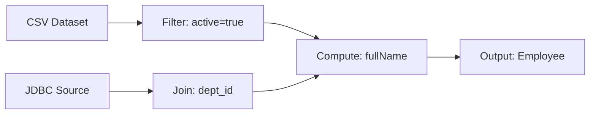
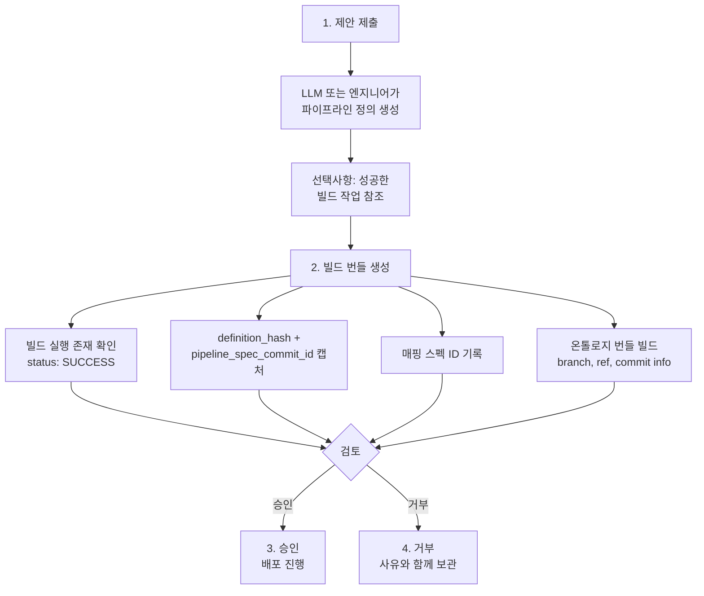

# 파이프라인 빌더(Pipeline Builder)

이 가이드는 데이터 엔지니어가 Spice OS에서 데이터 변환 파이프라인(Pipeline)을 빌드, 테스트, 배포하는 방법을 안내합니다. 파이프라인은 원시 데이터를 구조화된 온톨로지 객체로 변환하는 주요 메커니즘입니다.

## 개요

**파이프라인(Pipeline)**은 노드의 DAG(Directed Acyclic Graph, 방향성 비순환 그래프)로 정의되는 선언적 데이터 변환 워크플로입니다. 각 파이프라인은 다음으로 구성됩니다:

- **입력 노드(Input Nodes)** -- 데이터 소스 (데이터셋, JDBC 연결, Kafka 토픽, S3 파일)
- **변환 노드(Transform Nodes)** -- 데이터를 재구성, 필터링, 보강, 검증하는 연산
- **출력 노드(Output Nodes)** -- 대상 (데이터셋, 온톨로지 객체 유형, 지리시간 저장소)



## 파이프라인 정의

파이프라인은 `nodes`, `edges`, 메타데이터를 포함한 JSON 문서로 정의됩니다:

```json
{
  "nodes": {
    "input_csv": {
      "type": "input",
      "title": "Employee CSV",
      "metadata": {
        "dataset_id": "ri.spice.main.dataset.emp-data",
        "branch": "main"
      }
    },
    "filter_active": {
      "type": "transform",
      "title": "Active Employees Only",
      "metadata": {
        "operation": "filter",
        "expression": "row['status'] == 'ACTIVE'"
      }
    },
    "compute_name": {
      "type": "transform",
      "title": "Compute Full Name",
      "metadata": {
        "operation": "compute",
        "assignments": [
          {
            "column": "fullName",
            "expression": "row['firstName'] + ' ' + row['lastName']"
          }
        ]
      }
    },
    "output_ontology": {
      "type": "output",
      "title": "Write to Employee ObjectType",
      "metadata": {
        "outputName": "Employee",
        "kind": "ontology"
      }
    }
  },
  "edges": [
    { "source": "input_csv", "target": "filter_active" },
    { "source": "filter_active", "target": "compute_name" },
    { "source": "compute_name", "target": "output_ontology" }
  ],
  "executionMode": "snapshot",
  "parameters": {},
  "outputs": [
    {
      "name": "Employee",
      "kind": "ontology",
      "notes": "Upsert active employees into Employee object type"
    }
  ]
}
```

### 노드 유형

| 유형 | 설명 | 일반적인 용도 |
|------|-------------|-------------|
| `input` | 데이터 소스 노드 | 데이터셋, JDBC, Kafka, S3에서 읽기 |
| `read_dataset` | 데이터셋 리더 | 특정 데이터셋 버전 읽기 |
| `transform` | 데이터 변환 | 38개 이상의 변환 연산 중 하나 적용 |
| `output` | 데이터 싱크 | 데이터셋, 온톨로지 또는 지리시간 저장소에 쓰기 |

### 엣지 구조

엣지(Edge)는 노드를 연결하고 데이터 흐름 방향을 정의합니다:

```json
{ "source": "node_a", "target": "node_b" }
```

엣지는 유효한 DAG를 형성해야 합니다 -- 순환(Cycle)은 유효성 검증 중에 거부됩니다.

## 변환 연산(Transform Operations)

Spice OS는 네 가지 범주로 구성된 **38개 이상의 변환 유형**을 지원합니다:

### 데이터 조작(Data Manipulation)

#### filter

Python 표현식을 기반으로 행을 필터링합니다:

```json
{
  "operation": "filter",
  "expression": "row['age'] >= 18 and row['status'] == 'ACTIVE'"
}
```

#### compute

계산된 값으로 컬럼을 추가하거나 덮어씁니다:

```json
{
  "operation": "compute",
  "assignments": [
    { "column": "fullName", "expression": "row['first'] + ' ' + row['last']" },
    { "column": "yearJoined", "expression": "row['startDate'][:4]" }
  ]
}
```

#### select

지정된 컬럼만 유지합니다:

```json
{
  "operation": "select",
  "columns": ["employeeId", "fullName", "department", "startDate"]
}
```

#### drop

지정된 컬럼을 제거합니다:

```json
{
  "operation": "drop",
  "columns": ["internalNotes", "tempFlag"]
}
```

#### rename

컬럼 이름을 변경합니다:

```json
{
  "operation": "rename",
  "rename": {
    "emp_id": "employeeId",
    "dept_name": "department"
  }
}
```

#### cast

컬럼 데이터 타입을 변환합니다:

```json
{
  "operation": "cast",
  "casts": [
    { "column": "age", "target": "xsd:integer" },
    { "column": "salary", "target": "xsd:decimal" },
    { "column": "startDate", "target": "xsd:date" }
  ]
}
```

#### normalize

텍스트 데이터를 정리하고 표준화합니다:

```json
{
  "operation": "normalize",
  "columns": ["email", "fullName"],
  "trim": true,
  "emptyToNull": true,
  "whitespaceToNull": true,
  "lowercase": true,
  "uppercase": false
}
```

#### regexReplace

정규식 기반 텍스트 변환을 적용합니다:

```json
{
  "operation": "regexReplace",
  "column": "phone",
  "pattern": "[^0-9+]",
  "replacement": ""
}
```

#### sort

하나 이상의 컬럼으로 행을 정렬합니다:

```json
{
  "operation": "sort",
  "columns": ["department", "fullName"],
  "ascending": [true, true]
}
```

#### dedupe

컬럼 하위 집합을 기반으로 중복 행을 제거합니다:

```json
{
  "operation": "dedupe",
  "columns": ["employeeId"],
  "keepFirst": true
}
```

#### split

조건에 따라 행을 다른 분기로 라우팅합니다:

```json
{
  "operation": "split",
  "expression": "row['department'] == 'Engineering'"
}
```

### 집계(Aggregation)

#### groupBy

키 컬럼별로 행을 그룹화합니다 (일반적으로 집계와 함께 사용):

```json
{
  "operation": "groupBy",
  "groupBy": ["department", "level"],
  "aggregates": [
    { "column": "salary", "op": "sum", "alias": "totalSalary" },
    { "column": "employeeId", "op": "count", "alias": "headcount" },
    { "column": "salary", "op": "avg", "alias": "avgSalary" }
  ]
}
```

**지원되는 집계 연산:** `sum`, `count`, `avg`, `min`, `max`

#### aggregate

명시적 그룹화 없는 독립형 집계:

```json
{
  "operation": "aggregate",
  "aggregates": [
    { "column": "revenue", "op": "sum", "alias": "totalRevenue" }
  ]
}
```

#### pivot

피벗 테이블을 생성합니다:

```json
{
  "operation": "pivot",
  "pivot": {
    "index": ["quarter"],
    "columns": "region",
    "values": "revenue",
    "agg": "sum"
  }
}
```

#### window

파티션된 데이터에 윈도우 함수(Window Function)를 적용합니다:

```json
{
  "operation": "window",
  "window": {
    "partitionBy": ["department"],
    "orderBy": ["salary"],
    "outputColumn": "salaryRank"
  }
}
```

윈도우 함수는 `row_number`, `rank`, `dense_rank` 및 누적 연산을 지원합니다.

### 집합 연산(Set Operations)

#### join

두 데이터셋을 조인합니다:

```json
{
  "operation": "join",
  "joinType": "left",
  "leftKey": "departmentId",
  "rightKey": "dept_id",
  "allowCrossJoin": false
}
```

**조인 유형:** `inner`, `left`, `right`, `full`, `cross`

:::caution
크로스 조인(Cross Join)은 매우 큰 결과를 생성할 수 있습니다. 이를 활성화하려면 `allowCrossJoin: true`를 명시적으로 설정하십시오.
:::

#### union

여러 데이터셋을 수직으로 결합합니다:

```json
{
  "operation": "union",
  "unionMode": "common_only"
}
```

**유니온 모드:**
- `strict` -- 모든 데이터셋이 동일한 스키마를 가져야 합니다
- `common_only` -- 모든 입력에 존재하는 컬럼만 유지합니다
- `pad_missing_nulls` -- 모든 컬럼을 포함하고, 누락된 값은 NULL로 채웁니다

#### explode

배열 컬럼을 개별 행으로 확장합니다:

```json
{
  "operation": "explode",
  "column": "tags"
}
```

### 고급(Advanced)

#### udf

행별 사용자 정의 Python 로직을 적용합니다 (아래 [UDF 시스템](#사용자-정의-함수udfs) 참조):

```json
{
  "operation": "udf",
  "udfId": "clean-phone-numbers",
  "udfVersion": 1
}
```

#### geospatial

좌표 및 형상 데이터에 대한 지리공간(Geospatial) 연산:

```json
{
  "operation": "geospatial",
  "geoOperation": "distance",
  "sourceColumn": "location",
  "targetColumn": "headquarters"
}
```

#### patternMining

통계적 패턴 발견:

```json
{
  "operation": "patternMining",
  "columns": ["category", "region"],
  "minSupport": 0.05
}
```

#### streamJoin

시간 윈도우 기반 스트리밍 조인:

```json
{
  "operation": "streamJoin",
  "leftKey": "userId",
  "rightKey": "userId",
  "windowSeconds": 3600
}
```

## 사용자 정의 함수(UDFs)

UDF(User-Defined Function)는 **샌드박스 환경**에서 엄격한 보안 제어와 함께 실행되는 Python으로 작성된 사용자 정의 행별 변환을 허용합니다.

### UDF 작성

```python
def transform(row):
    """Clean and normalize phone numbers."""
    phone = row.get("phone", "")
    # Remove all non-numeric characters except +
    cleaned = ""
    for ch in str(phone):
        if ch.isdigit() or ch == "+":
            cleaned += ch
    return {"phone_cleaned": cleaned}
```

### UDF 계약

- **함수 이름은 반드시 `transform`이어야 합니다**
- **입력:** `row` -- 컬럼 이름을 키로 가지는 Python `dict`
- **출력:** `dict` (단일 행) 또는 `list[dict]` (복수 행)를 반환해야 합니다
- **처리:** 각 입력 행은 독립적으로 처리됩니다

### 보안 샌드박스(Security Sandbox)

UDF는 Python AST(추상 구문 트리) 유효성 검증을 통해 적용되는 제한된 환경에서 실행됩니다:

**차단되는 구문:**

| 구문 | 이유 |
|-----------|--------|
| `import`, `from ... import` | 외부 모듈 접근 불가 |
| `class` 정의 | 클래스 생성 불가 |
| `while`, `for` 루프 | 무한 루프 방지 |
| `lambda` 표현식 | 익명 함수 불가 |
| `try`/`except`/`raise` | 예외 처리 불가 |
| `with` 구문 | 컨텍스트 매니저 불가 |
| `async`/`await`/`yield` | 비동기 또는 제너레이터 패턴 불가 |
| `global`/`nonlocal` | 스코프 조작 불가 |
| `__dunder__` 속성 접근 | 인터프리터 인트로스펙션 방지 |

**허용되는 내장 함수:**

```
abs, bool, dict, enumerate, float, int, len, list,
max, min, range, round, str, sum
```

:::warning
UDF는 라이브러리를 가져오거나, 루프를 사용하거나, 파일 시스템에 접근할 수 없습니다. 이는 의도된 설계입니다 -- UDF는 단순한 행별 변환이어야 합니다. 복잡한 로직의 경우 여러 변환 노드를 사용하는 것을 고려하십시오.
:::

### UDF 캐싱

UDF는 파이프라인 실행 간 재컴파일을 방지하기 위해 `{udfId}:{version}:{code_hash}`로 캐싱됩니다.

## 실행 모드(Execution Modes)

파이프라인은 데이터 처리 방식을 제어하는 세 가지 실행 모드를 지원합니다:

### 미리보기 모드(Preview Mode)

**목적:** 부작용 없이 샘플 데이터로 빠른 유효성 검증을 수행합니다.

```json
{
  "__preview_meta__": {
    "branch": "main",
    "max_output_rows": 1000,
    "sample_limit": 100
  }
}
```

- 입력 데이터의 제한된 샘플로 실행합니다
- 지원되지 않는 표현식은 오류 대신 `NULL`을 생성합니다 (최선의 노력)
- 전체 외래 키 유효성 검사를 건너뜁니다 (전체 테이블 스캔 필요)
- 어떤 출력에도 데이터가 기록되지 않습니다
- 검사를 위한 미리보기 결과를 반환합니다

**미리보기 사용 시기:** 리소스를 투입하기 전에 파이프라인 로직 테스트, 표현식 유효성 검사, 출력 스키마 확인에 사용합니다.

### 빌드 모드(Build Mode)

**목적:** 아티팩트를 배포하지 않고 생성하는 전체 실행을 수행합니다.

- 모든 입력 데이터를 처리합니다
- 스키마 계약 및 기대값을 검증합니다
- S3/LakeFS에 저장되는 빌드 아티팩트를 생성합니다
- 상태 추적이 포함된 버전별 빌드 레코드를 생성합니다
- 프로덕션 출력에 데이터가 기록되지 않습니다

**빌드 사용 시기:** CI/CD 유효성 검증, 변경 검토 워크플로, 배포 전 테스트에 사용합니다.

### 배포 모드(Deploy Mode)

**목적:** 출력에 기록하는 프로덕션 실행을 수행합니다.

- 모든 입력 데이터를 처리합니다
- 출력 데이터셋 및/또는 온톨로지 객체 유형에 결과를 기록합니다
- 후속 실행을 위한 증분 상태를 관리합니다
- 다운스트림 소비를 위해 Kafka에 이벤트를 게시합니다
- 계보(Lineage) 엣지를 기록합니다

**배포 사용 시기:** 프로덕션 데이터 로딩, 예약된 반복 파이프라인에 사용합니다.

## 실행 시맨틱(Execution Semantics)

파이프라인은 출력 데이터 관리 방식을 결정하는 다양한 실행 시맨틱을 지원합니다:

| 시맨틱 | 설명 | 사용 시기 |
|----------|-------------|-------------|
| `snapshot` | 전체 새로고침 -- 모든 출력 데이터를 교체 | 일일 보고서, 소규모 데이터셋 |
| `incremental` | 워터마크를 사용하여 새로운/변경된 데이터만 추가 | 타임스탬프가 있는 대규모 데이터셋 |
| `streaming` | 상태 관리가 포함된 연속 처리 | 실시간 이벤트 스트림 |

`executionMode` 필드를 통해 구성합니다:

```json
{
  "executionMode": "incremental",
  "incremental": {
    "watermarkColumn": "updated_at",
    "watermarkType": "timestamp"
  }
}
```

## 스키마 계약 적용(Schema Contract Enforcement)

파이프라인은 출력에 스키마 계약을 적용할 수 있습니다:

```json
{
  "schemaContract": {
    "enforcement": "fail"
  },
  "expectations": [
    {
      "type": "required_columns",
      "columns": ["employeeId", "fullName"]
    },
    {
      "type": "unique",
      "columns": ["employeeId"]
    },
    {
      "type": "fk_exists",
      "columns": ["departmentId"],
      "reference": {
        "dataset_id": "ri.spice.main.dataset.dept-data",
        "columns": ["deptId"]
      }
    }
  ]
}
```

### 기대값 유형(Expectation Types)

| 유형 | 설명 | 예시 |
|------|-------------|---------|
| `required_columns` | 지정된 컬럼이 출력에 존재해야 함 | `["id", "name"]` |
| `unique` | 지정된 컬럼 전체에서 값이 고유해야 함 | `["employeeId"]` |
| `fk_exists` | 외래 키 값이 참조 데이터셋에 존재해야 함 | dept 테이블 참조 |

**적용 모드:**
- `fail` -- 기대값이 위반되면 파이프라인이 실패합니다
- `warn` -- 파이프라인이 성공하지만 경고를 기록합니다

## 제안 워크플로(Proposal Workflow)

보호된 브랜치(`main`, `prod`)의 파이프라인 변경은 배포 전에 **제안 승인(Proposal Approval)**이 필요합니다.

### 제안 수명주기(Proposal Lifecycle)



### 제안 상태(Proposal States)

| 상태 | 설명 |
|-------|-------------|
| `pending` | 제출됨, 검토 대기 중 |
| `approved` | 승인됨, 배포 준비 완료 |
| `rejected` | 명시적으로 거부됨 |

### 멱등성(Idempotency)

모든 제안 작업에는 중복 제출을 방지하기 위한 **멱등성 키(Idempotency Key)**가 필요합니다. 동일한 키가 두 번 제출되면 두 번째 요청은 기존 제안을 반환합니다.

## 파이프라인 실행 흐름

파이프라인이 실행되면 시스템은 다음 흐름을 따릅니다:

1. **정규화(Normalization)** -- `normalize_nodes()`와 `normalize_edges()`가 구조를 유효성 검사합니다
2. **위상 정렬(Topological Sort)** -- DAG에서 실행 순서를 계산합니다
3. **노드 실행(Node Execution)** -- 위상 순서대로 각 노드를 처리합니다:
   - 입력 노드의 데이터 로드
   - 변환 연산 적용
   - 각 단계에서 스키마 검사 유효성 검증
4. **출력 처리(Output Processing)** -- 스키마 계약 및 기대값 유효성 검증
5. **결과 기록(Result Recording)** -- 실행 상태, 아티팩트, 계보 기록

### 동시성 제어(Concurrency Control)

- **낙관적 동시성 제어(OCC, Optimistic Concurrency Control)** -- 파이프라인이 쓰기 전에 버전을 확인합니다
- **게시 잠금(Publish Locks)** -- 동일한 출력에 대한 동시 배포를 방지합니다
- **멱등적 실행(Idempotent Execution)** -- 결정적 실행 ID로 중복 처리를 방지합니다

## 스케줄링(Scheduling)

파이프라인은 반복 실행을 위해 예약할 수 있습니다:

```json
{
  "schedule_cron": "0 2 * * *",
  "schedule_interval_seconds": null
}
```

**스케줄링 옵션:**
- **Cron 표현식** -- 표준 cron 형식 (예: 매일 오전 2시에 `0 2 * * *`)
- **간격 기반** -- N초마다 실행

**파이프라인 스케줄러(Pipeline Scheduler)**는 다음을 수행하는 독립적인 백그라운드 프로세스입니다:
1. N초마다 파이프라인 레지스트리를 폴링합니다
2. 현재 시간에 대해 cron 표현식을 평가합니다
3. 파이프라인 의존성을 확인합니다 (업스트림 파이프라인이 먼저 완료되어야 함)
4. 워커 실행을 위해 Kafka에 작업을 큐에 넣습니다

스케줄은 구성을 삭제하지 않고 **일시 중지** 및 **재개**할 수 있습니다.

## 출력 유형(Output Types)

파이프라인은 여러 출력 유형에 기록할 수 있습니다:

| 출력 종류 | 설명 | 사용 사례 |
|-------------|-------------|----------|
| `dataset` | LakeFS의 버전별 데이터셋 | 중간 데이터, 공유 데이터셋 |
| `ontology` | 객체 유형 인스턴스 | 프로덕션 객체 |
| `virtual` | 읽기 전용 쿼리 뷰 | 분석 대시보드 |
| `geotemporal` | 위치 + 시간 인덱싱 데이터 | 지도, 공간 분석 |
| `media` | 바이너리 아티팩트 (이미지, PDF) | 문서 처리 |

## 파이프라인 설정

### 캐스트 모드(Cast Mode)

변환 중 타입 불일치 처리 방법을 제어합니다:

| 모드 | 동작 |
|------|----------|
| `strict` | 모든 타입 불일치 시 실패 |
| `lenient` | 자동 타입 강제 변환 시도 |
| `best_effort` | 가능한 경우 강제 변환, 실패 시 NULL |

### 매개변수(Parameters)

파이프라인은 재사용성을 위한 매개변수화를 지원합니다:

```json
{
  "parameters": {
    "target_department": {
      "type": "string",
      "default": "Engineering"
    },
    "min_salary": {
      "type": "float",
      "default": 50000
    }
  }
}
```

매개변수는 필터 표현식과 compute 할당에서 참조할 수 있습니다.

## 모범 사례

### 파이프라인 설계

1. **변환을 집중적으로 유지하십시오** -- 디버깅 가능성을 위해 노드당 하나의 연산을 사용하십시오
2. **일찍 필터링하십시오** -- 비용이 많이 드는 연산 (조인, 집계) 전에 필터를 배치하십시오
3. **미리보기 모드를 사용하십시오** -- 빌드 전에 항상 미리보기로 테스트하십시오
4. **스키마 기대값을 추가하십시오** -- 데이터 품질 문제를 일찍 포착하십시오
5. **노드에 설명적인 이름을 지정하십시오** -- 디버깅과 모니터링에 도움이 됩니다

### 성능

1. **컬럼 선택을 제한하십시오** -- 데이터 볼륨을 줄이기 위해 일찍 `select`를 사용하십시오
2. **조인 전에 중복을 제거하십시오** -- 조인 출력 크기를 줄입니다
3. **증분 시맨틱을 사용하십시오** -- 대규모 데이터셋의 전체 재처리를 피하십시오
4. **크로스 조인을 피하십시오** -- O(n*m) 출력 행을 생성합니다
5. **UDF를 단순하게 유지하십시오** -- 복잡한 로직은 여러 변환으로 분리해야 합니다

### 오류 처리

1. **적용을 `fail`로 설정하십시오** -- 문제가 전파되기 전에 포착하십시오
2. **required_columns 기대값을 추가하십시오** -- 중요한 컬럼이 존재하는지 확인하십시오
3. **compute 전에 normalize를 사용하십시오** -- 연산 전에 데이터를 정리하십시오
4. **파이프라인 실행을 모니터링하십시오** -- 실행 기록에서 실패 및 경고를 확인하십시오

## 다음 단계

- **[스키마 구성](./schema-config)** -- 대상 객체 유형을 정의합니다
- **[가져오기 템플릿](./import-templates)** -- 외부 데이터 소스를 연결합니다
- **[파이프라인 도구 레퍼런스](/docs/reference/pipeline-tools)** -- 전체 변환 레퍼런스
- **[구성 레퍼런스](/docs/reference/config)** -- 파이프라인 환경 변수
