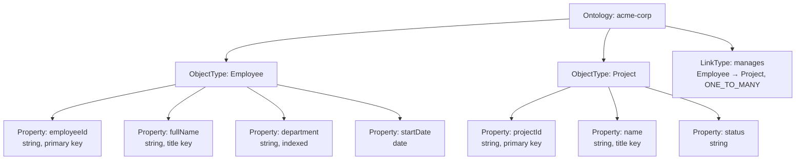

# 스키마 구성(Schema Configuration)

이 가이드는 데이터 엔지니어가 Spice OS에서 온톨로지(Ontology) 스키마를 정의하고 관리하는 방법을 안내합니다. 객체 유형(Object Type) 생성, 속성(Property) 구성, 링크 유형(Link Type) 설정, 그리고 시간이 지남에 따라 스키마를 안전하게 발전시키는 방법을 학습합니다.

## 개요

Spice OS에서 **온톨로지(Ontology)**는 데이터 모델을 설명하는 중앙 스키마 정의입니다. 플랫폼을 통해 흐르는 모든 데이터 -- 외부 데이터베이스에서 가져온 데이터, 파이프라인(Pipeline)으로 변환된 데이터, 또는 액션(Action)을 통해 생성된 데이터 -- 는 온톨로지 스키마를 따릅니다.



## 객체 유형 정의

**객체 유형(Object Type)**은 관계형 데이터베이스의 테이블과 유사한 스키마 청사진입니다. 각 객체 유형은 온톨로지에 등록되며, 해당 유형의 모든 인스턴스가 따라야 하는 구조를 정의합니다.

### 객체 유형 생성

객체 유형은 OMS Ontology API를 통해 생성합니다:

```bash
curl -X POST http://localhost:8080/api/databases/acme-corp/ontology \
  -H "Content-Type: application/json" \
  -d '{
    "id": "Employee",
    "label": { "en": "Employee", "ko": "직원" },
    "description": { "en": "A person employed by the organization" },
    "properties": [
      {
        "name": "employeeId",
        "type": "xsd:string",
        "label": { "en": "Employee ID" },
        "primary_key": true,
        "required": true
      },
      {
        "name": "fullName",
        "type": "xsd:string",
        "label": { "en": "Full Name" },
        "title_key": true,
        "required": true
      },
      {
        "name": "department",
        "type": "xsd:string",
        "label": { "en": "Department" }
      },
      {
        "name": "startDate",
        "type": "xsd:date",
        "label": { "en": "Start Date" }
      },
      {
        "name": "salary",
        "type": "xsd:decimal",
        "label": { "en": "Salary" },
        "constraints": { "min": 0 }
      }
    ],
    "relationships": [
      {
        "predicate": "manages",
        "target": "Project",
        "label": { "en": "Manages" },
        "cardinality": "1:n"
      }
    ]
  }'
```

### 객체 유형 필드

| 필드 | 필수 여부 | 설명 |
|-------|----------|-------------|
| `id` | 선택 | 고유 식별자. 생략 시 자동 생성 |
| `label` | 예 | 사람이 읽을 수 있는 표시 이름 (i18n 지원) |
| `description` | 아니오 | 상세 설명 (i18n 지원) |
| `parent_class` | 아니오 | 상속을 위한 부모 객체 유형 |
| `abstract` | 아니오 | `true`인 경우 직접 인스턴스를 가질 수 없음 |
| `properties` | 예 | 속성 정의 목록 |
| `relationships` | 아니오 | 관계 정의 목록 |
| `metadata` | 아니오 | 임의의 키-값 메타데이터 |

### Foundry v2 API

객체 유형은 Foundry v2 호환 API를 통해서도 접근할 수 있습니다:

```bash
# 모든 객체 유형 조회
GET /api/v2/ontologies/{ontologyRid}/objectTypes

# 특정 객체 유형 조회
GET /api/v2/ontologies/{ontologyRid}/objectTypes/{objectTypeRid}
```

## 속성 구성

**속성(Property)**은 객체 유형에 정의된 이름과 타입을 가진 어트리뷰트입니다. 속성은 각 인스턴스가 보유하는 데이터를 정의합니다.

### 속성 정의

```json
{
  "name": "employeeId",
  "type": "xsd:string",
  "label": { "en": "Employee ID" },
  "required": true,
  "primary_key": true,
  "description": { "en": "Unique identifier for the employee" },
  "constraints": {
    "pattern": "^EMP-\\d{3,6}$"
  }
}
```

### 속성 필드

| 필드 | 필수 여부 | 설명 |
|-------|----------|-------------|
| `name` | 예 | API 요청에서 사용되는 속성 식별자 |
| `type` | 예 | 데이터 타입 (아래 표 참조) |
| `label` | 예 | 표시 이름 (문자열 또는 i18n 객체) |
| `required` | 아니오 | 모든 인스턴스에 속성이 반드시 존재해야 하는지 여부 |
| `primary_key` | 아니오 | 고유 식별자 속성으로 지정 |
| `title_key` | 아니오 | 표시 이름 속성으로 지정 |
| `default` | 아니오 | 새 인스턴스의 기본값 |
| `description` | 아니오 | 사람이 읽을 수 있는 설명 |
| `constraints` | 아니오 | 유효성 검증 규칙 (min, max, pattern, enum, length) |
| `value_type_ref` | 아니오 | 시맨틱 값 타입 정의에 대한 참조 |
| `shared_property_ref` | 아니오 | 재사용 가능한 속성 템플릿에 대한 참조 |

### 지원 데이터 타입

Spice OS는 XSD 기본 타입, 시맨틱 타입(Semantic Type), 복합 타입(Complex Type)을 포함하는 포괄적인 타입 시스템을 지원합니다:

#### 기본 타입(Primitive Types)

| 타입 | XSD 이름 | 설명 | PostgreSQL 매핑 |
|------|----------|-------------|-------------------|
| String | `xsd:string` | UTF-8 텍스트 | `TEXT` |
| Integer | `xsd:integer` | 64비트 부호 있는 정수 | `BIGINT` |
| Long | `xsd:long` | 64비트 부호 있는 정수 (별칭) | `BIGINT` |
| Float | `xsd:float` | 32비트 부동 소수점 | `REAL` |
| Double | `xsd:double` | 64비트 부동 소수점 | `DOUBLE PRECISION` |
| Decimal | `xsd:decimal` | 임의 정밀도 소수 | `NUMERIC` |
| Boolean | `xsd:boolean` | 참 또는 거짓 | `BOOLEAN` |
| Date | `xsd:date` | ISO 8601 날짜 | `DATE` |
| DateTime | `xsd:dateTime` | ISO 8601 날짜/시간 | `TIMESTAMP WITH TIME ZONE` |
| Time | `xsd:time` | ISO 8601 시간 | `TIME` |
| Duration | `xsd:duration` | ISO 8601 기간 | `INTERVAL` |
| URI | `xsd:anyURI` | 통합 자원 식별자 | `TEXT` |
| Base64 Binary | `xsd:base64Binary` | Base64 인코딩 바이너리 데이터 | `BYTEA` |

#### 시맨틱 타입(Semantic Types)

시맨틱 타입은 기본 저장소에 매핑되면서 도메인별 의미를 제공합니다:

| 타입 | 저장 타입 | 설명 | 예시 |
|------|-------------|-------------|---------|
| `email` | string | 이메일 주소 | `"jane@acme.com"` |
| `phone` | string | 전화번호 | `"+1-555-0100"` |
| `address` | string | 물리적 주소 | `"123 Main St"` |
| `money` | decimal | 금액 | `49999.99` |
| `coordinate` | string | 위도/경도 쌍 | `"37.7749,-122.4194"` |
| `geopoint` | string | GeoJSON 포인트 | `{"lat": 37.7749, "lon": -122.4194}` |
| `geoshape` | string | GeoJSON 지오메트리 | `{"type": "Polygon", ...}` |
| `marking` | string | 보안 마킹 | `"CONFIDENTIAL"` |
| `cipher` | string | 암호화된 텍스트 | _(encrypted)_ |

#### 복합 타입(Complex Types)

| 타입 | 설명 | 예시 |
|------|-------------|---------|
| `array` | 정렬된 값 목록 | `["tag1", "tag2"]` |
| `object` | 중첩 JSON 객체 | `{"key": "value"}` |
| `struct` | 구조화된 레코드 | `{"street": "Main", "city": "SF"}` |
| `vector` | 수치 벡터 | `[0.1, 0.2, 0.3]` |
| `enum` | 열거형 문자열 값 | `"ACTIVE"` |

### Foundry v2 타입 정규화

Foundry v2 API를 통해 접근할 때 타입은 자동으로 정규화됩니다:

| 입력 타입 | 정규화된 출력 |
|-----------|-------------------|
| `xsd:string`, `normalizedstring`, `token` | `string` |
| `xsd:integer`, `xsd:int` | `integer` |
| `xsd:long` | `long` |
| `xsd:double` | `double` |
| `xsd:boolean` | `boolean` |
| `xsd:dateTime` | `timestamp` |
| `xsd:date` | `date` |

### 특수 속성 역할

#### 기본 키(Primary Key)

모든 객체 유형은 인스턴스를 고유하게 식별하는 정확히 하나의 **기본 키(Primary Key)** 속성을 가져야 합니다:

```json
{
  "name": "employeeId",
  "type": "xsd:string",
  "primary_key": true,
  "required": true
}
```

- 항상 필수이며 인덱싱됩니다
- 명시적으로 설정되지 않은 경우 시스템이 추론합니다 (`{type_id}_id` 또는 `id`를 검색)
- 라운드트립 안전성을 위해 `OntologyKeySpecRegistry`에 저장됩니다

#### 타이틀 키(Title Key)

**타이틀 키(Title Key)** 속성은 UI 컴포넌트에서 표시 이름으로 사용됩니다:

```json
{
  "name": "fullName",
  "type": "xsd:string",
  "title_key": true
}
```

- 설정되지 않은 경우 `name` 속성이 기본값이 되며, 그다음 기본 키로 폴백됩니다
- 키 스펙 레지스트리에도 저장됩니다

### 제약 조건(Constraints)

속성은 유효성 검증 제약 조건을 지원합니다:

```json
{
  "name": "age",
  "type": "xsd:integer",
  "constraints": {
    "min": 0,
    "max": 200
  }
}
```

| 제약 조건 | 타입 | 설명 |
|-----------|------|-------------|
| `required` | boolean | 반드시 존재해야 함 |
| `min` | number | 최솟값 |
| `max` | number | 최댓값 |
| `pattern` | string | 정규식 패턴 |
| `enum` | array | 허용되는 값 |
| `length` | object | 문자열 길이에 대한 `{"min": N, "max": N}` |
| `format` | string | 시맨틱 타입에 대한 형식 힌트 |

### 공유 속성 템플릿(Shared Property Templates)

**공유 속성 정의(Shared Property Definitions)**를 사용하면 재사용 가능한 속성 템플릿을 정의할 수 있습니다:

```json
{
  "id": "standard_audit_fields",
  "properties": [
    { "name": "createdAt", "type": "xsd:dateTime", "required": true },
    { "name": "updatedAt", "type": "xsd:dateTime" },
    { "name": "createdBy", "type": "xsd:string" }
  ]
}
```

객체 유형에서 참조합니다:

```json
{
  "name": "createdAt",
  "shared_property_ref": "standard_audit_fields.createdAt"
}
```

공유 속성은 유효성 검증 시 확장됩니다 -- 시스템이 참조를 확인하고 템플릿 정의를 적용합니다.

## 링크 유형 생성

**링크 유형(Link Type)**은 두 객체 유형 간의 방향성 관계를 정의합니다. 링크는 온톨로지의 일급 시민(First-Class Citizen)이며 데이터 전반에 걸쳐 그래프 스타일의 탐색을 가능하게 합니다.

### 인라인 관계(Inline Relationships)

링크를 정의하는 가장 간단한 방법은 객체 유형 정의 내에 인라인으로 작성하는 것입니다:

```json
{
  "relationships": [
    {
      "predicate": "manages",
      "target": "Project",
      "label": { "en": "Manages" },
      "cardinality": "1:n",
      "inverse_predicate": "managed_by",
      "inverse_label": { "en": "Managed By" }
    }
  ]
}
```

### 독립형 링크 유형(Standalone Link Types)

더 세밀한 제어가 필요한 경우, 링크 유형을 독립형 리소스로 생성합니다:

```bash
curl -X POST http://localhost:8080/api/link-types \
  -H "Content-Type: application/json" \
  -d '{
    "id": "manages",
    "label": "Manages",
    "from": "Employee",
    "to": "Project",
    "predicate": "manages",
    "cardinality": "1:n",
    "status": "ACTIVE",
    "relationship_spec": {
      "type": "foreign_key",
      "fk_column": "manager_employee_id",
      "dangling_policy": "ALLOW"
    }
  }'
```

### 카디널리티 옵션(Cardinality Options)

| 카디널리티 | 약칭 | 설명 |
|-------------|-----------|-------------|
| `1:1` | `one` | 하나의 소스가 하나의 대상에 매핑 |
| `1:n` | `many` | 하나의 소스가 여러 대상에 매핑 |
| `n:1` | -- | 여러 소스가 하나의 대상에 매핑 |
| `n:m` | -- | 여러 소스가 여러 대상에 매핑 |

### 관계 구현 유형(Relationship Implementation Types)

링크 유형은 세 가지 백엔드 구현을 지원합니다:

#### 외래 키(Foreign Key)

가장 단순한 패턴 -- 소스 테이블의 컬럼이 대상의 기본 키를 참조합니다:

```json
{
  "type": "foreign_key",
  "fk_column": "manager_employee_id",
  "target_pk_field": "employeeId",
  "dangling_policy": "FAIL",
  "auto_sync": true
}
```

- `dangling_policy`: `FAIL` (끊어진 참조 거부) 또는 `ALLOW` (댕글링 허용)
- `auto_sync`: FK 값 변경 시 링크 자동 동기화

#### 조인 테이블(Join Table)

별도의 브릿지 테이블을 사용하는 다대다(Many-to-Many) 관계:

```json
{
  "type": "join_table",
  "join_dataset_id": "employee_project_assignments",
  "source_key_column": "employee_id",
  "target_key_column": "project_id",
  "dedupe_policy": "DEDUP",
  "dangling_policy": "FAIL"
}
```

#### 객체 기반(Object-Backed)

추가 속성을 가진 고유한 객체 유형으로 표현되는 관계 (연관 객체):

```json
{
  "type": "object_backed",
  "relationship_object_type": "ProjectAssignment",
  "source_key_column": "employee_id",
  "target_key_column": "project_id"
}
```

## 스키마 진화(Schema Evolution)

비즈니스 요구사항이 변화함에 따라 스키마도 발전합니다. Spice OS는 안전한 스키마 진화를 위한 도구와 안전장치를 제공합니다.

### 안전한 변경 (비호환 변경 아님)

다음 변경은 안전하며 기존 데이터에 영향을 주지 않고 적용할 수 있습니다:

- **새로운 선택적 속성 추가** -- 기존 인스턴스가 유효한 상태로 유지됩니다
- **새로운 객체 유형 추가** -- 기존 유형에 영향 없음
- **새로운 링크 유형 추가** -- 기존 객체에 영향 없음
- **표시 레이블 업데이트** -- 메타데이터만 변경
- **설명 추가** -- 메타데이터만 변경
- **제약 조건 완화** -- 필수 필드를 선택적으로 변경

### 호환성을 깨는 변경 (마이그레이션 필요)

다음 변경은 신중한 계획이 필요합니다:

- **속성 제거** -- 기존 인스턴스에 제거된 필드의 데이터가 있을 수 있음
- **속성 이름 변경** -- API 소비자가 참조를 업데이트해야 함
- **데이터 타입 변경** -- 기존 값이 호환되지 않을 수 있음
- **제약 조건 강화** -- 기존 값이 새로운 제약 조건을 위반할 수 있음
- **기본 키 변경** -- 모든 참조와 인덱스를 업데이트해야 함

### 타입 호환성 규칙

속성 데이터 타입을 변경할 때 시스템이 호환성을 확인합니다:

| 소스 타입 | 호환되는 대상 타입 |
|-----------|----------------------|
| `xsd:string` | `xsd:string`만 |
| `xsd:integer` | `xsd:integer`만 |
| `xsd:decimal` | `xsd:decimal`, `xsd:integer` |
| `xsd:date` | `xsd:date`, `xsd:dateTime` |
| `xsd:dateTime` | `xsd:dateTime`, `xsd:date` |

호환되지 않는 타입 변경은 유효성 검증 레이어에서 거부됩니다.

### 스키마 해시 추적(Schema Hash Tracking)

Spice OS는 스키마 변경을 감지하기 위해 컬럼 정의의 안정적인 SHA-256 해시를 계산합니다. 이 해시는 다음에서 사용됩니다:

- **파이프라인(Pipelines)** -- 실행 간 소스 스키마 변경 여부 감지
- **데이터셋(Datasets)** -- 데이터와 함께 스키마 버전 관리
- **가져오기 흐름(Import Flows)** -- 수신 데이터가 예상 스키마와 일치하는지 검증

### 유효성 검증 파이프라인(Validation Pipeline)

객체 유형을 생성하거나 업데이트할 때 시스템은 다단계 유효성 검증 파이프라인을 실행합니다:

1. **입력 정제(Input Sanitization)** -- 데이터베이스 및 클래스 이름 유효성 검사
2. **공유 속성 확장(Shared Property Expansion)** -- 템플릿 참조 확인
3. **값 타입 유효성 검사(Value Type Validation)** -- 시맨틱 값 타입 참조 확인
4. **그룹 참조 유효성 검사(Group Reference Validation)** -- 그룹 메타데이터 검증
5. **온톨로지 린팅(Ontology Linting)** -- 구조적 유효성 검사 (중복 속성 없음, 유효한 카디널리티, 제약 조건 확인)
6. **이벤트 소싱(Event Sourcing)** -- 변경을 불변 이벤트로 영속화

## 백킹 데이터소스(Backing Datasources)

모든 객체 유형은 하나 이상의 데이터셋에 의해 백킹될 수 있습니다. **백킹 데이터셋(Backing Dataset)**은 인스턴스로 객체화되는 원시 데이터를 제공합니다.

### 데이터셋 연결

BFF 레이어를 통해 객체 유형을 생성할 때 다음을 지정할 수 있습니다:

```json
{
  "backing_dataset_id": "ri.spice.main.dataset.sales-data-uuid",
  "pk_spec": {
    "primary_key": ["orderId"],
    "title_key": ["customerName"]
  },
  "mapping_spec_id": "mapping-uuid"
}
```

- `backing_dataset_id` -- 원시 데이터를 제공하는 데이터셋
- `pk_spec` -- 기본 키와 타이틀 키에 매핑되는 컬럼
- `mapping_spec_id` -- 컬럼 매핑 구성에 대한 선택적 참조

### 객체화(Objectification)

원시 데이터셋 행을 온톨로지 인스턴스로 변환하는 프로세스를 **객체화(Objectification)**라고 합니다. `ObjectifyRegistry`는 다음을 추적합니다:

- 어떤 데이터셋이 어떤 객체 유형에 매핑되어 있는지
- 현재 객체화 상태 (대기 중, 실행 중, 완료)
- 컬럼-속성 매핑 규칙
- 마지막 성공적인 객체화 타임스탬프

## 모범 사례

### 명명 규칙

| 요소 | 규칙 | 예시 |
|---------|-----------|---------|
| 객체 유형 ID | PascalCase | `Employee`, `SalesOrder` |
| 속성 이름 | camelCase | `fullName`, `startDate` |
| 링크 유형 서술어 | camelCase 동사 | `manages`, `belongsTo` |
| 기본 키 | `{type}Id` | `employeeId`, `projectId` |

### 설계 지침

1. **의미 있는 기본 키를 선택하십시오** -- 자동 증분 정수보다 비즈니스 식별자 (`EMP-042`)를 가능하면 사용하십시오
2. **타이틀 키를 명시적으로 표시하십시오** -- UI 컴포넌트가 의미 있는 이름을 표시하는 데 도움이 됩니다
3. **시맨틱 타입을 사용하십시오** -- `string` 대신 `email`을 사용하면 타입별 유효성 검증과 렌더링이 가능합니다
4. **제약 조건을 일찍 정의하십시오** -- 나중에 제약 조건을 추가하면 기존 데이터가 거부될 수 있습니다
5. **공유 속성을 사용하십시오** -- 감사 필드(`createdAt`, `updatedAt`, `createdBy`)와 같은 공통 패턴에 사용하십시오
6. **카디널리티를 신중하게 계획하십시오** -- `1:n`에서 `n:m`으로 변경하면 다른 관계 구현이 필요합니다
7. **설명으로 문서화하십시오** -- 모든 객체 유형과 중요한 속성에 `description`을 포함하십시오
8. **처음부터 i18n을 지원하십시오** -- 단일 언어 배포에서도 레이블에 `{ "en": "...", "ko": "..." }` 형식을 사용하십시오

### 성능 고려사항

- **전략적으로 인덱싱하십시오** -- 자주 검색되는 속성을 Elasticsearch용 `indexed`로 표시하십시오
- **지나치게 넓은 스키마를 피하십시오** -- 큰 유형을 링크 유형으로 연결된 집중된 유형으로 분할하십시오
- **적절한 데이터 타입을 사용하십시오** -- 숫자 데이터에는 `xsd:string`보다 `xsd:integer`가 더 효율적입니다
- **배열 속성을 제한하십시오** -- 단일 속성의 큰 배열은 직렬화 성능에 영향을 줄 수 있습니다

## 다음 단계

- **[파이프라인 빌더](./pipeline-builder)** -- 스키마로 데이터를 변환하고 로드합니다
- **[가져오기 템플릿](./import-templates)** -- 외부 데이터 소스를 연결합니다
- **[v2 Object Types API](/docs/api/v2-object-types)** -- 전체 API 레퍼런스
- **[핵심 개념](/docs/getting-started/concepts)** -- 기본 개념을 검토합니다
