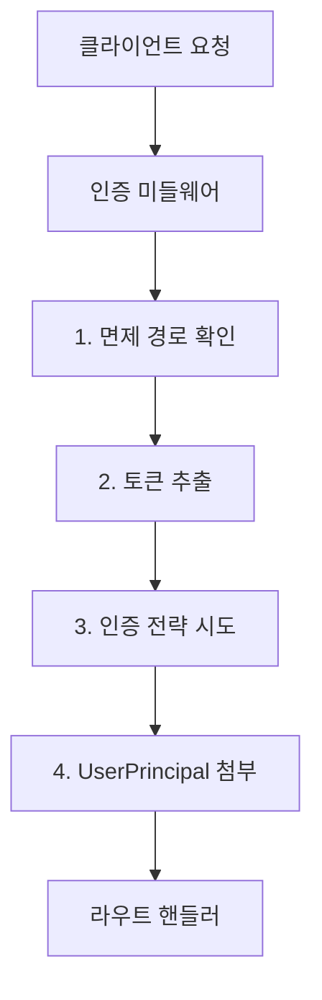

# 인증 흐름(Authentication Flow)

이 가이드는 통합 개발자(Integration Developer)에게 Spice OS의 인증(Authentication) 및 인가(Authorization) 메커니즘을 안내합니다. 인증 미들웨어(Auth Middleware)의 작동 방식, 지원되는 인증 전략, 그리고 통합 보안을 위한 모범 사례를 학습합니다.

## 개요(Overview)

Spice OS의 BFF 서비스는 미들웨어 계층을 통해 모든 API 요청에 대한 인증을 적용합니다. 미들웨어는 HTTP 헤더에서 자격 증명(Credentials)을 추출하고, 구성된 전략에 대해 유효성을 검증한 후, **UserPrincipal**을 요청 컨텍스트에 첨부합니다.



### 면제 경로(Exempt Paths)

다음 경로는 인증 없이 접근할 수 있습니다.

- `/api/v1/health` -- 헬스 체크 엔드포인트
- `/api/v1/` -- 서비스 메타데이터

추가 면제 경로는 환경 변수를 통해 구성할 수 있습니다.

## 인증 전략(Authentication Strategies)

미들웨어는 인증 전략을 순차적으로 시도합니다. 첫 번째로 성공한 전략이 사용됩니다.

### 전략 1: 위임 인증이 포함된 에이전트 토큰(Agent Token with Delegated Auth)

사용자를 대신하여 작동하는 AI 에이전트 및 자동화 도구를 위한 전략입니다.

**필수 헤더:**
```
Authorization: Bearer <agent-token>
X-Agent-Tool-ID: <tool-identifier>
X-Delegated-Authorization: Bearer <user-jwt>
```

**선택적 헤더:**
```
X-Agent-Session-ID: <session-id>
X-Agent-Tool-Run-ID: <run-id>
```

**흐름:**
1. 구성된 예상 토큰에 대해 에이전트 토큰 유효성 검증
2. 위임된 사용자 JWT 추출 및 검증
3. 에이전트 도구 레지스트리(Agent Tool Registry)에서 도구의 정책 조회
4. 정책 제한 적용 (허용된 메서드, 경로, 데이터셋, 파이프라인)
5. 위임된 사용자의 주체(Principal)를 요청에 첨부

**정책 적용 예시:**
- 도구를 읽기 전용으로 제한: `GET` 메서드만 허용
- 특정 데이터셋으로 제한: `allowed_dataset_ids`
- 특정 파이프라인으로 제한: `allowed_pipeline_ids`
- 특정 온톨로지로 제한: `allowed_ontology_ids`

### 전략 2: Bearer 토큰(Bearer Token)

API 키 및 서비스 계정에 적합한 가장 간단한 인증 방법입니다.

**필수 헤더:**
```
Authorization: Bearer <token>
```

**흐름:**
1. `Authorization` 헤더에서 토큰 추출
2. `bff_expected_tokens` 구성에 대해 유효성 검증
3. 서비스 주체(Service Principal)를 요청에 첨부

### 전략 3: 사용자 JWT(User JWT)

JSON Web Token을 사용하는 SSO/OIDC 인증 사용자를 위한 전략입니다.

**필수 헤더:**
```
Authorization: Bearer <jwt>
```

**지원되는 검증 방법:**

| 방법 | 구성 | 설명 |
|--------|--------------|-------------|
| HS256 Secret | `JWT_SECRET` | 대칭 키(Symmetric Key) 검증 |
| RSA Public Key | `JWT_RSA_PUBLIC_KEY` | 비대칭 키(Asymmetric Key) 검증 |
| JWKS URL | `JWT_JWKS_URL` | 동적 키 검색 (OIDC 프로바이더용) |

**추출되는 JWT 클레임(Claims):**

| 클레임 | 매핑 대상 | 설명 |
|-------|---------|-------------|
| `sub` | `user_id` | 주체 식별자(Subject Identifier) |
| `roles` | `roles` | 역할 이름 배열 |
| `tenant_id` | `tenant_id` | 멀티 테넌트 격리 |
| `org_id` | `org_id` | 조직 식별자 |

### 전략 4: 관리자 토큰(Admin Token)

사전 공유된 관리자 토큰을 사용하는 관리 작업을 위한 전략입니다.

**필수 헤더:**
```
X-Admin-Token: <admin-token>
```

**흐름:**
1. `X-Admin-Token` 헤더에서 토큰 추출
2. 구성된 관리자 토큰에 대해 유효성 검증
3. `admin` 및 `platform_admin` 역할을 가진 시스템 주체(System Principal) 첨부
4. 모든 플랫폼 API 스코프가 자동으로 부여됨

관리자 토큰 주체는 `id: "system"`과 전체 플랫폼 스코프로 생성됩니다. 이를 통해 구성되지 않은 개발 스택에서도 액션 유효성 검증 및 적용이 가능합니다 (`system`에 대해서는 편집 정책 적용이 건너뛰어집니다).

### 전략 5: Pytest 범위 주체(Pytest-Scoped Principal)

**테스트 전용** -- 테스트 하네스에서 실행할 때 주체를 자동으로 첨부합니다.

**흐름:**
1. `X-User-ID` 또는 `X-Actor` 헤더 확인 (`pytest-user`로 폴백)
2. `admin` 및 `platform_admin` 역할을 가진 주체 생성
3. `scope` 클레임을 통해 모든 플랫폼 API 스코프 부여

:::caution
Pytest 주체는 애플리케이션이 테스트 러너 하에서 실행될 때만 활성화됩니다. 프로덕션 환경에서는 절대 도달할 수 없어야 합니다.
:::

### 전략 6: 개발용 마스터 인증(Dev Master Auth)

**개발 전용** -- 활성화 시 모든 인증을 우회합니다.

```bash
DEV_MASTER_AUTH_ENABLED=true
```

:::danger
프로덕션 환경에서는 절대 Dev Master Auth를 활성화하지 마십시오. 모든 보안 제어를 우회합니다.
:::

## UserPrincipal

인증이 성공하면 `UserPrincipal`이 요청에 첨부됩니다.

```python
@dataclass(frozen=True)
class UserPrincipal:
    id: str                        # 고유 사용자 식별자
    type: str = "user"             # "user", "service", "agent"
    email: Optional[str] = None    # 이메일 주소 (JWT에서 추출)
    roles: Tuple[str, ...] = ()    # 역할 할당
    tenant_id: Optional[str] = None  # 테넌트 격리 키
    org_id: Optional[str] = None   # 조직 식별자
    verified: bool = True          # 토큰이 암호학적으로 검증되었는지 여부
    claims: Dict[str, Any] = {}    # 원시 JWT 클레임 (스코프 추출에 사용)

    def scopes(self) -> Tuple[str, ...]:
        """클레임 딕셔너리에서 OAuth 스코프를 추출합니다."""
        ...
```

### OAuth 스코프(OAuth Scopes)

`UserPrincipal.scopes()` 메서드는 OIDC 클레임에서 OAuth 스코프를 파싱합니다. 다양한 형식을 지원합니다.

| 형식 | 출처 | 예시 |
|--------|--------|---------|
| 공백 구분 문자열 | OAuth2 표준 (`scope` 클레임) | `"api:datasets-read api:ontologies-write"` |
| 쉼표 구분 문자열 | 레거시 시스템 | `"api:datasets-read,api:ontologies-write"` |
| 문자열 배열 | Azure AD (`scp` 클레임) | `["api:datasets-read", "api:ontologies-write"]` |

### 플랫폼 API 스코프(Platform API Scopes)

Spice OS는 세분화된 접근 제어를 위해 8개의 플랫폼 API 스코프를 정의합니다.

| 스코프 | 설명 |
|-------|-------------|
| `api:datasets-read` | 데이터셋, 브랜치, 트랜잭션, 파일 읽기 |
| `api:datasets-write` | 데이터셋 생성/수정, 파일 업로드, 트랜잭션 관리 |
| `api:ontologies-read` | 온톨로지, 객체 타입, 객체, 링크 읽기 |
| `api:ontologies-write` | 온톨로지 생성/수정, 액션 실행 |
| `api:orchestration-read` | 빌드, 스케줄, 실행 읽기 |
| `api:orchestration-write` | 빌드 생성, 스케줄 관리 |
| `api:connectivity-read` | 커넥션, 임포트, 가상 테이블 읽기 |
| `api:connectivity-write` | 커넥션 및 임포트 생성/수정 |

스코프는 보호된 엔드포인트에서 `require_scopes` 의존성을 사용하여 적용됩니다. 요청에 필요한 스코프가 부족한 경우, API는 `ApiUsageDenied` 오류 이름과 함께 Foundry 스타일의 `403 PERMISSION_DENIED` 오류를 반환합니다.

주체(Principal)는 헤더를 통해 다운스트림 서비스로 전파됩니다.

| 헤더 | 값 |
|--------|-------|
| `X-User-ID` | 주체의 사용자 ID |
| `X-User-Type` | 주체 타입 (user/service/agent) |
| `X-Principal-Id` | 사용자 ID와 동일 |
| `X-Principal-Type` | 사용자 타입과 동일 |
| `X-Actor` | 행위자(Actor) 식별자 |
| `X-Actor-Type` | 행위자 타입 |
| `X-Tenant-ID` | 테넌트 ID |
| `X-Org-ID` | 조직 ID |
| `X-User-Roles` | 쉼표로 구분된 역할 |

## 토큰 관리(Token Management)

### 토큰 획득(Obtaining Tokens)

**Bearer 토큰**은 BFF 서비스 환경에서 구성됩니다.

```bash
BFF_EXPECTED_TOKENS=token1,token2,token3
```

**사용자 JWT**는 ID 프로바이더(IdP)에서 발급되며 BFF에서 검증됩니다.

**에이전트 토큰**은 에이전트 도구 레지스트리에서 에이전트 도구 정책과 함께 구성됩니다.

### 토큰 보안 모범 사례(Token Security Best Practices)

1. **HTTPS 사용** -- 암호화되지 않은 연결을 통해 토큰을 전송하지 마십시오
2. **단기 토큰(Short-lived Tokens)** -- JWT 만료를 구성하십시오 (일반적으로 15-60분)
3. **정기적 토큰 교체** -- 일정에 따라 Bearer 토큰을 업데이트하십시오
4. **안전한 저장** -- 환경 변수 또는 시크릿 매니저를 사용하고, 토큰을 하드코딩하지 마십시오
5. **최소 범위 스코프** -- 에이전트 도구 정책을 사용하여 최소 필요 리소스로 접근을 제한하십시오
6. **토큰 사용 감사** -- 인증 로그에서 이상 징후를 모니터링하십시오

## 서비스 간 인증(Service-to-Service Authentication)

내부 서비스(워커, 스케줄러)는 동일한 Bearer 토큰 메커니즘을 사용하여 BFF에 인증합니다.

```python
# 워커 구성
BFF_INTERNAL_TOKEN=internal-service-token

# 워커에서 BFF로의 요청
headers = {"Authorization": f"Bearer {BFF_INTERNAL_TOKEN}"}
```

워커는 추가 컨텍스트 헤더를 포함합니다.

```
X-Service-Name: pipeline-worker
X-Job-ID: job-12345
```

## 멀티 테넌트 격리(Multi-Tenant Isolation)

Spice OS는 테넌트별 데이터 격리를 통한 멀티 테넌트 배포를 지원합니다.

1. **테넌트 추출** -- 테넌트 ID는 JWT의 `tenant_id` 클레임에서 추출됩니다
2. **폴백(Fallback)** -- 테넌트 ID가 없는 경우 `"default"`로 기본 설정됩니다
3. **쿼리 범위 지정** -- 모든 데이터베이스 쿼리는 자동으로 해당 테넌트로 범위가 지정됩니다
4. **리소스 격리** -- 데이터셋, 파이프라인, 온톨로지는 테넌트별로 격리됩니다

## 멱등성 키(Idempotency Keys)

쓰기 작업의 경우, 클라이언트는 `Idempotency-Key` 헤더를 포함할 수 있습니다.

```bash
curl -X POST http://localhost:8080/api/v2/ontologies/acme/actions/createObject \
  -H "Authorization: Bearer YOUR_TOKEN" \
  -H "Idempotency-Key: unique-request-id-12345" \
  -H "Content-Type: application/json" \
  -d '{"parameters": {...}}'
```

동일한 멱등성 키가 두 번 전송되면, 두 번째 요청은 액션을 재실행하지 않고 첫 번째 요청의 결과를 반환합니다.

## 인증 문제 디버깅(Debugging Authentication Issues)

### 일반적인 오류

| 오류 | HTTP 상태 | 원인 | 해결 방법 |
|-------|------------|-------|------------|
| Authorization 헤더 누락 | 401 | 토큰 미제공 | `Authorization: Bearer <token>` 헤더 추가 |
| 유효하지 않은 토큰 | 401 | 토큰이 예상 목록에 없음 | `BFF_EXPECTED_TOKENS` 구성 확인 |
| JWT 검증 실패 | 401 | 잘못된 시크릿/키 또는 만료된 토큰 | JWT 구성 및 토큰 만료 확인 |
| 권한 거부 | 403 | 역할에 필요한 권한 부족 | 사용자에게 필요한 역할 추가 또는 RBAC 정책 조정 |
| 스코프 누락 (`ApiUsageDenied`) | 403 | 주체에 OAuth 스코프 없음 | JWT의 `scope` 또는 `scp` 클레임에 필요한 스코프 포함 확인 |
| 에이전트 도구 미발견 | 403 | `X-Agent-Tool-ID` 미등록 | 에이전트 도구 레지스트리에 도구 등록 |
| 에이전트 정책 위반 | 403 | 요청이 도구 정책 위반 | 도구의 허용된 메서드, 경로, 리소스 확인 |

### 디버깅 단계

1. **헬스 엔드포인트 확인** -- BFF가 실행 중인지 확인: `GET /api/health`
2. **토큰 형식 확인** -- `Bearer ` 접두사(공백 포함)가 있는지 확인
3. **JWT 클레임 확인** -- jwt.io에서 JWT를 디코딩하여 클레임 확인
4. **인증 로그 검토** -- BFF 로그에서 인증 실패 확인
5. **Dev Master Auth로 테스트** -- 개발 환경에서 일시적으로 활성화하여 인증 문제와 로직 문제를 분리

## 다음 단계(Next Steps)

- **[RBAC 가이드](../platform-admin/rbac)** -- 역할 및 권한 구성
- **[REST API 가이드](./rest-api)** -- 인증된 API 사용
- **[SDK 가이드](./sdk-guide)** -- 클라이언트 라이브러리가 인증을 자동으로 처리
- **[오류 코드](/docs/api/error-codes)** -- 인증 오류 코드
