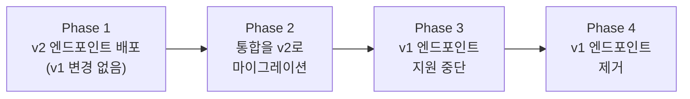

# Foundry v2 마이그레이션 가이드

이 가이드는 플랫폼 관리자가 내부 v1 API에서 Foundry v2 호환 API로 마이그레이션하는 방법을 안내합니다. v2 API는 Palantir Foundry 호환 엔드포인트, 표준화된 리소스 식별자(RID), 일관된 오브젝트 모델을 제공합니다.

## v2로 마이그레이션하는 이유

| 항목 | v1 (내부) | v2 (Foundry 호환) |
|------|-----------|-------------------|
| **식별자(Identifiers)** | 숫자 ID | 문자열 API 이름 + RID |
| **오브젝트 형식** | 플랫 JSON | `__rid`, `__primaryKey`, `__apiName`, `properties` |
| **페이지네이션(Pagination)** | Offset/limit | 불투명 `pageToken` (커서 기반) |
| **검색(Search)** | 커스텀 필터 구문 | `SearchJsonQueryV2` 연산자 (23개 연산자) |
| **쓰기 작업** | 직접 PUT/DELETE | 검증 및 감사 추적이 포함된 Actions API |
| **일관성** | 형식이 다양함 | 모든 엔드포인트에서 Foundry 호환 |

## 마이그레이션 일정



Phase 1-2 동안에는 v1과 v2 엔드포인트가 동시에 사용 가능합니다.

## URL 경로 마이그레이션

### 온톨로지 엔드포인트(Ontology Endpoints)

| v1 경로 | v2 경로 |
|---------|---------|
| `GET /api/databases/{db}/ontology` | `GET /api/v2/ontologies/{apiName}/objectTypes` |
| `GET /api/databases/{db}/ontology/{classId}` | `GET /api/v2/ontologies/{apiName}/objectTypes/{typeApiName}` |
| `POST /api/databases/{db}/ontology` | `POST /api/v2/ontologies/{apiName}/actions/createObject` |

### 오브젝트 엔드포인트(Object Endpoints)

| v1 경로 | v2 경로 |
|---------|---------|
| `GET /api/databases/{db}/objects/{type}` | `GET /api/v2/ontologies/{apiName}/objectTypes/{type}/objects` |
| `GET /api/databases/{db}/objects/{type}/{id}` | `GET /api/v2/ontologies/{apiName}/objectTypes/{type}/objects/{pk}` |
| `PUT /api/databases/{db}/objects/{type}/{id}` | `POST /api/v2/ontologies/{apiName}/actions/editObject` |
| `DELETE /api/databases/{db}/objects/{type}/{id}` | `POST /api/v2/ontologies/{apiName}/actions/deleteObject` |

### 검색 엔드포인트(Search Endpoints)

| v1 경로 | v2 경로 |
|---------|---------|
| `POST /api/databases/{db}/search` | `POST /api/v2/ontologies/{apiName}/objectTypes/{type}/objects/search` |

### 데이터셋 엔드포인트(Dataset Endpoints)

v2 Datasets API는 전체 Foundry Datasets 생명주기(CRUD, 브랜칭, 트랜잭션, 파일, 스키마)를 다루는 19개의 엔드포인트로 대폭 확장되었습니다.

| v1 경로 | v2 경로 |
|---------|---------|
| `GET /api/databases/{db}/datasets` | `GET /api/v2/datasets/{datasetRid}` |
| `GET /api/databases/{db}/datasets/{id}` | `GET /api/v2/datasets/{datasetRid}` |
| *(v1 해당 없음)* | `POST /api/v2/datasets` (데이터셋 생성) |
| *(v1 해당 없음)* | `GET/POST /api/v2/datasets/{rid}/branches` (브랜치 목록 조회/생성) |
| *(v1 해당 없음)* | `GET/POST /api/v2/datasets/{rid}/files/{path}/upload` (파일 관리) |
| *(v1 해당 없음)* | `GET/PUT /api/v2/datasets/{rid}/getSchema` / `putSchema` |
| *(v1 해당 없음)* | `POST /api/v2/datasets/{rid}/transactions` (생성/커밋/중단) |

### 연결 엔드포인트(Connectivity Endpoints)

| v1 경로 | v2 경로 |
|---------|---------|
| `POST /api/data-connector/connections` | `POST /api/v2/connectivity/connections` |
| `POST /api/data-connector/imports` | `POST /api/v2/connectivity/tableImports` |

## 식별자 마이그레이션(Identifier Migration)

### 리소스 식별자(Resource Identifiers, RIDs)

v2 API는 Foundry 스타일의 RID(리소스 식별자)를 사용합니다.

```
형식: ri.spice.main.{resource-type}.{id}
```

| 리소스 | RID 예시 |
|--------|----------|
| Object Type | `ri.spice.main.object-type.Employee` |
| Object | `ri.spice.main.object.employee-00042` |
| Dataset | `ri.spice.main.dataset.a1b2c3d4` |
| Connection | `ri.spice.main.connection.conn-123` |
| Table Import | `ri.spice.main.table-import.imp-456` |
| Build | `ri.spice.main.build.build-789` |
| Schedule | `ri.spice.main.schedule.sched-012` |
| Transaction | `ri.spice.main.transaction.txn-345` |

### v1 ID를 v2 RID로 매핑

v1 숫자 ID는 일관된 접두사를 통해 v2 RID로 매핑됩니다.

```python
# v1
object_id = 42

# v2
object_rid = "ri.spice.main.object.employee-00042"
```

BFF 계층에서 이 매핑을 내부적으로 처리합니다. 클라이언트 코드에서는 RID 형식을 사용하도록 업데이트하기만 하면 됩니다.

## 응답 형식 마이그레이션

### 오브젝트 응답

**v1 형식:**

```json
{
  "id": 42,
  "type": "Employee",
  "data": {
    "employeeId": "EMP-042",
    "fullName": "Jane Doe",
    "department": "Engineering"
  }
}
```

**v2 형식:**

```json
{
  "__rid": "ri.spice.main.object.employee-00042",
  "__primaryKey": "EMP-042",
  "__apiName": "Employee",
  "properties": {
    "employeeId": "EMP-042",
    "fullName": "Jane Doe",
    "department": "Engineering"
  }
}
```

### 주요 변경사항:
- `id` (숫자) → `__rid` (문자열 RID)
- `type` → `__apiName`
- `data` → `properties`
- `__primaryKey` 필드 추가

### 에러 응답 형식

v2 엔드포인트는 모든 에러 응답에 **FoundryAPIError** 엔벨로프를 사용합니다. v1 클라이언트에서 에러 응답을 파싱하고 있다면, 새로운 형식을 처리하도록 업데이트해야 합니다.

**v1 에러:**
```json
{"error": "Object not found", "status": 404}
```

**v2 에러 (FoundryAPIError):**
```json
{
  "errorCode": "NOT_FOUND",
  "errorName": "ObjectNotFound",
  "errorInstanceId": "a1b2c3d4-...",
  "parameters": {"objectType": "Employee", "primaryKey": "EMP-999"}
}
```

v2 경로에서의 요청 유효성 검사 에러 및 JSON 디코드 에러도 자동으로 이 형식으로 래핑됩니다.

## 페이지네이션 마이그레이션(Pagination Migration)

### v1 (Offset/Limit)

```bash
GET /api/databases/acme/objects/Employee?offset=50&limit=25
```

### v2 (커서 기반)

```bash
# 첫 번째 페이지
GET /api/v2/ontologies/acme/objectTypes/Employee/objects?pageSize=25

# 다음 페이지 (이전 응답의 토큰 사용)
GET /api/v2/ontologies/acme/objectTypes/Employee/objects?pageSize=25&pageToken=eyJvZmZzZXQiOjI1fQ==
```

**커서 기반 페이지네이션의 장점:**
- 페이지 간 데이터가 수정되더라도 일관된 결과를 보장합니다
- 대규모 데이터셋에서 더 나은 성능을 제공합니다
- 항목의 누락이나 중복 위험이 없습니다

## 검색 마이그레이션(Search Migration)

### v1 필터 구문

```json
{
  "filters": {
    "department": "Engineering",
    "salary_gte": 80000
  },
  "sort": "fullName",
  "order": "asc"
}
```

### v2 SearchJsonQueryV2

```json
{
  "where": {
    "type": "and",
    "value": [
      { "type": "eq", "field": "department", "value": "Engineering" },
      { "type": "gte", "field": "salary", "value": 80000 }
    ]
  },
  "orderBy": {
    "fields": [{ "field": "fullName", "direction": "asc" }]
  },
  "pageSize": 25
}
```

### 일반적인 검색 패턴

| v1 패턴 | v2 연산자 |
|---------|-----------|
| `field: value` | `{"type": "eq", "field": "...", "value": "..."}` |
| `field_gte: value` | `{"type": "gte", "field": "...", "value": ...}` |
| `field_contains: text` | `{"type": "containsAnyTerm", "field": "...", "value": "..."}` |
| `field_is_null: true` | `{"type": "isNull", "field": "...", "value": true}` |
| 다중 필터 (AND) | `{"type": "and", "value": [...]}` |
| 다중 필터 (OR) | `{"type": "or", "value": [...]}` |

## 쓰기 작업 마이그레이션(Write Operation Migration)

### v1 (직접 CRUD)

```bash
# 생성
POST /api/databases/acme/objects/Employee
{"employeeId": "EMP-099", "fullName": "John Smith"}

# 수정
PUT /api/databases/acme/objects/Employee/EMP-099
{"department": "Sales"}

# 삭제
DELETE /api/databases/acme/objects/Employee/EMP-099
```

### v2 (Actions API)

```bash
# 생성
POST /api/v2/ontologies/acme/actions/createObject
{
  "parameters": {
    "objectType": "Employee",
    "properties": {"employeeId": "EMP-099", "fullName": "John Smith"}
  }
}

# 편집
POST /api/v2/ontologies/acme/actions/editObject
{
  "parameters": {
    "objectType": "Employee",
    "primaryKey": "EMP-099",
    "properties": {"department": "Sales"}
  }
}

# 삭제
POST /api/v2/ontologies/acme/actions/deleteObject
{
  "parameters": {
    "objectType": "Employee",
    "primaryKey": "EMP-099"
  }
}
```

**Actions API의 장점:**
- 실행 전 유효성 검사
- 이벤트 소싱(Event Sourcing)을 통한 완전한 감사 추적
- 보상 액션(Compensating Actions)을 통한 실행 취소 지원
- 동시 수정에 대한 충돌 감지
- 재사용 가능한 비즈니스 로직을 위한 액션 템플릿

## 클라이언트 SDK 업데이트

### Python SDK

```python
# v1
response = requests.get(f"{base_url}/databases/acme/objects/Employee/{pk}")

# v2
employee = client.objects.get("acme", "Employee", pk)
```

### TypeScript SDK

```typescript
// v1
const response = await fetch(`${baseUrl}/databases/acme/objects/Employee/${pk}`);

// v2
const employee = await client.objects.get('acme', 'Employee', pk);
```

## 마이그레이션 체크리스트

1. **인벤토리** -- v1 엔드포인트를 사용하는 모든 통합을 목록화합니다
2. **엔드포인트 매핑** -- 각 v1 엔드포인트에 대해 v2 동등 항목을 식별합니다
3. **식별자 업데이트** -- 숫자 ID에서 API 이름 및 RID로 전환합니다
4. **응답 파싱 업데이트** -- 새로운 오브젝트 형식(`__rid`, `properties`)에 맞게 수정합니다
5. **검색 쿼리 업데이트** -- `SearchJsonQueryV2` 연산자로 변환합니다
6. **쓰기 작업 업데이트** -- 직접 CRUD에서 Actions API로 전환합니다
7. **페이지네이션 업데이트** -- offset/limit에서 `pageToken`으로 전환합니다
8. **철저한 테스트** -- 모든 작업이 올바른 결과를 생성하는지 확인합니다
9. **모니터링** -- v1 엔드포인트 사용량 및 에러율을 관찰합니다
10. **해제** -- 모든 클라이언트가 마이그레이션된 후 v1 통합을 제거합니다

## 롤백 계획(Rollback Plan)

마이그레이션 중 문제가 발견된 경우:

1. 마이그레이션 기간 동안 v1과 v2 엔드포인트가 모두 활성 상태로 유지됩니다
2. 클라이언트는 언제든지 v1 엔드포인트로 전환할 수 있습니다
3. 데이터 마이그레이션이 필요하지 않습니다 -- v1과 v2는 동일한 기반 데이터를 공유합니다
4. BFF가 두 API 표면을 동시에 처리합니다

## 사전 요구사항

- [API 개요](/docs/api/overview) -- API 규칙에 대한 이해
- [v2 Object Types API](/docs/api/v2-object-types) -- v2 엔드포인트 문서

## 다음 단계

- **[REST API 가이드](../integration-developer/rest-api)** -- v2 API 통합 패턴
- **[검색 및 쿼리 가이드](../business-analyst/search-query)** -- SearchJsonQueryV2 연산자 가이드
- **[SDK 가이드](../integration-developer/sdk-guide)** -- 업데이트된 SDK 사용법
