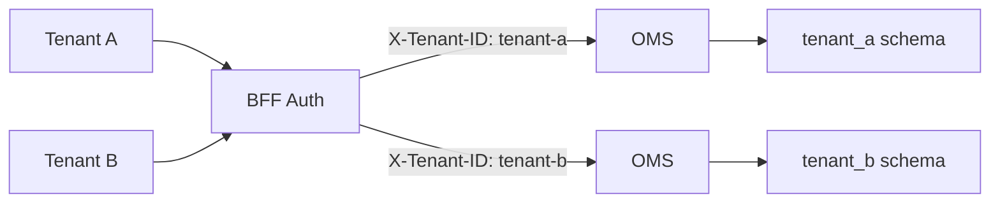

# 역할 기반 접근 제어(RBAC)

이 가이드는 플랫폼 관리자가 Spice OS에서 역할 기반 접근 제어(Role-Based Access Control, RBAC)를 구성하는 방법을 안내합니다. 인가 모델(Authorization Model)의 작동 방식, 사용자 및 역할 관리 방법, 특정 리소스에 대한 권한 범위 설정 방법을 학습합니다.

## 인가 모델(Authorization Model)

Spice OS는 계층화된 인가 모델을 사용합니다.


- **사용자(Users)** -- 인증 주체(Authentication Principal)로 식별됩니다 (JWT `sub` 클레임 또는 베어러 토큰)
- **역할(Roles)** -- 사용자에게 할당되는 권한의 집합입니다
- **권한(Permissions)** -- 허용되는 작업을 정의합니다
- **리소스(Resources)** -- 특정 온톨로지, 오브젝트 타입 또는 데이터셋으로 권한의 범위를 지정합니다

## 인증 전략(Authentication Strategies)

Spice OS는 여러 인증 방법을 지원하며, 각 방법은 인가 컨텍스트에 매핑됩니다.

| 전략 | 주체 소스(Principal Source) | 역할 소스(Roles Source) |
|------|---------------------------|------------------------|
| Bearer Token | `BFF_EXPECTED_TOKENS` 설정 | 토큰별 설정 |
| User JWT | JWT `sub` 클레임 | JWT `roles` 클레임 |
| Agent Token | 에이전트 도구 레지스트리 | 도구 정책 제한 |
| Admin Token | `X-Admin-Token` 헤더 | 전체 관리자 접근 |

자세한 인증 설정은 [인증 흐름 가이드](../integration-developer/auth-flow)를 참고하십시오.

## 내장 역할(Built-in Roles)

| 역할 | Read | Write | Delete | Admin | 사용 사례 |
|------|:----:|:-----:|:------:|:-----:|-----------|
| **Admin** | ✅ | ✅ | ✅ | ✅ | 플랫폼 관리자 |
| **Platform Admin** | ✅ | ✅ | ✅ | ✅ | 모든 플랫폼 API 스코프를 가진 슈퍼유저 |
| **Editor** | ✅ | ✅ | ✅ | -- | 데이터 엔지니어, 분석가 |
| **Viewer** | ✅ | -- | -- | -- | 읽기 전용 대시보드 사용자 |

### Admin 역할

모든 플랫폼 기능에 대한 전체 접근 권한을 가집니다.
- 온톨로지, 오브젝트 타입, 인스턴스의 생성/수정/삭제
- 연결, 파이프라인, 스케줄 관리
- 관리자 엔드포인트 접근 (사용자 관리, 설정)
- 감사 로그 및 리니지 데이터 조회

### Platform Admin 역할

Admin 역할의 상위 집합으로 모든 **플랫폼 API 스코프(Platform API Scopes)**가 부여됩니다. `platform_admin` 역할은 다음에 자동으로 할당됩니다.
- Admin 토큰 주체 (`X-Admin-Token` 헤더를 통해)
- Pytest 스코프 주체 (테스트 환경에서)
- Dev master auth 주체 (개발 환경에서)

### Editor 역할

데이터 작업에 대한 읽기 및 쓰기 접근 권한을 가집니다.
- 모든 온톨로지 데이터 및 메타데이터 읽기
- 오브젝트 인스턴스 생성, 편집 및 삭제
- 액션 실행 및 파이프라인 실행
- 관리자 엔드포인트에 접근할 수 없습니다

### Viewer 역할

읽기 전용 접근 권한을 가집니다.
- 오브젝트 목록 조회 및 검색
- 오브젝트 타입 정의 및 링크 타입 조회
- 대시보드 및 프로젝션 접근
- 데이터를 수정할 수 없습니다

## 권한 범위 설정(Permission Scoping)

세분화된 접근 제어를 위해 특정 리소스로 권한의 범위를 지정할 수 있습니다.

### 온톨로지 범위 설정(Ontology Scoping)

특정 온톨로지로 접근을 제한합니다.

```json
{
  "role": "editor",
  "scope": {
    "ontologies": ["acme-corp", "test-sandbox"]
  }
}
```

### 오브젝트 타입 범위 설정(Object Type Scoping)

온톨로지 내의 특정 오브젝트 타입으로 접근을 제한합니다.

```json
{
  "role": "editor",
  "scope": {
    "ontologies": ["acme-corp"],
    "objectTypes": ["Employee", "Department"]
  }
}
```

### 작업 범위 설정(Operation Scoping)

허용되는 작업을 제한합니다.

```json
{
  "role": "custom-reader",
  "scope": {
    "operations": ["read", "search"],
    "ontologies": ["acme-corp"]
  }
}
```

## 플랫폼 API 스코프(Platform API Scopes)

Spice OS는 v2 API 엔드포인트에 **OAuth 스타일 스코프**를 적용합니다. 스코프는 JWT `scope` 또는 `scp` 클레임에서 추출되며, `require_scopes` 의존성을 사용하여 엔드포인트 수준에서 검사됩니다.

| Scope | 접근 가능 대상 |
|-------|---------------|
| `api:datasets-read` | 데이터셋, 브랜치, 트랜잭션, 파일, 스키마 목록 조회/상세 조회 |
| `api:datasets-write` | 데이터셋, 브랜치, 트랜잭션 생성; 파일 업로드; 커밋 |
| `api:ontologies-read` | 온톨로지, 오브젝트 타입, 오브젝트, 링크 목록 조회/상세 조회, 검색 |
| `api:ontologies-write` | 오브젝트 타입 생성, 액션 실행, 배치 액션 적용 |
| `api:orchestration-read` | 빌드, 스케줄, 실행, 작업 목록 조회/상세 조회 |
| `api:orchestration-write` | 빌드 생성, 스케줄 생성/일시 중지/재개 |
| `api:connectivity-read` | 연결, 테이블/파일 임포트, 가상 테이블 목록 조회/상세 조회 |
| `api:connectivity-write` | 연결 및 임포트 생성/수정/삭제; 연결 테스트 |

주체에 필수 스코프가 없는 경우, API는 다음과 같이 응답합니다.

```json
{
  "errorCode": "PERMISSION_DENIED",
  "errorName": "ApiUsageDenied",
  "parameters": { "missingScope": "api:datasets-write" }
}
```

## 에이전트 도구 정책(Agent Tool Policies)

AI 에이전트 통합을 위해 Spice OS는 각 에이전트 도구가 접근할 수 있는 범위를 제한하는 세분화된 **도구 정책(Tool Policies)**을 제공합니다.

```json
{
  "tool_id": "data-analysis-agent",
  "allowed_methods": ["GET"],
  "allowed_path_patterns": ["/api/v2/ontologies/*/objects/*"],
  "allowed_dataset_ids": ["ri.spice.main.dataset.public-data"],
  "allowed_pipeline_ids": [],
  "allowed_ontology_ids": ["acme-corp"],
  "allowed_db_names": ["acme"],
  "allowed_branches": ["master"]
}
```

도구 정책은 다음을 적용합니다.
- **HTTP 메서드 제한** -- 읽기 전용 메서드로 제한합니다
- **경로 패턴 매칭(Path pattern matching)** -- 특정 API 경로만 허용합니다
- **리소스 허용 목록(Resource allowlists)** -- 특정 데이터셋, 파이프라인, 온톨로지로 제한합니다
- **브랜치 제한** -- 특정 데이터 브랜치로 제한합니다

## API 토큰 관리

### 베어러 토큰(Bearer Tokens)

환경 변수를 통해 API 토큰을 구성합니다.

```bash
# 쉼표로 구분된 유효한 토큰 목록
BFF_EXPECTED_TOKENS=token-for-service-a,token-for-service-b,token-for-dashboard
```

### 토큰 로테이션(Token Rotation)

다운타임 없이 토큰을 교체하는 방법은 다음과 같습니다.

1. 새 토큰을 목록에 추가합니다 (기존 토큰은 유지)
2. 모든 클라이언트를 새 토큰으로 업데이트합니다
3. 목록에서 기존 토큰을 제거합니다
4. BFF 서비스를 재시작합니다

### JWT 구성

JWT 기반 인증을 위한 설정입니다.

```bash
# HS256 대칭 키
JWT_SECRET=your-secret-key

# RSA 공개 키
JWT_RSA_PUBLIC_KEY=/path/to/public.pem

# OIDC/JWKS 디스커버리 (SSO에 권장)
JWT_JWKS_URL=https://your-idp.com/.well-known/jwks.json
```

## 멀티 테넌트 격리(Multi-Tenant Isolation)

Spice OS는 멀티 테넌트(Multi-Tenant) 배포를 지원합니다.

1. **테넌트 ID(Tenant ID)**는 JWT `tenant_id` 클레임에서 추출됩니다
2. 모든 데이터베이스 쿼리는 자동으로 해당 테넌트로 범위가 지정됩니다
3. 교차 테넌트 접근은 데이터 계층에서 방지됩니다
4. 테넌트 클레임이 없는 경우 기본 테넌트는 `"default"`입니다



## 감사 로깅(Audit Logging)

모든 인증 및 인가 이벤트가 로깅됩니다.

### 로깅되는 이벤트

| 이벤트 | 캡처되는 세부 정보 |
|--------|-------------------|
| 인증 성공 | 사용자 ID, 인증 전략, 타임스탬프 |
| 인증 실패 | 실패 사유, 토큰 유형, IP 주소 |
| 권한 거부 | 사용자 ID, 요청된 리소스, 필요한 권한 |
| 토큰 사용 | 토큰 식별자, 접근한 엔드포인트 |
| 에이전트 도구 접근 | 도구 ID, 세션 ID, 엔드포인트, 정책 평가 결과 |

### 감사 로그 조회

```bash
# BFF 인증 로그
docker compose logs bff | grep -i "auth"

# 사용자별 필터링
docker compose logs bff | grep "X-User-ID: user-123"
```

## SSO 통합

### OIDC/SAML 설정

1. **IdP 구성** (Okta, Auth0, Azure AD, Keycloak):
   - Spice OS 애플리케이션을 생성합니다
   - 콜백 URL을 BFF 서비스로 설정합니다
   - JWT 클레임에 `sub`, `roles`, `tenant_id`를 포함하도록 구성합니다

2. **BFF 구성**:
   ```bash
   JWT_JWKS_URL=https://your-idp.com/.well-known/jwks.json
   ```

3. **IdP 역할을 SPICE 역할로 매핑**:
   - IdP 그룹 `spice-admins` → SPICE 역할 `admin`
   - IdP 그룹 `spice-editors` → SPICE 역할 `editor`
   - IdP 그룹 `spice-viewers` → SPICE 역할 `viewer`

### JWT 클레임 요구사항

| Claim | 필수 여부 | 설명 |
|-------|-----------|------|
| `sub` | 필수 | 주체 식별자 (사용자 ID) |
| `roles` | 권장 | 역할 이름 배열 |
| `tenant_id` | 멀티 테넌트 시 필수 | 테넌트 격리 키 |
| `org_id` | 선택 | 조직 식별자 |
| `exp` | 필수 | 토큰 만료 시간 |

## 보안 모범 사례

1. **HTTPS 사용** -- 운영 환경에서는 항상 토큰 전송을 암호화합니다
2. **짧은 토큰 수명** -- JWT 만료를 15-60분으로 구성합니다
3. **정기적 토큰 교체** -- 베어러 토큰을 월간 일정으로 업데이트합니다
4. **최소 권한 범위** -- 필요한 최소한의 권한만 부여합니다
5. **정기적 감사** -- 인증 로그에서 이상 징후를 검토합니다
6. **Dev Master Auth 비활성화** -- 운영 환경에서 `DEV_MASTER_AUTH_ENABLED`가 설정되지 않았는지 확인합니다
7. **SSO에 JWKS 사용** -- 동적 키 디스커버리가 키 교체를 자동으로 처리합니다

## 사전 요구사항

- [API 개요](/docs/api/overview) -- 인증 메커니즘
- [설치 가이드](/docs/getting-started/installation) -- 관리자 서비스가 실행 중이어야 합니다

## 다음 단계

- **[인증 흐름 가이드](../integration-developer/auth-flow)** -- 상세한 인증 흐름
- **[서비스 모니터링](./service-monitoring)** -- 인증 관련 지표 모니터링
- **[설정 참고](/docs/reference/config)** -- 인증 환경 변수
