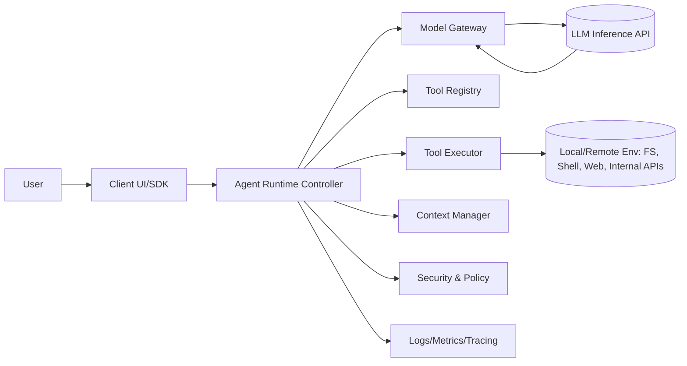
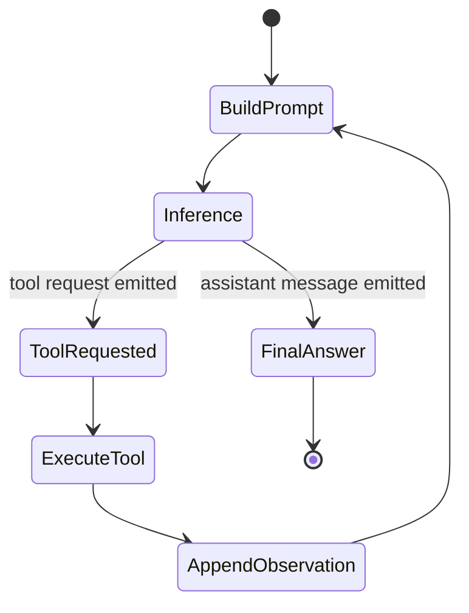

# Agent PRD: Natural Language Data ETL (Pipeline Agent)
	BuildPrompt → Inference → ToolRequested → ExecuteTool → AppendObservation → (다시 Inference) → FinalAnswer
이 문서는 “사용자 자연어 요청을 정확히 수행하는 데이터 ETL 에이전트”의 제품/기술 PRD입니다.
구현 상세/개발자 가이드는 `docs/PIPELINE_AGENT.md`를 우선 참고하세요.

---

## 1) 핵심 문제

기존 방식(LLM이 DSL/definition_json을 직접 생성)은 다음 문제가 반복됩니다.
- 구조 오류(노드/엣지/키 누락)로 컴파일 실패가 잦음
- 작은 변경이 필요한데도 전체 재생성(regen)으로 품질이 흔들림
- 사용자의 “범위”를 과하게 확장(overreach)해서 신뢰를 잃음

---

## 2) 목표(Goal) / 비목표(Non-goal)

### Goal
- 사용자가 어떤 요청을 하든 **의도를 정확히 반영**하고, 필요한 범위 내에서만 ETL 작업을 수행한다.
- 단순 요청은 단순하게(예: “null check만”) / 복잡 요청은 전략적으로(예: join+cast+aggregate+window 등).
- 실패 시 전체 재생성 대신 **부분 patch 기반 repair**로 안정적으로 복구한다.
- 데이터 안전: 샘플 기반 분석(PII 마스킹) + 결정론적 검증/가드레일.

### Non-goal (현재)
- “대규모 Spark build/deploy를 무승인으로 자동 실행”은 목표가 아니다(운영 정책/승인 게이트 필요).
- 온톨로지 자동 구축(무질문/무승인)은 목표가 아니다.

---

## 3) 핵심 철학: MCP = 도구, Agent = 단일 autonomous loop

### MCP: Tool provider
- LLM은 DSL 문자열을 직접 생성하지 않는다.
- 대신 LLM은 MCP 도구 호출로 plan을 조립/수정한다.
  - 예: `plan_add_join`, `plan_add_filter`, `plan_update_node_metadata`, `plan_delete_node`
- 도구(서버)는 노드/엣지/키 정합성과 금지 규칙을 **결정론적으로 강제**한다.

### Agent: Single autonomous loop runtime controller
- 오케스트레이터는 “여러 에이전트를 조율”하지 않는다.
- 한 요청(한 턴) 안에서 다음을 반복한다:
  - BuildPrompt → Inference → ToolRequested → ExecuteTool → AppendObservation → (다시 Inference) → FinalAnswer
- 서브 에이전트(각자 모델/컨텍스트/툴셋/메모리), 핸드오프, 라우팅/합성, 병렬 실행은 사용하지 않는다.

---

## 4) Overreach 방지(현재): LLM 지시 + 서버의 “무음 수정 금지”

현재 구현의 핵심은 “의미를 바꾸는 휴리스틱”을 제거하고, LLM이 도구 관측을 근거로 스스로 계획/수정하도록 하는 것입니다.

- 단순 요청(예: null check)은 분석 툴만 호출하고 종료(Plan 생성 금지).
- 복잡 요청(조인/집계/윈도우 등)은 plan-builder tools로 graph를 만들고 validate/preview 관측을 통과할 때까지 반복.
- 서버는 plan을 자동으로 고쳐서 통과시키지 않는다(무음 rewiring/auto-insert 금지).

---

## 5) 결정론적 분석(Profiler 확장): PK/FK/type inference

LLM이 조인 전략/키/타입을 “상상”하지 않도록 후보 공간을 결정론적으로 제공합니다.
- Context pack에서 제공:
  - PK 후보(`pk_candidates`)
  - FK 후보(`foreign_key_candidates`)
  - join key 후보(`join_key_candidates`, type/format/overlap 신호 포함)
- MCP 분석 툴 추가:
  - `context_pack_infer_keys`: PK/FK 후보를 planner-friendly 형태로 정리
  - `context_pack_infer_types`: 컬럼 타입 추론 + join-key 캐스트 제안
  - `context_pack_infer_join_plan`: 다중 데이터셋 join chain 후보(스패닝 트리) 제안

관련 코드:
- `backend/bff/services/pipeline_context_pack.py`
- `backend/shared/services/pipeline_type_inference.py`
- `backend/mcp/pipeline_mcp_server.py`

---

## 5.1) Claim-based Refutation Gate (반증기, witness 기반 Hard Gate)

핵심 원칙:
- Evaluator는 “정답 검증기(Verifier)”가 아니라 **반증기(Refuter)** 입니다.
- Hard Gate는 오직 **반례(witness)가 존재하는 명백한 오답**만 차단합니다.
- 반례를 못 찾았다고 “맞다”가 아닙니다. **PASS = not refuted** 입니다.

왜 필요한가:
- LLM에게 과도한 룰/휴리스틱을 강제하면 표현 다양성/모호성에서 오히려 품질이 떨어질 수 있습니다.
- 대신 LLM의 자유도를 유지하되, ETL 단계별 “명백한 사고(키 중복, 캐스팅 실패, 조인 다대다 폭발 전제 위반 등)”만 데이터 기반 반례로 잡아냅니다.

구현 방식(요약):
- Agent는 각 ETL 노드(특히 join/cast 등)에 대해 **claims**를 node.metadata에 선언할 수 있습니다.
- MCP 도구 `plan_refute_claims`가 claims를 읽고, 샘플 실행 결과에서 반례를 찾습니다.
- Hard failure가 나오면 Agent는 tool-call 기반으로 plan을 부분 patch하여 repair 루프로 복귀합니다.

Claim 예시(노드 메타데이터):
```json
{
  "claims": [
    {"id": "join_orders_customers_right_pk", "kind": "JOIN_ASSUMES_RIGHT_PK", "severity": "HARD"},
    {"id": "join_orders_customers_n_to_1", "kind": "JOIN_FUNCTIONAL_RIGHT", "severity": "HARD"},
    {"id": "cast_order_id_parse", "kind": "CAST_SUCCESS", "severity": "HARD", "spec": {"columns": ["order_id"]}},
    {"id": "filter_only_nulls_customer_id", "kind": "FILTER_ONLY_NULLS", "severity": "HARD", "spec": {"column": "customer_id"}},
    {"id": "union_lossless_stage", "kind": "UNION_ROW_LOSSLESS", "severity": "HARD"}
  ]
}
```

주의(샘플 기반의 “비가역성/부정확성”):
- PK 중복/NULL/캐스팅 실패/조인 다대다 등은 “샘플에서 발견되면 실제로 존재”하므로 **반례 기반 Hard Gate가 가능**합니다.
- FK orphan은 “부모 샘플에 없다”가 “전체에 없다”를 의미하지 않으므로, 현재는 **SOFT로만 처리**합니다(향후 full-scan membership oracle이 있으면 HARD 승격 가능).

관련 코드:
- Refuter: `backend/shared/services/pipeline_claim_refuter.py`
- MCP tool: `backend/mcp/pipeline_mcp_server.py` (`plan_refute_claims`)
- Finish-time gate(자동): `backend/bff/services/pipeline_agent_autonomous_loop.py`

---

## 6) Plan Builder Tools (MCP) + 부분 Repair(패치)

### Plan build
- LLM은 도구 호출 step 리스트를 생성하고, 서버가 순서대로 적용하여 `PipelinePlan`을 만든다.
- 도구는 “구조적으로 유효한 plan”만 생성하도록 설계한다(노드/엣지/키/중복 방지).

### Repair(부분 수정)
- 실패 시 “전체 재생성” 대신 patch/delete/rewire를 먼저 시도한다.
- 최소 변경으로 성공률/일관성을 높인다.

관련 코드:
- `backend/shared/services/pipeline_plan_builder.py`
- `backend/mcp/pipeline_mcp_server.py`
- `backend/bff/services/pipeline_plan_autonomous_compiler.py`
- `backend/bff/services/pipeline_plan_models.py`
- `backend/bff/services/pipeline_agent_autonomous_loop.py`

추가 원칙(엔터프라이즈 관점):
- compiler/validator는 plan을 **무음으로 보정하지 않는다**(의미 변형/디버깅 난이도 증가 방지).
- output 누락/중복, join wiring 오류 등은 `validation_errors`로 표면화하고, LLM이 repair(tool-call)로 명시적으로 수정한다.

---

## 7) 실행 단위(현재): single autonomous loop

Pipeline Agent는 역할 분해 그래프 대신, 단일 루프가 필요한 도구만 호출하며 종료합니다.

핵심 원칙:
- 단순 요청(리포트)은 plan을 만들지 않는다.
- 복잡 요청은 분석 → plan build → validate/preview → patch(수정) 반복으로 끝까지 간다.

---

## 8) Clarification(재질문) 정책

금지:
- 룰 기반 하드코딩 질문 문구(예: “범위를 확장해도 되나요?” 같은 템플릿 고정 질문)

허용:
- LLM이 현재 관측(도구 결과/오류)을 근거로 “필요한 질문”을 직접 생성(`action=clarify`)

---

## 9) Rollout: feature flags

- `PIPELINE_PLAN_LLM_ENABLED` (planner/agent on/off)
- 기본 모델은 `LLM_MODEL`로 제어(권장: `gpt-5`)

---

## 10) Acceptance test 시나리오(우선순위)

### A. 단순 리포트 요청은 “리포트만”
- 입력: CSV 1개
- 요청: “null check 해줘”
- 기대: context pack 기반 null report만 반환, plan compile/transform/repair/spec 생성 금지

### B. 복잡 통합 요청은 “전략적으로”
- 입력: CSV 6개
- 요청: “최적으로 join 전략 짜서 온톨로지에 맵핑 준비까지 해줘”
- 기대:
  - PK/FK 후보 + 타입/캐스트 제안을 활용해 join chain 구성
  - join 품질 평가(coverage/explosion) 후 필요 시 1회 revise
  - cleansing/type cast를 최소 범위로 적용
  - object/link 분류 및 spec 생성(사용자가 명시적으로 mapping을 요청한 경우에만)

### C. 실패 시 부분 repair로 복구
- 입력: join key mismatch, missing columns 등 실패 조건
- 기대: `plan_update_node_metadata`/`plan_set_node_inputs`/`plan_delete_node` 등으로 최소 수정 후 재시도

---

## 11) 주요 코드 레퍼런스

- Pipeline Agent entrypoint: `backend/bff/routers/agent_proxy.py` (`POST /api/v1/agent/pipeline-runs`)
- Pipeline Agent loop runtime: `backend/bff/services/pipeline_agent_autonomous_loop.py`
- Pipeline Plans API: `backend/bff/routers/pipeline_plans.py`
- Plan validation/preflight: `backend/bff/services/pipeline_plan_validation.py`
- Context pack + join/pk/fk 후보: `backend/bff/services/pipeline_context_pack.py`
- Pipeline MCP server: `backend/mcp/pipeline_mcp_server.py`

---

## Appendix A) Agent Runtime Architecture (AGENT-RUNTIME-ARCH-001)

에이전트 런타임 기술 문서 (단일 에이전트 루프: single autonomous loop + tools)

- 문서 ID: AGENT-RUNTIME-ARCH-001
- 버전: v1.0 (초안)
- 최종 수정: 2026-01-24 (KST)
- 대상 독자: 백엔드/플랫폼/클라이언트 엔지니어, 보안 담당, 프로덕트 엔지니어
- 범위: LLM 기반 에이전트 기능의 아키텍처, 핵심 컴포넌트, 작동 원리(루프), 성능/보안/컨텍스트 관리

---

1. 목적 및 설계 원칙

1.1 목적

본 문서는 LLM 기반 에이전트 기능을 제품/플랫폼에 내장하기 위한 표준 실행 루프(Agent Loop) 와 이를 뒷받침하는 프롬프트 구성, 도구 호출, 스트리밍 처리, 성능 최적화, 컨텍스트 윈도우 관리(압축), 보안/권한 체계를 기술합니다.

1.2 설계 원칙(근거 포함)
	1.	반복 가능한 루프(Deterministic Loop Skeleton)
	•	에이전트는 “추론 → 도구 호출 → 관측 → 재추론”을 반복합니다.
	•	이 구조가 필요한 이유: LLM 단독 출력만으로는 외부 상태(파일, DB, 웹, 사내 API 등)를 확정적으로 알 수 없고, 도구 실행 결과를 관측으로 반영해야 정확도가 올라갑니다.
	2.	프롬프트는 ‘아이템 리스트’로 관리
	•	메시지/추론 요약/도구 호출/도구 결과/압축 상태 등 타입이 다른 항목을 한 컨테이너로 다루는 편이, 멀티턴과 툴 반복을 안정적으로 확장합니다.
	3.	성능은 “모델 샘플링 비용”이 지배
	•	네트워크 JSON 크기 최적화보다 추론 재사용(캐시), 정적 프롬프트의 접두(prefix) 안정화가 더 큰 효과를 주는 구조가 일반적입니다.
	4.	컨텍스트 윈도우는 ‘소모 자원’
	•	루프가 길어질수록 입력이 누적되어 컨텍스트 한도를 초과합니다.
	•	따라서 토큰 수 추정, 자동 압축(compaction) 전략이 “필수 런타임 책임”입니다.
	5.	보안은 “도구 경계”에서 강제
	•	모델은 신뢰할 수 있는 실행 주체가 아닙니다.
	•	파일/네트워크/프로세스 실행 등 위험도가 있는 작업은 런타임이 권한·샌드박스·감사 로그로 통제해야 합니다.

---

2. 용어 정의
	•	Turn(턴): 사용자가 메시지를 보낸 시점부터, 에이전트가 최종 사용자 응답(assistant message)을 반환하기까지의 단위.
	•	Iteration(반복/스텝): 한 턴 안에서 “추론 → 도구 호출 → 결과 반영”이 1회 수행되는 단위.
	•	Thread(스레드/대화): 여러 턴이 누적되는 대화 컨텍스트.
	•	Prompt Item(프롬프트 아이템): 입력 컨텍스트를 구성하는 단위 객체(예: message, tool_call, tool_output, reasoning_summary, compaction 등).
	•	Tool Call(도구 호출): 모델이 특정 도구 실행을 요청하는 구조화된 출력.
	•	Observation(관측): 도구 실행 결과를 프롬프트에 다시 주입한 항목.
	•	Context Window(컨텍스트 윈도우): 모델이 한 번의 추론에서 사용할 수 있는 최대 토큰(입력+출력).
	•	Compaction(압축): 컨텍스트 한도 관리를 위해 이전 대화를 요약/축약하고, 필요 시 “잠재 상태(opaque state)”를 보존하는 작업.
	•	Prompt Cache(프롬프트 캐시): 동일한 접두(prefix)가 재사용될 때 모델 추론 계산을 재사용해 비용을 절감하는 메커니즘(제공자/서버 구현에 의존).

---

3. 시스템 아키텍처 개요

3.1 구성 요소
	1.	Client (UI/CLI/SDK)
	•	사용자 입력 수집, 스트리밍 출력 렌더링
	•	(선택) 로컬 환경 정보 제공(cwd, shell, 프로젝트 메타)
	2.	Agent Runtime Controller (오케스트레이터)
	•	역할: “멀티 에이전트 매니저”가 아니라 단일 루프 런타임 컨트롤러(추론 호출/툴 실행/관측 주입/종료 판단)
	•	입력 아이템 리스트 관리(대화 상태)
	•	모델 추론 요청 생성
	•	도구 호출 감지 → 실행 위임 → 관측 주입
	•	종료 조건(assistant message) 판단
	3.	Model Gateway (모델 추론 게이트웨이)
	•	특정 제공자의 추론 API로 요청/응답 변환
	•	스트리밍(SSE 등) 이벤트를 내부 이벤트로 정규화
	4.	Tool Registry (도구 레지스트리)
	•	사용 가능한 도구 스키마 목록 관리
	•	내장 도구(예: shell, file ops, plan update) + 플러그인 도구(사내/외부 서버)
	5.	Tool Executor (도구 실행기)
	•	도구 호출 실행 및 결과 표준화
	•	샌드박스/권한/감사 로깅 적용 지점
	6.	Context Manager (컨텍스트 매니저)
	•	토큰 사용량 추정
	•	자동 압축 트리거/실행
	•	“정적 접두 유지” 정책 적용(캐시 효율)
	7.	Security & Policy Engine
	•	파일 쓰기 허용 경로, 네트워크 접근, 승인 모드(자동/수동) 등 정책 적용
	•	도구별 가드레일 분리(내장 샌드박스 vs 외부 도구 자체 정책)
	8.	Observability (로깅/메트릭/트레이싱)
	•	턴/스텝/도구 호출 단위의 구조화 로그
	•	비용/지연/에러율 모니터링

3.2 아키텍처 다이어그램(개념)



---

4. 에이전트 실행 루프(Agent Loop) 작동 원리

4.1 루프의 핵심: “모델이 답을 내거나, 도구를 요청한다”

에이전트 런타임의 기본 동작은 다음 중 하나로 수렴합니다.
	•	종료(termination): 모델이 최종 사용자 메시지(assistant message)를 출력 → 턴 종료
	•	지속(iterate): 모델이 도구 호출(tool_call)을 출력 → 런타임이 도구 실행 → 결과를 관측으로 주입 → 재추론

4.2 상태 머신(턴 내부)



4.3 런타임 컨트롤러 의사코드(정확한 구현 골격)

중요: 아래는 “단일 에이전트 루프”의 골격이며, 멀티 에이전트(서브에이전트/핸드오프/라우터/합성/병렬 실행)는 금지합니다.

### Option A) Native tool calling(streaming tool_call) 패턴
(일부 제공자/모델/SDK에서 지원)

```text
items = initial_items() + [user_message_item]

loop:
  payload = {
    instructions: system/developer instructions,
    tools: tool_definitions,
    input: items
  }

  stream = model_gateway.infer(payload, streaming=true)

  tool_call = null
  assistant_text = ""

  for event in stream:
    if event.type == OUTPUT_TEXT_DELTA:
      client.stream(event.delta)
      assistant_text += event.delta

    if event.type == OUTPUT_ITEM_ADDED && event.item.type == TOOL_CALL:
      tool_call = event.item

    if event.type == COMPLETED:
      break

  if tool_call != null:
    tool_result = tool_executor.run(tool_call)
    items.append(tool_call)
    items.append(make_tool_output(tool_call.call_id, tool_result))
    continue

  else:
    items.append(make_assistant_message(assistant_text))
    return assistant_text
```

### Option B) Decision JSON 패턴 (현재 SPICE Pipeline Agent에서 사용)
모델이 매 스텝 “다음 액션”을 JSON으로 선택하고, 런타임이 MCP 도구를 실행해 관측을 주입합니다.

```text
state = {
  goal, data_scope,
  context_pack (server-side), plan (server-side),
  last_observation (compact)
}

loop:
  snapshot = build_compact_snapshot(state)  # large objects are summarized
  decision = model.complete_json(system_prompt, snapshot, schema=Decision)

  if decision.action == "call_tool":
    # Execute deterministic tool (MCP). Never trust model-provided large objects.
    tool_result = tool_executor.call(decision.tool, decision.args, server_side_state=state)
    state.last_observation = compact(tool_result)
    continue

  if decision.action == "finish":
    # Valid output must be either:
    # - report-only (analysis), OR
    # - a validated plan (has outputs) persisted to registry
    return final_payload

  if decision.action == "clarify":
    # Only for missing external inputs (dataset/db/ambiguous columns, etc).
    # Never ask to increase internal step/tool-call limits.
    return questions
```

왜 이 구조인가?
	•	도구 호출이 발생하면 “현재 출력”은 최종 답이 아닙니다. 도구 결과를 관측으로 넣지 않으면 모델은 같은 추론을 반복하거나, 환각 가능성이 상승합니다.
	•	스트리밍 출력은 UI 품질을 올리지만, 도구 호출 감지 시점을 명확히 처리해야 합니다(도구 호출이 늦게 도착할 수 있음).

---

5. 프롬프트(입력 컨텍스트) 구성 규칙

5.1 역할(role) 우선순위

프롬프트 아이템 중 메시지 타입은 일반적으로 역할 우선순위를 갖습니다(가중치/우선 적용 관점).
	•	system > developer > user > assistant (높음 → 낮음)

설계 근거
	•	상위 역할은 안전/정책/제품 규칙(절대 준수)을 담고, 하위 역할은 대화 내 맥락(상대적으로 가변)을 담는 편이 유지보수와 통제에 유리합니다.

5.2 초기 입력 아이템(권장 템플릿)

초기 턴의 input 리스트는 대략 아래 구성을 권장합니다(정적 → 가변 순서).
	1.	Developer Message: Permissions/Sandbox 정책 설명
	•	파일 권한, 네트워크 접근, 승인 모드, 쓰기 허용 경로(allowlist) 등
	2.	(옵션) Developer Message: 제품/프로젝트별 개발자 지침
	•	예: 코드 스타일, 브랜치 전략, 보안 규칙, 출력 포맷
	3.	(옵션) User Message: 프로젝트/조직 지침 묶음
	•	예: AGENTS.md 같은 프로젝트 문서, 스킬 메타데이터 등(사내 룰/도메인 지식)
	4.	User Message: 환경 컨텍스트(environment_context)
	•	현재 작업 디렉토리, 셸/런타임, 리포지토리 루트, OS 등
	5.	User Message: 실제 사용자 요청

핵심은 “정적 정보는 앞에, 변동 정보는 뒤에”입니다.
	•	이유: 프롬프트 캐시가 “정확한 접두(prefix) 일치”에서만 작동하는 구현이 많습니다. 정적 내용을 앞에 두면, 턴/스텝이 반복되어도 앞부분이 동일하게 유지되어 캐시 히트 확률이 상승합니다.

5.3 프롬프트 아이템 타입(내부 표준 스키마 제안)
	•	message: role + content(텍스트/이미지/파일)
	•	reasoning_summary: 모델의 내부 요약(선택, 저장/표시 정책 필요)
	•	tool_call: name + arguments(JSON 문자열) + call_id
	•	tool_output: call_id + output(텍스트/구조화)
	•	compaction: encrypted_content(opaque) + summary(선택)

설계 근거
	•	“도구 호출”과 “도구 결과”를 메시지로 뭉개면, 멀티턴/디버깅/재현성이 급격히 악화합니다. 타입 분리는 런타임의 안정성을 올립니다.

---

6. 도구 호출(Tool Call) 프로토콜

6.1 도구 정의(Registry)

도구는 모델이 호출할 수 있도록 스키마(함수 시그니처) 로 제공되어야 합니다.

권장 필드:
	•	type: function / web_search / …
	•	name
	•	description
	•	parameters: JSON Schema(Object, required 등)
	•	strict: 입력 검증 강도(가능하면 런타임에서 강제 검증 권장)

6.2 도구 호출 실행 규칙
	1.	모델이 tool_call을 출력하면 오케스트레이터는 해당 도구를 레지스트리에서 조회합니다.
	2.	arguments를 JSON 파싱 및 스키마 검증합니다.
	3.	실행 전 권한 정책을 평가합니다(예: 파일 쓰기, 프로세스 실행, 네트워크).
	4.	실행 후 결과를 tool_output으로 표준화해 input 리스트에 append합니다.
	5.	append 후 재추론합니다.

왜 “append”인가?
	•	이전 프롬프트를 수정하면 접두(prefix)가 깨져 캐시 효율이 떨어지고, 재현성(디버깅)도 악화합니다.
	•	“과거는 불변, 현재는 추가” 모델이 안정적입니다.

6.3 샌드박스 책임 분리
	•	내장 도구(로컬 실행/파일 조작 등): 런타임 샌드박스/권한 시스템이 강제
	•	외부 도구(플러그인 서버, 사내 API 게이트웨이 등): 각 도구 제공자가 자체 가드레일을 강제
	•	단, 런타임도 최소한의 호출 전 정책(예: 데이터 유출 위험, 민감 리소스 접근) 을 적용하는 것이 안전합니다.

---

7. 스트리밍(Streaming) 이벤트 처리

7.1 이벤트 정규화가 필요한 이유

모델 제공자는 스트리밍에서 다양한 이벤트 타입(텍스트 델타, 아이템 추가/완료, 최종 완료 등)을 흘려보냅니다. 클라이언트/오케스트레이터가 이를 직접 다루면 결합도가 상승하므로, 게이트웨이에서 내부 이벤트로 정규화하는 것이 바람직합니다.

7.2 런타임이 최소 처리해야 할 이벤트
	•	output_text.delta: UI 스트리밍
	•	output_text.done: 해당 출력 종료
	•	output_item.added/done: tool_call 등 구조화 출력 수집
	•	completed: 한 번의 추론 호출 완료

주의 사항(실전 이슈)
	•	텍스트 델타가 먼저 오고, tool_call 아이템이 뒤늦게 올 수 있습니다.
	•	따라서 “텍스트가 나오니 최종 답”으로 단정하면 오작동합니다. completed 또는 “도구 호출 없음 확정” 조건이 필요합니다.

---

8. 멀티턴 대화(스레드) 관리

8.1 멀티턴 원리

새 턴이 시작될 때, 이전 턴의 assistant message 및 모든 도구 호출/결과가 input 리스트에 누적됩니다.
즉, 대화가 길어질수록 입력이 증가합니다.

8.2 상태 저장 방식 선택지
	1.	완전 무상태(stateless) 요청
	•	매 호출마다 input 리스트 전체를 전송
	•	장점: 서버 측 저장 불필요, 데이터 보관 최소화 정책과 궁합 좋음
	•	단점: 요청 페이로드가 커지고, (단순 관점에서) 누적 전송량은 커짐
	2.	서버 상태 참조(stateful reference)
	•	“이전 응답 ID” 같은 핸들을 보내 서버가 과거 컨텍스트를 재사용
	•	장점: 네트워크 전송량 절감
	•	단점: 서버 저장/정책/보관 기간 관리 필요, 특정 보안 요구사항과 충돌 가능

권장 판단 기준
	•	보안/규정/데이터 보관 요구가 강하면 무상태를 우선 고려하고, 성능은 캐시/압축으로 보완합니다.
	•	내부망·사내 모델처럼 보관이 허용되고 비용이 큰 환경이면 상태 참조를 고려합니다.

---

9. 성능 설계: 캐시, 접두 안정화, 구성 변경 처리

9.1 프롬프트 캐시 최적화 핵심

캐시가 가능한 구현은 대부분 “정확한 접두(prefix) 일치” 에서만 히트합니다. 따라서 런타임이 해야 할 일은 단순합니다.
	•	정적 항목(정책/지침/도구 목록/예시)은 앞에 고정
	•	가변 항목(사용자 입력/도구 결과/새 메시지)은 뒤에 append
	•	중간 항목 수정 금지(가능하면 append로 표현)

9.2 캐시 미스 유발 요인(대표)
	•	대화 중간에 도구 목록 변경(특히 순서가 비결정적일 때)
	•	모델 변경(모델별 기본 지침이 달라져 접두가 변함)
	•	샌드박스/승인 모드 변경
	•	작업 디렉토리(cwd) 변경을 “기존 메시지 수정”으로 처리

9.3 구성 변경을 append로 표현(권장 패턴)
	•	샌드박스/승인 모드 변경 → 새로운 developer message로 “현재 정책”을 추가
	•	cwd 변경 → 새로운 user message로 <environment_context>를 추가

왜 이렇게까지 하는가?
	•	접두가 유지되어 캐시가 살고, 로그/감사/재현성 측면에서 “언제 정책이 바뀌었는지”가 명확해집니다.

---

10. 컨텍스트 윈도우 관리: 자동 압축(Compaction)

10.1 문제

도구 호출이 많거나 멀티턴이 길어지면 input 토큰이 증가해 컨텍스트 한도에 도달합니다. 이때 에이전트는 아래 중 하나로 실패합니다.
	•	모델 호출 실패(한도 초과)
	•	중요한 지시/맥락이 잘려 성능 급락
	•	불필요한 반복/도구 호출 폭주

10.2 해결 전략(권장)
	1.	토큰 사용량 추정기
	•	매 스텝마다 “현재 입력 토큰 + 예상 출력 토큰”을 추정
	2.	자동 압축 트리거
	•	임계치(auto_compact_limit) 초과 시 압축 수행
	3.	압축 결과 형태
	•	(a) 요약 메시지(사람이 읽을 수 있는 summary)
	•	(b) opaque 상태(encrypted_content 등) — 모델 제공자가 지원하는 경우, 이전 대화의 잠재 이해를 보존

10.3 압축 구현 옵션
	•	요약 기반 축약(보편적): 오래된 메시지/도구 로그를 요약해 핵심만 유지
	•	전용 압축 엔드포인트 사용(가능 시): 제공자가 더 효율적인 내부 표현을 반환할 수 있음

설계 근거
	•	단순 요약만으로는 세부 제약(파일 경로, 변수명, API 파라미터)을 잃기 쉽습니다.
	•	opaque 상태 보존을 지원한다면, “요약의 손실”을 완화할 수 있습니다.

10.4 압축 시 유지해야 할 정보(최소 세트)
	•	사용자 목표/성공 기준
	•	현재 계획/진행 상태(남은 할 일)
	•	중요한 제약(보안/정책/금지 사항)
	•	도구 실행으로 인해 바뀐 환경 상태(파일 생성/수정 결과, 배포 상태 등)
	•	최근 에러와 원인(재발 방지)

---

11. 보안·권한·감사(필수)

11.1 위협 모델(간단 정리)
	•	모델 출력은 신뢰할 수 없고, 프롬프트 인젝션을 포함할 수 있습니다.
	•	도구 실행이 가능한 순간, 시스템은 “원격 명령 실행기”가 될 수 있습니다.

11.2 필수 통제 지점
	1.	도구별 권한 정책
	•	예: shell 실행은 사용자 승인 필요
	•	예: 파일 쓰기는 allowlist 경로만
	•	예: 네트워크는 기본 차단 후 예외 허용
	2.	인자 검증
	•	JSON Schema 검증 + 길이 제한 + 금칙 패턴(경로 traversal 등)
	3.	감사 로그
	•	누가/언제/어떤 입력으로/어떤 도구를 호출했고/무슨 결과가 나왔는지
	4.	비밀정보 보호
	•	토큰/키/개인정보는 도구 결과에 섞일 수 있으므로 마스킹/레드액션 전략 필요

---

12. 확장성: 플러그인 도구(외부 서버) 설계

12.1 플러그인 도구가 필요한 이유
	•	사내 시스템(결제, CRM, 티켓, 배포) 연동은 내장 도구로 끝나지 않습니다.
	•	도구를 분리하면 배포/권한/감사를 독립적으로 운영할 수 있습니다.

12.2 런타임 요구사항
	•	도구 목록 조회 및 스키마 캐시
	•	도구 순서 결정(정렬 규칙 고정) → 캐시 미스 방지
	•	도구 목록 변경 알림을 즉시 반영할지 여부 정책화
	•	즉시 반영은 캐시 미스 유발 가능
	•	권장: 턴 경계에서 반영 또는 “도구 변경 이벤트”를 별도 append 메시지로 기록

---

13. 장애/예외 처리 표준

13.1 도구 실행 실패
	•	도구 실패는 숨기지 말고 tool_output에 오류를 구조화해 반환
	•	모델이 재시도/대안 선택을 할 수 있도록 오류 코드를 표준화

예:
	•	TOOL_TIMEOUT, TOOL_PERMISSION_DENIED, TOOL_INVALID_ARGS, TOOL_RUNTIME_ERROR

13.2 재시도 정책(권장)
	•	네트워크/일시 오류는 제한적 재시도(지수 백오프)
	•	부작용이 있는 도구(배포, 결제)는 기본 재시도 금지 또는 멱등 키(idempotency key) 필수

---

14. 관측성(Observability) 체크리스트
	•	Turn ID / Step ID / Call ID 상관관계 부여
	•	모델 호출 지연, 토큰 사용량(입력/출력), 비용 추정
	•	도구 실행 시간, 성공률, 오류 분포
	•	압축 발생 횟수/압축 후 성능(도구 호출 수, 재시도율)

왜 필요한가?
	•	에이전트는 비결정적 요소가 있어 “현상 재현”이 어렵습니다.
	•	구조화 로그와 상관관계 ID가 없으면 운영이 불가능합니다.

---

15. 구현 체크리스트(바로 적용 가능한 수준)

15.1 오케스트레이터
	•	input 아이템 리스트를 append-only로 관리
	•	스트리밍 이벤트 파서/정규화
	•	tool_call 감지 및 실행 분기
	•	종료 조건: “도구 호출 없음 + 최종 메시지 완료”로 판정

15.2 도구 시스템
	•	JSON Schema 기반 인자 검증
	•	정책 엔진 연동(승인/경로/네트워크)
	•	결과 표준화(성공/실패 구조)
	•	감사를 위한 로깅

15.3 컨텍스트 매니저
	•	토큰 추정
	•	자동 압축 트리거
	•	압축 후에도 목표/제약/상태가 유지되는지 테스트

15.4 성능
	•	정적 접두 고정(정책/지침/도구 정의 순서 고정)
	•	구성 변경은 메시지 append로 표현
	•	도구 목록 순서 결정 규칙 고정(알파벳 정렬 등)

---

부록 A. 입력 아이템 예시(자체 포맷)

[
  {
    "type": "message",
    "role": "developer",
    "content": [
      { "type": "input_text", "text": "<permissions>\n- filesystem: write allowed: /workspace\n- network: disabled by default\n- approval: required for shell\n</permissions>" }
    ]
  },
  {
    "type": "message",
    "role": "user",
    "content": [
      { "type": "input_text", "text": "<environment_context>\n<cwd>/workspace/project</cwd>\n<shell>zsh</shell>\n</environment_context>" }
    ]
  },
  {
    "type": "message",
    "role": "user",
    "content": [
      { "type": "input_text", "text": "README에 아키텍처 다이어그램을 추가해줘." }
    ]
  }
]


---

부록 B. 도구 호출/관측 예시(자체 포맷)

{
  "type": "tool_call",
  "name": "shell",
  "arguments": "{\"command\": [\"cat\", \"README.md\"], \"workdir\": \"/workspace/project\"}",
  "call_id": "call_001"
}

{
  "type": "tool_output",
  "call_id": "call_001",
  "output": "....(README content)...."
}


---

결론(핵심만 정리)
	•	에이전트 기능의 본질은 루프입니다: 추론 → 도구 → 관측 → 재추론 → 종료 메시지.
	•	안정적인 제품화를 위해 런타임은 반드시 (1) 프롬프트 아이템 관리, (2) 도구 호출 프로토콜, (3) 스트리밍 이벤트 처리, (4) 캐시 친화적 접두 안정화, (5) 컨텍스트 압축, (6) 보안/권한/감사를 책임져야 합니다.
	•	특히 “과거 프롬프트를 수정하지 않고 append-only로 누적”하는 규칙은 성능(캐시), 재현성(디버깅), 감사(보안) 3가지 측면에서 동시에 유리합니다.
