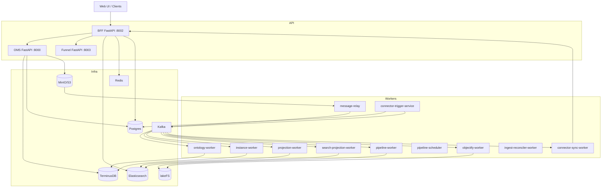
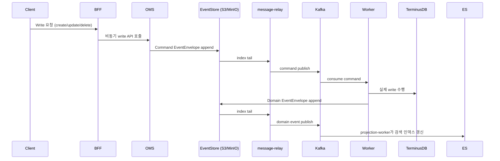

# SPICE HARVESTER — Architecture (Current, Code-Backed)

> - 기준: 코드 + docker-compose.full.yml
> - 범위: Backend + Infra + Control/Data plane + Event Sourcing
> - 상태: 현재 구현된 구성요소/계약 중심으로 정리

## 0) TL;DR

- **BFF가 유일한 프론트 API 계약**이며 OMS/Funnel/Workers로 라우팅한다.
- **Event Store(S3/MinIO)가 Write SSoT**이고, Kafka는 transport다.
- **Control Plane은 Postgres**(proposal/approval/deploy/registry/outbox/processed_event_registry).
- **Ontology 정의는 TerminusDB**, 데이터 아티팩트는 **lakeFS + MinIO**, 검색은 **Elasticsearch**.
- **Outbox + Reconciler**로 dataset/objectify 등의 내구성을 확보한다.

---

## 1) 서비스 토폴로지

**Note**: BFF 내부에서 `dataset_ingest_outbox_worker`와 `objectify_outbox_worker`가 함께 실행된다.

---

## 2) Event Sourcing Write Flow (실제 코드 기준)

핵심 포인트:
- **Event Store가 유일한 SSoT**이며, Kafka는 transport로만 사용된다.
- **ProcessedEventRegistry(Postgres)**로 worker idempotency + ordering 보장.
- **CommandStatusService(Redis)**가 async write 상태/결과를 추적.

---

## 3) 저장소/인프라 역할 (SSoT 분리)

| 저장소 | 역할 | SSoT 여부 |
|---|---|---|
| **S3/MinIO (Event Store)** | Command + Domain 이벤트 로그 (immutable) | Write SSoT |
| **TerminusDB** | Ontology 정의 + 버전/브랜치 | Definition SSoT |
| **Postgres** | registry/outbox/proposal/health/processed_event_registry | Control Plane SSoT |
| **lakeFS + MinIO** | dataset/artifact 버전 관리 | Data plane SSoT |
| **Elasticsearch** | CQRS read model/projection | Read cache |
| **Redis** | command status, cache, websocket, rate limit | 보조 |

---

## 4) Control Plane (Proposal/Approval/Deploy/Health)

### 4.1 Proposal/Approval

- **Pull Request 서비스**가 Postgres(MVCC)로 proposal 상태를 관리.
- 보호된 브랜치에서 direct write는 `409`로 차단된다.

### 4.2 Deploy

- `deployments_v2`에 `ontology_commit_id`, `snapshot_rid`, `gate_policy`, `health_summary` 고정.
- **deploy outbox**가 후속 작업(캐시/알림/프로젝션)을 분리 처리.

### 4.3 Health Gate

- Linter + 관계 검증 결과를 Postgres에 기록.
- 동일 commit/policy 조합은 dedupe 가능.

---

## 5) Data Plane (Dataset / Pipeline / Objectify)

### 5.1 Dataset Ingest

- BFF에서 CSV/Excel/Media 업로드 처리.
- **Idempotency Key 필수**: 동일 payload 재시도 시 중복 방지.
- 업로드 → lakeFS commit → dataset registry 기록 → **outbox 발행** → (event store + lineage 기록).

### 5.2 Pipeline Build/Deploy

- `pipeline-worker`가 Spark 기반 빌드 실행.
- build/preview 결과는 **PipelineRegistry**에 기록.
- Deploy 시 lakeFS merge + dataset version 등록 + lineage 기록.

### 5.3 Objectify

- Mapping spec + dataset version 기준으로 bulk instance 생성.
- Objectify outbox + reconciler로 내구성 확보.

---

## 6) Connector Flow (Google Sheets)

- `connector_trigger_service`가 polling / cursor 변경을 감지.
- 변경 사항은 Kafka 이벤트로 publish.
- `connector_sync_worker`가 BFF를 호출하여 ingest 파이프라인 실행.
- Connector sources + mappings + sync state는 **ConnectorRegistry(Postgres)**에 저장.

---

## 7) Read/Query Path

- **Elasticsearch projection**이 기본 조회 경로.
- ES 장애 시 OMS/TerminusDB로 **fallback**한다.
- Graph query는 WOQL 기반 schema traversal + ES document fetch를 결합한다.

---

## 8) Consistency & Idempotency

- `AggregateSequenceAllocator` (Postgres)로 **expected_seq** 보장.
- `ProcessedEventRegistry`로 worker idempotency + ordering 보장.
- Event Store는 **event_id 기반 idempotency**를 제공.
- Kafka producer는 idempotent 설정으로 retry 안전성을 높인다.

---

## 9) Observability & Security

- Prometheus metrics + OpenTelemetry tracing.
- Error normalization (`shared/errors/error_response.py`).
- Input sanitizer로 SQL/XSS/NoSQL 주입 차단.
- Rate limiting (Redis token bucket + local fallback).
- `/api/v1/monitoring`, `/api/v1/config` 로 상태/설정 모니터링 제공.

---

## 10) Runtime / Local

- 권장 실행: `docker-compose.full.yml`.
- 구성 요소: terminusdb, postgres, kafka, minio, lakefs, bff, oms, funnel, workers.

---

## 11) 코드 네비게이션

- `backend/bff/` : API contract + aggregation
- `backend/oms/` : TerminusDB + ontology control
- `backend/shared/` : Event Store, registries, models, security
- `backend/*_worker/` : async command execution + projection
- `backend/message_relay/` : S3 event tail → Kafka publish
- `backend/funnel/` : type inference + structure analysis

