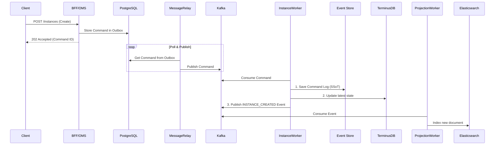

# SPICE HARVESTER - 시스템 아키텍처

## 목차

1.  [시스템 개요](#1-시스템-개요)
2.  [아키텍처 원칙](#2-아키텍처-원칙)
3.  [시스템 아키텍처 다이어그램](#3-시스템-아키텍처-다이어그램)
4.  [서비스 상세 설명](#4-서비스-상세-설명)
5.  [데이터 흐름 및 통신](#5-데이터-흐름-및-통신)
6.  [데이터 아키텍처](#6-데이터-아키텍처)
7.  [기술 스택](#7-기술-스택)
8.  [프로젝트 구조](#8-프로젝트-구조)
9.  [구현 현황](#9-구현-현황)

---

## 1. 시스템 개요

**SPICE HARVESTER**는 엔터프라이즈 환경을 위해 설계된 고성능 온톨로지 관리 및 데이터 거버넌스 플랫폼입니다. 다국어 지원, 복합 데이터 타입, 고급 관계 관리 기능을 제공하며, 특히 데이터의 변경 이력을 완벽하게 추적하고 재현하는 강력한 기능을 갖추고 있습니다.

### 핵심 역량

-   **엔터프라이즈 온톨로지 관리**: 버전 관리 포함, 온톨로지 전체 생명주기 관리
-   **Git과 유사한 버전 관리**: 브랜치, 커밋, 비교(Diff), 병합(Merge), 롤백 등 Git의 핵심 워크플로우 완벽 지원
-   **하이브리드 데이터 아키텍처**: 데이터 특성에 따라 최적의 관리 모델 적용
    -   **온톨로지 (스키마)**: 상태 저장(State-Store) 모델로 최신 상태를 신속하게 관리
    -   **인스턴스 (데이터)**: 이벤트 소싱(Event Sourcing) 모델로 모든 변경 이력을 완벽하게 보존 및 추적
-   **CQRS (Command Query Responsibility Segregation)**: 읽기/쓰기 모델을 분리하여 시스템 확장성 및 성능 최적화
-   **완전한 감사 및 시간 여행**: 인스턴스 데이터의 모든 변경 이력을 추적하고, 특정 시점의 상태를 완벽하게 재현
-   **AI 기반 타입 추론**: 외부 데이터 소스를 분석하여 온톨로지 스키마를 자동으로 생성 및 제안

---

## 2. 아키텍처 원칙

본 시스템은 확장성, 유지보수성, 안정성을 보장하기 위해 다음과 같은 현대적인 아키텍처 원칙을 따릅니다.

| 원칙 | 설명 |
| :--- | :--- |
| **하이브리드 데이터 모델** | 데이터의 성격에 따라 관리 방식을 달리합니다. 변경 빈도가 낮고 스키마 역할을 하는 **온톨로지**는 **상태 저장(State-Store)** 방식으로 최신 상태를 관리하고, 모든 변경 이력의 추적이 중요한 **인스턴스**는 **이벤트 소싱(Event Sourcing)** 방식으로 관리하여 효율성과 데이터 무결성을 동시에 달성합니다. |
| **CQRS** | 명령(Command)을 처리하는 책임과 조회(Query)를 처리하는 책임을 명확하게 분리합니다. 쓰기 작업은 이벤트 스트림을 통해 처리되며, 읽기 작업은 목적에 맞게 최적화된 다양한 읽기 모델(TerminusDB, Elasticsearch)을 통해 수행됩니다. |
| **이벤트 기반 비동기 통신** | 서비스 간의 결합도를 낮추기 위해 Kafka를 이벤트 버스로 사용합니다. 각 서비스는 이벤트를 발행(Publish)하거나 구독(Subscribe)함으로써 비동기적으로 상호작용하며, 이는 시스템 전체의 탄력성과 확장성을 높입니다. |
| **불변성 (Immutability)** | 이벤트 소싱이 적용된 인스턴스 데이터의 모든 변경은 새로운 '커맨드' 파일로 S3에 추가(append-only)됩니다. 한번 기록된 데이터는 절대 변경되거나 삭제되지 않아 데이터의 무결성과 완벽한 감사 추적을 보장합니다. |
| **단일 진실 공급원 (SSoT)** | 데이터의 종류에 따라 진실의 원천이 명확하게 정의됩니다. **인스턴스 데이터의 SSoT는 S3에 저장된 커맨드 로그**이며, **온톨로지 데이터의 SSoT는 TerminusDB에 저장된 최신 상태**입니다. 읽기 모델들은 모두 이 SSoT로부터 파생된 결과물입니다. |

---

## 3. 시스템 아키텍처 다이어그램

본 시스템은 CQRS와 이벤트 소싱 원칙에 따라 쓰기 경로와 읽기 경로가 명확하게 분리된 마이크로서비스 아키텍처를 따릅니다.

```mermaid
graph TD
    subgraph "사용자 / 클라이언트"
        A[Web UI / API Clients]
    end

    subgraph "API 게이트웨이 (BFF)"
        B(BFF - Backend for Frontend)
    end

    subgraph "쓰기 경로 (Write Path)"
        C(OMS - Ontology Management Service)
        D[PostgreSQL - Outbox]
        E[Message Relay]
        F[Kafka - Event Bus]
        G[Instance Worker]
        H[Ontology Worker]
        I[S3 / MinIO - Event Store]
        J[TerminusDB - Write Model]
    end

    subgraph "읽기 경로 (Read Path)"
        K[Projection Worker]
        L[Elasticsearch - Read Model]
        M[TerminusDB - Read Model]
        N[Redis - Cache]
    end

    %% 흐름 정의
    A -->|REST API| B

    B -->|Ontology Command| C
    B -->|Instance Command| C

    C -->|Store Command| D
    D -->|Poll & Publish| E
    E -->|Push to Topic| F

    F -- Instance Commands --> G
    F -- Ontology Commands --> H

    G -->|1. Save Command Log (SSoT)| I
    G -->|2. Update Write Model| J
    G -->|3. Publish Event| F

    H -->|Update Write Model| J
    H -->|Publish Event| F

    F -- Instance/Ontology Events --> K
    K -->|Project to| L
    K -->|Cache Data| N

    B -->|Query (Search)| L
    B -->|Query (Direct Get)| M
    B -->|Query (Cached Data)| N

    %% 스타일
    style A fill:#cce5ff,stroke:#333,stroke-width:2px
    style B fill:#cce5ff,stroke:#333,stroke-width:2px
    style C fill:#d4edda,stroke:#333,stroke-width:2px
    style G fill:#d4edda,stroke:#333,stroke-width:2px
    style H fill:#d4edda,stroke:#333,stroke-width:2px
    style K fill:#d4edda,stroke:#333,stroke-width:2px
    style L fill:#fff3cd,stroke:#333,stroke-width:2px
    style M fill:#fff3cd,stroke:#333,stroke-width:2px
    style I fill:#f8d7da,stroke:#333,stroke-width:2px
```

---

## 4. 서비스 상세 설명

### API 계층
-   **BFF (Backend for Frontend)**: 클라이언트(UI, 외부 API)를 위한 API 게이트웨이입니다. 복잡한 백엔드 로직을 추상화하고, 사용자 친화적인 API를 제공하며, 요청을 내부 서비스로 라우팅하고, 읽기 모델(Elasticsearch, TerminusDB)을 직접 조회하여 응답을 구성합니다.

### 쓰기 모델 (Write Model)
-   **OMS (Ontology Management Service)**: 모든 변경 요청(Command)의 진입점입니다. 커맨드를 검증하고 `Outbox` 테이블에 저장하여 처리의 안정성을 보장하는 핵심 서비스입니다.
-   **Message Relay**: `Outbox` 패턴의 핵심 컴포넌트로, PostgreSQL의 Outbox 테이블을 주기적으로 폴링하여 저장된 커맨드를 Kafka로 안정적으로 발행(Publish)합니다.
-   **Kafka**: 모든 커맨드와 이벤트가 흐르는 중앙 이벤트 버스입니다. 서비스 간의 비동기 통신을 담당합니다.
-   **Instance Worker**: `Instance` 관련 커맨드를 처리하는 실제 작업자입니다.
    1.  커맨드 자체를 **S3(Event Store)에 영구 저장**합니다 (SSoT).
    2.  TerminusDB에 최신 상태를 **업데이트**합니다 (Write-Model Cache).
    3.  처리 완료 후 `INSTANCE_CREATED`와 같은 도메인 이벤트를 Kafka로 발행합니다.
-   **Ontology Worker**: `Ontology` 관련 커맨드를 처리합니다. TerminusDB의 스키마를 직접 변경하고, 도메인 이벤트를 Kafka로 발행합니다.

### 읽기 모델 (Read Model)
-   **Projection Worker**: Kafka의 도메인 이벤트를 구독하여, 검색에 최적화된 읽기 모델을 **Elasticsearch에 구축(Projection)**합니다.
-   **TerminusDB**: `Ontology` 데이터의 SSoT이자, `Instance` 데이터의 최신 상태를 담는 캐시/읽기 모델 역할을 합니다. ID 기반의 직접 조회를 담당합니다.
-   **Elasticsearch**: 텍스트 검색, 필터링, 목록 조회 등 복잡한 쿼리를 위한 고성능 읽기 모델입니다.
-   **Redis**: 커맨드 처리 상태 추적, 분산 락, 온톨로지 메타데이터 캐싱 등 다목적 캐시 저장소로 사용됩니다.

---

## 5. 데이터 흐름 및 통신

### 인스턴스 생성 요청 (이벤트 소싱 경로)



---

## 6. 데이터 아키텍처

본 시스템은 여러 데이터 저장소를 각자의 역할에 맞게 최적화하여 사용합니다.

| 저장소 | 주 역할 | 데이터 종류 | 데이터 모델 | SSoT 여부 |
| :--- | :--- | :--- | :--- | :--- |
| **S3 / MinIO** | **이벤트 저장소 (Event Store)** | 인스턴스 커맨드 로그 | Append-only JSON 파일 | **Yes (Instance)** |
| **TerminusDB** | 쓰기/읽기 모델 | 온톨로지 스키마, 인스턴스 최신 상태 | Graph / Document | **Yes (Ontology)** |
| **Elasticsearch** | **읽기 모델 (Read Model)** | 검색 및 목록용 데이터 | Denormalized JSON | No |
| **PostgreSQL** | **메시지 큐 (Outbox)** | 처리 대기중인 커맨드 | Relational | No |
| **Kafka** | **이벤트 버스 (Event Bus)** | 커맨드 및 도메인 이벤트 | Event Stream | No |
| **Redis** | **캐시 / 상태 저장소** | 커맨드 처리 상태, 메타데이터 | Key-Value | No |

---

## 7. 기술 스택

### 백엔드
- **언어**: Python 3.9+
- **프레임워크**: FastAPI
- **비동기 처리**: `asyncio`, `httpx`

### 데이터 계층
- **그래프 DB**: TerminusDB
- **이벤트 저장소**: S3 (MinIO)
- **메시지 큐**: PostgreSQL (Outbox), Kafka
- **검색 엔진**: Elasticsearch
- **캐시**: Redis

### 핵심 설계 패턴
- **마이크로서비스 아키텍처 (MSA)**
- **CQRS (Command Query Responsibility Segregation)**
- **이벤트 소싱 (Event Sourcing)**
- **아웃박스 패턴 (Outbox Pattern)**
- **프로젝션 (Projection)**

(이하 내용은 기존 문서와 거의 동일하여 생략)
