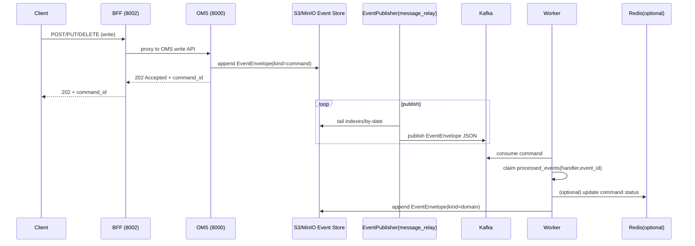
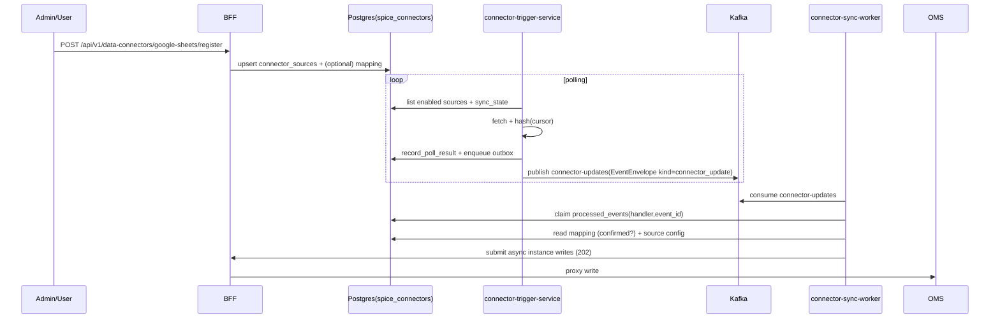

# SPICE HARVESTER — 백엔드 아키텍처 (코드 정합 문서)

> - 최종 업데이트: 2025-12-20
> - 대상 코드: `backend/` + `docker-compose.full.yml`
> - 핵심 쓰기 경로(현재 실사용): **S3/MinIO Event Store(SSoT) → EventPublisher(`backend/message_relay`) → Kafka → Workers**
> - 멱등/순서/OCC 계약: `docs/IDEMPOTENCY_CONTRACT.md`

## 관련 문서

- 프론트엔드 계약(API 표면): `docs/API_REFERENCE.md`
- 멱등/순서 계약(필수): `docs/IDEMPOTENCY_CONTRACT.md`
- Audit(구조화 로그 + 해시체인): `docs/AUDIT_LOGS.md`
- Lineage(그래프 provenance): `docs/DATA_LINEAGE.md`
- 운영/배포: `docs/OPERATIONS.md`, `backend/docs/deployment/DEPLOYMENT_GUIDE.md`
- Event Sourcing/CQRS 설계 원칙(백엔드 내부 문서): `backend/docs/Command/Event Sourcing + CQRS 아키텍처 설계 원칙.md`
- 포트/관측성/레이트리밋: `backend/docs/deployment/PORT_CONFIGURATION.md`, `backend/docs/OPENTELEMETRY_OBSERVABILITY.md`, `backend/docs/API_RATE_LIMITING.md`

## 목차

- 0. TL;DR
- 1. 시스템 개요
- 2. 아키텍처 원칙
- 3. 서비스 토폴로지
- 4. 데이터/인프라 컴포넌트
- 5. 공통 계약(Contracts)
- 6. Write Path 상세
- 7. Read Path 상세
- 8. Connector Runtime
- 9. Audit / Lineage / Observability
- 10. 보안/안정성
- 11. 배포/로컬 실행
- 12. 코드 네비게이션(확장 포인트)
- 부록 A. “진실의 원천” 요약표
- 부록 B. 런타임 환경변수 치트시트

## 0. TL;DR (한 장 요약)

- **BFF(`backend/bff`)가 프론트엔드 유일 계약**이며, 쓰기는 주로 **OMS(`backend/oms`)에 위임**합니다.
- **OMS는 Command를 검증/정규화한 뒤 `EventEnvelope(kind=command)`로 Event Store(S3/MinIO)에 append** 하고 즉시 `202 Accepted`를 반환합니다.
- **EventPublisher(`backend/message_relay`)는 Event Store의 `indexes/by-date`를 tail** 하여 Kafka로 발행합니다(최소 1회 전달).
- **Worker(Instance/Ontology/Projection/Connector)는 Kafka 소비 시 `ProcessedEventRegistry`(Postgres)로 claim** 하여 멱등+순서를 강제하고 side-effect를 수행합니다.
- **Domain event도 Event Store에 append** 되며, 동일한 relay 경로로 Kafka를 통해 Projection으로 흘러갑니다.
- **PostgreSQL은 SSoT가 아니라 “레지스트리/메타 저장소”**입니다: `processed_events`, `aggregate_versions`(OCC/seq), connector registry/outbox, audit, lineage.
- **Redis는 옵션(권장)**입니다: command status, rate limiting, websocket pub/sub에 사용되며, 장애 시 핵심 파이프라인은 계속 동작하도록 설계되어 있습니다.

---

## 1. 시스템 개요

SPICE HARVESTER는 온톨로지(스키마)와 인스턴스(데이터)를 운영 환경에서 안전하게 관리하기 위해 다음을 “플랫폼 레벨 계약”으로 제공합니다.

- **Command/Event Sourcing**: 모든 변경은 Command로 기록되고, 실행 결과는 Domain Event로 기록됩니다.
- **CQRS**: 쓰기 경로(커맨드 처리)와 읽기 경로(검색/조회)를 분리합니다.
- **추적성(Traceability)**: 이벤트/프로젝션/저장소 아티팩트 간 인과관계를 **Audit + Lineage**로 남깁니다.
- **운영 현실 대응**: Kafka/네트워크 장애로 재시도가 발생해도, 시스템 전체 side-effect를 “정확히 1회”처럼 보이게 만드는 **멱등/순서/lease** 계약을 갖습니다.

### 1.1 핵심 용어

- **Command**: “의도(요청)”를 표현. 예) `CREATE_INSTANCE`, `UPDATE_ONTOLOGY_CLASS` (`backend/shared/models/commands.py`)
- **Domain Event**: “사실(결과)”를 표현. 예) `INSTANCE_CREATED`, `ONTOLOGY_CLASS_UPDATED` (`backend/shared/models/events.py`)
- **EventEnvelope**: S3/Kafka에 저장·전달되는 표준 래퍼 (`backend/shared/models/event_envelope.py`)
- **Aggregate**: 버전/순서가 보장되는 스트림 단위(예: `Instance`, `OntologyClass`) + `aggregate_id`
- **`expected_seq`**: 낙관적 동시성 제어(OCC) 토큰. 현재 aggregate의 last seq와 다르면 409
- **`sequence_number`**: aggregate 내부 순서를 나타내는 단조 증가 정수(Write-side에서 원자적 할당)

---

## 2. 아키텍처 원칙(실제 구현 기준)

### 2.1 SSoT(단일 진실 공급원) 분리

SSoT는 “저장소별 책임”이 아니라 “데이터 종류별 진실의 원천”을 의미합니다.

- **이벤트의 SSoT**: `EVENT_STORE_BUCKET`(S3/MinIO) — `backend/shared/services/event_store.py`
- **그래프(관계/참조)의 최신 상태**: TerminusDB(Write-model cache / 조회 경로) — `backend/oms/services/async_terminus.py`
- **검색/목록의 Read Model**: Elasticsearch(Projection) — `backend/projection_worker/main.py`
- **레지스트리/메타**: PostgreSQL(멱등+순서+OCC + audit/lineage/connector registry)

### 2.2 전달 보장(At-least-once) + 멱등(Exactly-once처럼 보이게)

- EventPublisher/Kafka/Consumer는 모두 **at-least-once**입니다.
- 따라서 “중복 처리”는 정상 상황이며, 이를 **`ProcessedEventRegistry`(Postgres)** 가 handler 단위로 통제합니다.

### 2.3 Palantir-style “경량 그래프” 원칙(Instance)

`backend/instance_worker/main.py`의 구현 원칙:

- TerminusDB(그래프)에는 **관계/참조(@id → @id)** 와 최소 식별자만 저장합니다.
- 도메인 데이터(속성 값)는 **S3 instance bucket + Domain Event + Elasticsearch**에 둡니다.

---

## 3. 서비스 토폴로지(실제 코드/배포 기준)

### 3.1 전체 구성도

```mermaid
graph TD
  subgraph Client
    UI[Web UI / API Clients]
  end

  subgraph API["API Layer"]
    BFF["BFF (FastAPI)<br/>8002"]
    OMS["OMS (FastAPI)<br/>8000"]
    Funnel["Funnel (FastAPI)<br/>8003"]
  end

  subgraph WritePath["Write Path"]
    ESStore[S3/MinIO Event Store (EVENT_STORE_BUCKET)]
    Relay[EventPublisher / message_relay]
    Kafka[Kafka Topics]
    IW[Instance Worker]
    OW[Ontology Worker]
  end

  subgraph ReadPath["Read Path"]
    PW[Projection Worker]
    ES[Elasticsearch Read Model]
    TDB[TerminusDB (graph + ontology state)]
    Redis[Redis (optional)]
  end

  subgraph Postgres["PostgreSQL (registries)"]
    PER[processed_events + aggregate_versions]
    LIN[spice_lineage]
    AUD[spice_audit]
    CONN[spice_connectors]
  end

  subgraph ConnectorRuntime["Connector Runtime (Foundry-style)"]
    CT[connector-trigger-service]
    CS[connector-sync-worker]
  end

  UI -->|HTTP /api/v1| BFF
  BFF -->|Write (proxy)| OMS
  BFF -->|Type inference calls| Funnel

  OMS -->|append EventEnvelope(kind=command)| ESStore
  ESStore -->|tail indexes/by-date| Relay
  Relay -->|publish EventEnvelope JSON| Kafka

  Kafka -->|instance_commands| IW
  Kafka -->|ontology_commands + database_commands| OW

  IW -->|claim/mark| PER
  OW -->|claim/mark| PER
  PW -->|claim/mark| PER

  IW -->|write minimal graph| TDB
  OW -->|mutate schema/branches| TDB
  IW -->|append EventEnvelope(kind=domain)| ESStore
  OW -->|append EventEnvelope(kind=domain)| ESStore

  Kafka -->|instance_events + ontology_events| PW
  PW -->|index| ES

  BFF -->|search/list| ES
  BFF -->|direct get/query| TDB
  BFF -->|status/websocket/rate-limit| Redis

  CT --> CONN
  CS --> CONN
  CT -->|publish connector-updates| Kafka
  Kafka -->|connector-updates| CS
  CS -->|submit async writes| BFF
```

### 3.2 서비스별 책임(요약)

| 컴포넌트 | 코드 위치 | 런타임 | 기본 포트 | 핵심 책임 |
|---|---|---:|---:|---|
| BFF | `backend/bff` | FastAPI | 8002 | 프론트엔드 계약(API Gateway), Read Model 질의, 쓰기 요청 OMS로 위임, WebSocket/Audit/Lineage 노출 |
| OMS | `backend/oms` | FastAPI | 8000 | Command 생성/검증/OCC 적용 후 Event Store append(202), TerminusDB 일부 read/utility |
| Funnel | `backend/funnel` | FastAPI | 8003 | 타입 추론/스키마 제안/시트 구조 분석(일부 BFF를 콜백으로 사용) |
| message-relay | `backend/message_relay` | Worker | - | Event Store index tail → Kafka publish(체크포인트/룩백/중복 방지) |
| ontology-worker | `backend/ontology_worker` | Worker | - | ontology/database command 처리 → TerminusDB 변경 + domain event append |
| instance-worker | `backend/instance_worker` | Worker | - | instance command 처리 → S3(인스턴스 로그) + Terminus(경량 그래프) + domain event append |
| projection-worker | `backend/projection_worker` | Worker | - | domain event 처리 → Elasticsearch projection(+DLQ/재시도) |
| connector-trigger-service | `backend/connector_trigger_service` | Worker | - | Postgres registry 기반 외부 소스 변화 감지(폴링) + outbox → Kafka connector-updates 발행 |
| connector-sync-worker | `backend/connector_sync_worker` | Worker | - | connector-updates 소비 → mapping 확인 후 데이터 정규화 → BFF/OMS에 async write 제출 |

---

## 4. 데이터/인프라 컴포넌트(저장소별 역할)

### 4.1 S3/MinIO

#### (A) Event Store (SSoT)

- 버킷: `EVENT_STORE_BUCKET` (기본 `spice-event-store`)
- 구현: `backend/shared/services/event_store.py`
- 레이아웃(중요):
  - 이벤트 오브젝트(불변): `events/YYYY/MM/DD/<aggregate_type>/<aggregate_id>/<event_id>.json`
  - 인덱스(by-aggregate): `indexes/by-aggregate/<aggregate_type>/<aggregate_id>/<seq>_<event_id>.json`
  - 인덱스(by-date): `indexes/by-date/YYYY/MM/DD/<timestamp_ms>_<event_id>.json`
  - 인덱스(by-event-id): `indexes/by-event-id/<event_id>.json` (idempotent append의 핵심)
  - 체크포인트(퍼블리셔): `checkpoints/event_publisher.json` (기본값; env로 변경 가능)

Event Store append 동작(중요 구현 포인트):

- **전역 멱등(idempotent append)**: 같은 `event_id`는 “한 번만 저장”됩니다.
  - `indexes/by-event-id/<event_id>.json`를 먼저 조회하여, `occurred_at`이 달라도 동일 이벤트로 인식합니다.
- **Command payload 불일치 방지**: `metadata.kind == "command"`인 경우, 같은 `event_id`에 다른 payload가 들어오면 기본적으로 오류로 처리합니다.
  - 제어: `EVENT_STORE_IDEMPOTENCY_MISMATCH_MODE=error|warn` (`backend/shared/services/event_store.py`)
- **인덱스는 파생 데이터**: index 업데이트 실패는 append 실패로 간주하지 않습니다(append는 성공, 인덱스는 best-effort).
- **seq 할당은 write-side에서 원자적**입니다(Postgres allocator 사용).
  - `EVENT_STORE_SEQUENCE_ALLOCATOR_MODE=postgres|legacy|off`
  - `EVENT_STORE_SEQUENCE_SCHEMA`(기본 `spice_event_registry`), `EVENT_STORE_SEQUENCE_HANDLER_PREFIX`(기본 `write_side`)
- **Lineage/Audit는 fail-open**입니다. `ENABLE_LINEAGE`, `ENABLE_AUDIT_LOGS`가 켜져 있어도 기록 실패가 append를 막지 않습니다.

#### (B) Instance Bucket (도메인 페이로드 보존)

- 버킷: `INSTANCE_BUCKET` (기본 `instance-events`) — `backend/shared/config/app_config.py`
- 쓰기: `backend/instance_worker/main.py`
  - 키: `<db_name>/<branch>/<class_id>/<instance_id>/<command_id>.json`
  - 내용: `{command: {...}, payload: {...}, ...}` 형태(리플레이 지원)
- 읽기/리플레이: `backend/shared/services/storage_service.py`

### 4.2 Kafka (토픽/메시지 계약)

- 메시지 포맷: **EventEnvelope JSON** (`backend/shared/models/event_envelope.py`)
- 토픽 목록(기본): `backend/shared/config/app_config.py`

| 분류 | 토픽 | 메타데이터 `kind` | 생산자 | 소비자 |
|---|---|---|---|---|
| Commands | `database_commands` | `command` | OMS | ontology-worker |
| Commands | `ontology_commands` | `command` | OMS | ontology-worker |
| Commands | `instance_commands` | `command` | OMS | instance-worker |
| Domain events | `ontology_events` | `domain` | ontology-worker | projection-worker |
| Domain events | `instance_events` | `domain` | instance-worker | projection-worker |
| DLQ | `projection_failures_dlq` | `domain`(변형) | projection-worker | (운영 소비) |
| Connector | `connector-updates` | `connector_update` | connector-trigger-service | connector-sync-worker |
| Connector DLQ | `connector-updates-dlq` | `connector_update_dlq` | connector-sync-worker | (운영 소비) |

### 4.3 PostgreSQL (레지스트리/감사/라인리지/커넥터)

Postgres는 “진실의 원천”이 아니라, 이벤트 소싱 파이프라인을 **안전하게** 만들기 위한 레지스트리/메타 저장소입니다.

| 스키마 | 테이블(대표) | 책임 모듈 |
|---|---|---|
| `spice_event_registry` | `processed_events`, `aggregate_versions` | `backend/shared/services/processed_event_registry.py`, `backend/shared/services/aggregate_sequence_allocator.py` |
| `spice_lineage` | `lineage_nodes`, `lineage_edges`, `lineage_backfill_queue` | `backend/shared/services/lineage_store.py` |
| `spice_audit` | `audit_logs`, `audit_chain_heads` | `backend/shared/services/audit_log_store.py` |
| `spice_connectors` | `connector_sources`, `connector_mappings`, `connector_sync_state`, `connector_update_outbox` | `backend/shared/services/connector_registry.py` |

### 4.4 TerminusDB

- 온톨로지/브랜치/버전 컨트롤의 중심 저장소(스키마/그래프)
- Instance에 대해서는 “경량 그래프” 노드(@id, @type, 관계/참조, 일부 필수 필드)만 저장
- 구현 접근: `backend/oms/services/async_terminus.py`

### 4.5 Elasticsearch

- Projection Worker가 단일 writer로 read model을 구축합니다.
- 인덱스 네이밍(브랜치 오버레이 포함): `backend/shared/config/search_config.py`
  - main: `<db>_instances`, `<db>_ontologies`
  - non-main: `<db>_instances__br_<branchSlug>_<hash>` 형태

### 4.6 Redis (옵션이지만 권장)

- Command status: `backend/shared/services/command_status_service.py`
- Rate limiting: `backend/shared/middleware/rate_limiter.py`
- WebSocket notification: `backend/shared/services/websocket_service.py`
- 장애 시 fallback:
  - Command status는 OMS에서 Postgres(processed_events) 또는 Event Store 조회로 부분 복구(`backend/oms/routers/command_status.py`)

### 4.7 Label Mapping(SQLite)

- 레이블 ↔ 내부 ID 매핑은 SQLite로 영속화됩니다.
- 구현: `backend/shared/utils/label_mapper.py`
- 경로:
  - `LABEL_MAPPINGS_DB_PATH`로 지정 가능
  - (로컬 기본) `backend/data/label_mappings.db`

---

## 5. 공통 계약(Contracts)

### 5.1 EventEnvelope 표준

정의: `backend/shared/models/event_envelope.py`

핵심 필드:

- `event_id`: 멱등 키(특히 command는 `command_id`와 동일하게 저장)
- `aggregate_type`, `aggregate_id`: 순서/OCC/정합성의 기준
- `sequence_number`: write-side에서 원자적으로 할당되는 per-aggregate seq
- `metadata.kind`: `command` | `domain` | `connector_update` 등
- `metadata.kafka_topic`: message-relay가 Kafka 라우팅에 사용

Command envelope 예시(개념):

```json
{
  "event_id": "UUID(=command_id)",
  "event_type": "CREATE_INSTANCE_REQUESTED",
  "aggregate_type": "Instance",
  "aggregate_id": "db:branch:Class:instance_id",
  "sequence_number": 12,
  "metadata": {
    "kind": "command",
    "command_type": "CREATE_INSTANCE",
    "command_id": "UUID",
    "kafka_topic": "instance_commands",
    "service": "oms"
  },
  "data": {
    "command_type": "CREATE_INSTANCE",
    "payload": { "...": "..." },
    "expected_seq": 11
  }
}
```

Domain event 예시(개념; instance-worker가 생성):

```json
{
  "event_id": "deterministic uuid5(...)",
  "event_type": "INSTANCE_CREATED",
  "aggregate_type": "Instance",
  "aggregate_id": "db:branch:Class:instance_id",
  "sequence_number": 13,
  "metadata": {
    "kind": "domain",
    "kafka_topic": "instance_events",
    "service": "instance_worker",
    "command_id": "UUID",
    "ontology": { "ref": "branch:main", "commit": "..." }
  },
  "data": {
    "db_name": "db",
    "branch": "main",
    "class_id": "Class",
    "instance_id": "instance_id",
    "...": "payload fields"
  }
}
```

### 5.2 OCC(`expected_seq`)와 sequence allocation

구현: `backend/shared/services/event_store.py` + `backend/shared/services/aggregate_sequence_allocator.py`

- Command 이벤트 append 시 `expected_seq`가 있으면:
  - Postgres의 atomic allocator가 “현재 last seq == expected_seq”일 때만 다음 seq를 예약합니다.
  - 불일치하면 `OptimisticConcurrencyError` → API는 `409 Conflict`로 반환합니다.
- Domain event는 `expected_seq` 없이도 append 가능하며, allocator가 다음 seq를 예약합니다.
- **브랜치 가상화(Branch virtualization)**: non-main 브랜치가 main에서 분기되어 “상태를 상속”했지만 브랜치 전용 이벤트 스트림이 비어 있는 경우, 첫 write에서 base 브랜치의 last seq로 seed합니다.
  - 목적: `expected_seq`가 “상속된 상태” 기준으로 동작(OCC 정합성)
  - 설정: `BRANCH_VIRTUALIZATION_BASE_BRANCH` (기본 `main`) — `backend/shared/services/event_store.py`

### 5.3 멱등/순서 레지스트리(ProcessedEventRegistry)

구현: `backend/shared/services/processed_event_registry.py`

- 키: `(handler, event_id)`
- 상태: `processing`(lease+heartbeat) → `done` or `failed` or `skipped_stale`
- 순서 가드:
  - `sequence_number`가 제공되면, `aggregate_versions(handler, aggregate_id)`의 last_sequence보다 작은 이벤트는 stale로 처리
- lease 만료 시 다른 워커가 reclaim 가능(운영 현실: 워커 죽음/네트워크 단절)

### 5.4 i18n(출력 언어 선택) 계약

공통 미들웨어: `backend/shared/services/service_factory.py`

- `?lang=en|ko` 쿼리 파라미터 우선
- `Accept-Language` 헤더 fallback

---

## 6. Write Path 상세(비동기 202 플로우)

### 6.1 공통 시퀀스(Write 요청 → 완료 관측)



### 6.1.1 EventPublisher(message_relay) 동작 상세(S3 tail → Kafka)

구현: `backend/message_relay/main.py`

- 입력: Event Store의 `indexes/by-date/...` (index entry에는 `s3_key`, `kafka_topic` 등이 포함)
- 출력: Kafka로 **EventEnvelope JSON** publish
- 체크포인트(내구): S3 `checkpoints/...` (기본 `checkpoints/event_publisher.json`)
  - `last_timestamp_ms`, `last_index_key`를 단조 증가(monotonic)로 유지
  - 최근 publish한 `event_id` 일부를 `recent_event_ids`로 저장하여 “재기동 직후 중복 publish”를 완화
- lookback(복구 안전망): 체크포인트 직전 구간의 by-date key를 일부 재스캔하여 “인덱스 지연/일시 장애”로 누락된 이벤트를 보완
- dedup(베스트 에포트): 프로세스 메모리 + checkpoint의 `recent_event_ids` 기반 LRU로 중복 publish를 줄이지만, **정확한 멱등은 소비자 계약**입니다.
- Kafka flush 정책:
  - batch flush 후 **확인된 delivery prefix**만 체크포인트를 전진시킵니다(부분 실패 시 재시도 → at-least-once).

주요 환경변수(코드 기본값 기준):

- `EVENT_PUBLISHER_CHECKPOINT_KEY` (default `checkpoints/event_publisher.json`)
- `EVENT_PUBLISHER_POLL_INTERVAL` (default `3`)
- `EVENT_PUBLISHER_BATCH_SIZE` (default `200`)
- `EVENT_PUBLISHER_LOOKBACK_SECONDS` (default `600`)
- `EVENT_PUBLISHER_DEDUP_MAX_EVENTS` (default `10000`)
- `EVENT_PUBLISHER_DEDUP_CHECKPOINT_MAX_EVENTS` (default `2000`)

### 6.2 Instance write (CREATE/UPDATE/DELETE)

- Command 수락(OMS): `backend/oms/routers/instance_async.py`
  - `POST /api/v1/instances/{db_name}/async/{class_id}/create`
  - `PUT /api/v1/instances/{db_name}/async/{class_id}/{instance_id}/update?expected_seq=...`
  - `DELETE /api/v1/instances/{db_name}/async/{class_id}/{instance_id}/delete?expected_seq=...`
- 처리(Instance Worker): `backend/instance_worker/main.py`
  - Kafka topic: `instance_commands`
  - 처리 결과: `INSTANCE_*` domain event → `instance_events`

Instance Worker side-effects(핵심):

1) **S3 instance bucket에 full payload 저장**
2) **TerminusDB에 경량 그래프 노드 저장/수정/삭제**
3) **Domain event를 Event Store에 append**(message_relay가 Kafka로 전달)
4) (옵션) Redis에 command status 업데이트
5) (best-effort) Lineage/Audit 기록

### 6.3 Ontology/Database write

- Command 수락(OMS):
  - database: `backend/oms/routers/database.py`
  - ontology: `backend/oms/routers/ontology.py`
- 처리(Ontology Worker): `backend/ontology_worker/main.py`
  - Kafka topics: `database_commands`, `ontology_commands`
  - 결과: `ONTOLOGY_*`, `DATABASE_*` domain event → `ontology_events`

### 6.4 Command status 관측(프론트 계약)

프론트는 내부 서비스(OMS/worker)를 직접 호출하지 않고 **BFF**를 통해 관측합니다.

- BFF: `GET /api/v1/commands/{command_id}/status` (`backend/bff/routers/command_status.py`)
- 내부 구현:
  1) OMS의 status API를 proxy: `GET /api/v1/commands/{command_id}/status`
  2) OMS는 Redis가 가능하면 Redis 기반 status 반환
  3) Redis 불가 시 processed_event_registry 또는 event_store로 fallback (`backend/oms/routers/command_status.py`)

---

## 7. Read Path 상세(CQRS)

### 7.1 검색/목록(Read Model = Elasticsearch)

- 인스턴스 목록(기본): `backend/bff/routers/instances.py`
  - 우선 Elasticsearch 조회
  - 장애/오류 시 OMS(또는 Terminus)로 fallback

### 7.2 직접 조회/쿼리(TerminusDB)

- 레이블 기반 쿼리(BFF): `backend/bff/routers/query.py`
  - LabelMapper로 class/field label → internal id 변환 후 Terminus query

### 7.3 Projection Worker(단일 writer)

- 구현: `backend/projection_worker/main.py`
- 입력: `instance_events`, `ontology_events` (metadata.kind == `domain`)
- 출력: Elasticsearch 인덱스 업데이트
- 안정성:
  - processed_events claim(멱등/순서)
  - 실패 시 재시도 + DLQ(`projection_failures_dlq`)

---

## 8. Connector Runtime(Foundry-style) — Google Sheets 예시

### 8.1 구성요소

- Registry(내구 상태): `backend/shared/services/connector_registry.py` (Postgres `spice_connectors`)
- Trigger(변화 감지 + outbox publish): `backend/connector_trigger_service/main.py`
- Sync Worker(정규화 + write 제출): `backend/connector_sync_worker/main.py`
- Connector library(외부 I/O): `backend/data_connector/google_sheets/...`

### 8.2 주요 흐름(변화 감지 → 자동 import)



정책 요약:

- **Mapping-gated**: mapping이 confirmed/enabled가 아니면 자동 쓰기를 수행하지 않습니다.
- **At-least-once + 멱등**: connector update는 결정적 `event_id`를 사용하며, sync worker는 processed_events로 side-effect를 통제합니다.
- **DLQ**: 실패가 누적되면 `connector-updates-dlq`로 보냅니다.

---

## 9. Audit / Lineage / Observability

### 9.1 Audit(구조화 + tamper-evident)

- 저장: Postgres `spice_audit` (`backend/shared/services/audit_log_store.py`)
- 조회 API(BFF): `backend/bff/routers/audit.py`
- 상세: `docs/AUDIT_LOGS.md`

### 9.2 Lineage(그래프 provenance)

- 저장: Postgres `spice_lineage` (`backend/shared/services/lineage_store.py`)
- 조회 API(BFF): `backend/bff/routers/lineage.py`
- 상세: `docs/DATA_LINEAGE.md`

### 9.3 Metrics/Tracing

- FastAPI 공통: `backend/shared/services/service_factory.py`에서 `/metrics` 및 tracing 설치
- 문서: `backend/docs/OPENTELEMETRY_OBSERVABILITY.md`

---

## 10. 보안/안정성(현 구현)

### 10.1 입력 검증/정화

- 공통 sanitizer/validator: `backend/shared/security/input_sanitizer.py`
- BFF/OMS 라우터에서 `validate_db_name`, `validate_class_id`, `sanitize_input` 등을 통해 방어

### 10.2 인증(운영 기본값)

- Docker 구성에서 `ADMIN_TOKEN`이 필수이며, 서비스가 이를 사용해 관리자 토큰을 검증합니다.
  - 예: `backend/docker-compose.yml`의 `OMS_REQUIRE_AUTH`, `BFF_REQUIRE_AUTH`
- 실제 엔드포인트별 인증/권한 정책은 라우터/미들웨어에 의해 결정됩니다.

### 10.3 레이트 리미팅

- 구현: `backend/shared/middleware/rate_limiter.py`
- 문서: `backend/docs/API_RATE_LIMITING.md`

### 10.4 장애/재시도/Poison pill 처리

- Kafka 소비자:
  - `enable.auto.commit=false` + 처리 성공 시 수동 commit → at-least-once
  - JSON 파싱 실패/계약 위반 메시지는 poison pill로 간주하고 commit하여 무한 루프를 방지
- processed_event_registry lease/heartbeat로 “죽은 워커” 복구 가능

---

## 11. 배포/로컬 실행(권장 경로)

### 11.1 Full stack(로컬)

```bash
docker compose -f docker-compose.full.yml up -d --build
```

기본 포트:

- BFF: `http://localhost:8002` (Swagger: `http://localhost:8002/docs`)
- OMS: `http://localhost:8000` (Swagger: `http://localhost:8000/docs`)
- Funnel: `http://localhost:8003` (Swagger: `http://localhost:8003/docs`)
- TerminusDB: `http://localhost:6363`
- Kafka UI: `http://localhost:8080` (compose 설정에 따라)
- MinIO: `http://localhost:9000` (console: `http://localhost:9001`)

### 11.2 구성 파일

- `docker-compose.full.yml`: 전체 스택(권장)
- `docker-compose.databases.yml`: Postgres/Redis/ES/MinIO
- `docker-compose.kafka.yml`: Kafka/Zookeeper/Kafka UI
- `backend/docker-compose.yml`: 서비스 이미지/환경변수 정의(extends 대상)

---

## 12. 코드 네비게이션(확장 포인트)

### 12.1 새로운 Command/Event 추가

1) `backend/shared/models/commands.py`에 `CommandType` 추가(필요 시 Command 모델 추가)
2) OMS 라우터에서 해당 Command를 생성하고 `EventEnvelope.from_command()`로 Event Store append
3) 적절한 Kafka topic으로 라우팅(`metadata.kafka_topic`)
4) 워커에서 토픽 소비 + `ProcessedEventRegistry.claim()` + side-effect 구현
5) Domain event를 Event Store에 append(또는 `EventEnvelope.from_base_event()`)
6) Projection이 필요하면 projection-worker에 핸들러 추가

### 12.2 새로운 Projection(ES read model) 추가

- projection-worker에서 토픽/이벤트 타입 분기 추가
- 인덱스 매핑/설정은 `backend/projection_worker/mappings/` 및 `backend/shared/config/search_config.py`를 기준으로 관리

### 12.3 새로운 Connector 추가

- `backend/data_connector/<connector>/...`에 외부 I/O 어댑터 추가
- `connector_registry`에 source/mapping 스키마 확장(필요 시)
- trigger-service가 변화 감지하여 `connector-updates`로 신호를 보내도록 구현
- sync-worker가 mapping에 따라 write를 제출하도록 구현

---

## 부록 A. “진실의 원천” 요약표

| 데이터 | SSoT | 파생/캐시 |
|---|---|---|
| Command/Domain Event 로그 | Event Store(S3/MinIO) | Kafka(전달), Postgres(audit/lineage 메타) |
| Ontology 최신 상태 | TerminusDB | Elasticsearch(검색), LabelMapper(SQLite) |
| Instance 도메인 페이로드(보존) | S3 instance bucket | Elasticsearch(검색), Domain Event payload |
| 멱등/순서/OCC | Postgres(spice_event_registry) | - |

---

## 부록 B. 런타임 환경변수 치트시트(핵심)

> 전체 목록은 코드(`backend/shared/config/service_config.py`, `backend/shared/services/event_store.py`, `backend/message_relay/main.py`)와 `backend/docker-compose.yml`를 소스로 합니다.

### B.1 서비스 주소/포트

- `OMS_BASE_URL`, `BFF_BASE_URL`, `FUNNEL_BASE_URL` (우선순위 가장 높음)
- `OMS_HOST`/`OMS_PORT`, `BFF_HOST`/`BFF_PORT`, `FUNNEL_HOST`/`FUNNEL_PORT` (ServiceConfig 조합)
- `DOCKER_CONTAINER=true` (Docker 내부에서 service-name 기반 디폴트 라우팅)

### B.2 인프라(공통)

- Postgres: `POSTGRES_URL` 또는 `POSTGRES_HOST`/`POSTGRES_PORT`/`POSTGRES_USER`/`POSTGRES_PASSWORD`/`POSTGRES_DB`
- Kafka: `KAFKA_BOOTSTRAP_SERVERS` 또는 `KAFKA_HOST`/`KAFKA_PORT`
- Redis: `REDIS_URL` 또는 `REDIS_HOST`/`REDIS_PORT`/`REDIS_PASSWORD`
- MinIO/S3: `MINIO_ENDPOINT_URL`, `MINIO_ACCESS_KEY`, `MINIO_SECRET_KEY`

### B.3 Event Store(SSoT) — correctness 관련

- `EVENT_STORE_BUCKET` (default `spice-event-store`)
- `EVENT_STORE_SEQUENCE_ALLOCATOR_MODE` (default `postgres`)
- `EVENT_STORE_SEQUENCE_SCHEMA` (default `spice_event_registry`)
- `EVENT_STORE_SEQUENCE_HANDLER_PREFIX` (default `write_side`)
- `EVENT_STORE_IDEMPOTENCY_MISMATCH_MODE` (default `error`)
- `ENABLE_LINEAGE`, `ENABLE_AUDIT_LOGS` (default `true`)

### B.4 ProcessedEventRegistry(멱등/순서) — 운영 튜닝

- `ENABLE_PROCESSED_EVENT_REGISTRY` (default `true`)
- `PROCESSED_EVENT_LEASE_TIMEOUT_SECONDS` (default `900`)
- `PROCESSED_EVENT_HEARTBEAT_INTERVAL_SECONDS` (default `30`)

### B.5 EventPublisher(message_relay)

- `EVENT_PUBLISHER_CHECKPOINT_KEY` (default `checkpoints/event_publisher.json`)
- `EVENT_PUBLISHER_POLL_INTERVAL` (default `3`)
- `EVENT_PUBLISHER_BATCH_SIZE` (default `200`)
- `EVENT_PUBLISHER_LOOKBACK_SECONDS` (default `600`)
- `EVENT_PUBLISHER_DEDUP_MAX_EVENTS` (default `10000`)

### B.6 Connector runtime

- Topics: `CONNECTOR_UPDATES_TOPIC`(default `connector-updates`), `CONNECTOR_UPDATES_DLQ_TOPIC`(default `connector-updates-dlq`)
- Trigger: `CONNECTOR_TRIGGER_TICK_SECONDS`, `CONNECTOR_TRIGGER_POLL_CONCURRENCY`, `CONNECTOR_TRIGGER_OUTBOX_BATCH`
- Sync: `CONNECTOR_SYNC_GROUP`, `CONNECTOR_SYNC_MAX_RETRIES`, `CONNECTOR_SYNC_BACKOFF_*`

### B.7 인증/운영 토큰(기본)

- `ADMIN_TOKEN` (docker compose에서 필수)
- `OMS_REQUIRE_AUTH`, `BFF_REQUIRE_AUTH`
