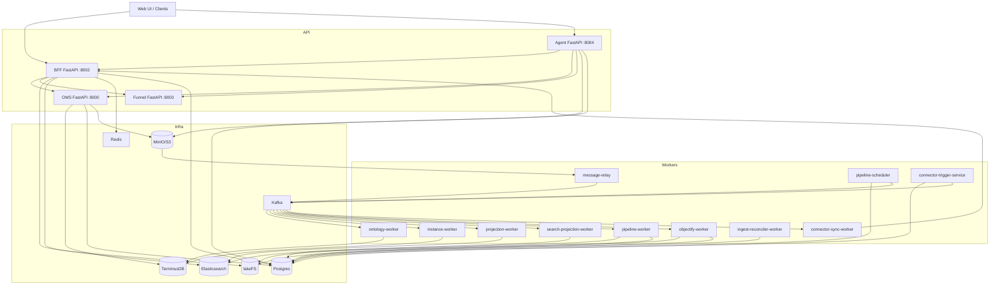

# SPICE HARVESTER — Architecture (Current, Code-Backed)

> - 기준: 코드 + docker-compose.full.yml
> - 범위: Backend + Infra + Control/Data plane + Event Sourcing
> - 상태: 현재 구현된 구성요소/계약 중심으로 정리

## 0) TL;DR

- **BFF가 결정론적 프론트 API 계약**이며 OMS/Funnel/Registry/Pipeline/Objectify로 라우팅한다. LangGraph 기반 **Agent 서비스는 별도 오케스트레이션 계층**이다.
- **Event Store(S3/MinIO)가 Write SSoT**이고, Kafka는 transport다.
- **Control Plane은 Postgres**(dataset/pipeline/objectify registry, proposal/approval/deploy, gate results, outbox, processed_event_registry).
- **Ontology 정의는 TerminusDB**, 데이터 아티팩트는 **lakeFS + MinIO**, 검색은 **Elasticsearch**.
- **Outbox + Reconciler**로 dataset/objectify 작업 내구성을 확보한다.
- **Relationship indexing + link edits overlay**로 그래프 관계와 수정을 분리 관리한다.
- **Audit/Lineage는 Postgres에 저장되고 BFF로 조회된다**.

---

## 1) 서비스 토폴로지



**Note**: BFF 내부에서 `dataset_ingest_outbox_worker`와 `objectify_outbox_worker`가 함께 실행된다.

---

## 1.1) 서비스 역할 (현재 구현)

- **BFF**: 단일 API gateway, auth/rate limit, dataset ingest + pipeline/objectify orchestration, graph/query/lineage/audit, command status(HTTP+WS), admin tasks, AI/Context7.
- **Agent**: LangGraph 기반 에이전트 실행(제안/오케스트레이션) + 감사/이벤트 기록.
- **OMS**: ontology/branch/version/pull request/merge/rollback, async command 등록, 스키마 검증.
- **Funnel**: 타입 추론/프로파일링(스키마/컬럼 분석).
- **message-relay**: S3/MinIO Event Store tail → Kafka publish.
- **ontology-worker**: ontology command 처리 → TerminusDB write + domain event.
- **instance-worker**: instance command 처리 → TerminusDB write + link indexing + domain event.
- **projection-worker**: domain event → ES projection (DLQ 포함).
- **search-projection-worker**: 선택적 검색 인덱스 업데이트 (`ENABLE_SEARCH_PROJECTION`).
- **pipeline-worker**: Spark 기반 변환 실행(Preview/Build/Deploy + 계약/expectations).
- **pipeline-scheduler**: 스케줄 파이프라인 실행 트리거 → job queue.
- **objectify-worker**: mapping spec → bulk instance 생성 + 관계 인덱싱 + edits overlay.
- **ingest-reconciler-worker**: dataset ingest/outbox 상태 복구/재발행.
- **connector-trigger-service / connector-sync-worker**: Google Sheets 변경 감지 → BFF ingest 호출.

---

## 2) Event Sourcing Write Flow (실제 코드 기준)


핵심 포인트:
- **Event Store가 유일한 SSoT**이며, Kafka는 transport로만 사용된다.
- **ProcessedEventRegistry(Postgres)**로 worker idempotency + ordering 보장.
- **CommandStatusService(Redis)**가 async write 상태/결과를 추적.

---

## 3) 저장소/인프라 역할 (SSoT 분리)

| 저장소 | 역할 | SSoT 여부 |
|---|---|---|
| **S3/MinIO (Event Store)** | Command + Domain 이벤트 로그 (immutable) | Write SSoT |
| **TerminusDB** | Ontology 정의 + 버전/브랜치 | Definition SSoT |
| **Postgres** | registry/outbox/proposal/health/processed_event_registry | Control Plane SSoT |
| **lakeFS + MinIO** | dataset/artifact 버전 관리 | Data plane SSoT |
| **Elasticsearch** | CQRS read model/projection | Read cache |
| **Redis** | command status, cache, websocket, rate limit | 보조 |

---

## 4) Control Plane (Registry/Proposal/Approval/Deploy/Health)

### 4.1 Registries & Governance Specs

- `dataset_registry` / `pipeline_registry` / `objectify_registry`가 데이터/파이프라인 실행 이력을 보존.
- BackingDataSource/Version, KeySpec, MappingSpec, Schema Migration Plan을 Postgres에 기록.
- Gate Policy/Result가 스키마/매핑/데이터 검증 결과를 축적한다.
- Dataset/Objectify outbox가 비동기 작업을 내구적으로 트리거한다.
- Access policy(행/컬럼 마스킹)는 dataset_registry에 저장되고 BFF 조회 경로에서 적용된다.

### 4.2 Proposal/Approval

- **Pull Request 서비스**가 Postgres(MVCC)로 proposal 상태를 관리.
- 보호된 브랜치에서 direct write는 `409`로 차단된다.

### 4.3 Deploy

- `deployments_v2`에 `ontology_commit_id`, `snapshot_rid`, `gate_policy`, `health_summary` 고정.
- **deploy outbox**가 후속 작업(캐시/알림/프로젝션)을 분리 처리.

### 4.4 Health Gate

- Linter + 관계 검증 결과를 Postgres에 기록.
- 동일 commit/policy 조합은 dedupe 가능.

---

## 5) Data Plane (Dataset / Pipeline / Objectify)

### 5.1 Dataset Ingest

- BFF에서 CSV/Excel/Media 업로드 처리.
- **Idempotency Key 필수**: 동일 payload 재시도 시 중복 방지.
- 업로드 → lakeFS commit → dataset registry 기록 → **outbox 발행** → (event store + lineage 기록).
- ingest-reconciler가 stale ingest를 복구/정리한다.

### 5.2 Pipeline Build/Deploy

- `pipeline-worker`가 Spark 기반 빌드 실행.
- 지원 변환: filter/join/compute/rename/cast/dedupe/groupBy/aggregate/window/pivot/union 등.
- expectations(not_null 등) 기반 데이터 품질 체크를 지원한다.
- 스키마 계약(schema contract) 위반이나 타입 미스매치는 빌드 게이트에서 차단.
- build/preview 결과는 **PipelineRegistry**에 기록.
- Deploy 시 lakeFS merge + dataset version 등록 + lineage 기록.

### 5.3 Objectify

- Mapping spec + dataset version 기준으로 bulk instance 생성.
- Objectify outbox + reconciler로 내구성 확보.

---

## 6) Connector Flow (Google Sheets)

- `connector_trigger_service`가 polling / cursor 변경을 감지.
- 변경 사항은 Kafka 이벤트로 publish.
- `connector_sync_worker`가 BFF를 호출하여 ingest 파이프라인 실행.
- Connector sources + mappings + sync state는 **ConnectorRegistry(Postgres)**에 저장.

---

## 7) Relationship Indexing & Link Edits

- LinkType/RelationshipSpec은 온톨로지 리소스로 저장된다.
- 인덱싱 파이프라인이 FK/조인 테이블 입력을 그래프 엣지로 반영한다.
- dangling policy(WARN/FAIL) 기반으로 인덱싱 상태/통계를 기록한다.
- Link edits(override)는 별도 레이어로 저장되며 reindex 시 반영될 수 있다.

---

## 8) Read/Query Path

- **Elasticsearch projection**이 기본 조회 경로.
- ES 장애 시 OMS/TerminusDB로 **fallback**한다.
- Graph query는 WOQL 기반 schema traversal + ES document fetch를 결합한다.
- Access policy에 따라 결과가 마스킹/필터링될 수 있다.

---

## 9) Consistency & Idempotency

- `AggregateSequenceAllocator` (Postgres)로 **expected_seq** 보장.
- `ProcessedEventRegistry`로 worker idempotency + ordering 보장.
- Event Store는 **event_id 기반 idempotency**를 제공.
- Kafka producer는 idempotent 설정으로 retry 안전성을 높인다.

---

## 10) Observability & Security

- Prometheus metrics + OpenTelemetry tracing.
- Error normalization (`shared/errors/error_response.py`).
- Input sanitizer로 SQL/XSS/NoSQL 주입 차단.
- Rate limiting (Redis token bucket + local fallback).
- `/api/v1/monitoring`, `/api/v1/config` 로 상태/설정 모니터링 제공.
- Admin 전용 replay/recompute/trace 작업 엔드포인트가 존재한다 (`backend/bff/routers/admin.py`).
- Audit logs(해시 체인) + lineage graph가 Postgres에 저장되며 BFF API로 조회 가능하다.

---

## 11) Runtime / Local

- 권장 실행: `docker-compose.full.yml`.
- 구성 요소: terminusdb, postgres, kafka, minio, lakefs, bff, oms, funnel, agent, workers.

---

## 12) 코드 네비게이션

- `backend/bff/` : API contract + aggregation
- `backend/oms/` : TerminusDB + ontology control
- `backend/agent/` : LangGraph agent runtime + audit/event logging
- `backend/shared/` : Event Store, registries, models, security
- `backend/*_worker/` : async command execution + projection
- `backend/message_relay/` : S3 event tail → Kafka publish
- `backend/funnel/` : type inference + structure analysis
- `backend/pipeline_worker/` : Spark transforms + dataset artifacts
- `backend/objectify_worker/` : mapping spec → ontology instances
- `backend/connector_trigger_service/`, `backend/connector_sync_worker/` : connector ingest flow

---

## 13) Auto-generated Reference (from code)

이 섹션은 코드/compose를 기반으로 자동 생성됩니다. 수정 시 아래 스크립트를 사용하세요:

```bash
python scripts/generate_architecture_reference.py
```

### Compose Inventory (docker-compose.full.yml)

<!-- BEGIN AUTO-GENERATED ARCH: COMPOSE_INVENTORY -->
Source: `docker-compose.full.yml` (with extends resolved).

| Service | Ports | Depends On |
| --- | --- | --- |
| `agent` | 8004:8004 | bff<br/>oms<br/>funnel<br/>postgres<br/>minio<br/>otel-collector |
| `bff` | 8002:8002 | oms<br/>funnel<br/>postgres<br/>lakefs<br/>otel-collector |
| `connector-sync-worker` | - | bff<br/>kafka<br/>postgres<br/>otel-collector |
| `connector-trigger-service` | - | kafka<br/>postgres<br/>otel-collector |
| `elasticsearch` | ${ELASTICSEARCH_PORT_HOST:-9200}:9200<br/>${ELASTICSEARCH_TRANSPORT_PORT_HOST:-9300}:9300 | - |
| `funnel` | 8003:8003 | otel-collector |
| `ingest-reconciler-worker` | ${INGEST_RECONCILER_PORT_HOST:-8012}:8012 | postgres<br/>otel-collector |
| `instance-worker` | - | terminusdb<br/>kafka<br/>elasticsearch<br/>minio<br/>message-relay<br/>postgres<br/>otel-collector |
| `jaeger` | 16686:16686 | - |
| `kafka` | ${KAFKA_PORT_HOST:-39092}:9092<br/>${KAFKA_PORT_INTERNAL_HOST:-29092}:29092 | zookeeper |
| `kafka-ui` | ${KAFKA_UI_PORT_HOST:-8080}:8080 | kafka<br/>zookeeper |
| `lakefs` | ${LAKEFS_PORT_HOST:-48080}:8000 | postgres<br/>minio |
| `lakefs-init` | - | lakefs<br/>minio-init |
| `message-relay` | - | kafka<br/>postgres<br/>minio<br/>otel-collector |
| `minio` | ${MINIO_PORT_HOST:-9000}:9000<br/>${MINIO_CONSOLE_PORT_HOST:-9001}:9001 | - |
| `minio-init` | - | minio |
| `objectify-worker` | - | kafka<br/>postgres<br/>lakefs<br/>oms<br/>otel-collector |
| `oms` | 8000:8000 | terminusdb<br/>postgres<br/>redis<br/>elasticsearch<br/>minio<br/>otel-collector |
| `ontology-worker` | - | terminusdb<br/>kafka<br/>redis<br/>message-relay<br/>postgres<br/>otel-collector |
| `otel-collector` | 4317:4317<br/>4318:4318 | jaeger |
| `pipeline-scheduler` | - | kafka<br/>postgres<br/>lakefs<br/>otel-collector |
| `pipeline-worker` | - | kafka<br/>postgres<br/>minio<br/>lakefs<br/>otel-collector |
| `postgres` | ${POSTGRES_PORT_HOST:-5433}:5432 | - |
| `projection-worker` | - | kafka<br/>elasticsearch<br/>redis<br/>message-relay<br/>postgres<br/>otel-collector |
| `redis` | ${REDIS_PORT_HOST:-6379}:6379 | - |
| `search-projection-worker` | - | kafka<br/>elasticsearch<br/>otel-collector |
| `terminusdb` | 6363:6363 | - |
| `zookeeper` | ${ZOOKEEPER_PORT_HOST:-2181}:2181 | - |
<!-- END AUTO-GENERATED ARCH: COMPOSE_INVENTORY -->

### Compose Dependency Graph (docker-compose.full.yml)

```mermaid
graph TD
  svc_agent[agent]
  svc_bff[bff]
  svc_connector_sync_worker[connector-sync-worker]
  svc_connector_trigger_service[connector-trigger-service]
  svc_elasticsearch[elasticsearch]
  svc_funnel[funnel]
  svc_ingest_reconciler_worker[ingest-reconciler-worker]
  svc_instance_worker[instance-worker]
  svc_jaeger[jaeger]
  svc_kafka[kafka]
  svc_kafka_ui[kafka-ui]
  svc_lakefs[lakefs]
  svc_lakefs_init[lakefs-init]
  svc_message_relay[message-relay]
  svc_minio[minio]
  svc_minio_init[minio-init]
  svc_objectify_worker[objectify-worker]
  svc_oms[oms]
  svc_ontology_worker[ontology-worker]
  svc_otel_collector[otel-collector]
  svc_pipeline_scheduler[pipeline-scheduler]
  svc_pipeline_worker[pipeline-worker]
  svc_postgres[postgres]
  svc_projection_worker[projection-worker]
  svc_redis[redis]
  svc_search_projection_worker[search-projection-worker]
  svc_terminusdb[terminusdb]
  svc_zookeeper[zookeeper]
  svc_agent --> svc_bff
  svc_agent --> svc_oms
  svc_agent --> svc_funnel
  svc_agent --> svc_postgres
  svc_agent --> svc_minio
  svc_agent --> svc_otel_collector
  svc_bff --> svc_oms
  svc_bff --> svc_funnel
  svc_bff --> svc_postgres
  svc_bff --> svc_lakefs
  svc_bff --> svc_otel_collector
  svc_connector_sync_worker --> svc_bff
  svc_connector_sync_worker --> svc_kafka
  svc_connector_sync_worker --> svc_postgres
  svc_connector_sync_worker --> svc_otel_collector
  svc_connector_trigger_service --> svc_kafka
  svc_connector_trigger_service --> svc_postgres
  svc_connector_trigger_service --> svc_otel_collector
  svc_funnel --> svc_otel_collector
  svc_ingest_reconciler_worker --> svc_postgres
  svc_ingest_reconciler_worker --> svc_otel_collector
  svc_instance_worker --> svc_terminusdb
  svc_instance_worker --> svc_kafka
  svc_instance_worker --> svc_elasticsearch
  svc_instance_worker --> svc_minio
  svc_instance_worker --> svc_message_relay
  svc_instance_worker --> svc_postgres
  svc_instance_worker --> svc_otel_collector
  svc_kafka --> svc_zookeeper
  svc_kafka_ui --> svc_kafka
  svc_kafka_ui --> svc_zookeeper
  svc_lakefs --> svc_postgres
  svc_lakefs --> svc_minio
  svc_lakefs_init --> svc_lakefs
  svc_lakefs_init --> svc_minio_init
  svc_message_relay --> svc_kafka
  svc_message_relay --> svc_postgres
  svc_message_relay --> svc_minio
  svc_message_relay --> svc_otel_collector
  svc_minio_init --> svc_minio
  svc_objectify_worker --> svc_kafka
  svc_objectify_worker --> svc_postgres
  svc_objectify_worker --> svc_lakefs
  svc_objectify_worker --> svc_oms
  svc_objectify_worker --> svc_otel_collector
  svc_oms --> svc_terminusdb
  svc_oms --> svc_postgres
  svc_oms --> svc_redis
  svc_oms --> svc_elasticsearch
  svc_oms --> svc_minio
  svc_oms --> svc_otel_collector
  svc_ontology_worker --> svc_terminusdb
  svc_ontology_worker --> svc_kafka
  svc_ontology_worker --> svc_redis
  svc_ontology_worker --> svc_message_relay
  svc_ontology_worker --> svc_postgres
  svc_ontology_worker --> svc_otel_collector
  svc_otel_collector --> svc_jaeger
  svc_pipeline_scheduler --> svc_kafka
  svc_pipeline_scheduler --> svc_postgres
  svc_pipeline_scheduler --> svc_lakefs
  svc_pipeline_scheduler --> svc_otel_collector
  svc_pipeline_worker --> svc_kafka
  svc_pipeline_worker --> svc_postgres
  svc_pipeline_worker --> svc_minio
  svc_pipeline_worker --> svc_lakefs
  svc_pipeline_worker --> svc_otel_collector
  svc_projection_worker --> svc_kafka
  svc_projection_worker --> svc_elasticsearch
  svc_projection_worker --> svc_redis
  svc_projection_worker --> svc_message_relay
  svc_projection_worker --> svc_postgres
  svc_projection_worker --> svc_otel_collector
  svc_search_projection_worker --> svc_kafka
  svc_search_projection_worker --> svc_elasticsearch
  svc_search_projection_worker --> svc_otel_collector
```

<!-- BEGIN AUTO-GENERATED ARCH: COMPOSE_GRAPH -->

<!-- END AUTO-GENERATED ARCH: COMPOSE_GRAPH -->

### Service Entry Points (backend/*/main.py)

<!-- BEGIN AUTO-GENERATED ARCH: ENTRYPOINTS -->
- `backend/agent/main.py`
- `backend/bff/main.py`
- `backend/connector_sync_worker/main.py`
- `backend/connector_trigger_service/main.py`
- `backend/funnel/main.py`
- `backend/ingest_reconciler_worker/main.py`
- `backend/instance_worker/main.py`
- `backend/message_relay/main.py`
- `backend/objectify_worker/main.py`
- `backend/oms/main.py`
- `backend/ontology_worker/main.py`
- `backend/pipeline_scheduler/main.py`
- `backend/pipeline_worker/main.py`
- `backend/projection_worker/main.py`
- `backend/search_projection_worker/main.py`
<!-- END AUTO-GENERATED ARCH: ENTRYPOINTS -->

### Router Inventory (BFF)

<!-- BEGIN AUTO-GENERATED ARCH: BFF_ROUTERS -->
| Router | Prefix | Tags |
| --- | --- | --- |
| `admin.router` | `/api/v1` | - |
| `ai.router` | `/api/v1` | - |
| `audit.router` | `/api/v1` | - |
| `command_status.router` | `/api/v1` | - |
| `config_monitoring.router` | `/api/v1/config` | - |
| `context7.router` | `/api/v1` | - |
| `data_connector.router` | `/api/v1` | - |
| `database.router` | `/api/v1` | - |
| `governance.router` | `/api/v1` | - |
| `graph.router` | `router-defined` | - |
| `health.router` | `/api/v1` | - |
| `instance_async.router` | `/api/v1` | - |
| `instances.router` | `/api/v1` | - |
| `lineage.router` | `/api/v1` | - |
| `link_types.router` | `/api/v1` | - |
| `mapping.router` | `/api/v1` | - |
| `merge_conflict.router` | `/api/v1` | - |
| `monitoring.router` | `/api/v1/monitoring` | - |
| `object_types.router` | `/api/v1` | - |
| `objectify.router` | `/api/v1` | - |
| `ontology.router` | `/api/v1` | - |
| `ontology_extensions.router` | `/api/v1` | - |
| `ops.router` | `/api/v1` | - |
| `pipeline.router` | `/api/v1` | - |
| `query.router` | `/api/v1` | - |
| `summary.router` | `/api/v1` | - |
| `tasks.router` | `/api/v1` | - |
| `websocket.router` | `/api/v1` | - |
<!-- END AUTO-GENERATED ARCH: BFF_ROUTERS -->

### Router Inventory (OMS)

<!-- BEGIN AUTO-GENERATED ARCH: OMS_ROUTERS -->
| Router | Prefix | Tags |
| --- | --- | --- |
| `branch.router` | `/api/v1` | branch |
| `command_status.router` | `/api/v1` | command-status |
| `config_monitoring.router` | `/api/v1/config` | config-monitoring |
| `database.router` | `/api/v1` | database |
| `instance.router` | `/api/v1` | instance |
| `instance_async.router` | `/api/v1` | async-instance |
| `monitoring.router` | `/api/v1/monitoring` | monitoring |
| `ontology.router` | `/api/v1` | ontology |
| `ontology_extensions.router` | `/api/v1` | ontology |
| `pull_request.router` | `/api/v1` | pull-requests |
| `query.router` | `/api/v1` | query |
| `version.router` | `/api/v1` | version |
<!-- END AUTO-GENERATED ARCH: OMS_ROUTERS -->

### Router Inventory (Funnel)

<!-- BEGIN AUTO-GENERATED ARCH: FUNNEL_ROUTERS -->
| Router | Prefix | Tags |
| --- | --- | --- |
| `type_inference_router` | `/api/v1` | - |
<!-- END AUTO-GENERATED ARCH: FUNNEL_ROUTERS -->
