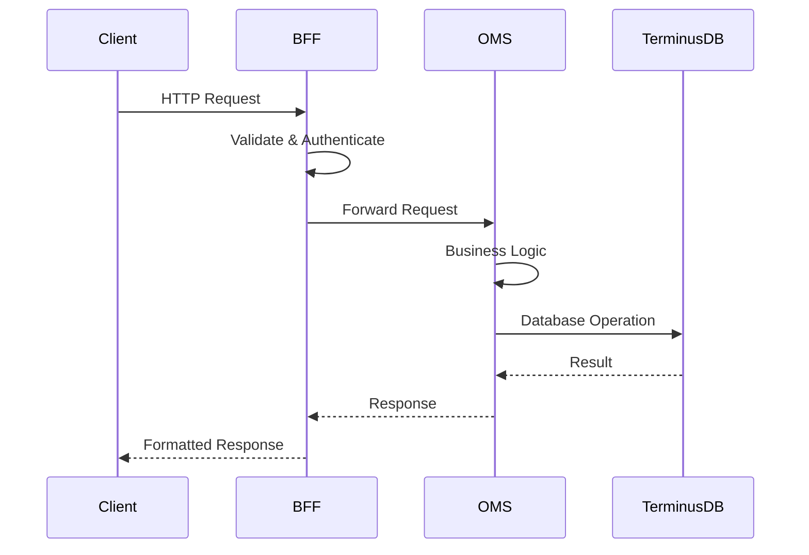
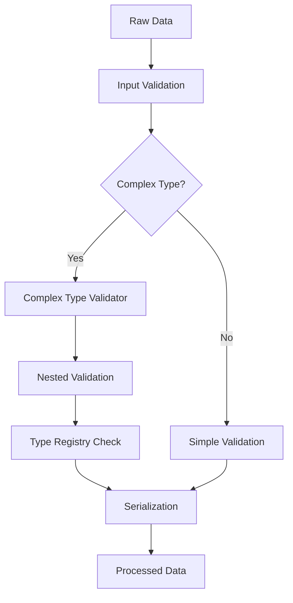

# SPICE HARVESTER - Detailed Architecture Documentation

## Table of Contents
1. [System Overview](#system-overview)
2. [Architecture Principles](#architecture-principles)
3. [System Components](#system-components)
4. [Data Flow](#data-flow)
5. [Technology Stack](#technology-stack)
6. [API Architecture](#api-architecture)
7. [Database Architecture](#database-architecture)
8. [Security Architecture](#security-architecture)
9. [Deployment Architecture](#deployment-architecture)

## System Overview

SPICE HARVESTER is a production-grade microservices architecture implementation inspired by Palantir Foundry, designed for complex data management and ontology-driven operations.

### Key Features
- **Microservices Architecture**: Modular services with clear separation of concerns
- **Ontology-Driven Design**: Flexible data modeling with semantic relationships
- **Complex Type System**: Advanced validation and serialization for nested data structures
- **Multi-language Support**: Comprehensive internationalization capabilities
- **Production-Ready**: Built with scalability, security, and reliability in mind

## Architecture Principles

### 1. Domain-Driven Design (DDD)
- Clear bounded contexts for each service
- Rich domain models with business logic encapsulation
- Value objects for immutable data representations

### 2. API-First Design
- OpenAPI 3.0 specification for all endpoints
- Consistent RESTful patterns
- Comprehensive error handling

### 3. Security by Design
- Input validation at every layer
- RBAC (Role-Based Access Control) implementation
- Secure communication between services

## System Components

### 1. Backend for Frontend (BFF) Service
**Purpose**: Acts as an API gateway and aggregation layer for frontend applications

**Key Responsibilities**:
- Request routing and orchestration
- Response formatting and aggregation
- Cross-cutting concerns (authentication, logging)
- API versioning and compatibility

**Components**:
```
backend-for-frontend/
├── main.py                 # FastAPI application entry point
├── routers/               # API route handlers
│   ├── database.py        # Database operations
│   ├── ontology.py        # Ontology management
│   ├── mapping.py         # Label mapping operations
│   └── query.py           # Query operations
├── middleware/            # Cross-cutting concerns
│   └── rbac.py           # Role-based access control
├── services/              # Business logic
│   └── oms_client.py     # OMS service client
└── schemas/               # Pydantic models
```

### 2. Ontology Management Service (OMS)
**Purpose**: Core service for managing ontologies, schemas, and data relationships

**Key Responsibilities**:
- Ontology CRUD operations
- Version control for schemas
- Relationship management
- Complex type validation

**Components**:
```
ontology-management-service/
├── entities/              # Domain models
│   ├── ontology.py       # Ontology entity
│   └── label_mapping.py  # Label mapping entity
├── services/              # Business services
│   ├── async_terminus.py # Async database operations
│   └── relationship_manager.py # Relationship handling
├── validators/            # Domain validators
│   └── relationship_validator.py
└── utils/                 # Utility functions
    ├── circular_reference_detector.py
    └── relationship_path_tracker.py
```

### 3. Shared Components
**Purpose**: Common utilities and models used across services

**Components**:
```
shared/
├── models/                # Shared domain models
│   ├── common.py         # Common base models
│   ├── ontology.py       # Ontology models
│   └── requests.py       # Request/response models
├── validators/            # Shared validators
│   └── complex_type_validator.py
├── serializers/           # Data serialization
│   └── complex_type_serializer.py
├── exceptions/            # Custom exceptions
├── middleware/            # Shared middleware
└── utils/                 # Utility functions
```

## Data Flow

### 1. Request Flow


### 2. Complex Type Processing


## Technology Stack

### Backend
- **Language**: Python 3.9+
- **Framework**: FastAPI
- **Async**: asyncio, httpx
- **Validation**: Pydantic
- **Testing**: pytest, pytest-asyncio

### Database
- **Primary**: TerminusDB (Graph Database)
- **Features**: 
  - ACID compliance
  - Version control
  - JSON-LD support
  - WOQL query language

### Infrastructure
- **Containerization**: Docker
- **Orchestration**: Docker Compose
- **API Documentation**: OpenAPI/Swagger
- **Monitoring**: Health check endpoints

## API Architecture

### RESTful Design
All APIs follow RESTful principles with consistent patterns:

```
GET    /api/v1/{resource}          # List resources
POST   /api/v1/{resource}          # Create resource
GET    /api/v1/{resource}/{id}     # Get specific resource
PUT    /api/v1/{resource}/{id}     # Update resource
DELETE /api/v1/{resource}/{id}     # Delete resource
```

### API Versioning
- Version in URL path: `/api/v1/`, `/api/v2/`
- Backward compatibility maintained
- Deprecation notices in headers

### Error Handling
Consistent error response format:
```json
{
    "error": {
        "code": "VALIDATION_ERROR",
        "message": "Invalid input data",
        "details": {
            "field": "email",
            "reason": "Invalid email format"
        },
        "timestamp": "2024-01-18T10:30:00Z",
        "request_id": "req_123456"
    }
}
```

## Database Architecture

### TerminusDB Schema Design
```javascript
// Example Ontology Schema
{
    "@type": "Class",
    "@id": "Production",
    "name": "xsd:string",
    "created_at": "xsd:dateTime",
    "metadata": "sys:JSON",
    "relationships": {
        "@type": "Set",
        "@class": "Relationship"
    }
}
```

### Relationship Management
- Bidirectional relationship tracking
- Circular reference detection
- Relationship path optimization
- Cascade operations support

## Security Architecture

### Authentication & Authorization
- JWT-based authentication
- Role-Based Access Control (RBAC)
- Permission-based resource access
- API key management for service-to-service

### Input Validation
- Schema validation at API layer
- Business rule validation at service layer
- SQL injection prevention
- XSS protection

### Data Security
- Encryption at rest
- TLS for data in transit
- Sensitive data masking
- Audit logging

## Deployment Architecture

### Container Architecture
```yaml
services:
  bff:
    image: spice-harvester/bff:latest
    ports:
      - "8080:8080"
    environment:
      - OMS_URL=http://oms:8000
    depends_on:
      - oms
      
  oms:
    image: spice-harvester/oms:latest
    ports:
      - "8000:8000"
    environment:
      - TERMINUS_URL=http://terminusdb:6363
    depends_on:
      - terminusdb
      
  terminusdb:
    image: terminusdb/terminusdb-server:latest
    ports:
      - "6363:6363"
    volumes:
      - terminus_data:/app/terminusdb/storage
```

### Scaling Strategy
- Horizontal scaling for BFF service
- Read replicas for database
- Load balancing with health checks
- Circuit breaker pattern for resilience

### Monitoring & Observability
- Health check endpoints
- Structured logging
- Metrics collection
- Distributed tracing support

## Development Workflow

### Local Development
```bash
# Start all services
docker-compose up

# Run tests
pytest backend/tests/

# Generate architecture diagrams
python generate_architecture.py
```

### Testing Strategy
- Unit tests for business logic
- Integration tests for API endpoints
- End-to-end tests for critical flows
- Performance tests for scalability

### CI/CD Pipeline
1. Code commit triggers tests
2. Build Docker images
3. Run integration tests
4. Deploy to staging
5. Run smoke tests
6. Deploy to production

## Future Enhancements

### Planned Features
1. GraphQL API support
2. Real-time subscriptions
3. Advanced caching layer
4. Machine learning integration
5. Enhanced monitoring dashboard

### Scalability Roadmap
1. Kubernetes deployment
2. Multi-region support
3. Event-driven architecture
4. CQRS implementation
5. Microservices mesh

---

*This document is maintained alongside the codebase. For the latest architecture diagrams, see the auto-generated [Architecture README](./architecture/README.md).*