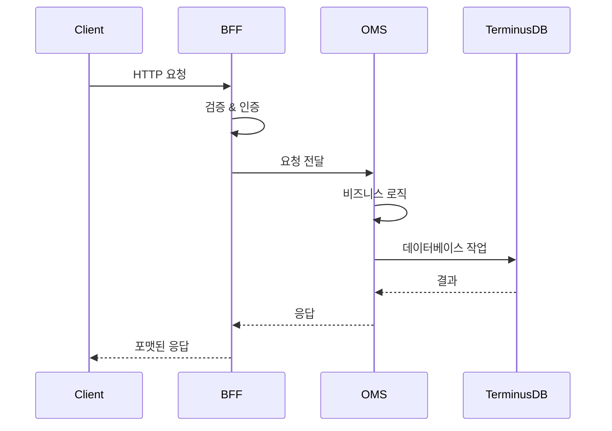
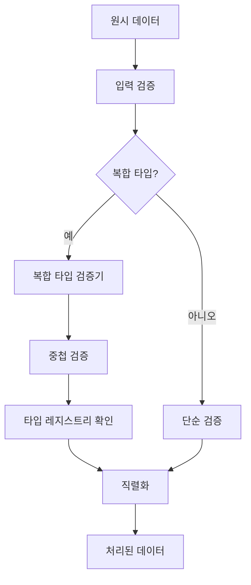
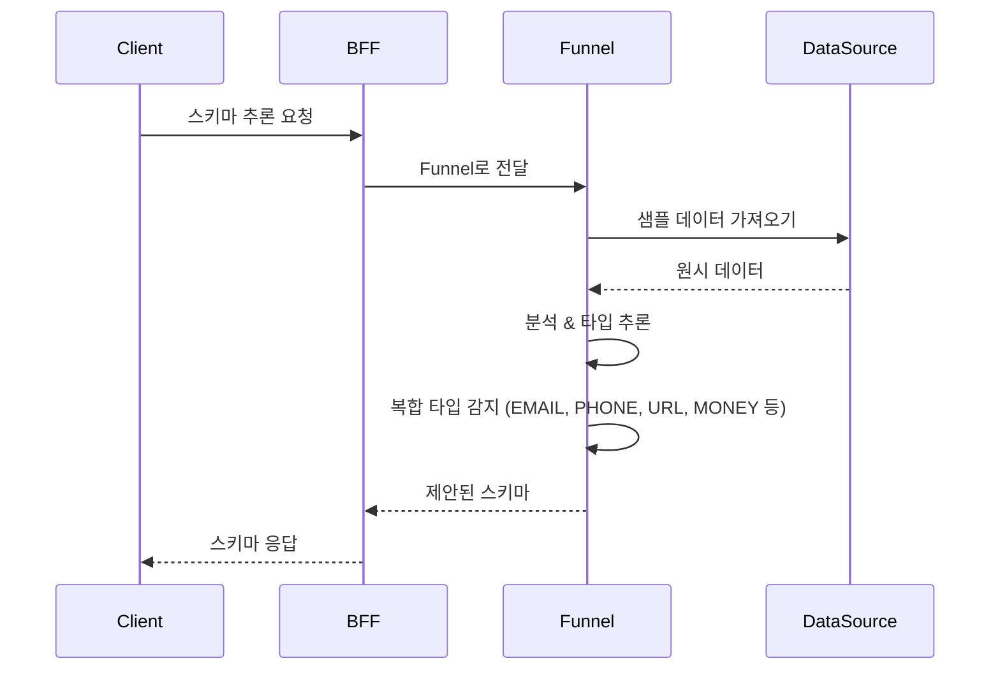

# SPICE HARVESTER - 상세 아키텍처 문서

## 목차
1. [시스템 개요](#시스템-개요)
2. [아키텍처 원칙](#아키텍처-원칙)
3. [시스템 구성요소](#시스템-구성요소)
4. [데이터 흐름](#데이터-흐름)
5. [기술 스택](#기술-스택)
6. [API 아키텍처](#api-아키텍처)
7. [데이터베이스 아키텍처](#데이터베이스-아키텍처)
8. [보안 아키텍처](#보안-아키텍처)
9. [배포 아키텍처](#배포-아키텍처)

## 시스템 개요

SPICE HARVESTER는 복잡한 데이터 관리와 온톨로지 기반 운영을 위해 설계된 프로덕션급 마이크로서비스 아키텍처 구현입니다.

### 주요 기능
- **마이크로서비스 아키텍처**: 명확한 관심사 분리를 통한 모듈식 서비스
- **온톨로지 중심 설계**: 의미론적 관계를 활용한 유연한 데이터 모델링
- **복합 타입 시스템**: 중첩 데이터 구조를 위한 고급 검증 및 직렬화
- **다국어 지원**: 포괄적인 국제화 기능
- **프로덕션 준비 완료**: 확장성, 보안성, 신뢰성을 고려한 설계

## 아키텍처 원칙

### 1. 도메인 주도 설계 (DDD)
- 각 서비스별 명확한 경계 컨텍스트
- 비즈니스 로직이 캡슐화된 풍부한 도메인 모델
- 불변 데이터 표현을 위한 값 객체
- 마이크로서비스 간 명확한 책임 분리

### 2. API 우선 설계
- 모든 엔드포인트에 대한 OpenAPI 3.0 사양
- 일관된 RESTful 패턴
- 포괄적인 오류 처리

### 3. 보안 중심 설계
- 모든 계층에서의 입력 검증
- RBAC (역할 기반 접근 제어) 구현
- 서비스 간 보안 통신

## 시스템 구성요소

### 1. 프론트엔드를 위한 백엔드 (BFF) 서비스
**목적**: 프론트엔드 애플리케이션을 위한 API 게이트웨이 및 집계 계층

**주요 책임**:
- 요청 라우팅 및 오케스트레이션
- 응답 포맷팅 및 집계
- 횡단 관심사 처리 (인증, 로깅)
- API 버전 관리 및 호환성

**구성요소**:
```
bff/
├── main.py                 # FastAPI 애플리케이션 진입점 (Port: 8002)
├── routers/               # API 라우트 핸들러
│   ├── database.py        # 데이터베이스 작업
│   ├── ontology.py        # 온톨로지 관리 (스키마 제안 포함)
│   ├── mapping.py         # 라벨 매핑 작업
│   ├── query.py           # 쿼리 작업
│   ├── merge_conflict.py  # 병합 충돌 처리
│   └── health.py          # 헬스 체크 엔드포인트
├── middleware/            # 횡단 관심사
│   └── rbac.py           # 역할 기반 접근 제어
├── services/              # 비즈니스 로직
│   ├── oms_client.py     # OMS 서비스 클라이언트
│   ├── funnel_client.py   # Funnel 서비스 클라이언트
│   └── funnel_type_inference_adapter.py  # 타입 추론 어댑터
├── schemas/               # Pydantic 모델
│   └── label_mapping_schema.py
└── utils/                 # 유틸리티 함수
    ├── conflict_converter.py
    └── label_mapper.py
```

### 2. 온톨로지 관리 서비스 (OMS)
**목적**: 온톨로지, 스키마 및 데이터 관계 관리를 위한 핵심 서비스

**주요 책임**:
- 온톨로지 CRUD 작업
- 스키마 버전 관리
- 관계 관리 및 Property-to-Relationship 자동 변환
- 복합 타입 검증
- 고급 제약조건 추출 및 검증
- TerminusDB v11.x 모든 스키마 타입 지원

**구성요소**:
```
oms/
├── main.py                # FastAPI 애플리케이션 진입점 (Port: 8000)
├── entities/              # 도메인 모델
│   ├── ontology.py       # 온톨로지 엔티티
│   └── label_mapping.py  # 라벨 매핑 엔티티
├── routers/               # API 라우트 핸들러
│   ├── branch.py         # 브랜치 작업
│   ├── database.py       # 데이터베이스 작업
│   ├── ontology.py       # 온톨로지 관리
│   └── version.py        # 버전 관리
├── services/              # 비즈니스 서비스
│   ├── async_terminus.py # 비동기 데이터베이스 작업
│   ├── relationship_manager.py # 관계 처리
│   └── property_to_relationship_converter.py # Property→Relationship 자동 변환
├── validators/            # 도메인 검증기
│   └── relationship_validator.py
├── utils/                 # 유틸리티 함수
│   ├── circular_reference_detector.py
│   ├── relationship_path_tracker.py
│   ├── constraint_extractor.py # 제약조건 추출 및 검증
│   └── terminus_schema_types.py # TerminusDB v11.x 스키마 타입 지원
├── dependencies.py        # 의존성 주입
└── exceptions.py          # 예외 처리
```

### 3. Funnel 서비스
**목적**: 외부 데이터 소스에 대한 타입 추론 및 스키마 제안 서비스

**주요 책임**:
- 자동 데이터 타입 감지
- 스키마 생성 및 검증
- Google Sheets 및 CSV 파일 지원
- 복합 타입 추론 (EMAIL, PHONE, URL, MONEY 등)

**구성요소**:
```
funnel/
├── main.py                # FastAPI 애플리케이션 진입점 (Port: 8004)
├── routers/               # API 라우트 핸들러
│   └── type_inference_router.py  # 타입 추론 엔드포인트
├── services/              # 비즈니스 로직
│   ├── data_processor.py  # 데이터 처리 로직
│   ├── type_inference.py  # 타입 추론 알고리즘
│   └── type_inference_adapter.py  # 외부 데이터 어댑터
├── models.py              # Funnel 전용 모델
└── tests/                 # 테스트 스위트
    └── test_type_inference.py
```

### 4. 공유 컴포넌트
**목적**: 서비스 간 공통으로 사용되는 유틸리티 및 모델

**구성요소**:
```
shared/
├── config/                # 서비스 구성
│   ├── service_config.py # 서비스 레벨 설정 (포트, URL 중앙 관리)
│   └── __init__.py
├── dependencies/          # 의존성 주입
│   └── type_inference.py # 공유 타입 추론
├── interfaces/            # 서비스 인터페이스
│   └── type_inference.py # 타입 추론 인터페이스
├── models/                # 공유 도메인 모델
│   ├── common.py         # 공통 기본 모델
│   ├── ontology.py       # 온톨로지 모델
│   ├── requests.py       # 요청/응답 모델
│   ├── config.py         # 구성 모델
│   ├── google_sheets.py  # Google Sheets 모델
│   └── responses.py      # API 응답 모델
├── validators/            # 공유 검증기
│   └── complex_type_validator.py
├── serializers/           # 데이터 직렬화
│   └── complex_type_serializer.py
├── security/              # 보안 유틸리티
│   └── input_sanitizer.py
└── utils/                 # 유틸리티 함수
    ├── jsonld.py         # JSON-LD 유틸리티
    ├── language.py       # 언어 처리
    └── logging.py        # 로깅 구성
```

## 데이터 흐름

### 1. 요청 흐름


### 2. 복합 타입 처리


### 3. 타입 추론 흐름 (Funnel 서비스)


## 기술 스택

### 백엔드
- **언어**: Python 3.9+
- **프레임워크**: FastAPI
- **비동기**: asyncio, httpx
- **검증**: Pydantic
- **테스트**: pytest, pytest-asyncio
- **타입 추론**: pandas, numpy (복합 타입 감지)

### 데이터베이스
- **주 데이터베이스**: TerminusDB (그래프 데이터베이스)
- **기능**: 
  - ACID 준수
  - 버전 관리
  - JSON-LD 지원
  - WOQL 쿼리 언어

### 인프라스트럭처
- **컨테이너화**: Docker
- **오케스트레이션**: Docker Compose
- **API 문서화**: OpenAPI/Swagger
- **모니터링**: 헬스 체크 엔드포인트
- **보안**: HTTPS 지원, CORS 자동 설정

## API 아키텍처

### RESTful 설계
모든 API는 일관된 패턴으로 RESTful 원칙을 따릅니다:

```
GET    /api/v1/{resource}          # 리소스 목록 조회
POST   /api/v1/{resource}          # 리소스 생성
GET    /api/v1/{resource}/{id}     # 특정 리소스 조회
PUT    /api/v1/{resource}/{id}     # 리소스 업데이트
DELETE /api/v1/{resource}/{id}     # 리소스 삭제
```

### API 버전 관리
- URL 경로에 버전 포함: `/api/v1/`, `/api/v2/`
- 하위 호환성 유지
- 헤더에 사용 중단 알림

### 오류 처리
일관된 오류 응답 형식:
```json
{
    "error": {
        "code": "VALIDATION_ERROR",
        "message": "잘못된 입력 데이터",
        "details": {
            "field": "email",
            "reason": "잘못된 이메일 형식"
        },
        "timestamp": "2024-01-18T10:30:00Z",
        "request_id": "req_123456"
    }
}
```

## 데이터베이스 아키텍처

### TerminusDB 스키마 설계
```javascript
// 온톨로지 스키마 예시
{
    "@type": "Class",
    "@id": "Production",
    "name": "xsd:string",
    "created_at": "xsd:dateTime",
    "metadata": "xsd:string", // sys:JSON -> xsd:string으로 변경
    "relationships": {
        "@type": "Set",
        "@class": "Relationship"
    },
    // 고급 타입 지원 예시
    "location": {
        "@type": "Optional",
        "@class": "xsd:geoPoint"
    },
    "tags": {
        "@type": "Set",
        "@class": "xsd:string"
    },
    "status": {
        "@type": "Enum",
        "@value": ["draft", "published", "archived"]
    }
}
```

### 관계 관리
- 양방향 관계 추적
- 순환 참조 감지
- 관계 경로 최적화
- 계단식 작업 지원

## 보안 아키텍처

### 인증 및 권한 부여
- JWT 기반 인증
- 역할 기반 접근 제어 (RBAC)
- 권한 기반 리소스 접근
- 서비스 간 통신을 위한 API 키 관리

### 입력 검증
- API 계층에서의 스키마 검증
- 서비스 계층에서의 비즈니스 규칙 검증
- SQL 인젝션 방지
- XSS 보호

### 데이터 보안
- 저장 데이터 암호화
- 전송 중 데이터를 위한 TLS
- 민감 데이터 마스킹
- 감사 로깅

## 배포 아키텍처

### 컨테이너 아키텍처
```yaml
services:
  bff:
    image: spice-harvester/bff:latest
    ports:
      - "8002:8002"
    environment:
      - OMS_URL=http://oms:8000
      - FUNNEL_URL=http://funnel:8004
    depends_on:
      - oms
      - funnel
      
  oms:
    image: spice-harvester/oms:latest
    ports:
      - "8000:8000"
    environment:
      - TERMINUS_URL=http://terminusdb:6364
    depends_on:
      - terminusdb
      
  funnel:
    image: spice-harvester/funnel:latest
    ports:
      - "8004:8004"
    environment:
      - BFF_URL=http://bff:8002
      
  terminusdb:
    image: terminusdb/terminusdb-server:latest
    ports:
      - "6364:6364"
    volumes:
      - terminus_data:/app/terminusdb/storage
```

### 확장 전략
- BFF 서비스의 수평 확장
- 데이터베이스 읽기 복제본
- 헬스 체크를 포함한 로드 밸런싱
- 복원력을 위한 서킷 브레이커 패턴

### 모니터링 및 관찰성
- 헬스 체크 엔드포인트
- 구조화된 로깅
- 메트릭 수집
- 분산 추적 지원

## 개발 워크플로우

### 로컬 개발
```bash
# 환경 설정
cd backend
cp .env.example .env

# 모든 서비스 시작 (방법 1)
docker-compose up

# 또는 개별 실행 (방법 2)
python start_services.py

# 테스트 실행
pytest tests/
```

### 테스트 전략
- 비즈니스 로직을 위한 단위 테스트
- API 엔드포인트를 위한 통합 테스트
- 중요 플로우를 위한 엔드투엔드 테스트
- 확장성을 위한 성능 테스트

### CI/CD 파이프라인
1. 코드 커밋이 테스트 트리거
2. Docker 이미지 빌드
3. 통합 테스트 실행
4. 스테이징 배포
5. 스모크 테스트 실행
6. 프로덕션 배포

## 향후 개선사항

### 계획된 기능
1. GraphQL API 지원
2. 실시간 구독
3. 고급 캐싱 레이어
4. 머신러닝 통합
5. 향상된 모니터링 대시보드
6. 더 많은 데이터 소스 커넥터 (Excel, API 등)
7. 고급 제약조건 UI 편집기
8. 스키마 마이그레이션 도구

### 확장성 로드맵
1. Kubernetes 배포
2. 다중 리전 지원
3. 이벤트 기반 아키텍처
4. CQRS 구현
5. 마이크로서비스 메시

---

*이 문서는 코드베이스와 함께 유지관리됩니다. 최신 아키텍처 다이어그램은 자동 생성된 [아키텍처 README](./architecture/README.md)를 참조하세요.*

**최종 업데이트**: 2025-07-20