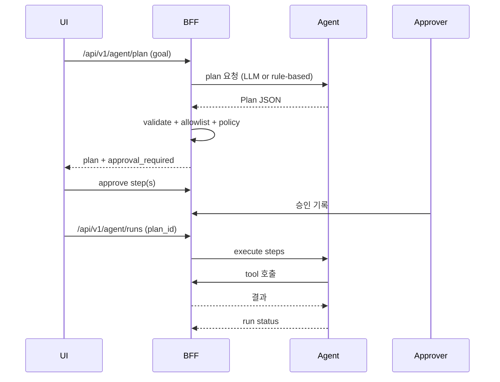

# LangGraph 확장 설계 (Planner/Allowlist/Approval) — SPICE-Harvester

> 기준: 현재 코드 구조 (`backend/agent`, `backend/bff`)  
> 목표: LangGraph에 **플래너 노드 + 툴 allowlist + 승인 게이트**를 추가하되,  
> **BFF 단일 진입점**과 **Event SSoT/감사/라인리지** 불변성을 유지한다.

---

## 0) TL;DR

- **Planner**는 LLM이 아니라 “검증 가능한 JSON 계획”을 만든다. 계획은 서버에서 강제 검증된다.
- **툴 allowlist**는 “BFF 경유만” 허용하며, 역할/환경/브랜치에 따라 실행 가능한 경로가 달라진다.
- **승인 게이트**는 write/위험 작업을 사람 승인 없이 실행하지 못하게 막는다.
- **실행**은 기존 Agent runtime의 순차 step executor를 유지하고, 정책/승인/제한 체크를 추가한다.
- **감사/라인리지**는 Agent 이벤트와 audit log를 분리 저장하며, 모든 행위에 책임 주체를 남긴다.
- **상태**: 설계 문서이며, 구현은 단계적으로 진행한다.

---

## 1) 현재 구현 베이스라인 (코드 기준)

- Agent는 **순차 step executor**다. (`backend/agent/services/agent_graph.py`)
- Agent는 **BFF만 호출**하며 `/api/v1/agent/*` 경로는 자체 차단한다. (`backend/agent/services/agent_runtime.py`)
- BFF는 `X-Spice-Caller: agent` 호출을 **agent proxy에서 차단**해 루프를 막는다. (`backend/bff/routers/agent_proxy.py`)
- 내부 호출은 **Agent service token**을 사용한다. (`backend/bff/middleware/auth.py`)
- Agent 이벤트는 core Event Store와 **분리된 버킷**에 기록한다. (`AGENT_EVENT_STORE_BUCKET` → `EVENT_STORE_BUCKET`)
- LLM은 현재 **읽기 전용 계획/요약**만 제공한다. (`backend/bff/routers/ai.py`)

---

## 2) 설계 목표 / 비목표

### 목표
- 자연어 요청을 **안전한 계획(JSON)** 으로 변환.
- 서버에서 계획을 **정적 검증 + 정책 검사** 후 실행.
- 위험 작업은 **명시적 승인** 없이는 불가.
- 모든 실행을 **감사/라인리지**로 추적.

### 비목표
- Agent가 OMS/Funnel을 **직접 호출**하도록 확장하지 않는다.
- 온톨로지 자동 생성/머지를 **무승인으로 실행**하지 않는다.
- Planner가 **실행 자체를** 결정하지 않는다. (결정은 서버/승인)

---

## 3) 확장 구성요소 (To-Be)

### 3.1 Planner Node

**역할**  
자연어 요청 → **Plan JSON** 생성 (단, 서버가 강제 검증).

**입력**  
- 사용자 질문
- 스키마 요약(라벨/관계) — BFF에서 안전하게 추출
- 범위 힌트(db/branch/role/limit)

**출력(요약)**  
- `plan_id`, `steps[]`, `requires_approval`, `data_scope`, `risk_level`
- 실행 가능한 **툴 ID**만 사용 (URL 직접 지정 금지)

### 3.2 Tool Registry + Allowlist

**핵심 원칙**  
- Tool은 **BFF 엔드포인트**만 등록 가능.
- Tool은 `role`, `env`, `branch`, `risk` 제한을 가진다.

**예시 스펙**
```json
{
  "tool_id": "pipeline.preview",
  "method": "POST",
  "path": "/api/v1/pipelines/{pipeline_id}/preview",
  "risk": "read",
  "roles": ["DataEngineer", "Admin"],
  "requires_idempotency_key": false,
  "max_payload_bytes": 200000
}
```

### 3.3 Approval Gate

**대상**
- write/merge/delete/publish 등 side-effect 작업
- 보호된 브랜치(write) 또는 정책 위반 후보

**상태 모델**
- `PENDING → APPROVED → EXECUTED`
- `PENDING → REJECTED`
- `PENDING → EXPIRED`

**보관**
- Postgres에 plan snapshot + step hash 저장
- 승인자는 반드시 **actor**로 기록

### 3.4 Execution Orchestrator (Agent Runtime 확장)

**기존 유지**
- 순차 step 실행 (LangGraph loop)

**추가**
- 실행 전 `allowlist` + `approval` + `policy` 검증
- `idempotency_key` 강제 (write 작업)
- 실패 시 **중단/롤백** 정책 적용

### 3.5 Audit / Lineage 통합

- 모든 step의 **입력/출력 digest** 기록 (PII 마스킹)
- `run_id`, `plan_id`, `step_id`, `actor`, `request_id`를 audit log에 저장
- dataset/pipeline/objectify와 연결해 lineage 추적

### 3.6 인증 주체 vs 요청 주체 (필수 계약)

- **인증 주체**: `BFF_AGENT_TOKEN` 기반 service token으로 BFF 인증
- **요청 주체**: `X-Actor`, `X-User-*` 헤더로 delegated actor 기록
- **Rate limit**: 내부 agent 호출은 별도 버킷 또는 우회 정책 적용

---

## 4) Plan Schema (제안)

스키마 구현: `backend/shared/models/agent_plan.py`

```json
{
  "plan_id": "uuid",
  "goal": "자연어 목표",
  "requires_approval": true,
  "risk_level": "write",
  "data_scope": { "db_name": "demo", "branch": "main" },
  "steps": [
    {
      "step_id": "s1",
      "tool_id": "pipeline.preview",
      "method": "POST",
      "path_params": { "pipeline_id": "..." },
      "query": {},
      "body": { "node_id": "..." },
      "requires_approval": false,
      "expected_output": "preview sample"
    },
    {
      "step_id": "s2",
      "tool_id": "pipeline.deploy",
      "requires_approval": true,
      "idempotency_key": "..."
    }
  ],
  "policy_notes": ["protected branch"],
  "created_at": "iso8601"
}
```

---

## 5) 실행 플로우 (요약)



---

## 6) 정책 매트릭스 (예시)

| 작업 유형 | allowlist | 승인 | 비고 |
| --- | --- | --- | --- |
| Read-only query | 자동 허용 | 불필요 | rate limit만 적용 |
| Pipeline preview | 허용 | 불필요 | 샘플 제한 |
| Pipeline deploy | 허용 | **필수** | 보호 브랜치 강제 |
| Ontology write | 허용 | **필수** | OMS write 경유 |
| External connector | 허용 | **필수** | 토큰/스코프 검증 |

### 6.1 Risk Level ↔ Tool 범주 매핑 (제안)

| Risk | 예시 tool 범주 | 승인 |
| --- | --- | --- |
| read | query/preview/describe | 불필요 |
| write | create/update/deploy | 필수 |
| admin | policy/replay/override | 필수 |
| destructive | delete/rollback/drop | 필수 + 추가 확인 |

---

## 7) 안전장치

- **Tool injection 방어**: planner 출력의 URL/메서드 직접 실행 금지, tool_id만 허용
- **Loop 방지**: Agent의 `/api/v1/agent/*` 호출 차단 + BFF proxy 차단 유지
- **PII 최소화**: 샘플/헤더만 전달, payload digest 기록
- **환경 분리**: dev/preview는 정책 완화 가능, prod는 stricter

---

## 8) 단계적 도입 (권장)

1) **Plan-only**: 계획 생성 + 검증 + UI 표시 (실행 없음)
2) **Read-only 실행**: allowlist 기반 실행 (승인 없음)
3) **Write + 승인**: plan 승인 후 실행
4) **고급 게이트**: 품질/스키마 드리프트/보상 롤백

---

## 9) 코드 반영 포인트 (현 구조 기준)

- Agent runtime 확장: `backend/agent/services/agent_runtime.py`
- Agent graph 확장: `backend/agent/services/agent_graph.py`
- Tool registry/allowlist: `backend/bff` 또는 `backend/shared`
- 승인 저장소: Postgres schema (새 테이블)
- 정책 검증: `backend/bff/middleware/auth.py` + 신규 policy module
- 환경 변수 표준: `BFF_AGENT_TOKEN` (인증, alias: `AGENT_BFF_TOKEN`), `AGENT_EVENT_STORE_BUCKET` (agent 이벤트 버킷)

---

## 10) 결정 요약

- **Planner는 추천**이고, 실행은 **서버 정책 + 승인**이 결정한다.
- **BFF 단일 진입점**을 유지하며, Agent는 오케스트레이터다.
- **감사/라인리지**는 모든 자동 행위의 책임성을 보장한다.

---

## 11) Plan/Approval 저장소 계약 (제안)

Planner/Approval 확장에 필요한 최소 상태 저장 계약을 명시한다.
실제 구현 시점까지는 문서 계약으로만 유지한다.

- `agent_runs`: `run_id`, `plan_id`, `status`, `started_at`, `finished_at`, `requester`, `delegated_actor`, `risk_level`
- `agent_steps`: `run_id`, `step_id`, `tool_id`, `status`, `command_id`/`task_id`, `input_digest`, `output_digest`, `error`
- `agent_approvals`: `plan_id`, `step_id?`, `approved_by`, `approved_at`, `decision`, `comment`
