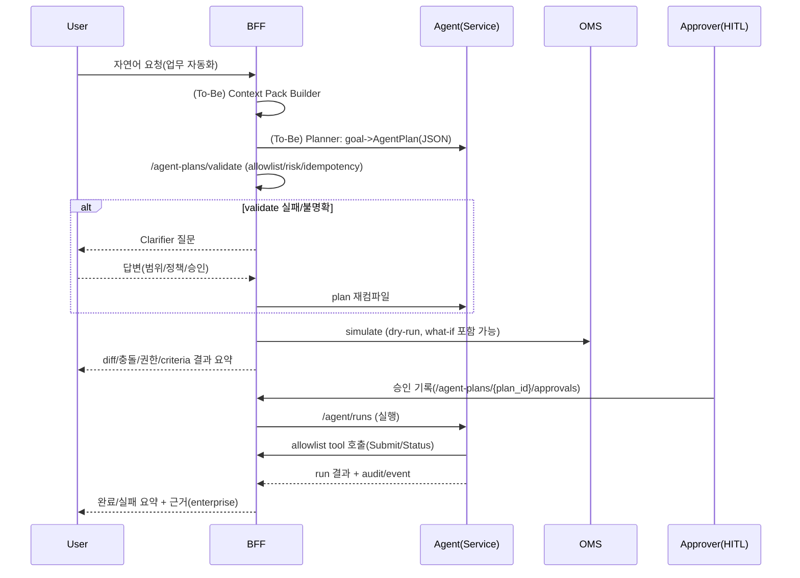

# LLM-Native Control Plane 설계 (Write Planner / Operational Memory / Policy E2E Evals) — SPICE-Harvester

> 업데이트: 2026-01-13  
> 대상: Backend/Platform, DevOps/SRE, Security, PO/PM  
> 목표: 현재 아키텍처(결정론적 코어 + 정책/승인/감사)를 유지하면서, LLM을 **“대화형 컴파일러(Planner)”** 로 올려 **더 높은 자동화율**과 **더 안전한 운영 자동화**를 달성한다.

---

## Table of Contents

- [0) TL;DR](#0-tldr)
- [1) 핵심 철학: LLM-native의 정의](#1-핵심-철학-llm-native의-정의)
- [2) 현재 구현 베이스라인(코드 정합성)](#2-현재-구현-베이스라인코드-정합성)
- [3) 구현 1: Write Planner Graph](#3-구현-1-write-planner-graph)
- [4) 구현 2: Operational Memory 레이어](#4-구현-2-operational-memory-레이어)
- [5) 구현 3: E2E 정책 회귀 테스트](#5-구현-3-e2e-정책-회귀-테스트)
- [6) 단계별 로드맵(P0/P1/P2)](#6-단계별-로드맵p0p1p2)
- [7) 리스크/트레이드오프](#7-리스크트레이드오프)
- [8) 오픈 퀘스천](#8-오픈-퀘스천)

---

## 0) TL;DR

- LLM-native는 “LLM이 마음대로 실행”이 아니라, **LLM이 “계획(Plan)”을 생성**하고 시스템이 **검증/정책/승인/시뮬레이션**으로 실행을 강제하는 구조다.
- 따라서 핵심 구현은 3개:
  1) **Write Planner Graph**: 자연어 → `AgentPlan` 생성 + Clarifier 루프 + *항상* `simulate→approve→submit`
  2) **Operational Memory**: `ActionLog`/`ActionSimulation`/`AgentRun`을 검색 가능한 객체 그래프로 만들고, LLM에 “안전한 컨텍스트 팩” 제공
  3) **E2E Policy Evals**: enterprise error taxonomy → 실행 분기/최종 상태가 절대 흔들리지 않게 회귀 테스트로 고정

---

## 1) 핵심 철학: LLM-native의 정의

### 1.1 Control Plane vs Data Plane

- **Data Plane(결정론 실행면)**: 저장/변환/검증/머지/overlay/materialize처럼 재현성이 핵심인 영역  
  → LLM을 끼우지 않는다(혹은 “추천”만).  
- **Control Plane(의사결정 제어면)**: 계획(Plan), 승인(Approval), 정책(Policy), 시뮬레이션(Preview), 실행 오케스트레이션(Run)  
  → LLM은 여기서 “대화형 컴파일러” 역할을 한다.

### 1.2 Typed Artifacts(스키마 있는 객체) 원칙

LLM이 다루는 산출물은 항상 스키마가 있는 객체여야 한다.
- `AgentPlan` (plan JSON)
- `ActionSimulation` (versioned preview)
- `ActionLog` (executed decision)
- `AgentRun`/`AgentStep`/`AgentApproval` (orchestration + HITL)
- `EnterpriseError` (error taxonomy payload)

이 원칙을 지키면:
- LLM이 “말”을 해도, 시스템은 **컴파일/검증 실패**로 처리할 수 있고
- 모든 결정은 **재현 가능**하게 된다(왜 그렇게 분기했는지).

---

## 2) 현재 구현 베이스라인(코드 정합성)

### 2.1 Agent Runtime (Sequential Step Executor)

- 순차 step executor + retry 분기: `backend/agent/services/agent_run_loop.py`
- enterprise taxonomy 기반 정책 분기(재시도/중단/권한 요청 등): `backend/agent/services/agent_policy.py`
- tool 실행은 BFF만 허용, 헤더 allowlist + payload size cap + audit 이벤트 기록: `backend/agent/services/agent_runtime.py`

### 2.2 Tool Allowlist + Plan Validation + Approval Recording

- Plan 스키마(typed): `backend/shared/models/agent_plan.py`
- Plan validate(allowlist/risk/idempotency_key): `backend/bff/services/agent_plan_validation.py`
- Validate API + approval 기록 API: `backend/bff/routers/agent_plans.py`
- Tool allowlist 레지스트리(Postgres): `backend/shared/services/agent_tool_registry.py`
- Tool policy admin API: `backend/bff/routers/agent_tools.py`

> 주의: 현재 “Plan 자체의 영속 저장(Plan Registry)”는 최소 구현 상태이며, 실행(run)은 `plan_snapshot`을 `agent_runs`에 저장한다. (`backend/shared/services/agent_registry.py`)

### 2.3 Action Writeback Simulation (simulate-first 기반)

- BFF simulate: `POST /api/v1/databases/{db_name}/actions/{action_type_id}/simulate`  
  구현: `backend/bff/routers/actions.py`
- OMS simulate(dry-run): `POST /api/v1/actions/{db_name}/async/{action_type_id}/simulate`  
  구현: `backend/oms/routers/action_async.py`
- 시뮬레이션 버전 저장소(Postgres): `backend/shared/services/action_simulation_registry.py`
- Level 2 what-if(안전한 상태 주입) 포함:
  - `assumptions.targets[].base_overrides` (counterfactual base)
  - `assumptions.targets[].observed_base_overrides` (stale-read 가정으로 conflict 유발)
  - 금지 필드/삭제 금지/주입 필드 목록 결과에 명시/마스킹 유지

---

## 3) 구현 1: Write Planner Graph

### 3.1 목표

사용자 자연어 요청을 “실행 가능한 계획”으로 바꾸되, 엔터프라이즈 안전을 위해:
- **서버가 검증할 수 있는 JSON Plan**만 생성
- write가 포함되면 **무조건 simulate→approve→submit**
- 실패는 `enterprise` 정책으로 “기계적 처방”으로 분기

### 3.1.1 현재 구현 API (정합성)

- Plan 컴파일: `POST /api/v1/agent-plans/compile`
  - 성공 시 `AgentPlanRegistry`에 `COMPILED`로 저장
  - Operational Memory context pack(안전 요약)을 자동 생성해 Planner 입력에 포함
  - 컴파일 결과에 `compilation_report`(PlanCompilationReport) 포함: errors/warnings + 서버 제안 patch
  - **서버는 auto-applicable patch를 자동 적용**(bounded)하고 재검증한다. 적용 내역은 `validation_warnings`에 `server_auto_applied_patches`로 노출한다.
- Plan 조회: `GET /api/v1/agent-plans/{plan_id}`
- Plan 미리보기(Preview-safe step만 실행): `POST /api/v1/agent-plans/{plan_id}/preview`
  - `simulate`/`GET`/read-risk만 실행하고 submit/write 단계 전에 중단
- Plan 실행(승인 필요): `POST /api/v1/agent-plans/{plan_id}/execute`
  - `requires_approval=true`인 경우 승인 기록 없이는 403
- 승인 기록: `POST /api/v1/agent-plans/{plan_id}/approvals`
- 서버 제안 patch 적용: `POST /api/v1/agent-plans/{plan_id}/apply-patch`
  - 서버가 반환한 patch(RFC6902-ish)를 사용자가 “명시적으로 수락”한 경우에만 적용
  - 적용 후 재검증하여 `COMPILED`/`DRAFT` 상태로 갱신

### 3.2 To-Be: Planner Graph의 역할 분리

Planner Graph는 “LLM을 끼워도 안전한” 경계를 명확히 한다.

- (A) **Planner(LLM)**: goal → Plan 후보 생성(툴 ID만 사용)
- (B) **Compiler/Validator(서버)**: allowlist/risk/idempotency/정책 검증
- (C) **Clarifier(LLM+서버)**: 검증 실패/불확실 변수 → 질문 생성 → 답 수집 → 재컴파일
- (D) **Execution(Agent runtime)**: 승인 후 실행 + 실패 정책 분기

### 3.3 핵심 설계: Clarifier 루프

LLM-native에서 “지능”은 답을 맞추는 게 아니라 **되묻는 품질**이다.

#### 불확실 변수의 대표 예시
- 대상 DB/branch/기간/오브젝트 타입이 불명확
- “적용”인지 “시뮬레이션만”인지 불명확
- conflict_policy, overlay_branch/base_branch가 불명확
- “권한이 필요한 작업”인지 여부가 불명확

#### Clarifier 입력(추천)
- 사용자 요청
- `AgentPlanValidationResult.errors/warnings` (BFF validate 결과)
- `data_scope` 힌트(사용자 세션/최근 작업)
- Operational Memory context pack(최근 유사 작업)

#### Clarifier 출력(권장 스키마)
```json
{
  "questions": [
    {
      "id": "q1",
      "question": "어느 DB에 적용할까요?",
      "required": true,
      "type": "enum",
      "options": ["demo", "prod-1"],
      "default": "demo"
    }
  ],
  "assumptions": ["simulate-first enforced"],
  "warnings": ["writes require approval"]
}
```

### 3.4 simulate→approve→submit 강제 규칙(Write Preflight Enforcer)

Planner가 실수해도 시스템이 안전해야 한다. 따라서 서버가 규칙을 강제한다.

#### 규칙(권장)
- Plan에 write 성격(step.method in POST/PUT/PATCH/DELETE)이 포함되면:
  1) **동일 목표에 대응하는 simulate step이 선행**해야 한다.
  2) simulate 결과가 “write 가능”을 충족해야 한다:
     - submission_criteria / validation_rules / governance gate 통과
     - conflict policy 결과가 REJECTED가 아님(또는 인간 승인으로 수동 해결 경로)
  3) `plan.requires_approval=true` + 승인 기록 없이는 submit 불가

#### 구현 정합성(현재 있는 구성요소)
- simulate 엔드포인트가 이미 존재(OMS/BFF)
- approval 기록 API가 이미 존재(BFF)
- agent executor가 이미 존재(Agent service)

> To-Be(추가 권장): validate 단계에서 “simulate missing”을 errors로 반환하거나, normalize로 simulate step 자동 삽입(투명성 이슈가 있으므로 일반적으로는 reject+수정이 더 안전).

#### PlanCompilationReport(Reject + Patch 제안) — 구현 정합성
- validate/compile은 단순 errors/warnings가 아니라, **서버가 왜 reject했는지 / 어떤 수정이 필요한지**를 `compilation_report`로 구조화 반환한다.
- 기본 동작은 **reject(투명성/안전)** 이지만, 서버가 “통과 가능한 수정안”을 patch로 제안한다.
- 사용자는 patch를 검토하고 수락할지 결정하며, 수락 시에만 `apply-patch`로 적용한다.

### 3.5 실행 플로우(요약)



---

## 4) 구현 2: Operational Memory 레이어

### 4.1 목표

운영 자동화를 “진짜”로 만들려면, LLM이 매번 즉흥적으로 판단하지 않고:
- 과거의 결정(ActionLog),
- 실행 전 미리보기(ActionSimulation),
- 에이전트 실행/승인 기록(AgentRun/Approval),
- 실패 패턴(EnterpriseError),
을 **검색/요약/재사용**해야 한다.

### 4.2 As-Is: Memory 원천 데이터(이미 존재)

- ActionLog(Postgres): `spice_action_logs.ontology_action_logs`  
  코드: `backend/shared/services/action_log_registry.py`
- ActionSimulation(Postgres): `spice_action_simulations.*`  
  코드: `backend/shared/services/action_simulation_registry.py`
- AgentRun/Step/Approval(Postgres): `spice_agent.*`  
  코드: `backend/shared/services/agent_registry.py`
- Agent audit/event: 별도 Event Store bucket에 기록(PII 마스킹 + digest)

### 4.3 To-Be: Operational Knowledge Graph(OKG) 모델

Operational Memory는 “SSoT”가 아니라 **파생 인덱스(derived index)** 여야 한다.
- 원천: ActionLog/Simulation/AgentRegistry
- 인덱스: OKG(그래프) + Search(키워드/벡터)

#### 최소 엔티티(권장)
- `Decision`: ActionLog
- `Simulation`: ActionSimulationVersion
- `Run`: AgentRun
- `Step`: AgentStep
- `Approval`: AgentApproval
- `PolicySnapshot`: enterprise catalog fingerprint + tool allowlist snapshot

#### 최소 엣지(권장)
- `Simulation -> previews -> Decision`
- `Decision -> executed_by -> Run`
- `Run -> has_step -> Step`
- `Approval -> approves -> Plan/Step`
- `Decision/Simulation -> has_error -> EnterpriseErrorOccurrence`

> 구현 우선순위: P0에서는 “그래프 DB”까지 가지 말고, Postgres 조인 + JSONB로 context pack을 구성해도 충분히 강력하다.  
> P1부터 OKG 테이블/인덱스를 도입하고, 필요 시 ES 벡터 인덱스(또는 Context7)에 연결한다.

### 4.4 Context Pack Builder(LLM 입력용 “안전한 팩”)

LLM-native에서 가장 중요한 안전장치 중 하나는 **컨텍스트 팩의 품질/안전성**이다.

#### 입력(예시)
- `db_name`, `actor`, `goal`, `candidate_action_type_id`, `class_id`, `time_window`

#### 출력(예시)
```json
{
  "schema_context": {"db_name":"demo","classes":[...],"...":"..."},
  "recent_simulations": [{"simulation_id":"...","version":3,"summary":"...","outcome":"REJECTED"}],
  "recent_decisions": [{"action_log_id":"...","status":"SUCCEEDED","summary":"..."}],
  "failure_patterns": [{"enterprise_code":"SHV-ACT-...","prescription":"request_human"}],
  "policy_snapshot": {"catalog_fingerprint":"...","tool_allowlist_hash":"..."}
}
```

#### 안전 규칙(필수)
- **데이터 최소화**: 원문 전체/PII 원문 금지
- **정책 마스킹 유지**: data_access 정책(row/column) 적용  
  - simulate 응답에서 마스킹을 적용하듯, memory 조회에도 동일하게 적용해야 한다.
- **재현성**: `catalog_fingerprint`, `plan_snapshot_digest`를 포함해 “왜 이런 결정을 추천했는지” 재현 가능하게.

#### 현재 구현(정합성)
- Context pack builder: `backend/bff/services/operational_memory.py`
  - `recent_decisions`: ActionLog(본인 제출, 요약만)
  - `recent_simulations`: ActionSimulation(본인 생성, 최신 버전 요약만)
  - `policy_snapshot`: enterprise catalog fingerprint + tool allowlist hash
- Debug/검증용 API: `POST /api/v1/agent-plans/context-pack`
  - 실 데이터/원문/패치셋을 반환하지 않고, Planner 입력과 동일한 안전 요약을 제공

---

## 5) 구현 3: E2E 정책 회귀 테스트

### 5.1 목표

LLM-native는 프롬프트가 변해도 “안전성/정책 분기”가 흔들리면 끝이다.  
따라서 “LLM 출력의 품질”을 테스트하지 말고, **정책의 결과(분기/금지/승인 요구)** 를 고정한다.

### 5.2 As-Is: 이미 있는 기반 테스트

- Agent graph retry 분기 테스트(StubRuntime): `backend/tests/unit/services/test_agent_graph_retry.py`
- Agent policy 분기 테스트: `backend/tests/unit/services/test_agent_policy.py`, `backend/tests/unit/services/test_agent_overlay_policy.py`
- Enterprise taxonomy coverage test(코드-like literal 누락 방지): `backend/tests/unit/errors/test_error_taxonomy_coverage.py`

### 5.3 To-Be: “최종 상태/엣지” 고정 테스트(강화 포인트)

#### (A) Policy Golden Matrix 테스트
입력: enterprise payload(+signals)  
출력: `family`, `recommended_action`, `safe_to_auto_retry`, `human_required` 등

특히 `submission_criteria_failed`는 reason에 따라 처방이 갈라져야 한다:
- `missing_role` → `request_access`
- `state_mismatch` → `check_state` (또는 선행 액션)

#### (B) Graph Path 테스트
입력: steps + stub 결과 시퀀스  
검증: 에러/정책에 따라 어떤 실행 분기 및 `final_state`가 되는지 고정

예:
- retryable timeout → `retry` edge → 성공
- overlay_degraded → write 금지 → `safe_mode` 경로로 종료(자동 실행 금지)

#### (C) simulate-first + approval gate 테스트(계약 테스트)
Planner/Plan이 어떻게 생겼든, “write는 simulate→approve→submit”이 깨지지 않음을 보장한다.

> 현재는 설계 단계이며, 구현 시점에 validate 레이어(서버)가 이 규칙을 강제하고 해당 규칙을 테스트로 고정한다.

#### (D) 정책 드리프트 감지(카탈로그/allowlist hash)
- Enterprise catalog fingerprint / allowlist bundle hash를 테스트에 “핀”하여,
  정책 변경 시 반드시 테스트/문서 업데이트가 동반되도록 CI에서 강제한다.

---

## 6) 단계별 로드맵(P0/P1/P2)

### P0 (가치/안전 가장 큼, 구현 난이도 중간)
- Write Planner Graph “Plan-only + Validate + Clarifier” (실행은 수동 트리거)
- simulate-first 강제 규칙(서버 validate 레이어에서)
- Policy Golden Matrix + Graph Path 테스트 강화

### P1 (운영 지능 강화)
- Context Pack Builder (Postgres 기반, 마스킹 포함)
- Agent/Action/Simulation/Approval 간 링크 강화(검색/필터)
- 운영 지표(승인율/실패 패턴/재시도 수렴률) 대시보드화

### P2 (조직 기억/메타인지)
- OKG(Operational Knowledge Graph) 파생 인덱스 + (선택) 벡터 검색
- “왜 이 결정을 추천했는지” 설명(근거 링크) 자동 생성
- 정책 학습(사람 승인 패턴 기반 추천) — 단, “정책 결정” 자체는 여전히 서버 고정

---

## 7) 리스크/트레이드오프

- **Planner가 똑똑해질수록 위험해지는 것**: tool injection / scope overreach  
  → 해결: tool_id allowlist + plan validate + payload cap + approval + simulate-first
- **Operational Memory가 커질수록 위험해지는 것**: 정보 유출/PII 확산  
  → 해결: data_access 마스킹, digest 기반 저장, 최소 컨텍스트 팩, 재빌드 가능한 파생 인덱스
- **Evals 비용**: 정책/그래프 테스트는 유지 비용이 든다  
  → 해결: Golden Matrix를 “enterprise catalog 변경”과 함께 업데이트하는 프로세스 확립

---

## 8) 오픈 퀘스천

1) Plan Registry(Plan을 별도 테이블로 버전 관리) 도입 여부  
   - 장점: approvals/run과 강결합, 재현성 향상  
   - 단점: 스키마/운영 복잡도 증가
2) Context Pack 저장소 선택(Postgres 파생 vs ES/Context7 인덱스)  
3) simulate-first 강제 방식: validate에서 reject vs normalize로 자동 삽입  
4) 정책 변경 권한/승인(enterprise catalog 업데이트, tool allowlist 변경) 운영 프로세스
