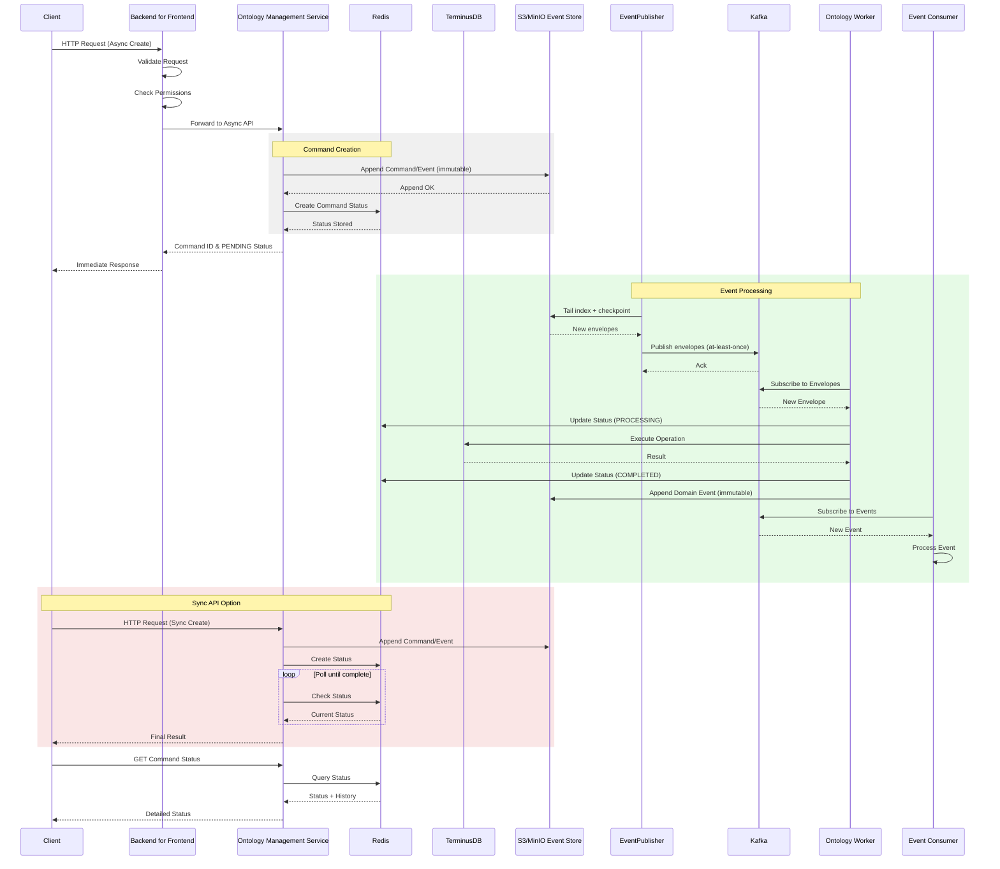

# SPICE HARVESTER Architecture

> Auto-generated on 2025-07-18 10:41:34  
> Updated on 2025-08-05 - Command/Event Sourcing & Redis Integration
>
> NOTE (2025-12): Legacy Postgres 기반 delivery-buffer는 제거되었습니다. 현재 실사용 경로는 **S3/MinIO Event Store(SSoT) + EventPublisher(S3 tail → Kafka)** 이며, PostgreSQL은 **`processed_events`(멱등 레지스트리) + write-side seq allocator** 용도로만 사용합니다. (`docs/IDEMPOTENCY_CONTRACT.md`)

## Overview

This document contains architecture diagrams for the SPICE HARVESTER project. The architecture now includes:

- **Command/Event Sourcing Pattern**: Complete separation of Commands (intent) from Events (results)
- **Redis-based Status Tracking**: Real-time command status monitoring with history
- **Synchronous API Wrapper**: Convenience APIs with configurable timeouts
- **S3/MinIO Event Store (SSoT)**: Immutable append-only envelopes + durable checkpoints
- **EventPublisher (S3 tail → Kafka)**: At-least-once publishing with best-effort dedup
- **Kafka Message Broker**: Reliable message delivery with retry logic
- **Multi-Worker Architecture**: Ontology, Instance, and Projection workers for distributed processing
- **CQRS with Elasticsearch**: Search-optimized projections with real-time indexing
- **Consumer Idempotency**: Postgres `processed_events` registry + per-aggregate `sequence_number` ordering
- **Fault Tolerance**: DLQ pattern with retry logic and circuit breaker patterns

## Class Diagrams

### Backend Classes

```mermaid
classDiagram
    %% SPICE HARVESTER Comprehensive Backend Architecture
    
    %% Core Application Layer
    class FastAPIApplication {
        +FastAPI app
        +List~Router~ routers
        +List~Middleware~ middleware
        +Config config
        +startup() Task
        +shutdown() Task
        +include_routers() None
        +add_middleware() None
    }
    
    %% Domain Models
    class Production {
        +String id
        +String name
        +DateTime created_at
        +DateTime updated_at
        +Dict metadata
        +List~Relationship~ relationships
        +validate() bool
        +to_dict() Dict
        +from_dict() Production
    }
    
    class Ontology {
        +String id
        +String name
        +String version
        +Dict schema
        +List~Class~ classes
        +List~Property~ properties
        +validate_schema() bool
        +get_class() Class
        +add_property() None
    }
    
    class Relationship {
        +String id
        +String source_id
        +String target_id
        +String relationship_type
        +Dict properties
        +DateTime created_at
        +validate_circular() bool
        +get_path() List
    }
    
    %% Service Layer
    class OntologyManagementService {
        +AsyncTerminusClient terminus_client
        +RelationshipManager relationship_manager
        +create_ontology() Ontology
        +update_ontology() Ontology
        +delete_ontology() bool
        +get_ontology() Ontology
        +list_ontologies() List~Ontology~
        +validate_relationships() bool
    }
    
    class BackendForFrontend {
        +OMSClient oms_client
        +LabelMapper label_mapper
        +ResponseFormatter formatter
        +aggregate_data() Dict
        +format_response() Response
        +handle_error() ErrorResponse
        +map_labels() Dict
    }
    
    class AsyncTerminusService {
        +String terminus_url
        +HTTPXClient http_client
        +ConnectionPool pool
        +execute_woql() Result
        +create_database() bool
        +get_document() Document
        +update_document() bool
        +delete_document() bool
    }
    
    %% Command/Event Sourcing Layer
    class RedisService {
        +ConnectionPool pool
        +Redis client
        +connect() None
        +disconnect() None
        +set_command_status() None
        +get_command_status() Dict
        +publish_command_update() None
        +subscribe_command_updates() PubSub
    }
    
    class CommandStatusService {
        +RedisService redis_service
        +create_command_status() None
        +update_status() bool
        +start_processing() bool
        +complete_command() bool
        +fail_command() bool
        +get_command_details() Dict
    }
    
    class SyncWrapperService {
        +CommandStatusService status_service
        +wait_for_command() SyncResult
        +execute_sync() SyncResult
        +poll_until_complete() Dict
    }
    
    class OntologyWorker {
        +Consumer kafka_consumer
        +Producer kafka_producer
        +RedisService redis_service
        +AsyncTerminusService terminus_service
        +process_command() None
        +handle_create_ontology() None
        +handle_update_ontology() None
        +handle_delete_ontology() None
    }
    
    class EventPublisher {
        +S3Client s3_client
        +KafkaProducer producer
        +load_checkpoint() Dict
        +save_checkpoint() None
        +tail_by_date_index() List
        +publish_events() None
    }
    
    %% Command/Event Models
    class BaseCommand {
        +UUID command_id
        +CommandType command_type
        +String aggregate_id
        +Dict payload
        +Dict metadata
        +DateTime created_at
    }
    
    class BaseEvent {
        +UUID event_id
        +EventType event_type
        +UUID command_id
        +Dict data
        +DateTime occurred_at
    }
    
    %% Complex Type System
    class ComplexTypeValidator {
        +Dict type_registry
        +List validation_rules
        +validate() bool
        +validate_nested() bool
        +register_type() None
        +get_validator() Validator
    }
    
    class ComplexTypeSerializer {
        +Dict serializers
        +serialize() str
        +deserialize() Any
        +register_serializer() None
        +handle_circular_refs() Dict
    }
    
    %% Utils and Helpers
    class RelationshipManager {
        +CircularReferenceDetector detector
        +RelationshipPathTracker tracker
        +create_relationship() Relationship
        +validate_relationship() bool
        +find_paths() List~Path~
        +detect_cycles() bool
    }
    
    class MultilingualText {
        +Dict~str, str~ translations
        +String default_language
        +get_text() str
        +set_text() None
        +get_languages() List~str~
        +validate() bool
    }
    
    %% Middleware
    class RBACMiddleware {
        +PermissionChecker checker
        +UserContext context
        +check_permission() bool
        +get_user_roles() List~Role~
        +enforce_policy() None
    }
    
    class ValidationMiddleware {
        +RequestValidator validator
        +validate_request() bool
        +validate_response() bool
        +sanitize_input() Dict
    }
    
    %% Relationships
    FastAPIApplication --> OntologyManagementService : uses
    FastAPIApplication --> BackendForFrontend : uses
    FastAPIApplication --> SyncWrapperService : uses
    OntologyManagementService --> AsyncTerminusService : uses
    OntologyManagementService --> RelationshipManager : uses
    OntologyManagementService --> CommandStatusService : uses
    BackendForFrontend --> ComplexTypeSerializer : uses
    BackendForFrontend --> ComplexTypeValidator : uses
    CommandStatusService --> RedisService : uses
    SyncWrapperService --> CommandStatusService : uses
    OntologyWorker --> RedisService : uses
    OntologyWorker --> AsyncTerminusService : uses
    OntologyWorker --> BaseCommand : processes
    OntologyWorker --> BaseEvent : publishes
    Production --> Relationship : has many
    Ontology --> Production : defines
    RelationshipManager --> Relationship : manages
    FastAPIApplication --> RBACMiddleware : applies
    FastAPIApplication --> ValidationMiddleware : applies
    MultilingualText --> ComplexTypeValidator : validated by
    BaseEvent --> BaseCommand : originated from
```



### Classes Spice Harvester

*Diagram generation pending for Classes Spice Harvester*

### Data Flow

```mermaid
graph TB
    %% Data Flow Architecture (Event Store Publisher)
    
    subgraph "Client Layer"
        Web[Web Application]
        Mobile[Mobile App]
        API[External API]
    end
    
    subgraph "API Gateway Layer"
        BFF[Backend for Frontend]
        Auth[Authentication]
        RateLimit[Rate Limiter]
    end
    
    subgraph "Service Layer"
        OMS[Ontology Management]
        Query[Query Service]
        Validator[Validation Service]
        Publisher[Event Publisher]
    end
    
    subgraph "Data Layer"
        Terminus[TerminusDB]
        EventStore[S3/MinIO<br/>Event Store (SSoT)]
        Registry[(PostgreSQL<br/>processed_events)]
        Cache[Redis Cache]
        Search[Search Index]
    end
    
    subgraph "Message Layer"
        Kafka[Apache Kafka]
        Consumers[Event Consumers]
    end
    
    %% Connections
    Web --> BFF
    Mobile --> BFF
    API --> BFF
    
    BFF --> Auth
    BFF --> RateLimit
    
    Auth --> OMS
    Auth --> Query
    
    OMS --> Validator
    Query --> Validator
    
    OMS --> Terminus
    OMS --> EventStore
    Query --> Terminus
    Query --> Cache
    
    EventStore --> Publisher
    Publisher --> Kafka
    Kafka --> Consumers
    
    Terminus --> Search
```

### Service Interactions



## EventPublisher + Idempotent Consumers

### Overview

SPICE HARVESTER uses **S3/MinIO Event Store(SSoT)** as the durable append-only log. An **EventPublisher** tails the event store and publishes envelopes to Kafka with **at-least-once delivery**. All consumers (workers/projections) are required to be **idempotent by `event_id`** and to enforce **per-aggregate ordering via `sequence_number`**.

### Architecture Evolution

#### Problem with Original Approach
```
OMS → TerminusDB (Transaction A) → (any external write) (Transaction B)
```
Two independent transactions cannot guarantee atomicity.

#### Solution: Event Store + Publisher + Idempotent Consumers
```
OMS/Workers → S3/MinIO (append-only envelopes) → EventPublisher → Kafka → Consumers
```

### Components

1. **S3/MinIO Event Store (SSoT)**: Stores command + domain envelopes and publisher checkpoints (append-only)
2. **OMS Service**: Appends command/request envelopes and tracks command status (Redis)
3. **EventPublisher**: S3 tail → Kafka (durable checkpoint, best-effort dedup, at-least-once)
4. **Workers / Projections**: Idempotent consumers; side effects guarded by `processed_events` + `sequence_number`
5. **Kafka**: Transport (at-least-once)

### Message Types

#### Commands (Intent)
- `CREATE_ONTOLOGY_CLASS`: Request to create a new ontology class
- `UPDATE_ONTOLOGY_CLASS`: Request to update an existing class
- `DELETE_ONTOLOGY_CLASS`: Request to delete a class

#### Events (Facts)
- `ONTOLOGY_CLASS_CREATED`: Ontology class was successfully created
- `ONTOLOGY_CLASS_UPDATED`: Ontology class was successfully updated
- `ONTOLOGY_CLASS_DELETED`: Ontology class was successfully deleted
- `COMMAND_FAILED`: Command execution failed

### Benefits

- **Perfect Atomicity**: Commands are stored in a single transaction
- **Distributed Transaction Solution**: No two-phase commit needed
- **Audit Trail**: Complete history of intentions and outcomes
- **Resilience**: Failed commands can be automatically retried
- **Scalability**: Workers can be scaled horizontally
- **Event Sourcing**: System state can be rebuilt from events

### Configuration

Key environment variables:
- `POSTGRES_*`: PostgreSQL connection settings (processed-event registry / seq-guard)
- `KAFKA_BOOTSTRAP_SERVERS`: Kafka broker addresses
- `EVENT_STORE_BUCKET`: S3/MinIO event store bucket (default: `spice-event-store`)
- `EVENT_PUBLISHER_BATCH_SIZE`: Index entries per batch (default: 200)
- `EVENT_PUBLISHER_POLL_INTERVAL`: Polling interval in seconds (default: 3)
- `EVENT_PUBLISHER_CHECKPOINT_KEY`: S3 checkpoint key (default: `checkpoints/event_publisher.json`)

### API Usage

#### 1. Async API (Production Recommended)
```bash
# Submit command and get immediate response
POST /api/v1/ontology/mydb/async/create
{
  "id": "Person",
  "label": "Person"
}

Response:
{
  "command_id": "550e8400-e29b-41d4-a716-446655440000",
  "status": "PENDING"
}

# Check command status
GET /api/v1/ontology/mydb/async/command/550e8400.../status
Response:
{
  "command_id": "550e8400-e29b-41d4-a716-446655440000",
  "status": "COMPLETED",
  "result": {
    "progress": 100,
    "history": [...],
    "result": {...}
  }
}
```

#### 2. Sync API (Convenience Wrapper)
```bash
# Submit and wait for completion (with timeout)
POST /api/v1/ontology/mydb/sync/create?timeout=30&poll_interval=0.5
{
  "id": "Person",
  "label": "Person"
}

Response (Success):
{
  "status": "success",
  "message": "Successfully created ontology class 'Person'",
  "data": {
    "command_id": "550e8400...",
    "execution_time": 2.5,
    "result": {...}
  }
}

Response (Timeout):
HTTP 408 Request Timeout
{
  "detail": {
    "message": "Operation timed out after 30 seconds",
    "command_id": "550e8400...",
    "hint": "Check status using the async API"
  }
}

# Wait for existing command
GET /api/v1/ontology/mydb/sync/command/550e8400.../wait?timeout=30
```

#### 3. Legacy Direct API (Limited Use)
```bash
POST /api/v1/ontology/mydb/create
# Direct TerminusDB operation (use with caution - no status tracking)
```
