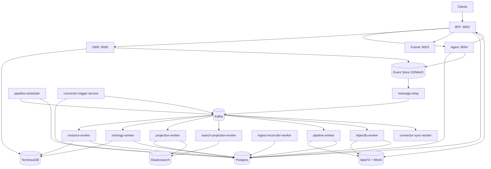
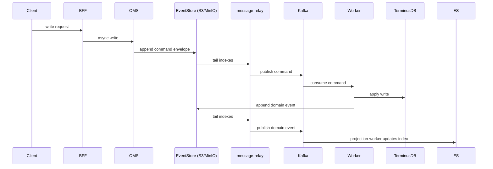
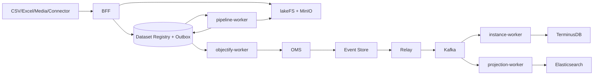
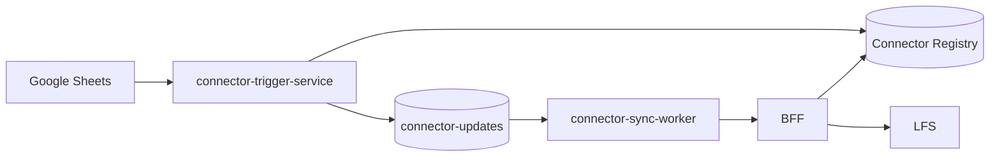

# SPICE HARVESTER Architecture Diagrams (Current)

> Updated: 2026-01-08  
> Canonical architecture reference: `docs/ARCHITECTURE.md`  
> This file focuses on diagrams and major flows that match the current code and `docker-compose.full.yml`.

## 1) Service Topology

Notes:
- BFF runs dataset/objectify outbox workers in-process.
- search-projection-worker is optional (`ENABLE_SEARCH_PROJECTION=false` by default).
- Agent service is internal; it executes LangGraph runs, calls BFF for actions, and logs events/audit trails to S3/Postgres.

## 2) Event Sourcing Write Path

## 3) Data Plane (Ingest -> Pipeline -> Objectify)

Notes:
- Pipeline steps include filter/join/compute/cast/dedupe/aggregate with schema contracts and expectations.
- Objectify submits async bulk instance commands to OMS.

## 4) Connector Flow (Google Sheets)

## 5) Read/Query Path

- Primary read model: Elasticsearch projection.
- Graph queries combine TerminusDB traversal + ES document fetch.
- Fallback to OMS/TerminusDB when ES is unavailable.
- Access policy may mask/filter rows/fields in read responses.
- Audit/Lineage queries are served by BFF from Postgres.

## 6) Idempotency & Ordering

- Global idempotency key: `event_id` (same id produces side effects once).
- Aggregate ordering: `sequence_number` with `expected_seq` OCC guard.
- `ProcessedEventRegistry` ensures consumer idempotency and ordering.

## 7) Where to look in code

- `backend/bff/`: API gateway and orchestration
- `backend/oms/`: TerminusDB control + async write APIs
- `backend/agent/`: LangGraph agent runtime + audit/event logging
- `backend/pipeline_worker/`: Spark pipeline execution
- `backend/objectify_worker/`: mapping spec -> instance creation
- `backend/connector_trigger_service/`, `backend/connector_sync_worker/`: connector ingest flow
- `backend/message_relay/`: S3 tail -> Kafka publisher
