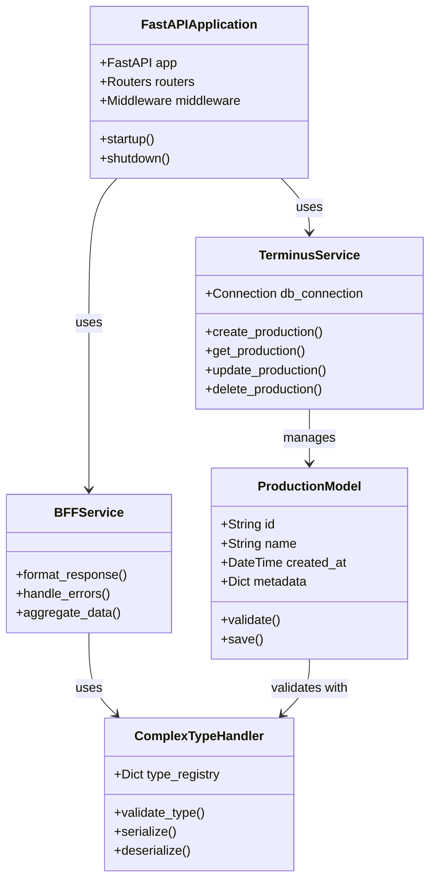

# SPICE HARVESTER Architecture

> Auto-generated on 2025-07-18 10:27:31

## Overview

This document contains automatically generated architecture diagrams for the SPICE HARVESTER project.

## Class Diagrams

### Backend Classes

### Classes Spice Harvester

*Diagram generation pending for Classes Spice Harvester*

