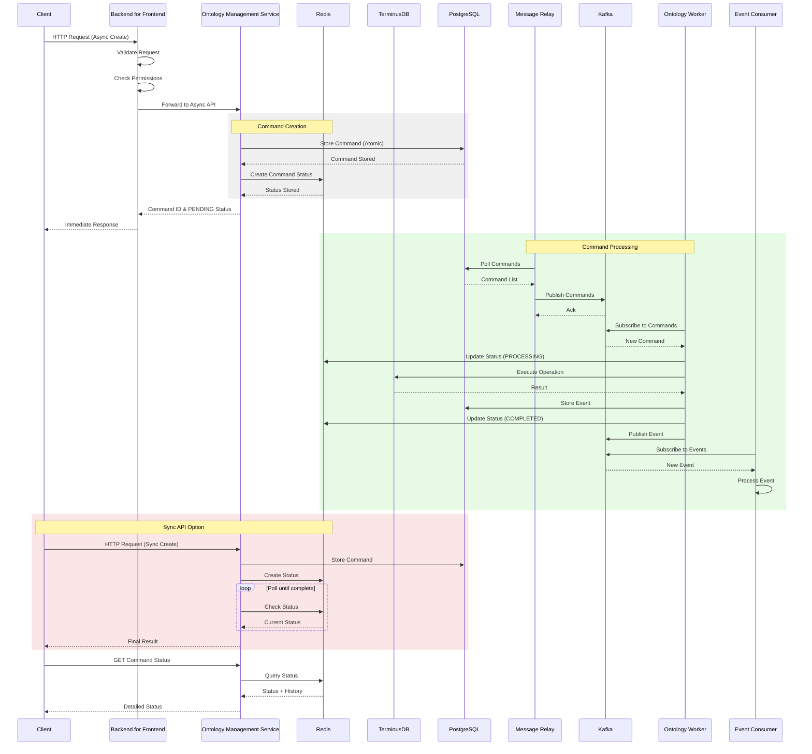

# SPICE HARVESTER Architecture

> Auto-generated on 2025-07-18 10:41:34  
> Updated on 2025-08-05 - Command/Event Sourcing & Redis Integration

## Overview

This document contains architecture diagrams for the SPICE HARVESTER project. The architecture now includes:

- **Command/Event Sourcing Pattern**: Complete separation of Commands (intent) from Events (results)
- **Redis-based Status Tracking**: Real-time command status monitoring with history
- **Synchronous API Wrapper**: Convenience APIs with configurable timeouts
- **Enhanced Outbox Pattern**: Support for both Commands and Events
- **Kafka Message Broker**: Reliable message delivery with retry logic
- **Ontology Worker Service**: Asynchronous command processing

## Class Diagrams

### Backend Classes

```mermaid
classDiagram
    %% SPICE HARVESTER Comprehensive Backend Architecture
    
    %% Core Application Layer
    class FastAPIApplication {
        +FastAPI app
        +List~Router~ routers
        +List~Middleware~ middleware
        +Config config
        +startup() Task
        +shutdown() Task
        +include_routers() None
        +add_middleware() None
    }
    
    %% Domain Models
    class Production {
        +String id
        +String name
        +DateTime created_at
        +DateTime updated_at
        +Dict metadata
        +List~Relationship~ relationships
        +validate() bool
        +to_dict() Dict
        +from_dict() Production
    }
    
    class Ontology {
        +String id
        +String name
        +String version
        +Dict schema
        +List~Class~ classes
        +List~Property~ properties
        +validate_schema() bool
        +get_class() Class
        +add_property() None
    }
    
    class Relationship {
        +String id
        +String source_id
        +String target_id
        +String relationship_type
        +Dict properties
        +DateTime created_at
        +validate_circular() bool
        +get_path() List
    }
    
    %% Service Layer
    class OntologyManagementService {
        +AsyncTerminusClient terminus_client
        +RelationshipManager relationship_manager
        +create_ontology() Ontology
        +update_ontology() Ontology
        +delete_ontology() bool
        +get_ontology() Ontology
        +list_ontologies() List~Ontology~
        +validate_relationships() bool
    }
    
    class BackendForFrontend {
        +OMSClient oms_client
        +LabelMapper label_mapper
        +ResponseFormatter formatter
        +aggregate_data() Dict
        +format_response() Response
        +handle_error() ErrorResponse
        +map_labels() Dict
    }
    
    class AsyncTerminusService {
        +String terminus_url
        +HTTPXClient http_client
        +ConnectionPool pool
        +execute_woql() Result
        +create_database() bool
        +get_document() Document
        +update_document() bool
        +delete_document() bool
    }
    
    %% Command/Event Sourcing Layer
    class RedisService {
        +ConnectionPool pool
        +Redis client
        +connect() None
        +disconnect() None
        +set_command_status() None
        +get_command_status() Dict
        +publish_command_update() None
        +subscribe_command_updates() PubSub
    }
    
    class CommandStatusService {
        +RedisService redis_service
        +create_command_status() None
        +update_status() bool
        +start_processing() bool
        +complete_command() bool
        +fail_command() bool
        +get_command_details() Dict
    }
    
    class SyncWrapperService {
        +CommandStatusService status_service
        +wait_for_command() SyncResult
        +execute_sync() SyncResult
        +poll_until_complete() Dict
    }
    
    class OntologyWorker {
        +Consumer kafka_consumer
        +Producer kafka_producer
        +RedisService redis_service
        +AsyncTerminusService terminus_service
        +process_command() None
        +handle_create_ontology() None
        +handle_update_ontology() None
        +handle_delete_ontology() None
    }
    
    class MessageRelayService {
        +PostgreSQL outbox_db
        +KafkaProducer producer
        +poll_outbox() None
        +publish_messages() None
        +handle_retry() None
    }
    
    %% Command/Event Models
    class BaseCommand {
        +UUID command_id
        +CommandType command_type
        +String aggregate_id
        +Dict payload
        +Dict metadata
        +DateTime created_at
    }
    
    class BaseEvent {
        +UUID event_id
        +EventType event_type
        +UUID command_id
        +Dict data
        +DateTime occurred_at
    }
    
    %% Complex Type System
    class ComplexTypeValidator {
        +Dict type_registry
        +List validation_rules
        +validate() bool
        +validate_nested() bool
        +register_type() None
        +get_validator() Validator
    }
    
    class ComplexTypeSerializer {
        +Dict serializers
        +serialize() str
        +deserialize() Any
        +register_serializer() None
        +handle_circular_refs() Dict
    }
    
    %% Utils and Helpers
    class RelationshipManager {
        +CircularReferenceDetector detector
        +RelationshipPathTracker tracker
        +create_relationship() Relationship
        +validate_relationship() bool
        +find_paths() List~Path~
        +detect_cycles() bool
    }
    
    class MultilingualText {
        +Dict~str, str~ translations
        +String default_language
        +get_text() str
        +set_text() None
        +get_languages() List~str~
        +validate() bool
    }
    
    %% Middleware
    class RBACMiddleware {
        +PermissionChecker checker
        +UserContext context
        +check_permission() bool
        +get_user_roles() List~Role~
        +enforce_policy() None
    }
    
    class ValidationMiddleware {
        +RequestValidator validator
        +validate_request() bool
        +validate_response() bool
        +sanitize_input() Dict
    }
    
    %% Relationships
    FastAPIApplication --> OntologyManagementService : uses
    FastAPIApplication --> BackendForFrontend : uses
    FastAPIApplication --> SyncWrapperService : uses
    OntologyManagementService --> AsyncTerminusService : uses
    OntologyManagementService --> RelationshipManager : uses
    OntologyManagementService --> CommandStatusService : uses
    BackendForFrontend --> ComplexTypeSerializer : uses
    BackendForFrontend --> ComplexTypeValidator : uses
    CommandStatusService --> RedisService : uses
    SyncWrapperService --> CommandStatusService : uses
    OntologyWorker --> RedisService : uses
    OntologyWorker --> AsyncTerminusService : uses
    OntologyWorker --> BaseCommand : processes
    OntologyWorker --> BaseEvent : publishes
    MessageRelayService --> BaseCommand : relays
    MessageRelayService --> BaseEvent : relays
    Production --> Relationship : has many
    Ontology --> Production : defines
    RelationshipManager --> Relationship : manages
    FastAPIApplication --> RBACMiddleware : applies
    FastAPIApplication --> ValidationMiddleware : applies
    MultilingualText --> ComplexTypeValidator : validated by
    BaseEvent --> BaseCommand : originated from
```



### Classes Spice Harvester

*Diagram generation pending for Classes Spice Harvester*

### Data Flow


### Service Interactions



## Outbox Pattern with Command/Event Sourcing

### Overview

The enhanced Outbox Pattern with Command/Event Sourcing solves the distributed transaction problem by separating intent (Commands) from results (Events). This ensures perfect atomicity and reliability in a microservices architecture.

### Architecture Evolution

#### Problem with Original Approach
```
OMS → TerminusDB (Transaction A) → PostgreSQL Outbox (Transaction B)
```
Two independent transactions cannot guarantee atomicity!

#### Solution: Command/Event Sourcing
```
OMS → PostgreSQL (Command) → Kafka → Worker → TerminusDB
                                          ↓
                                    PostgreSQL (Event) → Kafka → Consumers
```

### Components

1. **PostgreSQL Outbox Table**: Stores both Commands and Events
2. **OMS Service**: Only stores Commands (single transaction)
3. **Message Relay Service**: Publishes messages to Kafka
4. **Ontology Worker**: Processes Commands and executes TerminusDB operations
5. **Kafka**: Message broker for both Commands and Events
6. **Event Consumers**: Services that react to Events

### Message Types

#### Commands (Intent)
- `CREATE_ONTOLOGY_CLASS`: Request to create a new ontology class
- `UPDATE_ONTOLOGY_CLASS`: Request to update an existing class
- `DELETE_ONTOLOGY_CLASS`: Request to delete a class

#### Events (Facts)
- `ONTOLOGY_CLASS_CREATED`: Ontology class was successfully created
- `ONTOLOGY_CLASS_UPDATED`: Ontology class was successfully updated
- `ONTOLOGY_CLASS_DELETED`: Ontology class was successfully deleted
- `COMMAND_FAILED`: Command execution failed

### Benefits

- **Perfect Atomicity**: Commands are stored in a single transaction
- **Distributed Transaction Solution**: No two-phase commit needed
- **Audit Trail**: Complete history of intentions and outcomes
- **Resilience**: Failed commands can be automatically retried
- **Scalability**: Workers can be scaled horizontally
- **Event Sourcing**: System state can be rebuilt from events

### Configuration

Key environment variables:
- `POSTGRES_*`: PostgreSQL connection settings
- `KAFKA_BOOTSTRAP_SERVERS`: Kafka broker addresses
- `MESSAGE_RELAY_BATCH_SIZE`: Messages per batch (default: 100)
- `MESSAGE_RELAY_POLL_INTERVAL`: Polling interval in seconds (default: 5)

### API Usage

#### 1. Async API (Production Recommended)
```bash
# Submit command and get immediate response
POST /api/v1/ontology/mydb/async/create
{
  "id": "Person",
  "label": "Person"
}

Response:
{
  "command_id": "550e8400-e29b-41d4-a716-446655440000",
  "status": "PENDING"
}

# Check command status
GET /api/v1/ontology/mydb/async/command/550e8400.../status
Response:
{
  "command_id": "550e8400-e29b-41d4-a716-446655440000",
  "status": "COMPLETED",
  "result": {
    "progress": 100,
    "history": [...],
    "result": {...}
  }
}
```

#### 2. Sync API (Convenience Wrapper)
```bash
# Submit and wait for completion (with timeout)
POST /api/v1/ontology/mydb/sync/create?timeout=30&poll_interval=0.5
{
  "id": "Person",
  "label": "Person"
}

Response (Success):
{
  "status": "success",
  "message": "Successfully created ontology class 'Person'",
  "data": {
    "command_id": "550e8400...",
    "execution_time": 2.5,
    "result": {...}
  }
}

Response (Timeout):
HTTP 408 Request Timeout
{
  "detail": {
    "message": "Operation timed out after 30 seconds",
    "command_id": "550e8400...",
    "hint": "Check status using the async API"
  }
}

# Wait for existing command
GET /api/v1/ontology/mydb/sync/command/550e8400.../wait?timeout=30
```

#### 3. Legacy Direct API (Limited Use)
```bash
POST /api/v1/ontology/mydb/create
# Direct TerminusDB operation (use with caution - no status tracking)
```

