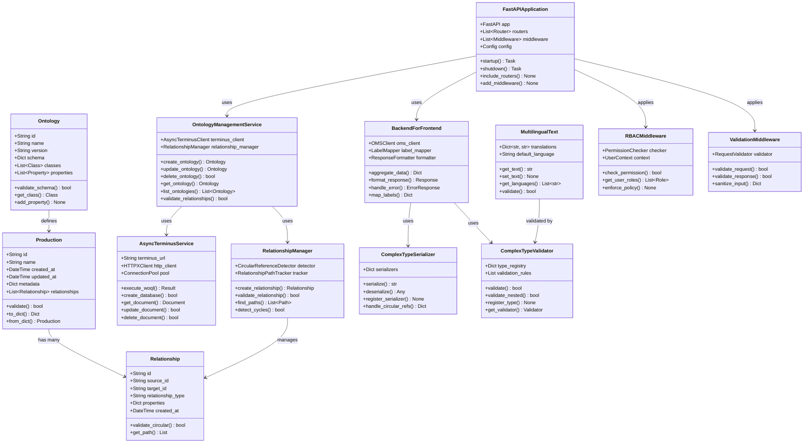

# SPICE HARVESTER Architecture

> Auto-generated on 2025-07-18 10:41:34
> Updated on 2025-08-05 - Outbox Pattern Implementation

## Overview

This document contains automatically generated architecture diagrams for the SPICE HARVESTER project. The architecture now includes the Outbox Pattern for reliable event publishing and asynchronous processing.

## Class Diagrams

### Backend Classes

### Classes Spice Harvester

*Diagram generation pending for Classes Spice Harvester*

### Data Flow

### Service Interactions

## Outbox Pattern Implementation

### Overview

The Outbox Pattern ensures reliable event publishing by storing events in a database table within the same transaction as the business operation. A separate Message Relay service then reads these events and publishes them to Kafka.

### Components

1. **PostgreSQL Outbox Table**: Stores events with metadata
2. **OMS Service**: Writes to both TerminusDB and Outbox table in a single transaction
3. **Message Relay Service**: Polls the outbox table and publishes to Kafka
4. **Kafka**: Message broker for event distribution
5. **Event Consumers**: Services that subscribe to and process events

### Event Types

- `ONTOLOGY_CLASS_CREATED`: New ontology class created
- `ONTOLOGY_CLASS_UPDATED`: Existing ontology class modified
- `ONTOLOGY_CLASS_DELETED`: Ontology class removed

### Benefits

- **Atomicity**: Events are guaranteed to be published if the business transaction succeeds
- **Reliability**: No events are lost even if Kafka is temporarily unavailable
- **Scalability**: Multiple Message Relay instances can run concurrently
- **Decoupling**: Services communicate asynchronously through events

### Configuration

Key environment variables:
- `POSTGRES_HOST/PORT/USER/PASSWORD/DB`: PostgreSQL connection
- `KAFKA_BOOTSTRAP_SERVERS`: Kafka broker addresses
- `MESSAGE_RELAY_BATCH_SIZE`: Events per batch (default: 100)
- `MESSAGE_RELAY_POLL_INTERVAL`: Polling interval in seconds (default: 5)

