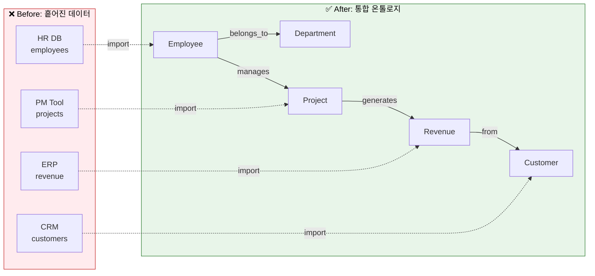
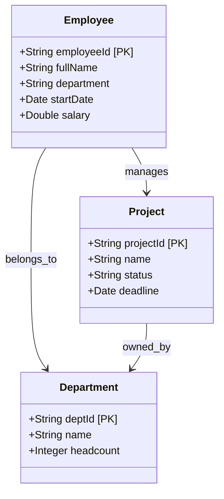
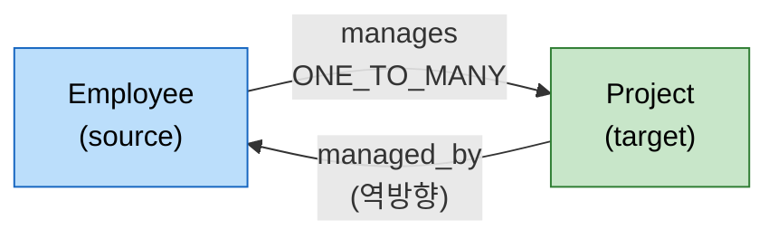
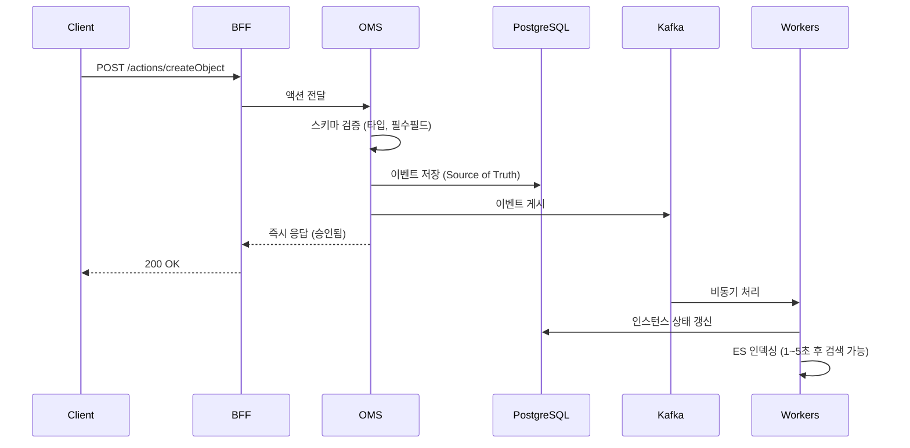
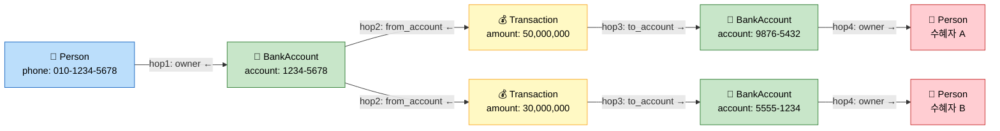
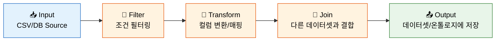
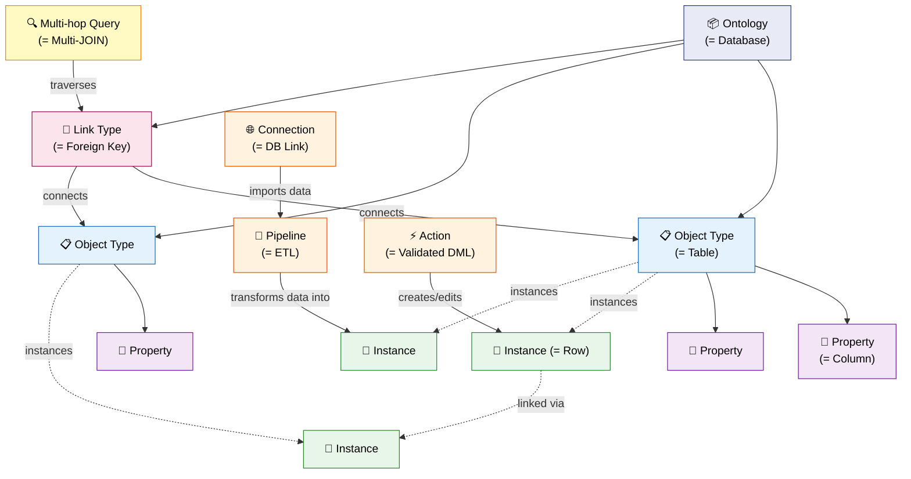

# 이 제품이 뭔가요? - Spice OS 핵심 개념 가이드

> 이 문서는 Spice OS의 핵심 개념을 **SQL/ORM에 익숙한 개발자가 바로 이해할 수 있도록** 코드와 다이어그램 중심으로 설명합니다.

---

## 한 줄 요약

**Spice OS = 여러 데이터 소스를 하나의 통합 스키마(온톨로지)로 연결하고, 관계를 따라 탐색할 수 있는 플랫폼**

---

## 왜 필요한가? (Before / After)



**Before:** "Engineering 부서에서 올해 진행한 프로젝트 중 매출 최고의 담당자는?" → HR, PM, ERP 3개 DB를 열어서 수동 조인

**After:** 온톨로지에서 `Employee → Project → Revenue` 링크를 따라 한 번의 쿼리로 답을 얻음

---

## 핵심 개념 7가지

### 1. 온톨로지(Ontology) = `DATABASE`

> SQL의 `CREATE DATABASE`에 해당합니다

온톨로지는 **데이터 모델의 최상위 컨테이너**입니다. Object Type, Link Type, Property 정의를 모두 포함합니다.

```
Ontology "company-data"                    ← SQL: CREATE DATABASE company_data
├── Object Type: Employee                  ← SQL: CREATE TABLE Employee
│   ├── Property: employeeId (PK)          ← SQL: employeeId VARCHAR PRIMARY KEY
│   ├── Property: fullName (STRING)        ← SQL: fullName VARCHAR NOT NULL
│   ├── Property: department (STRING)      ← SQL: department VARCHAR
│   └── Property: salary (DOUBLE)          ← SQL: salary DECIMAL
├── Object Type: Project
├── Object Type: Department
├── Link Type: Employee → manages → Project    ← SQL: FOREIGN KEY + JOIN TABLE
└── Link Type: Employee → belongs_to → Department
```

**API:**
```bash
# 온톨로지 목록 조회
GET /api/v1/databases

# 온톨로지 생성
POST /api/v1/databases
{ "name": "company-data", "displayName": "회사 데이터" }
```

---

### 2. 객체 유형(Object Type) = `CREATE TABLE`

> SQL의 테이블 정의에 해당합니다

Object Type은 엔티티의 **스키마(구조)**를 정의합니다.



SQL과의 비교:

| SQL | Spice OS |
|:---|:---|
| `CREATE TABLE Employee (...)` | Object Type `Employee` 생성 |
| `employeeId VARCHAR PRIMARY KEY` | `primaryKey: "employeeId"` |
| `fullName VARCHAR NOT NULL` | Property `fullName`, type: STRING, required: true |
| `salary DECIMAL` | Property `salary`, type: DOUBLE |

**API:**
```bash
# Object Type 생성
POST /api/v2/ontologies/{db}/objectTypes
{
  "apiName": "Employee",
  "displayName": "직원",
  "primaryKeyPropertyApiName": "employeeId",
  "properties": [
    { "apiName": "employeeId", "dataType": "STRING" },
    { "apiName": "fullName",   "dataType": "STRING" },
    { "apiName": "department", "dataType": "STRING" },
    { "apiName": "salary",     "dataType": "DOUBLE" }
  ]
}
```

---

### 3. 속성(Property) = `COLUMN`

> SQL의 컬럼 정의에 해당합니다

속성은 Object Type이 가진 **개별 필드**입니다.

#### 지원하는 데이터 타입

| Spice OS | SQL 대응 | 예시 값 |
|:---|:---|:---|
| `STRING` | `VARCHAR` | `"Jane Doe"` |
| `INTEGER` | `INT` / `BIGINT` | `42` |
| `DOUBLE` | `DECIMAL` / `FLOAT` | `75000.50` |
| `BOOLEAN` | `BOOLEAN` | `true` |
| `DATE` | `DATE` | `"2023-06-15"` |
| `TIMESTAMP` | `TIMESTAMP` | `"2023-06-15T09:30:00Z"` |
| `GEOHASH` | `POINT` (PostGIS) | `"u4pruydqqvj"` |
| `ARRAY` | `ARRAY` / `JSONB` | `["tag1", "tag2"]` |

#### 속성의 주요 옵션

```json
{
  "apiName": "salary",
  "displayName": "연봉",
  "dataType": "DOUBLE",
  "required": false,          // NOT NULL 여부
  "indexed": true,            // ES 검색 인덱스 생성 여부
  "description": "세전 연봉 (원)"
}
```

- **`required: true`** → SQL의 `NOT NULL` 제약과 동일. 인스턴스 생성 시 이 필드가 없으면 검증 오류
- **`indexed: true`** → Elasticsearch에 인덱스가 생성되어 이 필드로 검색/필터링/정렬 가능
- **`primaryKey`** → Object Type에 하나만 존재. 인스턴스의 고유 식별자

---

### 4. 링크 유형(Link Type) = `FOREIGN KEY` + `JOIN TABLE`

> SQL의 외래키/조인테이블에 해당하지만, **관계 자체가 일급 시민(first-class citizen)**입니다

링크 유형은 Object Type 사이의 **방향성 있는 관계**를 정의합니다.



SQL의 FK와 다른 점:

| SQL FK | Spice OS Link Type |
|:---|:---|
| 테이블 내부에 FK 컬럼이 필요 | 별도의 Link Type 정의로 관리 |
| 단방향 (FK가 있는 쪽에서만 조인) | **양방향 탐색** 가능 (`manages` ↔ `managed_by`) |
| JOIN 쿼리 직접 작성 | **선언적 탐색** (`/links/manages`) |
| 관계에 메타데이터 불가 | 관계에 속성 추가 가능 |

#### 카디널리티

| 카디널리티 | 의미 | 예시 |
|:---|:---|:---|
| `ONE_TO_ONE` | 1:1 | Employee → Passport |
| `ONE_TO_MANY` | 1:N | Department → Employees |
| `MANY_TO_MANY` | N:M | Employee ↔ Project |

**API:**
```bash
# 특정 직원이 관리하는 프로젝트 조회 (1-hop 링크 탐색)
GET /api/v2/ontologies/{db}/objects/Employee/EMP-042/links/manages
```

---

### 5. 인스턴스(Instance) = `INSERT INTO ... VALUES`

> SQL의 행(row)에 해당합니다

인스턴스는 Object Type에 대한 **실제 데이터 레코드**입니다.

```json
// SQL: INSERT INTO Employee VALUES ('EMP-042', 'Jane Doe', 'Engineering', '2023-06-15')
// Spice OS:
{
  "employeeId": "EMP-042",         // Primary Key
  "fullName": "Jane Doe",
  "department": "Engineering",
  "startDate": "2023-06-15",
  "salary": 85000000
}
```

인스턴스의 특징:
- **불변 이벤트로 관리**: 직접 UPDATE가 아닌, "변경 이벤트"를 기록 (Event Sourcing)
- **이중 저장**: PostgreSQL(정확성) + Elasticsearch(검색 속도)
- **관계 포함**: `relationships` 필드에 연결된 다른 인스턴스 참조가 저장됨

**API:**
```bash
# 인스턴스 검색
POST /api/v2/ontologies/{db}/objects/Employee/search
{ "where": { "type": "eq", "field": "department", "value": "Engineering" } }

# 단일 인스턴스 조회
GET /api/v2/ontologies/{db}/objects/Employee/EMP-042
```

---

### 6. 액션(Action) = Validated `INSERT`/`UPDATE`/`DELETE`

> SQL의 DML에 해당하지만, 검증/감사/되돌리기가 내장되어 있습니다

Spice OS에서는 데이터를 **직접 수정하지 않습니다**. 대신 **액션(변경 요청서)**을 제출합니다.



왜 액션을 사용하나?

| 일반 SQL | Spice OS 액션 |
|:---|:---|
| `UPDATE employee SET ...` | `submitAction({ type: "editObject", ... })` |
| 감사 로그 별도 구현 필요 | **자동** 감사 로그 (누가, 언제, 무엇을) |
| 검증 로직 별도 구현 필요 | 스키마 기반 **자동 검증** |
| 되돌리기 어려움 | Event Sourcing으로 **되돌리기 가능** |
| 동시 수정 충돌 직접 관리 | **충돌 감지** 내장 |

**API:**
```bash
# 인스턴스 생성 액션
POST /api/v2/ontologies/{db}/actions/createObject
{
  "parameters": {
    "objectType": "Employee",
    "properties": {
      "employeeId": "EMP-099",
      "fullName": "John Kim"
    }
  }
}
```

---

### 7. 멀티홉 쿼리(Multi-hop Query) = 다중 `JOIN` 그래프 탐색

> SQL에서 3~4단계 JOIN이 필요한 쿼리를 **선언적으로** 실행합니다

멀티홉 쿼리는 Link Type을 따라 **여러 Object Type을 연속으로 횡단**하는 그래프 탐색 쿼리입니다.

#### 예시: 금융 조사 (4-hop)

"특정 인물이 소유한 은행 계좌 → 그 계좌에서 발생한 거래 → 입금된 계좌 → 그 계좌의 소유자"를 추적



같은 쿼리를 SQL로 작성하면:

```sql
-- SQL로 4-hop 조인 (매우 복잡)
SELECT DISTINCT p2.*
FROM Person p1
JOIN BankAccount ba1 ON ba1.owner_id = p1.id
JOIN Transaction tx ON tx.from_account_id = ba1.id
JOIN BankAccount ba2 ON ba2.id = tx.to_account_id
JOIN Person p2 ON p2.id = ba2.owner_id
WHERE p1.phone = '010-1234-5678';
```

Spice OS에서는 **선언적 JSON**으로 동일한 탐색을 수행합니다:

```json
{
  "start_class": "Person",
  "filters": { "phone": "010-1234-5678" },
  "hops": [
    { "predicate": "owner",        "target_class": "BankAccount", "reverse": true },
    { "predicate": "from_account", "target_class": "Transaction", "reverse": true },
    { "predicate": "to_account",   "target_class": "BankAccount" },
    { "predicate": "owner",        "target_class": "Person" }
  ],
  "include_paths": true,
  "max_nodes": 500,
  "max_edges": 2000
}
```

#### `reverse`는 무엇인가?

```
                    forward (reverse: false)
Person ─────── owner ──────────→ BankAccount    ← "Person이 owner 필드를 가짐"
Person ←────── owner ────────── BankAccount     ← "BankAccount의 owner가 Person을 참조"
                    reverse (reverse: true)
```

- `reverse: false` (기본): source 문서의 `relationships.{predicate}` 필드에서 target 참조를 추출
- `reverse: true`: target 문서의 `relationships.{predicate}` 필드에 source 참조가 있는 문서를 검색

#### 관련 API 엔드포인트

| 엔드포인트 | 용도 |
|:---|:---|
| `POST /api/v1/graph-query/{db}` | 구조화된 멀티홉 쿼리 (typed) |
| `POST /api/v1/graph-query/{db}/multi-hop` | 멀티홉 쿼리 (dict, 호환용) |
| `POST /api/v1/graph-query/{db}/simple` | 단일 클래스 검색 (0-hop) |
| `GET /api/v1/graph-query/{db}/paths` | 스키마 레벨 경로 탐색 (BFS) |

#### 내부 동작 원리

멀티홉 쿼리는 별도의 그래프 DB 없이 **Elasticsearch만으로** 구현됩니다:

1. **Hop 0**: ES에서 `start_class` + `filters` 조건으로 시작 문서 검색
2. **Hop 1~N (forward)**: 각 문서의 `relationships.{predicate}` 필드에서 참조 추출 → ES `mget`으로 일괄 조회
3. **Hop 1~N (reverse)**: ES에서 `relationships.{predicate}` 필드에 현재 문서 참조를 포함하는 문서 검색
4. **팬아웃 제한**: 각 홉에서 최대 1,000개 참조로 제한 (폭발 방지)
5. **순환 감지**: `no_cycles: true` 옵션으로 이미 방문한 노드 건너뛰기

---

## 파이프라인(Pipeline)

데이터를 변환하는 **DAG(Directed Acyclic Graph) 워크플로**입니다. 38종의 변환 노드를 시각적으로 연결하여 ETL을 구성합니다.



---

## 커넥션(Connection)

외부 데이터 소스를 Spice OS에 **자동 동기화**하는 연결입니다.

지원하는 커넥터: PostgreSQL, MySQL, Oracle, MS SQL, Google Sheets, REST API

Import 모드:

| 모드 | 동작 | SQL 비유 |
|:---|:---|:---|
| `SNAPSHOT` | 전체 덮어쓰기 | `TRUNCATE + INSERT` |
| `APPEND` | 새 레코드만 추가 | `INSERT` |
| `INCREMENTAL` | 변경된 레코드만 갱신 | `MERGE / UPSERT` |
| `UPDATE` | 기존 레코드 갱신만 | `UPDATE WHERE ...` |

---

## 전체 개념 관계도



---

## 개발자가 다루게 될 영역

### 백엔드 개발
- **API 엔드포인트 추가/수정**: `backend/bff/routers/`와 `backend/oms/routers/`에서 FastAPI 라우터 작업
- **데이터 모델 확장**: `backend/shared/models/`에서 Pydantic 모델 추가
- **워커 로직**: `backend/*_worker/main.py`에서 비동기 처리 로직 개선
- **커넥터 개발**: `backend/data_connector/`에서 새 데이터 소스 지원

### 프론트엔드 개발
- **UI 페이지**: `frontend/src/pages/`에서 React 컴포넌트 개발
- **시각화**: ReactFlow(파이프라인), Cytoscape(그래프), Recharts(차트)
- **API 연동**: `frontend/src/api/bff.ts`에서 API 타입/호출 관리

### 인프라/DevOps
- **Docker 구성**: `docker-compose.full.yml` 서비스 설정
- **모니터링**: Grafana(:13000) 대시보드, Jaeger(:16686) 분산 추적
- **DB 관리**: PostgreSQL 마이그레이션, ES 인덱스 관리

---

## 다음으로 읽을 문서

- [멘탈 모델](02-MENTAL-MODEL.md) - Event Sourcing, CQRS 등 아키텍처 패턴을 비유로 이해
- [로컬 환경 설정](03-LOCAL-SETUP.md) - 내 컴퓨터에서 플랫폼 실행
- [아키텍처 이해하기](05-ARCHITECTURE-EXPLAINED.md) - 시스템 구조를 3단계로 상세 이해
