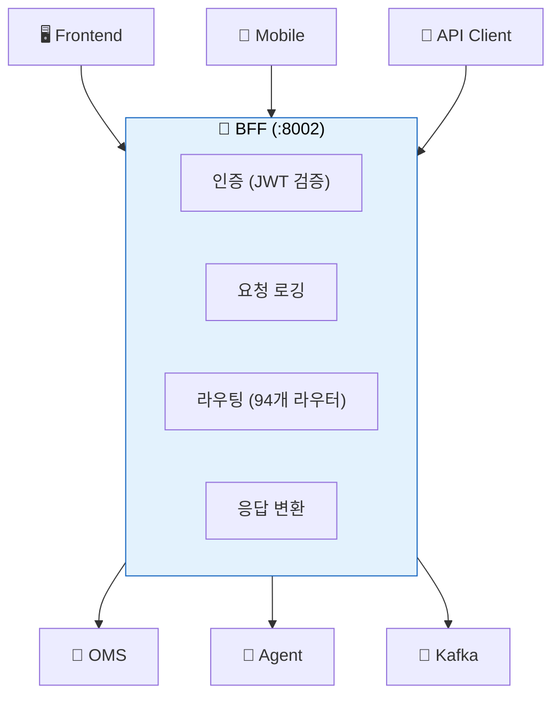
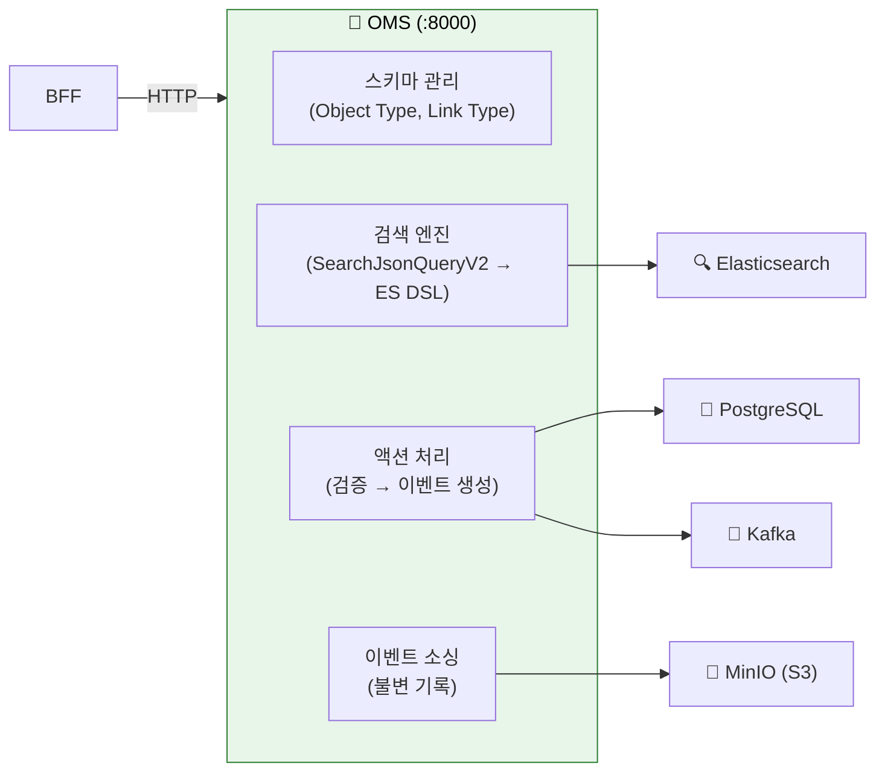
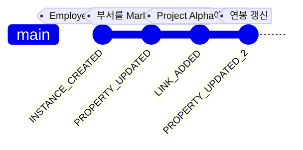
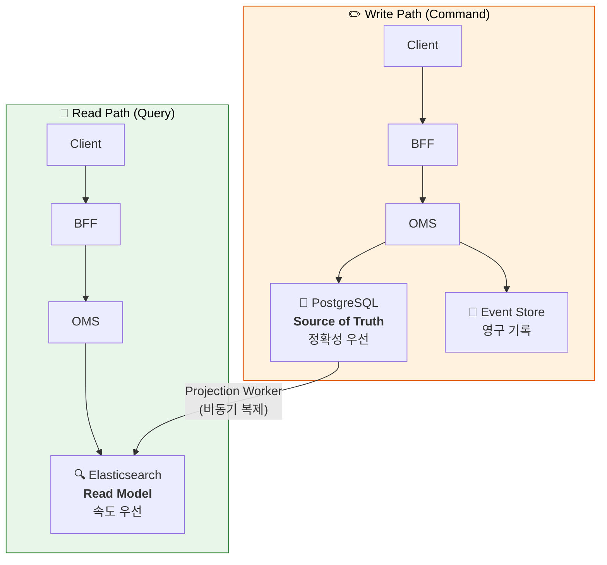
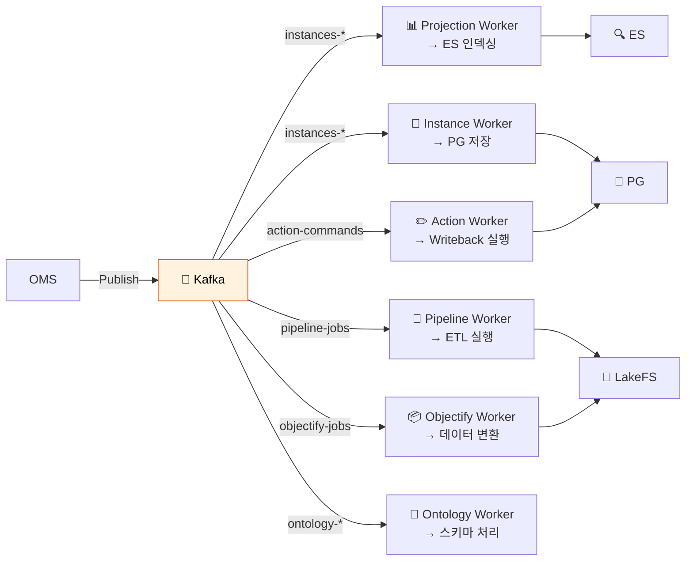
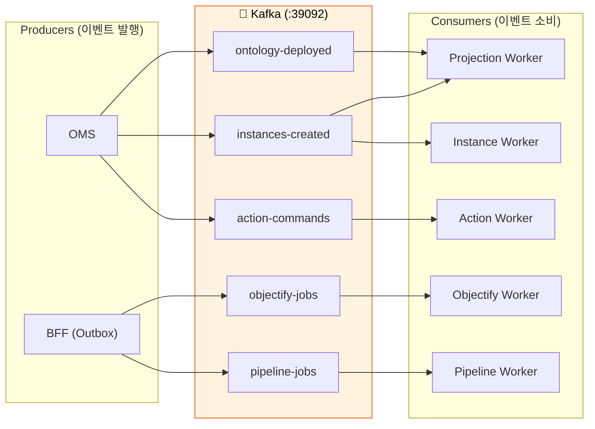
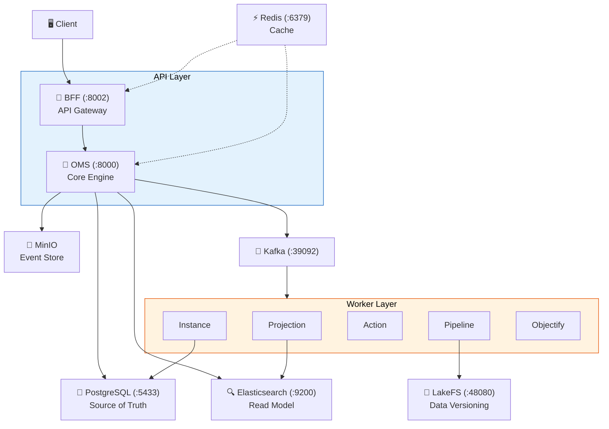

# 멘탈 모델 - 아키텍처 패턴 이해하기

> Spice OS의 아키텍처 패턴을 **개발자가 이미 알고 있는 개념**에 빗대어 설명합니다. 대략적인 구조를 잡은 후 [아키텍처 이해하기](05-ARCHITECTURE-EXPLAINED.md)에서 상세 구조를 학습하세요.

---

## 1. BFF = API Gateway

**BFF(Backend for Frontend)**는 모든 외부 요청이 반드시 거치는 **API Gateway**입니다.

- 외부에서 오는 **모든 HTTP 요청**은 BFF를 거칩니다
- 인증(JWT) → 로깅 → 라우팅 → 응답 변환 파이프라인을 처리
- 직접 비즈니스 로직을 실행하지 않고, **OMS 등 내부 서비스에 위임**합니다

**코드:** `backend/bff/main.py` (진입점), `backend/bff/routers/` (94개 라우터 파일)

---

## 2. OMS = Core Engine

**OMS(Ontology Management Service)**는 온톨로지 관리, 검색, 이벤트 처리의 **핵심 엔진**입니다.

**코드:** `backend/oms/main.py` (진입점), `backend/oms/routers/query.py` (검색)

---

## 3. Event Sourcing = Git for Data

Git이 코드 변경마다 **커밋**을 기록하듯, Spice OS는 데이터 변경마다 **이벤트**를 기록합니다.

| Git | Spice OS |
|:---|:---|
| `git commit` | 이벤트 생성 (INSTANCE_CREATED, PROPERTY_UPDATED...) |
| `git log` | 이벤트 스토어 조회 (S3/MinIO에 영구 보관) |
| `git checkout <hash>` | 타임 트래블 쿼리 (과거 시점 데이터 조회) |
| `.git/objects/` | S3/MinIO Event Store (불변 저장) |
| HEAD (현재 상태) | PostgreSQL + Elasticsearch (현재 데이터) |

핵심 규칙:
- 이벤트는 **절대 삭제하거나 수정하지 않습니다** (불변, append-only)
- 현재 상태는 이벤트를 **순서대로 재생(replay)**하면 복원됩니다
- 이벤트는 S3/MinIO에 **영구 보관**됩니다

**코드:** `backend/shared/models/event_envelope.py` (이벤트 구조)

---

## 4. CQRS = Read/Write 분리

**CQRS(Command Query Responsibility Segregation)**: 읽기(Query)와 쓰기(Command)를 서로 다른 저장소에서 처리합니다.

| | PostgreSQL (Write) | Elasticsearch (Read) |
|:---|:---|:---|
| **역할** | Source of Truth (원본) | Read Model (검색용 복사본) |
| **최적화** | 정확성, 트랜잭션 | 검색 속도, 집계 |
| **접근** | 쓰기 작업만 | 읽기 작업만 |
| **지연** | 즉시 반영 | 1~5초 지연 (최종 일관성) |

> **최종 일관성(Eventual Consistency)**: 쓰기 직후에는 ES에 아직 반영되지 않을 수 있습니다. Projection Worker가 비동기로 갱신하며, 보통 1~5초 내에 동기화됩니다.

---

## 5. Workers = Kafka Consumer 서비스

Workers는 Kafka에서 이벤트를 소비하여 **비동기로 처리하는 마이크로서비스**들입니다.

각 Worker의 특성:
- **독립적**: 하나가 느려도 다른 Worker에 영향 없음
- **멱등적(Idempotent)**: 같은 이벤트를 두 번 처리해도 결과 동일
- **자동 재시도**: 실패 시 Kafka가 자동으로 재전달

**코드:** 각 워커의 진입점은 `backend/{worker_name}/main.py`

---

## 6. Kafka = Message Broker

**Kafka**는 서비스 간 이벤트를 **비동기로 전달하는 메시지 브로커**입니다.

- Producer는 **토픽에 메시지를 발행**만 합니다 (누가 읽는지 모름)
- Consumer는 **관심 있는 토픽만 구독**합니다 (누가 올렸는지 모름)
- 이를 **느슨한 결합(Loose Coupling)**이라 합니다 → 서비스를 독립적으로 배포/확장 가능

---

## 7. LakeFS = Git for Data Files

**LakeFS**는 데이터 파일(CSV, Parquet 등)에 대한 **Git과 동일한 버전 관리**를 제공합니다.

| Git (코드) | LakeFS (데이터) |
|:---|:---|
| `git branch feature` | `lakefs branch staging` |
| `git add + commit` | `lakefs upload + commit` |
| `git merge feature` | `lakefs merge staging → main` |
| `git log` | `lakefs log` |
| `git diff` | `lakefs diff` |

파이프라인에서 데이터셋을 가공할 때, LakeFS 브랜치에서 안전하게 작업하고 완료 후 main에 머지합니다.

> **중요:** LakeFS 리포지토리의 기본 브랜치는 `"main"`입니다 (`"master"` 아님).

---

## 전체 아키텍처 요약

| 구성 요소 | 역할 | 코드 위치 |
|:---|:---|:---|
| BFF | API Gateway, 인증, 라우팅 | `backend/bff/` |
| OMS | 온톨로지 엔진, 검색, 이벤트 | `backend/oms/` |
| Workers | 비동기 이벤트 처리 | `backend/*_worker/` |
| PostgreSQL | 원본 데이터 (Source of Truth) | - |
| Elasticsearch | 검색용 인덱스 (Read Model) | - |
| Kafka | 서비스 간 이벤트 스트리밍 | - |
| MinIO (S3) | 이벤트 영구 저장소 | - |
| LakeFS | 데이터 파일 버전 관리 | - |
| Redis | 캐싱, 세션, 실시간 알림 | - |

---

## 다음으로 읽을 문서

- [로컬 환경 설정](03-LOCAL-SETUP.md) - 이 아키텍처를 실제로 실행해봅시다
- [아키텍처 이해하기](05-ARCHITECTURE-EXPLAINED.md) - 각 서비스의 상세 구조
- [데이터 흐름 추적](06-DATA-FLOW-WALKTHROUGH.md) - 실제 요청이 어떻게 흐르는지 추적
