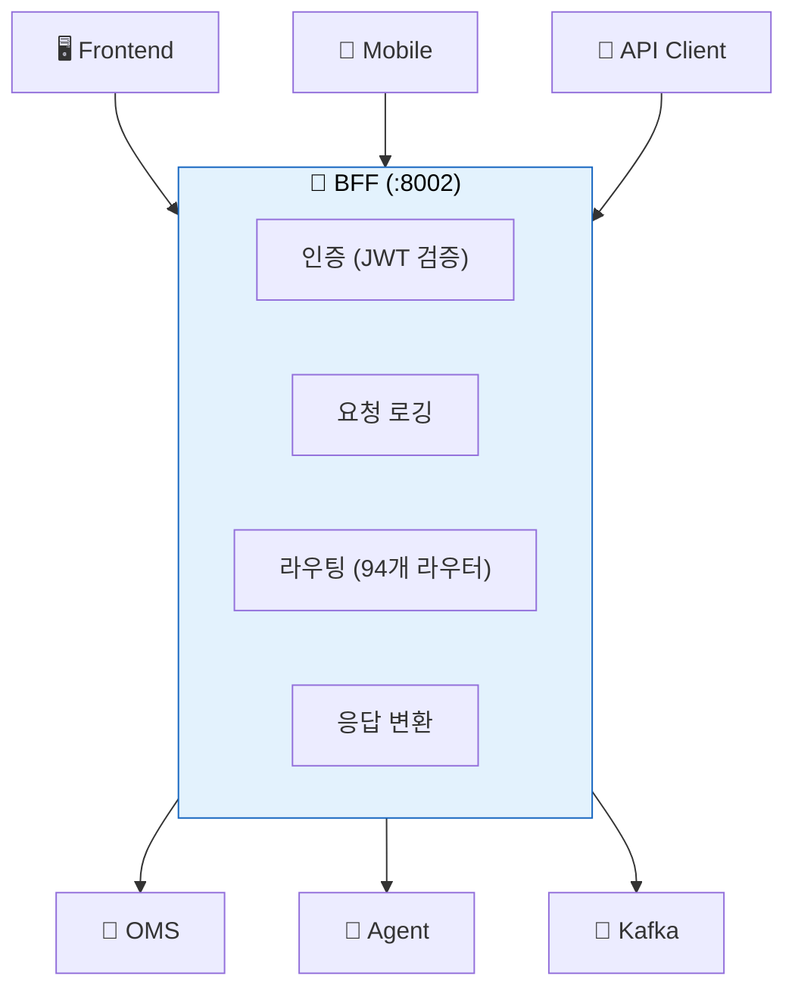
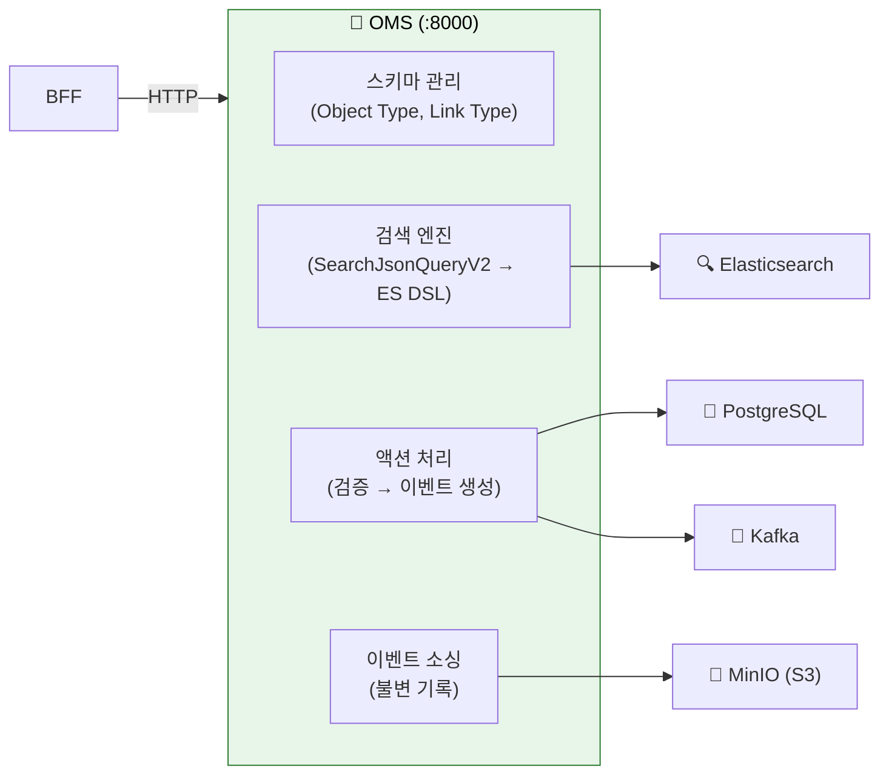
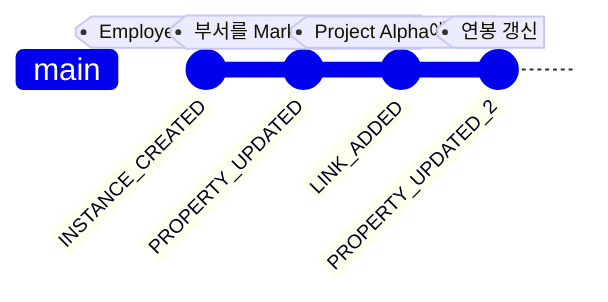
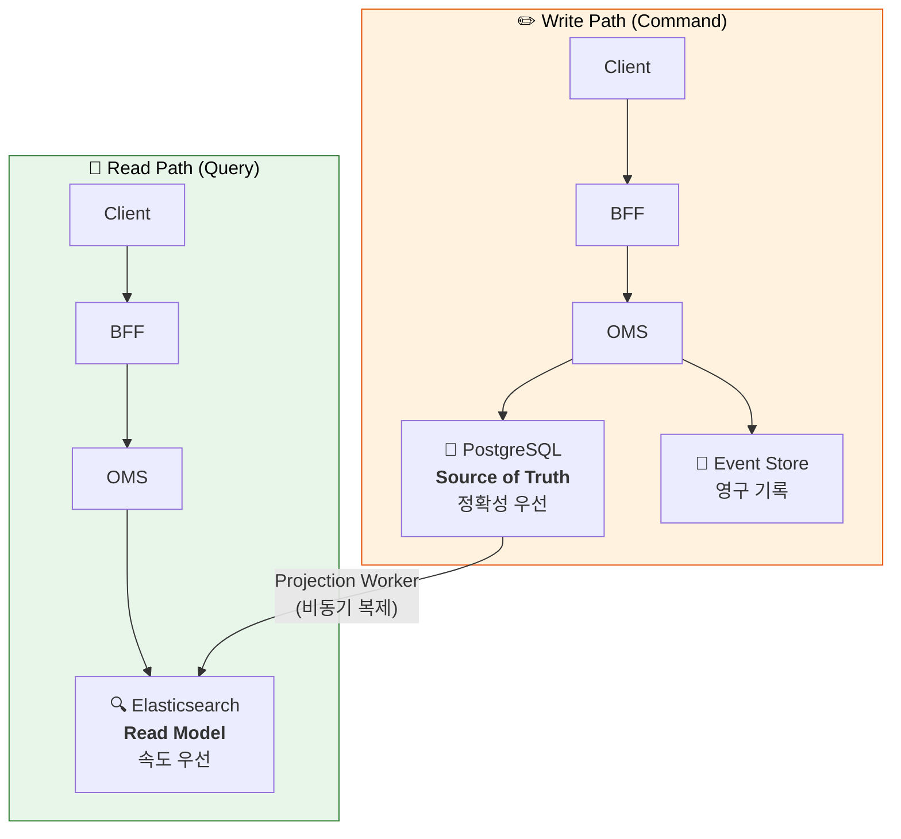
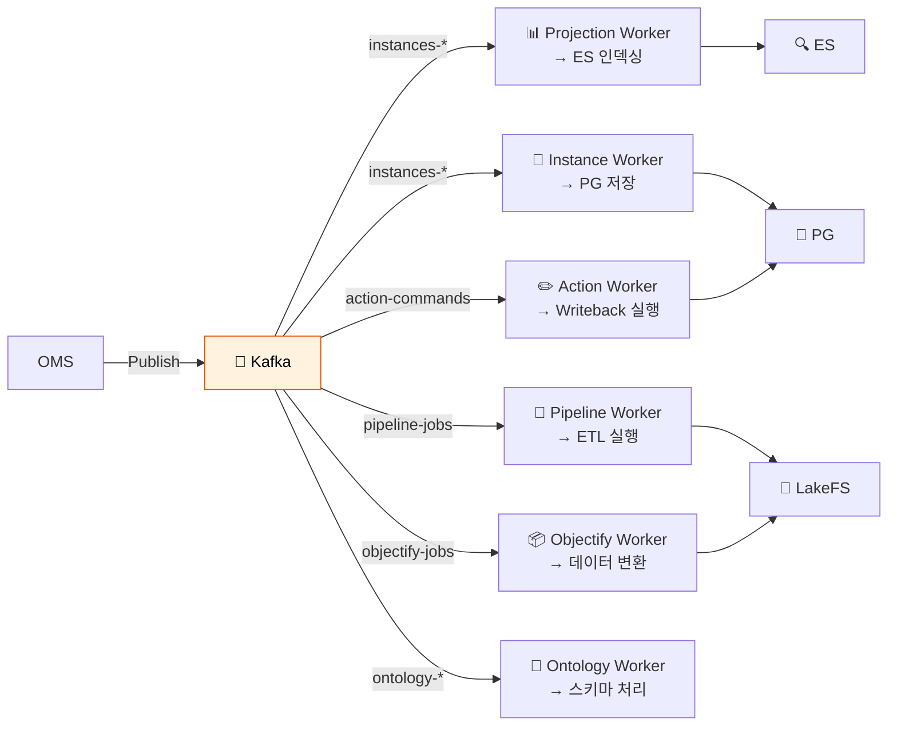
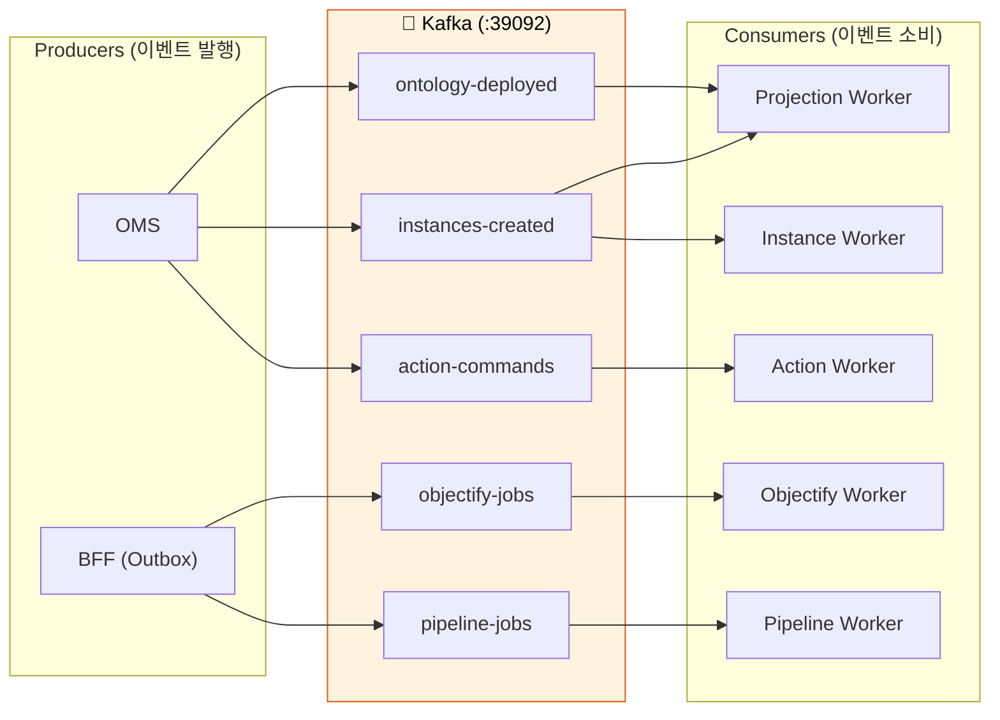
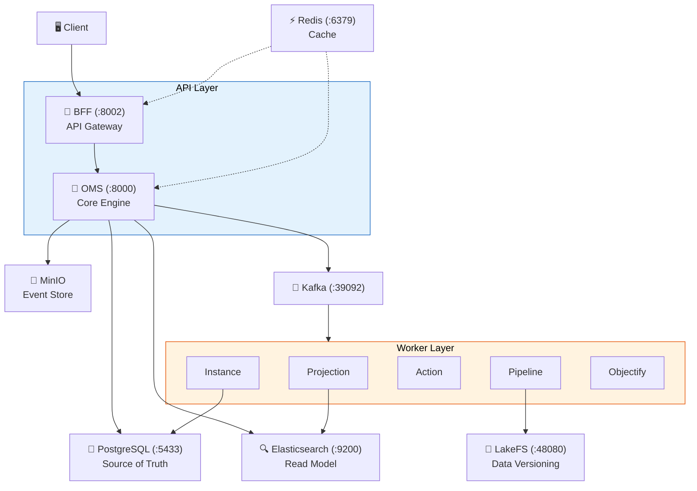

# 멘탈 모델 - 아키텍처 패턴 이해하기

> 이미 알고 있는 개념에 빗대어 Spice OS의 아키텍처 패턴을 설명해 드릴게요. 여기서 큰 그림을 잡은 뒤 [아키텍처 이해하기](05-ARCHITECTURE-EXPLAINED.md)에서 상세 구조를 살펴보면 돼요.

---

## 1. BFF = API Gateway

> 모든 외부 요청이 가장 먼저 도착하는 관문이에요.

**BFF(Backend for Frontend)**는 모든 외부 요청이 반드시 거치는 **API Gateway**예요.

- 외부에서 오는 **모든 HTTP 요청**은 BFF를 거쳐요.
- 인증(JWT) → 로깅 → 라우팅 → 응답 변환 순서로 파이프라인을 처리해요.
- 직접 비즈니스 로직을 실행하지 않고, **OMS 등 내부 서비스에 위임**하는 게 핵심이에요.

**코드:** `backend/bff/main.py` (진입점), `backend/bff/routers/` (94개 라우터 파일)

---

## 2. OMS = Core Engine

> 온톨로지 관리, 검색, 이벤트 처리를 모두 담당하는 두뇌 역할이에요.

**OMS(Ontology Management Service)**는 Spice OS의 **핵심 엔진**이에요.

**코드:** `backend/oms/main.py` (진입점), `backend/oms/routers/query.py` (검색)

---

## 3. Event Sourcing = Git for Data

> 코드에 Git이 있다면, 데이터에는 Event Sourcing이 있어요.

Git이 코드 변경마다 **커밋**을 기록하는 것처럼, Spice OS는 데이터 변경마다 **이벤트**를 기록해요.

| Git | Spice OS |
|:---|:---|
| `git commit` | 이벤트 생성 (INSTANCE_CREATED, PROPERTY_UPDATED...) |
| `git log` | 이벤트 스토어 조회 (S3/MinIO에 영구 보관) |
| `git checkout <hash>` | 타임 트래블 쿼리 (과거 시점 데이터 조회) |
| `.git/objects/` | S3/MinIO Event Store (불변 저장) |
| HEAD (현재 상태) | PostgreSQL + Elasticsearch (현재 데이터) |

핵심 규칙 세 가지만 기억하면 돼요:

- ✅ 이벤트는 **절대 삭제하거나 수정하지 않아요** (불변, append-only).
- ✅ 현재 상태는 이벤트를 **순서대로 재생(replay)**하면 복원할 수 있어요.
- ✅ 이벤트는 S3/MinIO에 **영구 보관**돼요.

**코드:** `backend/shared/models/event_envelope.py` (이벤트 구조)

---

## 4. CQRS = Read/Write 분리

> 읽기와 쓰기를 분리하면 각각에 최적화된 저장소를 쓸 수 있어요.

**CQRS(Command Query Responsibility Segregation)**는 읽기(Query)와 쓰기(Command)를 서로 다른 저장소에서 처리하는 패턴이에요.

| | PostgreSQL (Write) | Elasticsearch (Read) |
|:---|:---|:---|
| **역할** | Source of Truth (원본) | Read Model (검색용 복사본) |
| **최적화** | 정확성, 트랜잭션 | 검색 속도, 집계 |
| **접근** | 쓰기 작업만 | 읽기 작업만 |
| **지연** | 즉시 반영 | 1~5초 지연 (최종 일관성) |

> 💡 **최종 일관성(Eventual Consistency)이란?** 쓰기 직후에는 ES에 아직 반영되지 않을 수 있어요. Projection Worker가 비동기로 갱신하는데, 보통 1~5초 내에 동기화돼요. "방금 저장한 데이터가 검색에 안 나와요!"라는 상황이 이 때문이에요.

---

## 5. Workers = Kafka Consumer 서비스

> 이벤트를 받아서 실제 작업을 수행하는 일꾼들이에요.

Workers는 Kafka에서 이벤트를 소비해서 **비동기로 처리하는 마이크로서비스**들이에요.

각 Worker는 이런 특성을 가지고 있어요:

- **독립적** — 하나가 느려져도 다른 Worker에는 영향이 없어요.
- **멱등적(Idempotent)** — 같은 이벤트를 두 번 처리해도 결과가 같아요.
- **자동 재시도** — 실패하면 Kafka가 자동으로 다시 전달해 줘요.

**코드:** 각 워커의 진입점은 `backend/{worker_name}/main.py`

---

## 6. Kafka = Message Broker

> 서비스들 사이에서 메시지를 전달해 주는 우체국 같은 역할이에요.

**Kafka**는 서비스 간 이벤트를 **비동기로 전달하는 메시지 브로커**예요.

- Producer는 **토픽에 메시지를 발행**만 해요. 누가 읽는지는 신경 쓰지 않아요.
- Consumer는 **관심 있는 토픽만 구독**해요. 누가 올렸는지는 신경 쓰지 않아요.
- 이걸 **느슨한 결합(Loose Coupling)**이라고 해요. 덕분에 서비스를 독립적으로 배포하고 확장할 수 있어요.

---

## 7. LakeFS = Git for Data Files

> 코드에 Git이 있다면, 데이터 파일에는 LakeFS가 있어요.

**LakeFS**는 데이터 파일(CSV, Parquet 등)에 대해 **Git과 동일한 버전 관리**를 제공해요.

| Git (코드) | LakeFS (데이터) |
|:---|:---|
| `git branch feature` | `lakefs branch staging` |
| `git add + commit` | `lakefs upload + commit` |
| `git merge feature` | `lakefs merge staging → main` |
| `git log` | `lakefs log` |
| `git diff` | `lakefs diff` |

파이프라인에서 데이터셋을 가공할 때, LakeFS 브랜치에서 안전하게 작업하고 완료 후 main에 머지해요.

> ⚠️ **중요:** LakeFS 리포지토리의 기본 브랜치는 `"main"`이며, `"master"` 입력은 API에서 400으로 거부됩니다.

---

## 전체 아키텍처 요약

| 구성 요소 | 역할 | 코드 위치 |
|:---|:---|:---|
| BFF | API Gateway, 인증, 라우팅 | `backend/bff/` |
| OMS | 온톨로지 엔진, 검색, 이벤트 | `backend/oms/` |
| Workers | 비동기 이벤트 처리 | `backend/*_worker/` |
| PostgreSQL | 원본 데이터 (Source of Truth) | - |
| Elasticsearch | 검색용 인덱스 (Read Model) | - |
| Kafka | 서비스 간 이벤트 스트리밍 | - |
| MinIO (S3) | 이벤트 영구 저장소 | - |
| LakeFS | 데이터 파일 버전 관리 | - |
| Redis | 캐싱, 세션, 실시간 알림 | - |

---

## 다음으로 읽을 문서

- [로컬 환경 설정](03-LOCAL-SETUP.md) — 이 아키텍처를 실제로 실행해 봐요
- [아키텍처 이해하기](05-ARCHITECTURE-EXPLAINED.md) — 각 서비스의 상세 구조를 살펴봐요
- [데이터 흐름 추적](06-DATA-FLOW-WALKTHROUGH.md) — 실제 요청이 어떻게 흐르는지 따라가 봐요
