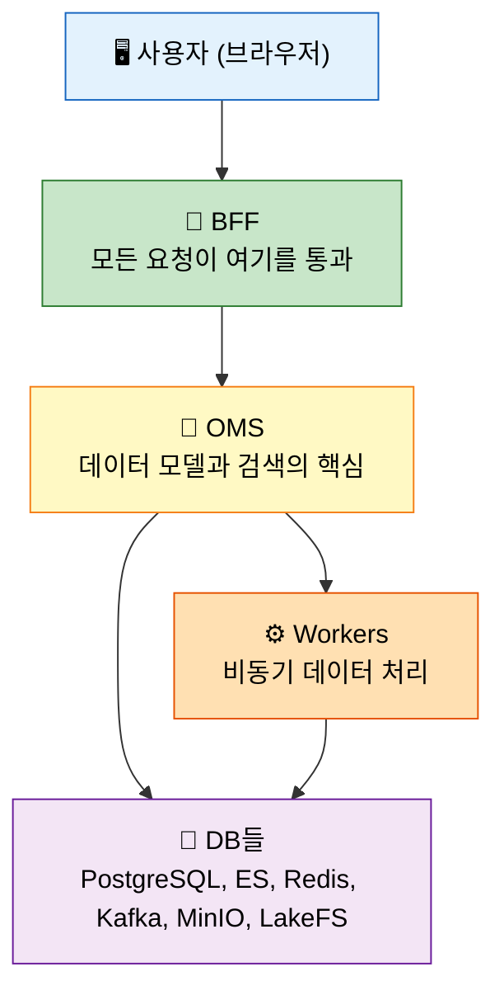
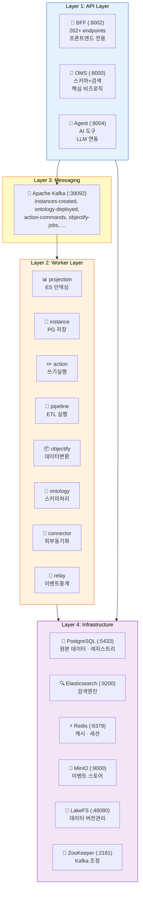
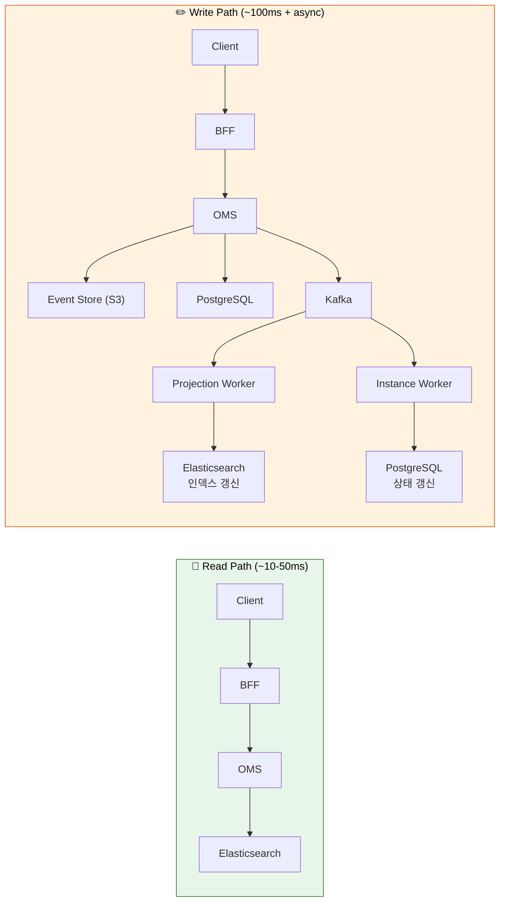
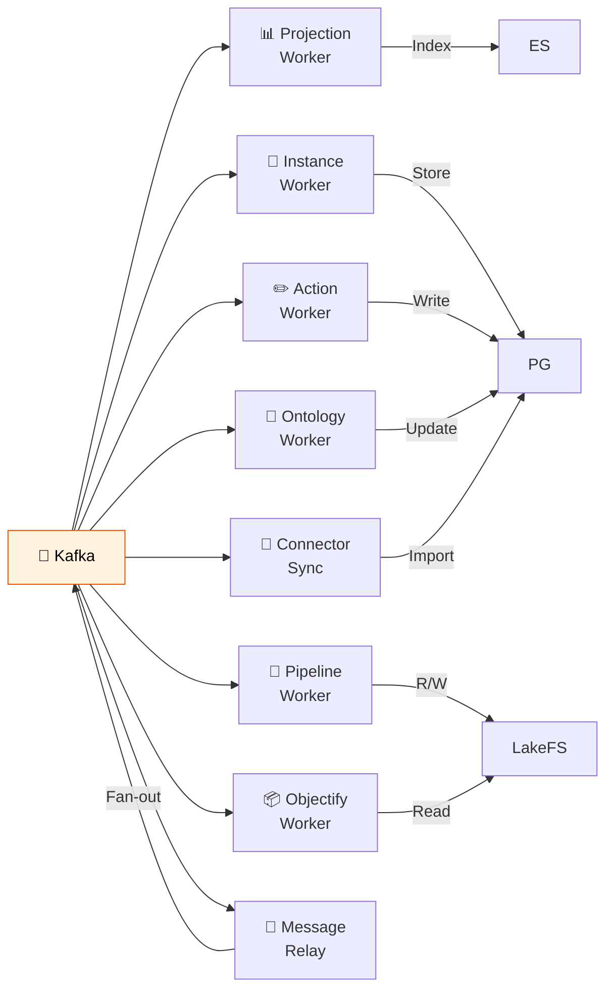

# 아키텍처 이해하기

> Spice OS의 아키텍처를 **3단계 줌 레벨**로 풀어볼게요. 30초 요약부터 시작해서 점점 깊이 들어가 봅시다.

---

## Level 1: 30초 요약

> 💡 전체 시스템을 한눈에 파악하는 단계예요.



**한 문장으로:** 사용자 요청은 BFF(게이트웨이)를 지나 OMS(엔진)에서 처리돼요. Workers가 비동기로 데이터를 인덱싱하고 변환한 뒤, 여러 DB에 나눠 저장합니다.

---

## Level 2: 5분 이해 - 4개 레이어

> 💡 시스템이 어떤 층으로 나뉘어 있는지 파악하는 단계예요.



### Read Path vs Write Path (CQRS)

읽기와 쓰기가 **서로 다른 경로**를 타는 게 CQRS 패턴의 핵심이에요.

⚠️ **왜 분리할까요?** 읽기는 "빠르게", 쓰기는 "안전하게"라는 서로 다른 목표가 있거든요. 각각에 최적화된 저장소를 쓰기 위해 경로를 나눈 거예요.



- ✅ **읽기**: Elasticsearch에서 직접 읽어서 **10~50ms**로 빨라요
- ✅ **쓰기**: 이벤트를 먼저 기록하고, Workers가 비동기로 처리해요. ES에 반영되기까지 **1~5초** 정도 걸립니다 (최종 일관성)

---

## Level 3: 30분 심화 - 각 서비스 상세

> 💡 실제로 코드를 수정할 때 참고할 상세 정보예요.

### API 서비스 3개

#### BFF (Backend for Frontend) - `backend/bff/main.py`

**역할:** 프론트엔드와 외부 클라이언트가 거치는 **유일한 진입점**이에요.

| 항목 | 내용 |
|:---|:---|
| 포트 | 8002 |
| 엔드포인트 | 262+ 개 |
| 라우터 파일 | 94개 (`backend/bff/routers/`) |
| 주요 의존성 | OMS (HTTP), PostgreSQL, Elasticsearch, Redis, Kafka |

**핵심 역할:**

인증과 라우팅:
- 인증/인가 처리 (JWT, 관리자 토큰)
- 요청 검증 및 변환
- OMS로 요청 전달

API 호환과 실시간 통신:
- Foundry v2 API 호환 계층 (Palantir Foundry API와 동일한 인터페이스 제공)
- WebSocket 실시간 알림
- 백그라운드 Outbox 워커 실행

**핵심 라우터:**

| 라우터 파일 | API 경로 | 역할 |
|:---|:---|:---|
| `foundry_ontology_v2.py` | `/api/v2/ontologies/*` | 온톨로지 CRUD, 객체 검색 |
| `foundry_datasets_v2.py` | `/api/v2/datasets/*` | 데이터셋 관리 |
| `foundry_connectivity_v2.py` | `/api/v2/connectivity/*` | 외부 커넥터 |
| `pipeline.py` | `/api/v1/pipelines/*` | 파이프라인 (Pipeline) 빌더/실행 |
| `graph.py` | `/api/v1/graph-query/*` | 그래프/멀티홉 쿼리 |
| `objectify.py` | `/api/v1/objectify/*` | 데이터셋→인스턴스 변환 |
| `lineage.py` | `/api/v1/lineage/*` | 데이터 리니지 |
| `governance.py` | `/api/v1/governance/*` | 접근 제어 |

#### OMS (Ontology Management Service) - `backend/oms/main.py`

**역할:** 온톨로지 스키마, 인스턴스 (Instance), 검색을 담당하는 **핵심 엔진**이에요.

| 항목 | 내용 |
|:---|:---|
| 포트 | 8000 |
| 라우터 파일 | 16개 (`backend/oms/routers/`) |
| 주요 의존성 | PostgreSQL, Elasticsearch, S3/MinIO (Event Store) |

**핵심 역할:**

스키마와 데이터 관리:
- 온톨로지 스키마 정의/수정/삭제
- 인스턴스 CRUD

검색과 액션:
- Elasticsearch 기반 객체 검색 (SearchJsonQueryV2 → ES DSL 변환)
- 액션 (Action) 처리 (시뮬레이션 + 실행)

이벤트 소싱:
- 모든 변경을 불변 이벤트로 기록해요. 나중에 "되감기"가 가능하거든요.

**핵심 라우터:**

| 라우터 파일 | 역할 |
|:---|:---|
| `ontology.py` | 온톨로지 리소스 CRUD |
| `query.py` | 객체 검색 (SearchJsonQueryV2) |
| `action_async.py` | 액션 제출/시뮬레이션 |
| `instance_async.py` | 인스턴스 비동기 작업 |
| `attachments.py` | 파일 첨부 |
| `timeseries.py` | 시계열 데이터 |

#### Agent - `backend/agent/main.py`

**역할:** AI/LLM 기반 데이터 분석 및 쿼리 도구예요. 자연어로 데이터를 분석할 수 있게 해줍니다.

| 항목 | 내용 |
|:---|:---|
| 포트 | 8004 |
| 주요 의존성 | BFF, PostgreSQL, MinIO |

---

### Workers (12+ 백그라운드 워커)

모든 워커는 **Kafka에서 메시지를 받아서** 각자 **독립적으로** 동작해요. 서로 직접 통신하지 않고, Kafka를 통해서만 일감을 전달받는 구조입니다.



#### 독립 워커

| 워커 | 진입점 | 역할 | Kafka 토픽 |
|:---|:---|:---|:---|
| **Projection Worker** | `projection_worker/main.py` | 이벤트 → ES 인덱싱 | `instances-*`, `ontology-*` |
| **Instance Worker** | `instance_worker/main.py` | 인스턴스 → PostgreSQL 저장 | `instances-*` |
| **Action Worker** | `action_worker/main.py` | 액션 명령 → 쓰기 실행 | `action-commands` |
| **Pipeline Worker** | `pipeline_worker/main.py` | 파이프라인 DAG 실행 | `pipeline-jobs` |
| **Objectify Worker** | `objectify_worker/main.py` | 데이터셋 행 → 인스턴스 변환 | `objectify-jobs` |
| **Ontology Worker** | `ontology_worker/main.py` | 온톨로지 스키마 이벤트 처리 | `ontology-*` |
| **Connector Sync** | `connector_sync_worker/main.py` | 외부 DB 데이터 동기화 | 스케줄 기반 |
| **Message Relay** | `message_relay/main.py` | 이벤트 중계 (팬아웃) | 다수 토픽 |

#### BFF 내장 워커

| 워커 | 역할 | 동작 방식 |
|:---|:---|:---|
| **Pipeline Scheduler** | cron 기반 파이프라인 스케줄링 | 폴링 |
| **Action Outbox** | 액션 Outbox → Kafka 발행 | Outbox 패턴 |
| **Ingest Reconciler** | 중단된 인제스트 복구 | 폴링 |

---

### 인프라 서비스 7개

💡 **왜 이렇게 많을까요?** 각 저장소마다 잘하는 게 다르거든요. "정확한 원본 데이터"는 PostgreSQL, "빠른 검색"은 Elasticsearch처럼 역할을 나눈 거예요.

| 서비스 | 역할 | 데이터 특성 |
|:---|:---|:---|
| **PostgreSQL** | 원본 데이터 (Source of Truth) | 관계형, 정확성 우선 |
| **Elasticsearch** | 검색용 인덱스 (Read Model) | 비정규화, 속도 우선 |
| **Redis** | 캐시, 세션, WebSocket 상태 | 휘발성, 속도 우선 |
| **Kafka** | 이벤트 스트리밍, 서비스 간 통신 | 순서 보장, at-least-once |
| **MinIO (S3)** | 이벤트 스토어, 파일 저장 | 불변, 영구 보관 |
| **LakeFS** | 데이터셋 버전 관리 (Git for Data) | 브랜치/커밋/머지 |
| **ZooKeeper** | Kafka 클러스터 조정 | 내부 사용 |

---

### 공유 라이브러리 (`backend/shared/`)

모든 서비스가 공통으로 사용하는 코드가 여기에 모여 있어요. 새 기능을 만들 때 여기부터 살펴보면 이미 만들어진 유틸리티가 많습니다.

```
backend/shared/
├── config/           # 환경 설정 (Pydantic Settings)
│   └── settings.py   #   ApplicationSettings (모든 환경변수 관리)
├── models/           # 데이터 모델
│   ├── ontology.py   #   온톨로지 스키마 모델
│   ├── common.py     #   공통 타입 (DataType, Cardinality 등)
│   ├── event_envelope.py  #   Kafka 이벤트 래퍼
│   ├── graph_query.py     #   멀티홉 쿼리 모델 (GraphHop, GraphQueryRequest)
│   ├── pipeline_job.py    #   파이프라인 작업 모델
│   └── objectify_job.py   #   Objectify 작업 모델
├── services/
│   ├── core/         # 핵심 서비스
│   │   ├── service_factory.py          # FastAPI 앱 생성
│   │   ├── service_container_common.py # DI 컨테이너
│   │   └── graph_federation_service_es.py  # 멀티홉 쿼리 엔진
│   ├── storage/      # 저장소 클라이언트
│   │   ├── elasticsearch_service.py  # ES 클라이언트
│   │   ├── lakefs_client.py          # LakeFS 클라이언트
│   │   └── storage_service.py        # S3 추상화
│   ├── registries/   # Postgres 기반 레지스트리 (상태 관리)
│   │   ├── dataset_registry.py       # 데이터셋 메타데이터
│   │   ├── pipeline_registry.py      # 파이프라인 정의
│   │   ├── objectify_registry.py     # Objectify 작업 상태
│   │   └── connector_registry.py     # 커넥터 소스 관리
│   ├── pipeline/     # 파이프라인 실행 엔진
│   ├── events/       # 이벤트 처리 (Outbox, Reconciler)
│   └── kafka/        # Kafka 프로듀서/컨슈머
├── security/         # 인증/인가 (JWT, RBAC)
├── errors/           # 에러 처리 체계
└── observability/    # 추적, 메트릭, 로깅
```

---

## 아키텍처 패턴 요약

> 💡 면접에서도 자주 나오는 패턴들이에요. 이 프로젝트에서 실제로 어떻게 쓰이는지 눈여겨보세요.

| 패턴 | 적용 위치 | 효과 |
|:---|:---|:---|
| **Event Sourcing** | 모든 쓰기 작업 | 감사 추적, 타임 트래블, 데이터 리빌드 가능 |
| **CQRS** | 읽기(ES) / 쓰기(PG) 분리 | 읽기/쓰기 각각에 최적화된 저장소 사용 |
| **Outbox Pattern** | BFF의 이벤트 발행 | PG 트랜잭션과 Kafka 발행의 원자성 보장 |
| **DI Container** | 모든 서비스 | 테스트할 때 의존성을 쉽게 교체 가능 |
| **Idempotency** | 모든 워커 | 같은 이벤트를 여러 번 처리해도 결과가 동일 |
| **DAG Execution** | 파이프라인 워커 | 노드 간 의존성을 지키며 순서대로 실행 |

---

## 다음으로 읽을 문서

- [데이터 흐름 추적](06-DATA-FLOW-WALKTHROUGH.md) - 구체적인 시나리오별 데이터 흐름
- [프론트엔드 둘러보기](07-FRONTEND-TOUR.md) - UI와 백엔드의 연결
- [개발 워크플로](08-DEVELOPMENT-WORKFLOW.md) - 이 아키텍처에서 코드를 어떻게 수정하는지
