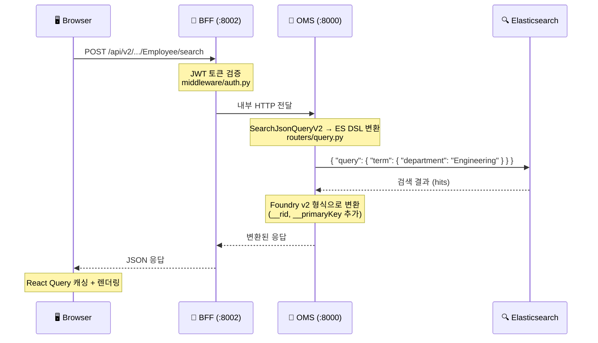
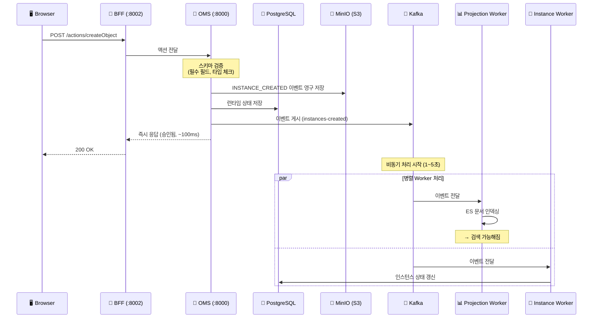
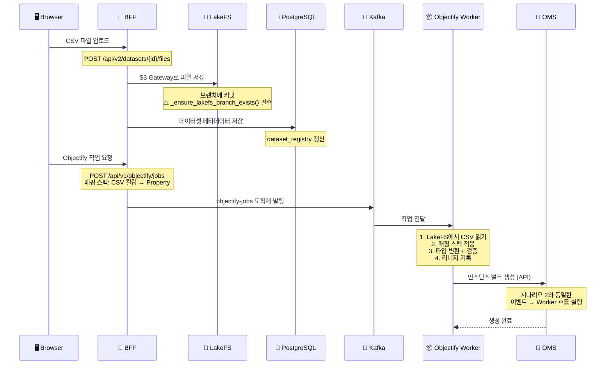
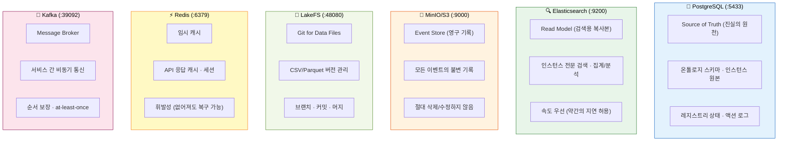
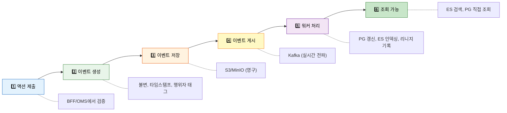

# 데이터 흐름 추적 - 요청이 시스템을 어떻게 통과하나요?

> 3가지 대표 시나리오를 **단계별로 추적**해 볼게요. 각 단계에서 어떤 코드가 실행되는지 파일 경로와 함께 설명합니다.

💡 **이 문서를 읽으면 좋은 점:** 디버깅할 때 "이 요청이 어디를 거치지?"를 바로 파악할 수 있어요.

---

## 시나리오 1: 객체 검색 (Read Path)

> 💡 가장 빈번한 요청이에요. 읽기 경로가 얼마나 단순한지 확인해 보세요.

**상황:** 사용자가 프론트엔드에서 "Engineering 부서 직원 검색"을 합니다.

```
API: POST /api/v2/ontologies/{db}/objects/Employee/search
Body: { "where": { "type": "eq", "field": "department", "value": "Engineering" } }
```

### 검색 흐름



### 검색 관련 파일

| 단계 | 파일 |
|:---|:---|
| 프론트엔드 API 호출 | `frontend/src/api/bff.ts` → `searchObjects()` |
| 인증 미들웨어 | `backend/bff/middleware/auth.py` |
| BFF 라우터 | `backend/bff/routers/foundry_ontology_v2.py` |
| OMS 검색 핸들러 | `backend/oms/routers/query.py` |
| ES 쿼리 빌더 | SearchJsonQueryV2 → Elasticsearch DSL 변환 |

- ✅ **소요 시간:** ~10-50ms
- ✅ **접근 저장소:** Elasticsearch (주), PostgreSQL (스키마 오버레이)

💡 **읽기가 빠른 이유:** PostgreSQL을 거치지 않고 Elasticsearch에서 바로 결과를 가져오거든요. 이게 CQRS의 장점이에요.

---

## 시나리오 2: 객체 생성 (Write Path)

> 💡 쓰기 경로는 읽기보다 복잡해요. "즉시 응답 → 비동기 처리" 패턴을 주목해 보세요.

**상황:** 사용자가 새 직원 인스턴스를 생성합니다.

```
API: POST /api/v2/ontologies/{db}/actions/createObject
Body: { "parameters": { "objectType": "Employee", "properties": { ... } } }
```

### 생성 흐름



### 생성 관련 파일

| 단계 | 파일 |
|:---|:---|
| BFF 라우터 | `backend/bff/routers/foundry_ontology_v2.py` |
| OMS 액션 핸들러 | `backend/oms/routers/action_async.py` |
| 이벤트 모델 | `backend/shared/models/event_envelope.py` |
| Projection Worker | `backend/projection_worker/main.py` |
| Instance Worker | `backend/instance_worker/main.py` |

- ✅ **소요 시간:** 응답 ~100ms, 전체 리드모델 반영 1~5초
- ✅ **접근 저장소:** PostgreSQL, S3/MinIO, Kafka, Elasticsearch (비동기)

⚠️ **주의할 점:** 생성 직후 바로 검색하면 아직 ES에 인덱싱이 안 됐을 수 있어요. 이걸 "최종 일관성(eventual consistency)"이라고 해요.

---

## 시나리오 3: 데이터 파이프라인 (CSV → 인스턴스)

> 💡 가장 복잡한 흐름이에요. 파일 업로드부터 인스턴스 생성까지 여러 서비스를 거칩니다.

**상황:** CSV 파일을 업로드하고, 파이프라인으로 변환해서, 온톨로지 인스턴스를 만들어요.

### 파이프라인 흐름



### 파이프라인 관련 파일

| 단계 | 파일 |
|:---|:---|
| 파일 업로드 라우터 | `backend/bff/routers/foundry_datasets_v2.py` |
| LakeFS 클라이언트 | `backend/shared/services/storage/lakefs_client.py` |
| 데이터셋 레지스트리 | `backend/shared/services/registries/dataset_registry.py` |
| Objectify 라우터 | `backend/bff/routers/objectify_incremental.py` |
| Objectify Worker | `backend/objectify_worker/main.py` |

- ✅ **소요 시간:** CSV 크기에 따라 수초~수분
- ✅ **접근 저장소:** LakeFS (파일), PostgreSQL (메타데이터), Kafka (작업), Elasticsearch (인덱싱)

⚠️ **자주 겪는 문제:** LakeFS에 파일을 저장하려면 브랜치가 먼저 존재해야 해요. `_ensure_lakefs_branch_exists()`를 빠뜨리면 "NoSuchBucket" 에러가 발생합니다.

---

## 데이터 저장소별 역할 정리

> 💡 "이 데이터는 어디에 저장되지?" 싶을 때 참고하세요.



---

## 이벤트 라이프사이클

> 💡 시스템에서 데이터가 변경되면, 항상 이 6단계를 거쳐요.

모든 데이터 변경은 아래 라이프사이클을 따릅니다.



---

## 다음으로 읽을 문서

- [프론트엔드 둘러보기](07-FRONTEND-TOUR.md) - UI 페이지가 이 데이터 흐름을 어떻게 보여주는지
- [개발 워크플로](08-DEVELOPMENT-WORKFLOW.md) - 이 흐름에 새 기능을 추가하는 방법
