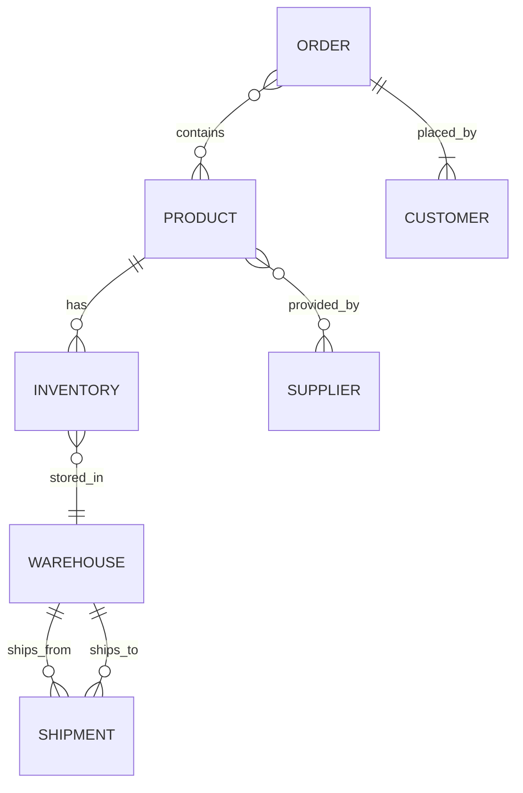

# Synthetic Dataset Ontology Schema for SPICE HARVESTER

> Status: Sample data/schema used for synthetic tests. Not a production contract.

## 1. Purpose
This ontology schema is designed to test the SPICE HARVESTER's ability to process and infer insights from synthetic supply chain data across multiple entities and relationships.

## 2. Core Entities

### 2.1 Product
| Attribute         | Type     | Description |
|-------------------|----------|-------------|
| product_id        | String   | Unique identifier for the product |
| name              | String   | Product name |
| category          | String   | Product category (e.g., Electronics, Apparel) |
| sku               | String   | Stock Keeping Unit |
| unit_price        | Float    | Price per unit |
| dimensions        | String   | Dimensions (LxWxH) |
| weight_kg         | Float    | Weight in kilograms |

### 2.2 Supplier
| Attribute         | Type     | Description |
|-------------------|----------|-------------|
| supplier_id       | String   | Unique supplier identifier |
| name              | String   | Supplier name |
| location          | String   | City/Country |
| contact_email     | String   | Contact email |
| lead_time_days    | Integer  | Average lead time in days |

### 2.3 Warehouse
| Attribute         | Type     | Description |
|-------------------|----------|-------------|
| warehouse_id      | String   | Unique warehouse identifier |
| name              | String   | Warehouse name |
| location          | String   | City/Country |
| capacity_m3       | Float    | Capacity in cubic meters |
| current_utilization_pct | Float | Current storage utilization in percentage |

### 2.4 Inventory
| Attribute         | Type     | Description |
|-------------------|----------|-------------|
| inventory_id      | String   | Unique inventory record identifier |
| product_id        | String   | Linked to Product |
| warehouse_id      | String   | Linked to Warehouse |
| quantity          | Integer  | Current stock quantity |
| last_updated      | DateTime | Last update timestamp |

### 2.5 Shipment
| Attribute         | Type     | Description |
|-------------------|----------|-------------|
| shipment_id       | String   | Unique shipment identifier |
| origin_warehouse  | String   | Linked to Warehouse |
| destination_warehouse | String | Linked to Warehouse or Customer |
| departure_date    | DateTime | Date of shipment departure |
| arrival_date      | DateTime | Date of shipment arrival |
| carrier           | String   | Carrier company name |

### 2.6 Order
| Attribute         | Type     | Description |
|-------------------|----------|-------------|
| order_id          | String   | Unique order identifier |
| customer_id       | String   | Linked to Customer |
| order_date        | DateTime | Date the order was placed |
| status            | String   | Status (Pending, Shipped, Delivered) |
| total_amount      | Float    | Total order amount |

### 2.7 Customer
| Attribute         | Type     | Description |
|-------------------|----------|-------------|
| customer_id       | String   | Unique customer identifier |
| name              | String   | Customer name |
| location          | String   | City/Country |
| contact_email     | String   | Email address |

### 2.8 Supplier-Product Relationship
Represents which products each supplier provides.

| Attribute         | Type     | Description |
|-------------------|----------|-------------|
| supplier_id       | String   | Linked to Supplier |
| product_id        | String   | Linked to Product |
| unit_cost         | Float    | Cost from supplier per unit |
| min_order_qty     | Integer  | Minimum order quantity |

## 3. Relationships in Ontology
- **Product → Supplier**: Many-to-Many
- **Product → Inventory**: One-to-Many
- **Warehouse → Inventory**: One-to-Many
- **Warehouse → Shipment**: One-to-Many (as origin/destination)
- **Order → Customer**: Many-to-One
- **Order → Product**: Many-to-Many (through Order Line Items)
- **Shipment → Warehouse**: Many-to-One

## 4. Example Ontology Diagram

